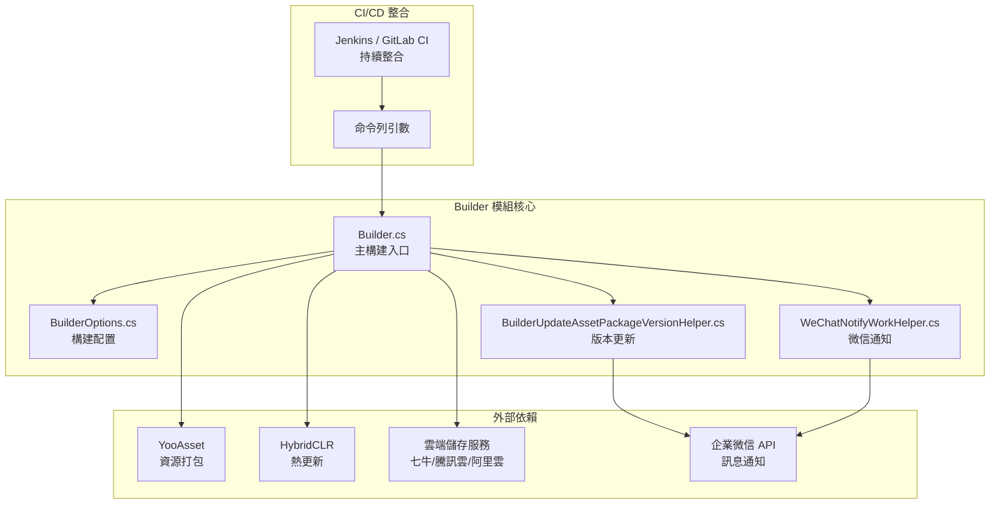
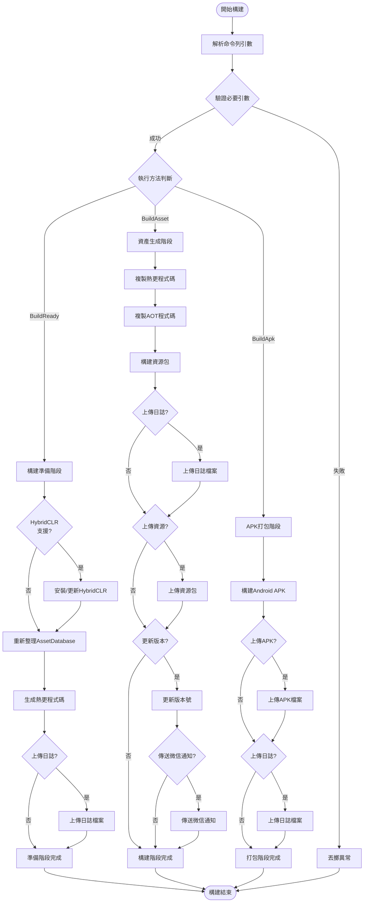

# 概述

GameFrameX Builder 是 GameFrameX 遊戲框架的 Unity 自動化構建模組，提供完整的 CI/CD 構建流程支援。該模組透過命令列引數驅動的構建方式，能夠與 Jenkins、GitLab CI、GitHub Actions 等持續整合平臺無縫整合，實現遊戲專案的自動化打包、資產生成和版本釋出。

## Overview

GameFrameX Builder 是 GameFrameX 遊戲框架的核心組件之一，專注於解決 Unity 遊戲專案的自動化構建問題。在遊戲開發過程中，頻繁的版本釋出和多渠道打包是一項耗時且容易出錯的工作。Builder 模組透過標準化的命令列介面和模組化的構建流程設計，將這些重複性工作自動化，從而顯著提升開發效率和釋出質量。

該模組的核心設計理念是將構建過程拆分為多個獨立的階段，每個階段專注於特定的任務。這種設計不僅提高了程式碼的可維護性，還使得構建流程可以根據專案需求進行靈活配置。從技術實現角度來看，Builder 模組深度整合了 HybridCLR 熱更新解決方案、YooAsset 資源管理系統以及多種雲端儲存服務，形成了一套完整的遊戲釋出解決方案。

## 架構設計

GameFrameX Builder 採用模組化的架構設計，將構建過程中的不同功能分離到獨立的類中實現。這種設計模式使得每個模組的職責清晰明確，便於維護和擴充套件。以下是 Builder 模組的整體架構圖：



從架構圖中可以看出，Builder 模組處於整個構建流程的核心位置，它負責協調各個外部依賴組件的工作。命令列引數首先被解析為 BuilderOptions 物件，然後 Builder 主類根據這些配置執行相應的構建任務。構建過程中產生的資源包可以透過雲端儲存服務進行上傳，同時版本更新資訊可以透過企業微信自動通知相關人員。

## 核心功能

### 命令列構建支援

GameFrameX Builder 完全基於命令列執行，所有的構建引數都透過命令列傳遞。這種設計使得構建過程可以完全自動化，無需人工干預。在 Builder.cs 中，透過 `BuildParamsParse()` 方法解析命令列引數，將各種構建選項儲存到 BuilderOptions 物件中。

```csharp
private static void BuildParamsParse()
{
    var commandLineArgs = Environment.GetCommandLineArgs();
    _builderOptions = new BuilderOptions();
    for (var index = 0; index < commandLineArgs.Length; index++)
    {
        var commandLineArg = commandLineArgs[index];
        if (commandLineArg == "-logFile")
        {
            _builderOptions.LogFilePath = commandLineArgs[index + 1].Replace("/Unity/", "/");
        }
        else if (commandLineArg == "-executeMethod")
        {
            _builderOptions.ExecuteMethod = commandLineArgs[index + 1].Trim();
        }
        // ... 更多引數解析
    }
}
```
> Source: [Builder.cs](https://github.com/GameFrameX/com.gameframex.unity.builder/blob/main/Editor/Builder.cs#L60-L74)

這種引數解析機制支援豐富的構建選項，包括構建編號、任務名稱、包名、版本號、渠道名稱等。透過合理配置這些引數，開發團隊可以實現完全自定義的構建流程。

### 資產生成與打包

Builder 模組整合了 YooAsset 資源管理系統，提供強大的資產生成和打包功能。在 `BuildAsset()` 方法中，實現了完整的資源打包流程，包括熱更新程式碼複製、AOT 程式碼處理、資源包構建等步驟。

```csharp
public static void BuildAsset()
{
    // 複製熱更新程式集
    Debug.Log("BuildReady Start Copy Hotfix Code");
    BuildHotfixHelper.CopyHotfixCode();
    AssetDatabase.Refresh();
    
    // 複製AOT程式碼
    Debug.Log("BuildReady Start Copy AOT Code");
    BuildHotfixHelper.CopyAOTCode();
    AssetDatabase.Refresh();
    
    // 構建資源包
    var buildInFileCopyParams = AssetBundleBuilderSetting.GetPackageBuildinFileCopyParams(_builderOptions.PackageName, EBuildPipeline.BuiltinBuildPipeline);
    BuiltinBuildPipeline pipeline = new BuiltinBuildPipeline();
    BuildParameters buildParameters = new BuildParameters();
    buildParameters.BuildMode = _builderOptions.IsIncrementalBuildPackage ? EBuildMode.IncrementalBuild : EBuildMode.ForceRebuild;
    // ... 更多配置
    pipeline.Run(buildParameters, true);
}
```
> Source: [Builder.cs](https://github.com/GameFrameX/com.gameframex.unity.builder/blob/main/Editor/Builder.cs#L255-L296)

資源打包支援增量構建和全量構建兩種模式，開發者可以根據實際需求選擇合適的構建方式。增量構建模式可以顯著減少構建時間，特別適合開發階段的頻繁打包需求。

### 熱更新支援

Builder 模組原生支援 HybridCLR 熱更新解決方案。在構建準備階段（`BuildReady()` 方法），系統會自動檢查 HybridCLR 的安裝狀態，並在必要時進行自動安裝和配置。這一功能對於需要支援熱更新的遊戲專案至關重要。

```csharp
public static void BuildReady()
{
#if ENABLE_GAME_FRAME_X_HYBRID_CLR
    Debug.Log("BuildReady Start HybridCLR");
    var installerController = new InstallerController();
    var isInstalled = installerController.HasInstalledHybridCLR();
    if (!isInstalled || installerController.InstalledLibil2cppVersion != installerController.PackageVersion)
    {
        installerController.InstallDefaultHybridCLR();
    }
    // 生成熱更新代理
    PrebuildCommand.GenerateAll();
#endif
    AssetDatabase.Refresh();
}
```
> Source: [Builder.cs](https://github.com/GameFrameX/com.gameframex.unity.builder/blob/main/Editor/Builder.cs#L215-L244)

透過條件編譯指令 `ENABLE_GAME_FRAME_X_HYBRID_CLR`，開發者可以靈活控制是否啟用熱更新功能。這種設計使得模組可以同時滿足需要熱更新和不需要熱更新的不同專案需求。

### 雲端儲存整合

GameFrameX Builder 支援多種雲端儲存服務的整合，包括七牛雲、騰訊雲和阿里雲。透過統一的介面設計，可以方便地在不同雲服務商之間切換。在構建過程中，生成的資源包和 APK 檔案可以自動上傳到指定的雲端儲存空間。

```csharp
#if ENABLE_GAME_FRAME_X_OBJECT_STORAGE
#if ENABLE_GAME_FRAME_X_OBJECT_STORAGE_QI_NIU
    ObjectStorageUploadManager = ObjectStorageUploadFactory.Create<QiNiuYunObjectStorageUploadManager>(_builderOptions.ObjectStorageKey, _builderOptions.ObjectStorageSecret, _builderOptions.ObjectStorageBucketName, _builderOptions.ObjectStorageEndPoint);
#endif

#if ENABLE_GAME_FRAME_X_OBJECT_STORAGE_TENCENT
    ObjectStorageUploadManager = ObjectStorageUploadFactory.Create<TencentCloudObjectStorageUploadManager>(_builderOptions.ObjectStorageKey, _builderOptions.ObjectStorageSecret, _builderOptions.ObjectStorageBucketName, _builderOptions.ObjectStorageEndPoint);
#endif

#if ENABLE_GAME_FRAME_X_OBJECT_STORAGE_A_LI_YUN
    ObjectStorageUploadManager = ObjectStorageUploadFactory.Create<ALiYunObjectStorageUploadManager>(_builderOptions.ObjectStorageKey, _builderOptions.ObjectStorageSecret, _builderOptions.ObjectStorageBucketName, _builderOptions.ObjectStorageEndPoint);
#endif
#endif
```
> Source: [Builder.cs](https://github.com/GameFrameX/com.gameframex.unity.builder/blob/main/Editor/Builder.cs#L32-L54)

雲端儲存上傳功能透過 `IObjectStorageUploadManager` 介面進行抽象，使用工廠模式建立不同雲服務商的具體實現。這種設計遵循了開閉原則，便於未來新增新的雲端儲存支援。

### 版本管理與通知

Builder 模組提供了完整的版本管理功能。構建完成後，可以自動更新資源包版本號，並透過企業微信傳送構建通知。這些功能大大提升了團隊協作效率，使得相關人員能夠及時瞭解構建狀態和版本資訊。

```csharp
if (_builderOptions.IsUpdateAssetPackageVersion)
{
    var result = BuilderUpdateAssetPackageVersionHelper.Run(buildParameters, _builderOptions);
    if (result)
    {
        WeChatNotifyWorkHelper.Run(buildParameters, _builderOptions);
    }
}
```
> Source: [Builder.cs](https://github.com/GameFrameX/com.gameframex.unity.builder/blob/main/Editor/Builder.cs#L335-L342)

版本更新透過 HTTP POST 請求將構建資訊傳送到指定的伺服器，而微信通知則使用企業微信的 Webhook 介面傳送 Markdown 格式的構建報告。

## 構建流程

GameFrameX Builder 的構建流程分為多個階段，每個階段都有明確的目標和職責。以下是完整的構建流程圖：



從流程圖中可以看出，Builder 模組支援三種主要的構建方法：構建準備（BuildReady）、資產生成（BuildAsset）和 APK 打包（BuildApk）。每種方法都可以獨立執行，也可以按順序組合使用以完成完整的構建流程。

## 配置選項

BuilderOptions 類定義了所有可用的構建引數，這些引數透過命令列傳遞給構建系統。以下是主要的配置選項：

| 選項 | 型別 | 預設值 | 說明 |
|------|------|--------|------|
| ExecuteMethod | string | - | **必需**。指定要執行的構建方法（BuildReady、BuildAsset、BuildApk） |
| BuildNumber | string | - | **必需**。構建編號，用於版本追蹤 |
| JobName | string | - | 任務名稱，用於區分不同的構建任務 |
| PackageName | string | "DefaultPackage" | 資源包名稱 |
| ChannelName | string | "default" | 渠道名稱，用於多渠道打包 |
| BundleId | string | - | 包名，為空時使用專案預設包名 |
| AppVersion | string | - | 程式版本號，為空時使用專案預設版本 |
| IsIncrementalBuildPackage | bool | false | 是否使用增量構建 |
| IsUploadAsset | bool | false | 是否上傳資源包到雲端儲存 |
| IsUploadApk | bool | false | 是否上傳 APK 到雲端儲存 |
| IsUploadLogFile | bool | false | 是否上傳日誌檔案到雲端儲存 |
| IsUpdateAssetPackageVersion | bool | false | 是否更新資源包版本 |
| UpdateAssetPackageVersionUrl | string | - | 版本更新伺服器的 URL |
| UpdateAssetPackageVersionAuthorization | string | - | 版本更新請求的授權資訊 |
| WeChatBotKey | string | - | 企業微信機器人的 Key |
| Language | string | "default" | 多語言配置 |

## 使用場景

GameFrameX Builder 適用於多種遊戲開發和釋出場景：

**持續整合環境**：在 Jenkins、GitLab CI 或 GitHub Actions 中配置自動化構建任務，當程式碼提交或合併到主分支時自動觸發構建流程。Builder 的命令列介面可以方便地與這些 CI 系統整合，實現全自動化的構建和釋出。

**多渠道打包**：透過配置不同的 ChannelName 和 PackageName 引數，可以快速生成針對不同渠道的遊戲包。這種能力對於需要在多個平臺或渠道釋出遊戲的專案尤為重要。

**熱更新發布**：結合 HybridCLR 熱更新功能，可以在不重新發布遊戲的情況下更新遊戲內容。Builder 自動處理熱更新程式碼的複製和打包，簡化了熱更新的釋出流程。

**版本管理**：透過版本更新和微信通知功能，團隊成員可以及時瞭解每次構建的結果和變更內容，提高協作效率。

## 相關連結

- [安裝](./2-installation) - 瞭解如何安裝和配置 Builder 模組
- [快速開始](./3-getting-started) - 快速上手 Builder 的基本使用
- [使用方法](./4-usage) - 詳細的構建命令和使用方法
- [配置選項](./5-configuration) - 完整的配置引數參考
- [物件儲存](./6-object-storage) - 雲端儲存服務配置指南
- [常見問題](./7-troubleshooting) - 常見問題排查和解決方案

- 官方文件：https://gameframex.doc.alianblank.com
- GitHub 倉庫：https://github.com/GameFrameX/com.gameframex.unity.builder
