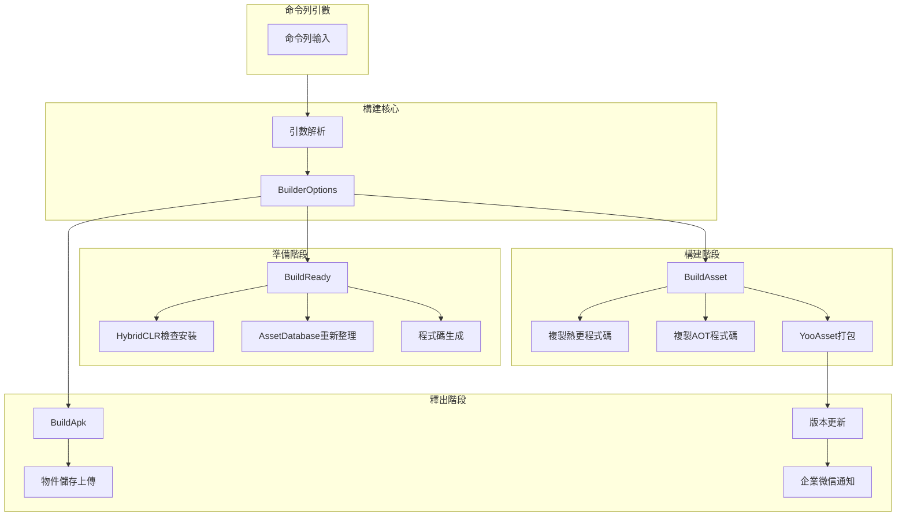
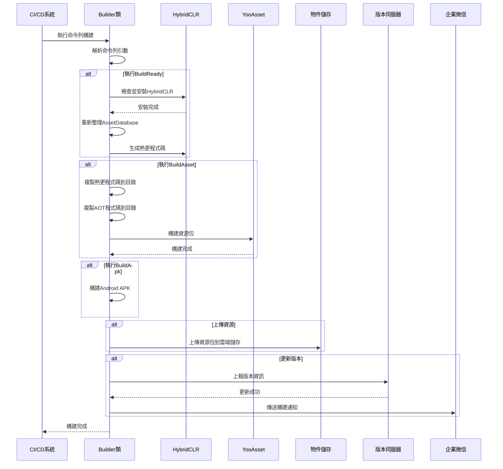

# 快速開始

GameFrameX Unity Builder 是一個功能強大的自動化構建系統，專門用於 Unity 專案的持續整合和自動化打包。透過命令列引數驅動，該系統能夠自動完成從環境準備、資源打包到 APK 構建的全流程。

## 概述

GameFrameX Builder 是 GameFrameX 遊戲框架的核心組件之一，專注於解決 Unity 專案自動化構建的痛點。它透過解析命令列引數來配置構建流程，支援以下核心功能：

- **打包準備（BuildReady）**：自動檢查並安裝 HybridCLR 熱更新框架，執行程式碼生成
- **資源打包（BuildAsset）**：使用 YooAsset 構建遊戲資源包，支援增量構建
- **APK 構建（BuildApk）**：自動構建 Android 安裝包
- **物件儲存上傳**：支援騰訊雲、阿里雲、七牛雲等主流雲端儲存
- **版本更新通知**：自動更新資源包版本並透過企業微信傳送通知

## 架構概覽



## 核心流程

### 構建流程式列圖



## 命令列引數

### 必需引數

| 引數 | 說明 | 示例 |
|------|------|------|
| `-executeMethod` | 執行方法 | `GameFrameX.Builder.Editor.Builder.BuildAsset` |
| `-BUILD_NUMBER` | 構建號 | `1001` |

### 構建配置引數

| 引數 | 說明 | 預設值 |
|------|------|--------|
| `-JOB_NAME` | 任務名稱 | - |
| `-PackageName` | 資源包名稱 | `DefaultPackage` |
| `-ChannelName` | 渠道名稱 | `default` |
| `-BundleId` | 包名 | 專案預設值 |
| `-AppVersion` | 程式版本號 | 專案預設值 |
| `-IsIncrementalBuildPackage` | 是否增量構建 | `false` |
| `-Language` | 語言 | `default` |

### 物件儲存引數

| 引數 | 說明 |
|------|------|
| `-ObjectStorageKey` | 物件儲存AccessKey |
| `-ObjectStorageSecret` | 物件儲存SecretKey |
| `-ObjectStorageBucketName` | 儲存桶名稱 |
| `-ObjectStorageEndPoint` | 區域節點 |

### 上傳控制引數

| 引數 | 說明 |
|------|------|
| `-IsUploadLogFile` | 是否上傳日誌檔案 |
| `-IsUploadAsset` | 是否上傳資源包 |
| `-IsUploadApk` | 是否上傳APK |
| `-IsUpdateAssetPackageVersion` | 是否更新資源包版本 |
| `-UpdateAssetPackageVersionUrl` | 版本更新伺服器URL |
| `-UpdateAssetPackageVersionAuthorization` | 版本更新授權碼 |
| `-WeChatBotKey` | 企業微信機器人Key |

## 使用示例

### Jenkins 構建任務配置

```groovy
// Jenkinsfile 示例
pipeline {
    agent any
    stages {
        stage('構建') {
            steps {
                bat '''
                    Unity.exe -projectPath "${WORKSPACE}" ^
                    -executeMethod GameFrameX.Builder.Editor.Builder.BuildAsset ^
                    -BUILD_NUMBER "${BUILD_NUMBER}" ^
                    -JOB_NAME "${JOB_NAME}" ^
                    -PackageName "GamePackage" ^
                    -ChannelName "official" ^
                    -IsUploadLogFile true ^
                    -IsUploadAsset true ^
                    -logFile "../Logs/build_${BUILD_NUMBER}.log"
                '''
            }
        }
    }
}
```

> Source: [Builder.cs](https://github.com/GameFrameX/com.gameframex.unity.builder/blob/main/Editor/Builder.cs#L60-L181)

### 完整的構建命令示例

```bash
Unity.exe -projectPath "D:\UnityProject\MyGame" ^
-executeMethod GameFrameX.Builder.Editor.Builder.BuildAsset ^
-BUILD_NUMBER "1001" ^
-JOB_NAME "DailyBuild" ^
-PackageName "GamePackage" ^
-ChannelName "official" ^
-Language "zh-CN" ^
-ObjectStorageKey "your_access_key" ^
-ObjectStorageSecret "your_secret_key" ^
-ObjectStorageBucketName "game-assets" ^
-ObjectStorageEndPoint "ap-guangzhou" ^
-IsUploadLogFile true ^
-IsUploadAsset true ^
-IsUpdateAssetPackageVersion true ^
-UpdateAssetPackageVersionUrl "https://api.example.com/version" ^
-UpdateAssetPackageVersionAuthorization "Bearer token" ^
-WeChatBotKey "your_wechat_key" ^
-logFile "../Logs/build_1001.log"
```

### 不同構建階段

根據需求選擇不同的執行方法：

```csharp
// 打包準備 - 安裝HybridCLR、生成熱更程式碼
-executeMethod GameFrameX.Builder.Editor.Builder.BuildReady

// 打包資源 - 構建資源包
-executeMethod GameFrameX.Builder.Editor.Builder.BuildAsset

// 構建APK - 打包安裝包
-executeMethod GameFrameX.Builder.Editor.Builder.BuildApk
```

> Source: [Builder.cs](https://github.com/GameFrameX/com.gameframex.unity.builder/blob/main/Editor/Builder.cs#L183-L345)

## 構建選項配置

BuilderOptions 類封裝了所有構建配置選項：

```csharp
public class BuilderOptions
{
    // 日誌檔案路徑
    public string LogFilePath { get; set; }
    
    // 執行方法
    public string ExecuteMethod { get; set; }
    
    // 構建號
    public string BuildNumber { get; set; }
    
    // 物件儲存配置
    public string ObjectStorageKey { get; set; }
    public string ObjectStorageSecret { get; set; }
    public string ObjectStorageBucketName { get; set; }
    public string ObjectStorageEndPoint { get; set; }
    
    // 構建配置
    public string JobName { get; set; }
    public string ChannelName { get; set; } = "default";
    public string BundleId { get; set; }
    public string AppVersion { get; set; }
    public string PackageName { get; set; } = "DefaultPackage";
    public bool IsIncrementalBuildPackage { get; set; }
    
    // 上傳控制
    public bool IsUploadLogFile { get; set; }
    public bool IsUploadAsset { get; set; }
    public bool IsUploadApk { get; set; }
    public bool IsUpdateAssetPackageVersion { get; set; }
    
    // 版本更新
    public string UpdateAssetPackageVersionUrl { get; set; }
    public string UpdateAssetPackageVersionAuthorization { get; set; }
    
    // 通知
    public string Language { get; set; } = "default";
    public string WeChatBotKey { get; set; }
}
```

> Source: [BuilderOptions.cs](https://github.com/GameFrameX/com.gameframex.unity.builder/blob/main/Editor/BuilderOptions.cs#L5-L116)

## 功能特性說明

### 熱更新支援

構建系統深度整合 HybridCLR，支援：
- 自動檢查 HybridCLR 安裝狀態
- 自動安裝和配置 HybridCLR
- 自動生成熱更新程式碼

### 資源打包

使用 YooAsset 進行資源打包：
- 支援增量構建和全量構建
- 自動複製熱更程式碼和 AOT 程式碼
- 支援資源包版本號自動生成

### 物件儲存

支援多種雲端儲存服務：

| 雲服務商 | 條件編譯符號 | 說明 |
|---------|-------------|------|
| 騰訊雲 | `ENABLE_GAME_FRAME_X_OBJECT_STORAGE_TENCENT` | 騰訊雲COS |
| 阿里雲 | `ENABLE_GAME_FRAME_X_OBJECT_STORAGE_A_LI_YUN` | 阿里雲OSS |
| 七牛雲 | `ENABLE_GAME_FRAME_X_OBJECT_STORAGE_QI_NIU` | 七牛雲Kodo |

> Source: [Builder.cs](https://github.com/GameFrameX/com.gameframex.unity.builder/blob/main/Editor/Builder.cs#L40-L53)

### 版本更新通知

構建完成後自動：
1. 將版本資訊上報到版本伺服器
2. 透過企業微信傳送構建通知

> Source: [BuilderUpdateAssetPackageVersionHelper.cs](https://github.com/GameFrameX/com.gameframex.unity.builder/blob/main/Editor/BuilderUpdateAssetPackageVersionHelper.cs#L51-L85)
> Source: [WeChatNotifyWorkHelper.cs](https://github.com/GameFrameX/com.gameframex.unity.builder/blob/main/Editor/WeChatNotifyWorkHelper.cs#L45-L71)

## 依賴項

本構建系統依賴以下核心組件：

| 依賴包 | 說明 |
|--------|------|
| GameFrameX.Editor | 編輯器工具基類 |
| GameFrameX.Runtime | 執行時基礎庫 |
| YooAsset | 資源管理包 |
| HybridCLR | IL2CPP熱更新方案 |

## 相關連結

- [安裝指南](./2-installation)
- [使用方法](./4-usage)
- [配置選項](./5-configuration)
- [物件儲存配置](./6-object-storage)
- [常見問題](./7-troubleshooting)
- [GitHub 倉庫](https://github.com/GameFrameX/com.gameframex.unity.builder.git)
- [官方文件](https://gameframex.doc.alianblank.com)
