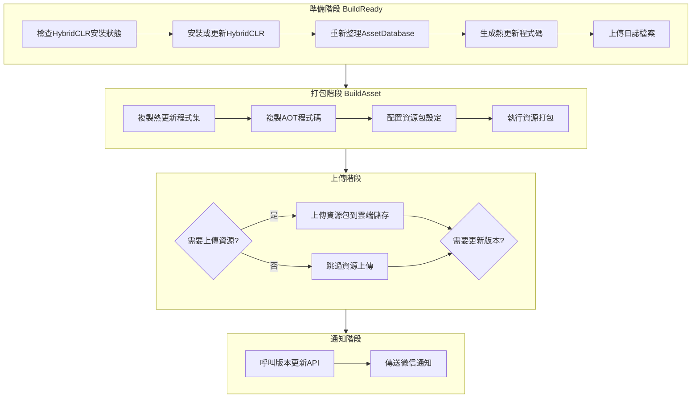

# 使用方法

GameFrameX Builder 提供了完整的 Unity 自動化構建解決方案，支援命令列驅動構建、資源打包、物件儲存整合以及構建通知等功能。

## 概述

GameFrameX Builder 是 GameFrameX 框架的核心構建模組，專門用於實現 Unity 專案的自動化構建流程。該模組透過命令列引數接收構建配置，支援多種構建場景，包括資源打包、APK 構建、熱更新處理等。在持續整合/持續部署（CI/CD）環境中，開發者可以透過 Jenkins、GitLab CI 等工具呼叫 Builder，實現完全自動化的構建釋出流程。

Builder 模組的核心設計理念是將複雜的構建流程分解為獨立的、可組合的步驟。每個構建步驟（BuildReady、BuildAsset、BuildApk）都可以獨立呼叫，這種設計使得構建流程具有極高的靈活性。開發者可以根據專案需求選擇性地執行某個步驟，也可以將多個步驟組合成一個完整的構建流水線。

## 核心概念

### 構建引數

Builder 使用命令列引數傳遞構建配置，這種方式與主流 CI/CD 系統完全相容。所有的構建選項都透過命令列引數指定，包括構建目標、包名、渠道、版本號、上傳選項等。這種設計使得構建指令碼可以完全外部化，便於在不同環境之間複用。

> Source: [Editor/BuilderOptions.cs](https://github.com/GameFrameX/com.gameframex.unity.builder/blob/main/Editor/BuilderOptions.cs#L1-L117)

### 構建方法

Builder 提供了三個主要的靜態方法，分別對應不同的構建階段：

- **BuildReady**：構建準備階段，負責初始化構建環境
- **BuildAsset**：資源打包階段，使用 YooAsset 構建資源包
- **BuildApk**：APK 構建階段，生成 Android 安裝包

> Source: [Editor/Builder.cs](https://github.com/GameFrameX/com.gameframex.unity.builder/blob/main/Editor/Builder.cs#L30-L346)

### 物件儲存

Builder 整合了多家物件儲存服務提供商，包括七牛雲、騰訊雲和阿里雲。構建完成後，可以自動將構建產物（APK、資源包、日誌檔案）上傳到指定的物件儲存桶中。這一功能極大地方便了構建產物的分發和管理。

## 構建流程

GameFrameX Builder 的構建流程遵循標準的 CI/CD 流水線模式，包含準備、打包、上傳和通知四個主要階段。每個階段都有明確的責任邊界，透過引數配置實現靈活的流程控制。



### 準備階段

準備階段（BuildReady）是構建流程的初始化步驟，主要完成以下工作：

首先檢查 HybridCLR 是否已安裝。HybridCLR 是一個 Unity 熱更新解決方案，能夠實現 C# 程式碼的熱部署。如果檢測到 HybridCLR 未安裝或版本不匹配，系統會自動執行安裝流程。這是確保熱更新功能正常工作的關鍵步驟。

在 HybridCLR 處理完成後，系統會重新整理 Unity 的 AssetDatabase，確保所有資源變更被正確識別。隨後呼叫 PrebuildCommand.GenerateAll() 生成熱更新所需的代理程式碼，這些程式碼是熱更新功能正常執行的必要基礎。

如果配置了日誌上傳選項（-IsUploadLogFile），準備階段結束時會將構建日誌上傳到物件儲存，便於後續問題排查。

> Source: [Editor/Builder.cs](https://github.com/GameFrameX/com.gameframex.unity.builder/blob/main/Editor/Builder.cs#L215-L250)

### 打包階段

打包階段（BuildAsset）負責生成遊戲的資源包，是整個構建流程的核心環節。該階段首先複製熱更新程式集和 AOT 程式碼到指定目錄，然後使用 YooAsset 執行資源打包。

在資源打包前，系統會修改資源包檔名的大小寫設定為不敏感（LocationToLower = true），確保資源包在不同平臺間的一致性。隨後建立內建構建管線（BuiltinBuildPipeline），配置構建引數，包括構建模式（增量或全量）、目標平臺、版本號等。

構建完成後，根據配置選項決定是否上傳資源包。如果啟用資源上傳功能，系統會將整個輸出目錄上傳到物件儲存。如果啟用版本更新功能，系統會呼叫版本更新 API 通知遊戲伺服器當前資源包資訊。

> Source: [Editor/Builder.cs](https://github.com/GameFrameX/com.gameframex.unity.builder/blob/main/Editor/Builder.cs#L255-L345)

### APK 構建階段

APK 構建階段（BuildApk）專門用於生成 Android 安裝包。該階段呼叫 BuildProductHelper.BuildPlayerAndroid() 執行原生 Android 構建流程，生成簽名的 APK 檔案。

構建完成後，如果配置了 APK 上傳選項（-IsUploadApk），系統會將生成的 APK 檔案上傳到物件儲存。同時也可以選擇上傳構建日誌，便於問題排查。

> Source: [Editor/Builder.cs](https://github.com/GameFrameX/com.gameframex.unity.builder/blob/main/Editor/Builder.cs#L194-L210)

### 通知階段

通知階段在構建完成後自動執行，包括版本更新通知和微信企業號通知兩個功能。

版本更新功能會向指定的 HTTP 介面傳送當前構建的版本資訊，包括應用版本、資源包版本、包名、平臺、渠道、語言等。這些資訊對於遊戲客戶端正確載入資源至關重要。

微信企業號通知功能會在構建完成後自動傳送構建結果通知，通知內容包括構建時間、資源版本、遊戲版本、包名、資源包名、平臺、渠道和語言等資訊。團隊成員可以透過微信及時瞭解構建狀態。

> Source: [Editor/WeChatNotifyWorkHelper.cs](https://github.com/GameFrameX/com.gameframex.unity.builder/blob/main/Editor/WeChatNotifyWorkHelper.cs#L40-L72)

## 命令列引數

Builder 透過命令列引數接收構建配置。以下是所有支援的引數及其說明：

| 引數 | 型別 | 必填 | 預設值 | 說明 |
|------|------|------|--------|------|
| -executeMethod | string | 是 | - | 要執行的構建方法，如 GameFrameX.Builder.Editor.Builder.BuildAsset |
| -BUILD_NUMBER | string | 是 | - | 構建編號，用於版本標識 |
| -logFile | string | 否 | 自動生成 | 日誌檔案輸出路徑 |
| -JOB_NAME | string | 否 | - | CI/CD 任務名稱 |
| -PackageName | string | 否 | DefaultPackage | 資源包名稱 |
| -ChannelName | string | 否 | default | 渠道名稱 |
| -BundleId | string | 否 | 專案配置 | Android 包名 |
| -AppVersion | string | 否 | 專案配置 | 應用程式版本號 |
| -IsIncrementalBuildPackage | flag | 否 | false | 啟用增量構建 |
| -IsUploadLogFile | flag | 否 | false | 上傳日誌檔案到雲端儲存 |
| -IsUploadAsset | flag | 否 | false | 上傳資源包到雲端儲存 |
| -IsUploadApk | flag | 否 | false | 上傳 APK 到雲端儲存 |
| -IsUpdateAssetPackageVersion | flag | 否 | false | 呼叫版本更新 API |
| -UpdateAssetPackageVersionUrl | string | 否 | - | 版本更新 API 地址 |
| -UpdateAssetPackageVersionAuthorization | string | 否 | - | 版本更新 API 授權碼 |
| -Language | string | 否 | default | 資源語言 |
| -WeChatBotKey | string | 否 | - | 微信企業號機器人 Key |
| -ObjectStorageKey | string | 否 | - | 物件儲存訪問 Key |
| -ObjectStorageSecret | string | 否 | - | 物件儲存訪問秘鑰 |
| -ObjectStorageBucketName | string | 否 | - | 物件儲存桶名稱 |
| -ObjectStorageEndPoint | string | 否 | - | 物件儲存區域節點 |

> Source: [Editor/Builder.cs](https://github.com/GameFrameX/com.gameframex.unity.builder/blob/main/Editor/Builder.cs#L60-L181)

## 使用示例

### 基本構建流程

以下是使用 Jenkins 進行自動化構建的完整示例：

```bash
# 進入 Unity 安裝目錄
cd /Applications/Unity/Hub/Editor/2021.3.0f1/Unity.app/Contents/MacOS

# 執行構建命令
./Unity \
  -projectPath /path/to/your/project \
  -executeMethod GameFrameX.Builder.Editor.Builder.BuildAsset \
  -BUILD_NUMBER=1001 \
  -JobName=Game_Build \
  -PackageName=DefaultPackage \
  -ChannelName=official \
  -IsIncrementalBuildPackage \
  -logFile=/var/jenkins/workspace/logs/build_1001.log
```

> Source: [Editor/Builder.cs](https://github.com/GameFrameX/com.gameframex.unity.builder/blob/main/Editor/Builder.cs#L60-L80)

### 完整構建流程（含上傳）

以下示例展示了一個完整的 CI/CD 構建流程，包括資源打包、上傳和版本更新：

```bash
# 完整構建命令
./Unity \
  -projectPath /path/to/your/project \
  -executeMethod GameFrameX.Builder.Editor.Builder.BuildAsset \
  -BUILD_NUMBER=1001 \
  -JobName=Game_Build \
  -PackageName=DefaultPackage \
  -ChannelName=official \
  -AppVersion=1.2.3 \
  -BundleId=com.gameframex.mygame \
  -IsIncrementalBuildPackage \
  -IsUploadAsset \
  -IsUpdateAssetPackageVersion \
  -UpdateAssetPackageVersionUrl=https://api.example.com/version/update \
  -UpdateAssetPackageVersionAuthorization=Bearer_token_here \
  -WeChatBotKey=your_wechat_bot_key \
  -ObjectStorageKey=your_access_key \
  -ObjectStorageSecret=your_secret_key \
  -ObjectStorageBucketName=game-bucket \
  -ObjectStorageEndPoint=cn-bj \
  -Language=zh-CN \
  -logFile=/var/jenkins/workspace/logs/build_1001.log
```

### APK 構建流程

如果需要構建 Android APK，可以使用以下命令：

```bash
# APK 構建命令
./Unity \
  -projectPath /path/to/your/project \
  -executeMethod GameFrameX.Builder.Editor.Builder.BuildApk \
  -BUILD_NUMBER=1001 \
  -JobName=Game_APK_Build \
  -PackageName=DefaultPackage \
  -ChannelName=official \
  -AppVersion=1.2.3 \
  -BundleId=com.gameframex.mygame \
  -IsUploadApk \
  -ObjectStorageKey=your_access_key \
  -ObjectStorageSecret=your_secret_key \
  -ObjectStorageBucketName=game-bucket \
  -ObjectStorageEndPoint=cn-bj \
  -logFile=/var/jenkins/workspace/logs/apk_build_1001.log
```

### 構建準備流程

在某些場景下，可能只需要執行構建準備工作（如更新 HybridCLR）：

```bash
# 構建準備命令
./Unity \
  -projectPath /path/to/your/project \
  -executeMethod GameFrameX.Builder.Editor.Builder.BuildReady \
  -BUILD_NUMBER=1001 \
  -JobName=Game_Prepare \
  -IsUploadLogFile \
  -logFile=/var/jenkins/workspace/logs/prepare_1001.log
```

## 配置物件儲存

Builder 支援三種主流的物件儲存服務：七牛雲、騰訊雲和阿里雲。根據選擇的儲存服務，需要在構建命令中配置相應的引數。

### 七牛雲配置

```bash
# 使用七牛雲時配置
-ObjectStorageKey=your_qiniu_access_key \
-ObjectStorageSecret=your_qiniu_secret_key \
-ObjectStorageBucketName=your_bucket \
-ObjectStorageEndPoint=cn-bj
```

### 騰訊雲配置

```bash
# 使用騰訊雲時配置
-ObjectStorageKey=your_tencent_secret_id \
-ObjectStorageSecret=your_tencent_secret_key \
-ObjectStorageBucketName=your_bucket \
-ObjectStorageEndPoint=ap-beijing
```

### 阿里雲配置

```bash
# 使用阿里雲時配置
-ObjectStorageKey=your_aliyun_access_key \
-ObjectStorageSecret=your_aliyun_secret_key \
-ObjectStorageBucketName=your_bucket \
-ObjectStorageEndPoint=oss-cn-beijing
```

> Source: [Editor/Builder.cs](https://github.com/GameFrameX/com.gameframex.unity.builder/blob/main/Editor/Builder.cs#L40-L53)

## 版本更新與通知

### 配置版本更新 API

當啟用版本更新功能時，Builder 會向指定的 HTTP 介面傳送版本資訊：

```bash
-IsUpdateAssetPackageVersion \
-UpdateAssetPackageVersionUrl=https://api.example.com/version/update \
-UpdateAssetPackageVersionAuthorization=Bearer_your_token
```

請求內容格式如下：

```json
{
  "AppVersion": "1.2.3",
  "PackageName": "com.gameframex.mygame",
  "AssetPackageVersion": "20240101120000",
  "AssetPackageName": "DefaultPackage",
  "Platform": "Android",
  "Language": "zh-CN",
  "Channel": "official"
}
```

> Source: [Editor/BuilderUpdateAssetPackageVersionHelper.cs](https://github.com/GameFrameX/com.gameframex.unity.builder/blob/main/Editor/BuilderUpdateAssetPackageVersionHelper.cs#L51-L85)

### 配置微信通知

配置微信企業號機器人後，構建完成會自動傳送通知：

```bash
-WeChatBotKey=your_wechat_bot_key
```

通知訊息格式為 Markdown，包含構建時間、資源版本、遊戲版本、包名、資源包名、平臺、渠道和語言等資訊。

> Source: [Editor/WeChatNotifyWorkHelper.cs](https://github.com/GameFrameX/com.gameframex.unity.builder/blob/main/Editor/WeChatNotifyWorkHelper.cs#L45-L71)

## GitLab CI 整合示例

以下是整合到 GitLab CI 的完整配置示例：

```yaml
stages:
  - build
  - upload

build-android:
  stage: build
  image: unityci/editor:2021.3.0f1-android
  script:
    - |
      /opt/Unity/Editor/Unity \
        -projectPath ${CI_PROJECT_DIR} \
        -executeMethod GameFrameX.Builder.Editor.Builder.BuildAsset \
        -BUILD_NUMBER=${CI_PIPELINE_ID} \
        -JobName=${CI_JOB_NAME} \
        -PackageName=DefaultPackage \
        -ChannelName=official \
        -AppVersion=1.2.3 \
        -BundleId=com.gameframex.mygame \
        -IsIncrementalBuildPackage \
        -IsUploadAsset \
        -IsUpdateAssetPackageVersion \
        -UpdateAssetPackageVersionUrl=${VERSION_API_URL} \
        -UpdateAssetPackageVersionAuthorization=${API_TOKEN} \
        -WeChatBotKey=${WECHAT_BOT_KEY} \
        -ObjectStorageKey=${OSS_KEY} \
        -ObjectStorageSecret=${OSS_SECRET} \
        -ObjectStorageBucketName=game-bucket \
        -ObjectStorageEndPoint=cn-bj \
        -Language=zh-CN
  artifacts:
    paths:
      - Logs/
    expire_in: 7 days
```

## Jenkins Pipeline 整合示例

以下是 Jenkins Pipeline 的配置示例：

```groovy
pipeline {
    agent any
    
    parameters {
        string(name: 'PACKAGE_NAME', defaultValue: 'DefaultPackage', description: '資源包名稱')
        string(name: 'CHANNEL_NAME', defaultValue: 'official', description: '渠道名稱')
        string(name: 'APP_VERSION', defaultValue: '1.2.3', description: '應用版本')
        booleanParam(name: 'INCREMENTAL_BUILD', defaultValue: true, description: '增量構建')
        booleanParam(name: 'UPLOAD_ASSET', defaultValue: true, description: '上傳資源')
        booleanParam(name: 'UPDATE_VERSION', defaultValue: true, description: '更新版本')
    }
    
    stages {
        stage('構建') {
            steps {
                bat """
                    "${UNITY_PATH}\\Editor\\Unity.exe" \
                        -projectPath "${WORKSPACE}" \
                        -executeMethod GameFrameX.Builder.Editor.Builder.BuildAsset \
                        -BUILD_NUMBER=${BUILD_NUMBER} \
                        -JobName=${JOB_NAME} \
                        -PackageName=${params.PACKAGE_NAME} \
                        -ChannelName=${params.CHANNEL_NAME} \
                        -AppVersion=${params.APP_VERSION} \
                        ${params.INCREMENTAL_BUILD ? '-IsIncrementalBuildPackage' : ''} \
                        ${params.UPLOAD_ASSET ? '-IsUploadAsset' : ''} \
                        ${params.UPDATE_VERSION ? '-IsUpdateAssetPackageVersion' : ''} \
                        -UpdateAssetPackageVersionUrl=${VERSION_API_URL} \
                        -UpdateAssetPackageVersionAuthorization=${API_TOKEN} \
                        -WeChatBotKey=${WECHAT_BOT_KEY} \
                        -ObjectStorageKey=${OSS_KEY} \
                        -ObjectStorageSecret=${OSS_SECRET} \
                        -ObjectStorageBucketName=${OSS_BUCKET} \
                        -ObjectStorageEndPoint=cn-bj
                """
            }
        }
    }
}
```

## 相關連結

- [配置選項](./5-configuration) - 詳細瞭解所有構建配置選項
- [物件儲存](./6-object-storage) - 物件儲存服務配置與使用
- [常見問題](./7-troubleshooting) - 構建過程中常見問題與解決方案
- [概述](./1-overview) - GameFrameX Builder 概述與架構
- [安裝](./2-installation) - 環境配置與安裝指南
- [快速開始](./3-getting-started) - 快速上手教程
