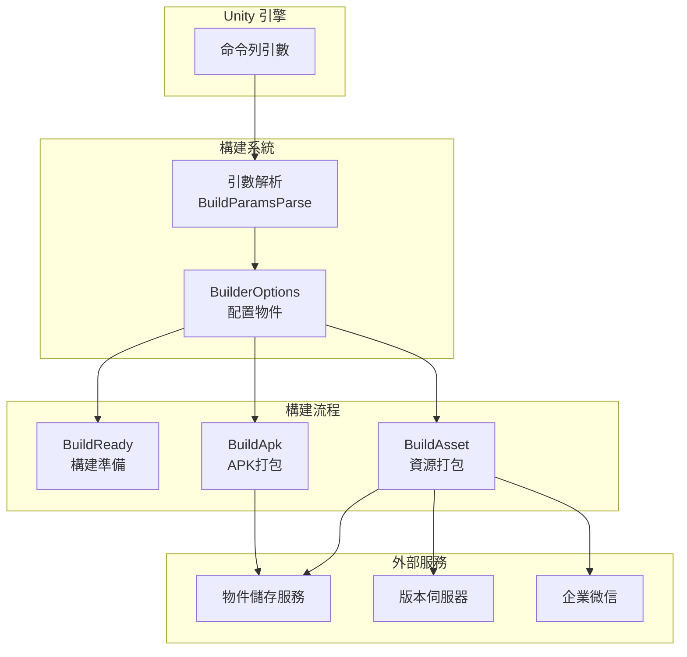
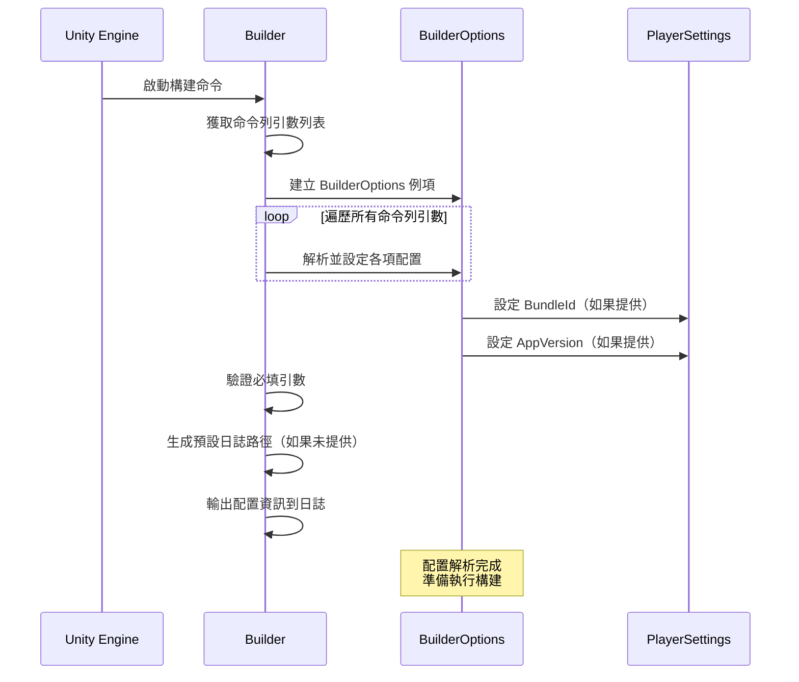

# 配置選項

GameFrameX Unity Builder 透過命令列引數接收構建配置，實現自動化構建流程。本文件詳細介紹所有可用的配置選項及其使用方法。

## 概述

BuilderOptions 類封裝了所有構建相關的配置選項，這些選項透過 Unity 命令列傳遞給構建指令碼。配置選項分為以下幾類：

- **基礎配置**：日誌路徑、執行方法、構建編號等
- **版本配置**：包名、程式版本號、資源包版本等
- **物件儲存配置**：雲端儲存金鑰、桶名、端點等
- **構建行為配置**：是否增量構建、是否上傳資源等
- **通知配置**：資源版本更新URL、微信機器人Key等

## 配置選項詳解

### 基礎配置

| 命令列引數 | 型別 | 預設值 | 說明 |
|-----------|------|--------|------|
| `-logFile` | string | 自動生成 | 日誌檔案路徑，用於儲存構建過程中的日誌 |
| `-executeMethod` | string | 必填 | 要執行的構建方法，如 `GameFrameX.Builder.Editor.Builder.BuildApk` |
| `-BUILD_NUMBER` | string | 必填 | 構建編號，用於標識本次構建 |
| `-JOB_NAME` | string | 必填 | 任務名稱，用於區分不同的構建任務 |

### 版本配置

| 命令列引數 | 型別 | 預設值 | 說明 |
|-----------|------|--------|------|
| `-BundleId` | string | 專案預設值 | 包名（Bundle Identifier），如為空則使用專案配置的包名 |
| `-AppVersion` | string | 專案預設值 | 程式版本號，如為空則使用專案配置的版本號 |

### 渠道配置

| 命令列引數 | 型別 | 預設值 | 說明 |
|-----------|------|--------|------|
| `-ChannelName` | string | "default" | 渠道名稱，用於區分不同分發渠道的構建 |

### 資源包配置

以下選項在呼叫 `BuildAsset` 方法時有效：

| 命令列引數 | 型別 | 預設值 | 說明 |
|-----------|------|--------|------|
| `-PackageName` | string | "DefaultPackage" | 資源包名稱，標識要構建的資源包 |
| `-IsIncrementalBuildPackage` | flag | false | 是否使用增量構建方式構建資源包 |

### 物件儲存配置

配置物件儲存服務所需的憑證資訊：

| 命令列引數 | 型別 | 預設值 | 說明 |
|-----------|------|--------|------|
| `-ObjectStorageKey` | string | - | 物件儲存的 Access Key |
| `-ObjectStorageSecret` | string | - | 物件儲存的 Secret Key |
| `-ObjectStorageBucketName` | string | - | 物件儲存桶的名稱 |
| `-ObjectStorageEndPoint` | string | - | 物件儲存服務的端點地址 |

支援的雲服務商：
- 阿里雲 (ALiYun)
- 騰訊雲 (Tencent)
- 七牛雲 (QiNiu)

### 上傳行為配置

| 命令列引數 | 型別 | 預設值 | 說明 |
|-----------|------|--------|------|
| `-IsUploadLogFile` | flag | false | 是否上傳構建日誌檔案到物件儲存 |
| `-IsUploadAsset` | flag | false | 是否上傳構建的資源包到物件儲存 |
| `-IsUploadApk` | flag | false | 是否上傳生成的APK檔案到物件儲存（僅BuildApk有效） |

### 資源版本更新配置

| 命令列引數 | 型別 | 預設值 | 說明 |
|-----------|------|--------|------|
| `-IsUpdateAssetPackageVersion` | flag | false | 是否更新資源包版本 |
| `-UpdateAssetPackageVersionUrl` | string | - | 更新資源包版本的HTTP請求URL |
| `-UpdateAssetPackageVersionAuthorization` | string | - | 更新資源包版本的授權資訊 |

### 多語言配置

| 命令列引數 | 型別 | 預設值 | 說明 |
|-----------|------|--------|------|
| `-Language` | string | "default" | 構建產物的語言版本 |

### 微信通知配置

| 命令列引數 | 型別 | 預設值 | 說明 |
|-----------|------|--------|------|
| `-WeChatBotKey` | string | - | 企業微信機器人的Webhook Key |

## 配置架構



## 配置解析流程



## 使用示例

### 基本 Android APK 構建

```bash
Unity.exe -projectPath "D:\MyGame" \
    -executeMethod GameFrameX.Builder.Editor.Builder.BuildApk \
    -BUILD_NUMBER "1001" \
    -JOB_NAME "daily_build" \
    -logFile "../Logs/BuildApk_1001.log"
```

### 資源包構建並上傳

```bash
Unity.exe -projectPath "D:\MyGame" \
    -executeMethod GameFrameX.Builder.Editor.Builder.BuildAsset \
    -BUILD_NUMBER "1001" \
    -JOB_NAME "asset_build" \
    -PackageName "HotUpdateResources" \
    -ChannelName "official" \
    -IsUploadAsset \
    -ObjectStorageKey "your_access_key" \
    -ObjectStorageSecret "your_secret_key" \
    -ObjectStorageBucketName "my-game-bucket" \
    -ObjectStorageEndPoint "https://s3.example.com"
```

### 完整構建流程（含版本更新和微信通知）

```bash
Unity.exe -projectPath "D:\MyGame" \
    -executeMethod GameFrameX.Builder.Editor.Builder.BuildAsset \
    -BUILD_NUMBER "1002" \
    -JOB_NAME "release_build" \
    -PackageName "GameResources" \
    -ChannelName "official" \
    -AppVersion "1.2.0" \
    -IsUploadAsset \
    -IsUpdateAssetPackageVersion \
    -UpdateAssetPackageVersionUrl "https://api.example.com/version/update" \
    -UpdateAssetPackageVersionAuthorization "Bearer token123" \
    -WeChatBotKey "your_wechat_bot_key" \
    -Language "zh-CN"
```

### 增量構建資源包

```bash
Unity.exe -projectPath "D:\MyGame" \
    -executeMethod GameFrameX.Builder.Editor.Builder.BuildAsset \
    -BUILD_NUMBER "1003" \
    -JOB_NAME "incremental_build" \
    -PackageName "HotUpdateResources" \
    -IsIncrementalBuildPackage \
    -IsUploadAsset
```

## 配置驗證

 Builder 在啟動時會驗證以下必填引數：

| 引數 | 驗證規則 |
|------|----------|
| `executeMethod` | 不能為空，否則丟擲異常：`executeMethod is null` |
| `BUILD_NUMBER` | 不能為空，否則丟擲異常：`build number is null` |
| `LogFilePath` | 如果為空，會根據 executeMethod 自動生成預設路徑 |

## 環境變數與配置檔案

所有配置選項均透過命令列引數傳遞，不支援透過配置檔案設定。這種設計使得 Builder 可以與各種 CI/CD 系統（如 Jenkins、GitLab CI、GitHub Actions）無縫整合。

## 相關連結

- [快速開始](./3-getting-started) - 瞭解如何開始使用自動化構建
- [使用方法](./4-usage) - 詳細瞭解構建流程
- [物件儲存](./6-object-storage) - 瞭解更多關於物件儲存整合的資訊
- [常見問題](./7-troubleshooting) - 解決常見構建問題
