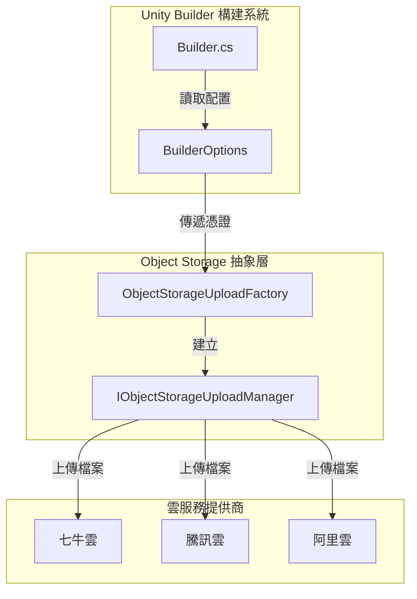
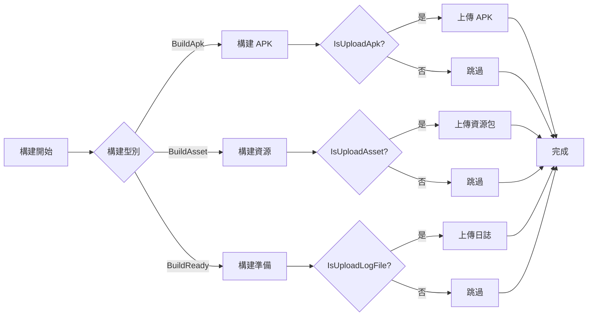

# 物件儲存

物件儲存模組為 Unity Builder 提供了將構建產物（APK、日誌檔案、資源包）上傳到雲端物件儲存服務的能力。透過整合外部 GameFrameX ObjectStorage 包，支援主流雲服務提供商。

## 概述

物件儲存（Object Storage）是 Unity Builder 的核心功能之一，用於自動化構建完成後將構建產物上傳到雲端儲存服務。這一功能在持續整合/持續部署（CI/CD）工作流中尤為重要，可以實現：

- **APK 自動上傳**：Android 構建完成後自動上傳安裝包
- **日誌檔案上傳**：構建日誌實時上傳，便於遠端檢視構建狀態
- **資源包上傳**：AB 資源包自動上傳到 CDN 源站

當前支援的雲服務提供商：
- 騰訊雲物件儲存（COS）
- 阿里雲物件儲存（OSS）
- 七牛雲物件儲存（Kodo）

> 注意：物件儲存功能依賴外部 GameFrameX ObjectStorage 包，需要在專案中正確安裝和配置相關包才能使用。

## 架構



**架構說明：**

- **Builder**：構建入口，負責解析命令列引數並觸發構建流程
- **BuilderOptions**：儲存物件儲存相關配置（Key、Secret、Bucket、Endpoint）
- **ObjectStorageUploadFactory**：工廠類，根據編譯條件建立對應雲服務商的 UploadManager
- **IObjectStorageUploadManager**：上傳管理器介面，定義 UploadFile 和 UploadDirectory 方法

## 核心功能

### 支援的雲服務商

| 雲服務商 | 包名稱 | 編譯宏 |
|----------|--------|--------|
| 七牛雲 | GameFrameX.ObjectStorage.QiNiu | ENABLE_GAME_FRAME_X_OBJECT_STORAGE_QI_NIU |
| 騰訊雲 | GameFrameX.ObjectStorage.Tencent | ENABLE_GAME_FRAME_X_OBJECT_STORAGE_TENCENT |
| 阿里雲 | GameFrameX.ObjectStorage.ALiYun | ENABLE_GAME_FRAME_X_OBJECT_STORAGE_A_LI_YUN |

### 上傳型別

```csharp
// 上傳單個檔案
ObjectStorageUploadManager.UploadFile(apkPath);

// 上傳整個目錄
ObjectStorageUploadManager.SetSavePath(savePath);
ObjectStorageUploadManager.UploadDirectory(uploadPath);
```

> Source: [Builder.cs](https://github.com/GameFrameX/com.gameframex.unity.builder/blob/main/Editor/Builder.cs#L200-L330)

### 上傳觸發時機



## 配置選項

物件儲存透過 `BuilderOptions` 類進行配置，支援以下選項：

| 選項 | 型別 | 預設值 | 說明 |
|------|------|--------|------|
| ObjectStorageKey | string | "" | 物件儲存的 AccessKey |
| ObjectStorageSecret | string | "" | 物件儲存的 SecretKey |
| ObjectStorageBucketName | string | "" | 儲存桶名稱 |
| ObjectStorageEndPoint | string | "" | 儲存桶地域節點 |
| IsUploadApk | bool | false | 構建完成後是否上傳 APK |
| IsUploadLogFile | bool | false | 構建完成後是否上傳日誌檔案 |
| IsUploadAsset | bool | false | 構建完成後是否上傳資源包 |

> Source: [BuilderOptions.cs](https://github.com/GameFrameX/com.gameframex.unity.builder/blob/main/Editor/BuilderOptions.cs#L22-L40)

## 命令列引數

物件儲存透過命令列引數傳遞配置，常用引數：

```bash
# 物件儲存配置
-ObjectStorageKey "your_access_key"
-ObjectStorageSecret "your_secret_key"
-ObjectStorageBucketName "your_bucket_name"
-ObjectStorageEndPoint "ap-guangzhou"

# 上傳控制
-IsUploadApk
-IsUploadLogFile
-IsUploadAsset
```

> Source: [Builder.cs](https://github.com/GameFrameX/com.gameframex.unity.builder/blob/main/Editor/Builder.cs#L83-L97)

### 引數解析示例

```csharp
// Builder.cs 中的引數解析邏輯
else if (commandLineArg == "-ObjectStorageKey")
{
    _builderOptions.ObjectStorageKey = commandLineArgs[index + 1];
}
else if (commandLineArg == "-ObjectStorageSecret")
{
    _builderOptions.ObjectStorageSecret = commandLineArgs[index + 1];
}
else if (commandLineArg == "-ObjectStorageBucketName")
{
    _builderOptions.ObjectStorageBucketName = commandLineArgs[index + 1];
}
else if (commandLineArg == "-ObjectStorageEndPoint")
{
    _builderOptions.ObjectStorageEndPoint = commandLineArgs[index + 1];
}
```

## 使用方法

### 1. 安裝依賴包

在 Unity Package Manager 中安裝所需的 GameFrameX ObjectStorage 包：

- 基礎包：`com.gameframex.unity.objectstorage`
- 七牛雲：`com.gameframex.unity.objectstorage.qiniu`
- 騰訊雲：`com.gameframex.unity.objectstorage.tencent`
- 阿里雲：`com.gameframex.unity.objectstorage.aliyun`

### 2. 配置編譯宏

在專案的 `GameFrameX.Builder.Editor.asmdef` 中已定義版本宏：

```json
{
  "versionDefines": [
    {
      "name": "com.gameframex.unity.objectstorage",
      "define": "ENABLE_GAME_FRAME_X_OBJECT_STORAGE"
    },
    {
      "name": "com.gameframex.unity.objectstorage.tencent",
      "define": "ENABLE_GAME_FRAME_X_OBJECT_STORAGE_TENCENT"
    }
  ]
}
```

> Source: [GameFrameX.Builder.Editor.asmdef](https://github.com/GameFrameX/com.gameframex.unity.builder/blob/main/Editor/GameFrameX.Builder.Editor.asmdef#L24-L44)

### 3. 建立上傳管理器

根據選擇的雲服務商，透過工廠類建立對應的上傳管理器：

```csharp
#if ENABLE_GAME_FRAME_X_OBJECT_STORAGE
#if ENABLE_GAME_FRAME_X_OBJECT_STORAGE_QI_NIU
ObjectStorageUploadManager = ObjectStorageUploadFactory.Create<QiNiuYunObjectStorageUploadManager>(
    _builderOptions.ObjectStorageKey, 
    _builderOptions.ObjectStorageSecret, 
    _builderOptions.ObjectStorageBucketName, 
    _builderOptions.ObjectStorageEndPoint);
#endif

#if ENABLE_GAME_FRAME_X_OBJECT_STORAGE_TENCENT
ObjectStorageUploadManager = ObjectStorageUploadFactory.Create<TencentCloudObjectStorageUploadManager>(
    _builderOptions.ObjectStorageKey, 
    _builderOptions.ObjectStorageSecret, 
    _builderOptions.ObjectStorageBucketName, 
    _builderOptions.ObjectStorageEndPoint);
#endif

#if ENABLE_GAME_FRAME_X_OBJECT_STORAGE_A_LI_YUN
ObjectStorageUploadManager = ObjectStorageUploadFactory.Create<ALiYunObjectStorageUploadManager>(
    _builderOptions.ObjectStorageKey, 
    _builderOptions.ObjectStorageSecret, 
    _builderOptions.ObjectStorageBucketName, 
    _builderOptions.ObjectStorageEndPoint);
#endif

// 設定上傳路徑
ObjectStorageUploadManager.SetSavePath($"builder/{PlayerSettings.productName}/{EditorUserBuildSettings.activeBuildTarget}/{_builderOptions.JobName}/{Application.version}/{_builderOptions.BuildNumber}");
#endif
```

> Source: [Builder.cs](https://github.com/GameFrameX/com.gameframex.unity.builder/blob/main/Editor/Builder.cs#L40-L52)

### 4. 執行上傳

在構建流程的適當位置呼叫上傳方法：

```csharp
// 上傳 APK
if (_builderOptions.IsUploadApk)
{
#if ENABLE_GAME_FRAME_X_OBJECT_STORAGE
    ObjectStorageUploadManager.UploadFile(apkPath);
#endif
}

// 上傳資源包
if (_builderOptions.IsUploadAsset)
{
    string savePath = $"Bundles/{PlayerSettings.applicationIdentifier}/{EditorUserBuildSettings.activeBuildTarget}/{Application.version}/{_builderOptions.ChannelName}/{_builderOptions.PackageName}/{buildParameters.PackageVersion}";
    string uploadPath = $"{buildParameters.BuildOutputRoot}/{buildParameters.BuildTarget}/{Application.version}/{buildParameters.PackageName}/{buildParameters.PackageVersion}";
    
#if ENABLE_GAME_FRAME_X_OBJECT_STORAGE
    ObjectStorageUploadManager.SetSavePath(savePath);
    ObjectStorageUploadManager.UploadDirectory(uploadPath);
#endif
}
```

> Source: [Builder.cs](https://github.com/GameFrameX/com.gameframex.unity.builder/blob/main/Editor/Builder.cs#L321-L331)

## 常見場景

### CI/CD 整合

在 Jenkins、GitLab CI 等 CI 系統中使用：

```bash
# Jenkinsfile 示例
pipeline {
    stages {
        stage('Build') {
            steps {
                sh '''
                    unity -projectPath . \
                    -executeMethod GameFrameX.Builder.Editor.Builder.BuildApk \
                    -logFile "../Logs/build_${BUILD_NUMBER}.log" \
                    -BUILD_NUMBER "${BUILD_NUMBER}" \
                    -JobName "android" \
                    -ObjectStorageKey "${OSS_KEY}" \
                    -ObjectStorageSecret "${OSS_SECRET}" \
                    -ObjectStorageBucketName "my-bucket" \
                    -ObjectStorageEndPoint "ap-guangzhou" \
                    -IsUploadApk \
                    -IsUploadLogFile
                '''
            }
        }
    }
}
```

### 多平臺構建

針對不同平臺配置不同的物件儲存：

```bash
# Android 構建
-executeMethod GameFrameX.Builder.Editor.Builder.BuildApk \
-ObjectStorageBucketName "android-bucket" \
-ObjectStorageEndPoint "ap-guangzhou" \
-IsUploadApk

# iOS 資源構建
-executeMethod GameFrameX.Builder.Editor.Builder.BuildAsset \
-ObjectStorageBucketName "ios-bucket" \
-ObjectStorageEndPoint "ap-shanghai" \
-IsUploadAsset
```

## 相關連結

- [使用方法](./4-usage) - 瞭解 Builder 的完整使用方式
- [配置選項](./5-configuration) - 檢視所有構建配置選項
- [GameFrameX 文件](https://gameframex.doc.alianblank.com) - 官方文件
- [七牛雲物件儲存](https://www.qiniu.com/products/kodo) - 七牛雲官方文件
- [騰訊雲物件儲存](https://cloud.tencent.com/product/cos) - 騰訊雲官方文件
- [阿里雲物件儲存](https://www.aliyun.com/product/oss) - 阿里雲官方文件
