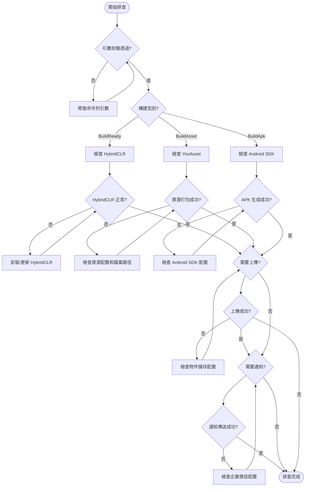

# 常見問題

本文件彙總了使用 GameFrameX Unity Builder 進行自動化構建時可能遇到的常見問題及其解決方案。

## 概述

GameFrameX Unity Builder 是一個自動化構建工具，支援以下功能：
- 命令列構建（支援 CI/CD 整合）
- 資源打包（基於 YooAsset）
- 熱更新支援（基於 HybridCLR）
- 多雲物件儲存上傳（七牛雲、騰訊雲、阿里雲）
- 企業微信構建通知

## 常見問題與解決方案

### 1. 引數錯誤

#### 1.1 executeMethod 為空

**錯誤資訊：**
```
Exception: executeMethod is null
```

**原因：** 未在命令列引數中指定 `-executeMethod`。

**解決方案：** 確保 CI/CD 配置中包含 `-executeMethod` 引數，指定要執行的構建方法（如 `GameFrameX.Builder.Editor.Builder.BuildAsset`）。

```bash
-executeMethod GameFrameX.Builder.Editor.Builder.BuildAsset
```
> Source: [Builder.cs#L153-L156](https://github.com/GameFrameX/com.gameframex.unity.builder/blob/main/Editor/Builder.cs#L153-L156)

---

#### 1.2 buildNumber 為空

**錯誤資訊：**
```
Exception: build number is null
```

**原因：** 未在命令列引數中指定 `-BUILD_NUMBER`。

**解決方案：** 確保 CI/CD 配置中包含 `-BUILD_NUMBER` 引數。

```bash
-BUILD_NUMBER 1001
```
> Source: [Builder.cs#L158-L161](https://github.com/GameFrameX/com.gameframex.unity.builder/blob/main/Editor/Builder.cs#L158-L161)

---

### 2. 構建問題

#### 2.1 HybridCLR 安裝失敗

**問題描述：** 構建過程中 HybridCLR 安裝失敗或未正確安裝。

**原因分析：**
- HybridCLR 包未正確安裝
- il2cpp 版本與 HybridCLR 版本不匹配

**解決方案：**

確保在構建前檢查 HybridCLR 安裝狀態。Builder 會在 `BuildReady` 階段自動檢查並安裝：

```csharp
var installerController = new InstallerController();
var isInstalled = installerController.HasInstalledHybridCLR();
if (!isInstalled || installerController.InstalledLibil2cppVersion != installerController.PackageVersion)
{
    installerController.InstallDefaultHybridCLR();
}
```
> Source: [Builder.cs#L219-L232](https://github.com/GameFrameX/com.gameframex.unity.builder/blob/main/Editor/Builder.cs#L219-L232)

**排查步驟：**
1. 確認 Unity 專案已正確安裝 HybridCLR 包
2. 確認 il2cpp 版本與 HybridCLR 相容
3. 在構建日誌中檢視 `BuildReady Check HybridCLR Install Status` 輸出

---

#### 2.2 資源打包失敗

**問題描述：** 資源打包過程中出現異常，導致構建失敗。

**常見原因：**
- YooAsset 配置錯誤
- 資原始檔路徑問題
- 磁碟空間不足

**解決方案：**

Builder 捕獲了異常並會輸出詳細錯誤日誌：

```csharp
try
{
    pipeline.Run(buildParameters, true);
    isSuccess = true;
}
catch (Exception e)
{
    Debug.LogException(e);
    Environment.Exit(1);
}
```
> Source: [Builder.cs#L298-L308](https://github.com/GameFrameX/com.gameframex.unity.builder/blob/main/Editor/Builder.cs#L298-L308)

**排查步驟：**
1. 檢視構建日誌中的詳細異常資訊
2. 檢查 YooAsset 配置（AssetBundleCollectorSetting）
3. 確認資源目錄路徑正確
4. 確認磁碟空間充足

---

#### 2.3 資源包檔名大小寫問題

**問題描述：** 某些檔案系統（不區分大小寫）導致資源包檔名衝突。

**解決方案：**

Builder 自動將所有資源包檔名轉換為小寫：

```csharp
foreach (var assetBundleCollectorPackage in AssetBundleCollectorSettingData.Setting.Packages)
{
    assetBundleCollectorPackage.LocationToLower = true;
}
AssetBundleCollectorSettingData.SaveFile();
```
> Source: [Builder.cs#L271-L278](https://github.com/GameFrameX/com.gameframex.unity.builder/blob/main/Editor/Builder.cs#L271-L278)

---

### 3. 物件儲存問題

#### 3.1 物件儲存上傳失敗

**問題描述：** 構建完成後，資源包或 APK 上傳至物件儲存失敗。

**原因分析：**
- 配置的 Key/Secret 錯誤
- Bucket 名稱或 Endpoint 錯誤
- 網路連線問題

**解決方案：**

確保在命令列引數中正確配置物件儲存相關引數：

| 引數 | 說明 | 示例 |
|------|------|------|
| `-ObjectStorageKey` | API 金鑰 | AKIDxxxx |
| `-ObjectStorageSecret` | API 秘鑰 | xxxxxxxxx |
| `-ObjectStorageBucketName` | 儲存桶名稱 | my-bucket |
| `-ObjectStorageEndPoint` | 區域節點 | ap-guangzhou |

並在程式碼中正確啟用編譯宏：
```csharp
#if ENABLE_GAME_FRAME_X_OBJECT_STORAGE
// 物件儲存功能程式碼
#endif
```

---

#### 3.2 未啟用物件儲存功能

**問題描述：** 程式碼中使用了物件儲存相關功能，但編譯報錯或功能未生效。

**原因：** 未在專案指令碼定義中啟用 `ENABLE_GAME_FRAME_X_OBJECT_STORAGE` 編譯宏。

**解決方案：**

在 Unity 編輯器中：
1. 開啟 `Edit > Project Settings > Player`
2. 找到 `Scripting Define Symbols`
3. 新增 `ENABLE_GAME_FRAME_X_OBJECT_STORAGE`
4. 根據需要新增雲服務商對應的宏：
   - `ENABLE_GAME_FRAME_X_OBJECT_STORAGE_QI_NIU`（七牛雲）
   - `ENABLE_GAME_FRAME_X_OBJECT_STORAGE_TENCENT`（騰訊雲）
   - `ENABLE_GAME_FRAME_X_OBJECT_STORAGE_A_LI_YUN`（阿里雲）

---

### 4. 網路通知問題

#### 4.1 企業微信通知傳送失敗

**問題描述：** 構建成功但未收到企業微信通知。

**原因分析：**
- WeChatBotKey 配置錯誤
- 企業微信機器人 API 呼叫失敗

**解決方案：**

確保配置了正確的企業微信機器人 Key：

```csharp
-WeChatBotKey xxxxx-xxxxx-xxxxx
```
> Source: [WeChatNotifyWorkHelper.cs#L49](https://github.com/GameFrameX/com.gameframex.unity.builder/blob/main/Editor/WeChatNotifyWorkHelper.cs#L49)

Builder 會捕獲異常但不會阻止構建流程：

```csharp
try
{
    var httpResponseMessage = httpClient.PostAsync(url, stringContent).GetAwaiter().GetResult();
    var response = httpResponseMessage.Content.ReadAsStringAsync().GetAwaiter().GetResult();
    Debug.Log(response);
}
catch (Exception e)
{
    Debug.LogException(e);
}
```
> Source: [WeChatNotifyWorkHelper.cs#L59-L69](https://github.com/GameFrameX/com.gameframex.unity.builder/blob/main/Editor/WeChatNotifyWorkHelper.cs#L59-L69)

---

#### 4.2 資源版本更新 API 呼叫失敗

**問題描述：** 資源包版本更新請求失敗。

**原因分析：**
- `UpdateAssetPackageVersionUrl` 配置錯誤
- `UpdateAssetPackageVersionAuthorization` 授權資訊錯誤

**解決方案：**

配置正確的版本更新 URL 和授權資訊：

```csharp
-UpdateAssetPackageVersionUrl https://api.example.com/version
-UpdateAssetPackageVersionAuthorization Bearer xxxxxx
```
> Source: [BuilderUpdateAssetPackageVersionHelper.cs#L55-L56](https://github.com/GameFrameX/com.gameframex.unity.builder/blob/main/Editor/BuilderUpdateAssetPackageVersionHelper.cs#L55-L56)

---

### 5. 版本與包名問題

#### 5.1 包名未更新

**問題描述：** 構建的 APK 包名未使用命令列指定的值。

**原因：** 只有在配置了 `-BundleId` 引數時才會覆蓋專案包名。

**解決方案：**

確保在命令列引數中包含 `-BundleId`：

```bash
-BundleId com.example.myapp
```

如果未配置此引數，將使用專案原有的包名：
```csharp
if (!_builderOptions.BundleId.IsNullOrWhiteSpace())
{
    PlayerSettings.applicationIdentifier = _builderOptions.BundleId.Trim();
}
```
> Source: [Builder.cs#L172-L175](https://github.com/GameFrameX/com.gameframex.unity.builder/blob/main/Editor/Builder.cs#L172-L175)

---

#### 5.2 版本號未更新

**問題描述：** 構建的 APK 版本號未使用命令列指定的值。

**原因：** 只有在配置了 `-AppVersion` 引數時才會覆蓋專案版本號。

**解決方案：**

確保在命令列引數中包含 `-AppVersion`：

```bash
-AppVersion 1.2.3
```

如果未配置此引數，將使用專案原有的版本號：
```csharp
if (!_builderOptions.AppVersion.IsNullOrWhiteSpace())
{
    PlayerSettings.bundleVersion = _builderOptions.AppVersion.Trim();
}
```
> Source: [Builder.cs#L177-L180](https://github.com/GameFrameX/com.gameframex.unity.builder/blob/main/Editor/Builder.cs#L177-L180)

---

### 6. 日誌相關問題

#### 6.1 日誌檔案路徑問題

**問題描述：** 無法找到構建日誌檔案。

**原因：** 未在命令列引數中指定 `-logFile` 路徑。

**解決方案：**

Builder 會自動生成預設日誌路徑（如果未指定）：

```csharp
if (_builderOptions.LogFilePath.IsNullOrWhiteSpace())
{
    var split = _builderOptions.ExecuteMethod.Split(new[] { "." }, StringSplitOptions.RemoveEmptyEntries);
    _builderOptions.LogFilePath = $"../Logs/{split[split.Length - 1]}_{_builderOptions.BuildNumber}.log";
}
```
> Source: [Builder.cs#L163-L167](https://github.com/GameFrameX/com.gameframex.unity.builder/blob/main/Editor/Builder.cs#L163-L167)

建議顯式指定日誌路徑：
```bash
-logFile /path/to/build.log
```

---

## 構建流程問題排查

### 排查流程圖



---

## 常用命令參考

### 完整構建命令示例

```bash
Unity \
  -projectPath /path/to/project \
  -executeMethod GameFrameX.Builder.Editor.Builder.BuildAsset \
  -BUILD_NUMBER ${BUILD_NUMBER} \
  -JOB_NAME ${JOB_NAME} \
  -PackageName DefaultPackage \
  -ChannelName default \
  -BundleId com.example.game \
  -AppVersion 1.0.0 \
  -IsIncrementalBuildPackage false \
  -IsUploadAsset true \
  -IsUploadLogFile true \
  -ObjectStorageKey ${OSS_KEY} \
  -ObjectStorageSecret ${OSS_SECRET} \
  -ObjectStorageBucketName game-assets \
  -ObjectStorageEndPoint ap-guangzhou \
  -IsUpdateAssetPackageVersion true \
  -UpdateAssetPackageVersionUrl https://api.example.com/version \
  -UpdateAssetPackageVersionAuthorization "Bearer token" \
  -WeChatBotKey ${WECHAT_KEY} \
  -logFile ../Logs/build_${BUILD_NUMBER}.log
```
> Source: [Builder.cs#L60-L151](https://github.com/GameFrameX/com.gameframex.unity.builder/blob/main/Editor/Builder.cs#L60-L151)

---

## 相關連結

- [概述](./1-overview) - 專案概述與架構
- [安裝](./2-installation) - 安裝指南
- [快速開始](./3-getting-started) - 快速入門
- [使用方法](./4-usage) - 詳細使用方法
- [配置選項](./5-configuration) - 配置選項說明
- [物件儲存](./6-object-storage) - 物件儲存整合
