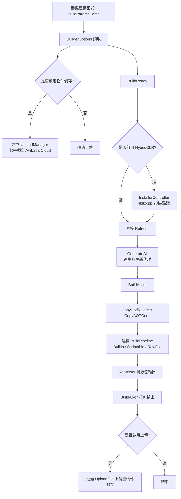

# 運作機制:Builder 管線

Builder 管線是 GameFrameX Unity Builder 在 Editor 端依序觸發的一系列打包進入點。它負責從 `BuildReady` 的環境準備、`BuildAsset` 的 YooAsset 資源包建置，到 `BuildApk` 的打包輸出與可選的物件儲存上傳。整條管線透過 `Builder.cs` 內以 `partial` 形式拆分至多個檔案的靜態方法串聯而成，每個方法對應管線中的一個階段。

## 管線階段一覽

| 階段 | 進入方法 | 主要處理 |
|------|---------|---------|
| 1. 參數解析 | `Builder.BuildParamsParse()`(於靜態建構函式中呼叫) | 解析 JSON 設定檔並設定 `BuilderOptions`;根據腳本巨集建立 `IObjectStorageUploadManager`(七牛/騰訊雲/Alibaba Cloud) |
| 2. 建置準備 | `Builder.BuildReady()` | 啟用 HybridCLR 時安裝/驗證 libil2cpp、重新整理 `AssetDatabase`、產生熱更新代理 |
| 3. 資源建置 | `Builder.BuildAsset()` | 複製熱更新與 AOT 組件、選擇建置管線、呼叫 YooAsset 輸出資源包 |
| 4. 打包輸出 | `Builder.BuildApk()`(其他平台亦為類似方法) | 呼叫平台建置器，並可選擇將 APK 與日誌上傳至物件儲存 |

## 機制概覽



## 階段 1:參數解析

`Builder.cs` 的靜態建構函式會先呼叫 `BuildParamsParse()` 讀取 JSON 設定並設定 `_builderOptions`。之後，根據腳本巨集判斷是否實例化物件儲存上傳管理器，並設定儲存路徑範本。

Source:[Editor/Builder.cs#L32-L49](https://github.com/GameFrameX/com.gameframex.unity.builder/blob/main/Editor/Builder.cs#L32-L49)

```csharp
static Builder()
{
    BuildParamsParse();
#if ENABLE_GAME_FRAME_X_OBJECT_STORAGE_QI_NIU
    ObjectStorageUploadManager = ObjectStorageUploadFactory.Create<QiNiuYunObjectStorageUploadManager>(
        _builderOptions.ObjectStorageKey, _builderOptions.ObjectStorageSecret,
        _builderOptions.ObjectStorageBucketName, _builderOptions.ObjectStorageEndPoint);
#endif
    /* ... 騰訊雲 / Alibaba Cloud 的分支亦同 ... */
    ObjectStorageUploadManager.SetSavePath($"builder/{PlayerSettings.productName}/{EditorUserBuildSettings.activeBuildTarget}/{_builderOptions.JobName}/{Application.version}/{_builderOptions.BuildNumber}");
}
```

## 階段 2:`BuildReady` 建置準備

`BuildReady` 會在打包開始前統一環境。若啟用 HybridCLR,會驗證/安裝 libil2cpp、重新整理 AssetDatabase 並產生 HybridCLR 的熱更新代理。之後，若啟用日誌上傳，則會先上傳一次日誌。

Source:[Editor/Builder.BuildReady.cs#L15-L50](https://github.com/GameFrameX/com.gameframex.unity.builder/blob/main/Editor/Builder.BuildReady.cs#L15-L50)

```csharp
public static void BuildReady()
{
#if ENABLE_GAME_FRAME_X_HYBRID_CLR
    var installerController = new InstallerController();
    var isInstalled = installerController.HasInstalledHybridCLR();
    if (!isInstalled || installerController.InstalledLibil2cppVersion != installerController.PackageVersion)
    {
        installerController.InstallDefaultHybridCLR();
    }
    PrebuildCommand.GenerateAll();
#endif
    AssetDatabase.Refresh();
    if (_builderOptions.IsUploadLogFile)
    {
        ObjectStorageUploadManager.UploadFile(_builderOptions.LogFilePath);
    }
}
```

## 階段 3:`BuildAsset` 資源建置

`BuildAsset` 會先將熱更新/AOT 組件複製到執行階段目錄，接著依據 `_builderOptions.BuildPipeline` 選擇 `BuiltinBuildPipeline`、`ScriptableBuildPipeline` 或 `RawFileBuildPipeline` 其中之一，最後呼叫 YooAsset 輸出資源包。

Source:[Editor/Builder.BuildAsset.cs#L15-L80](https://github.com/GameFrameX/com.gameframex.unity.builder/blob/main/Editor/Builder.BuildAsset.cs#L15-L80)

```csharp
BuildHotfixHelper.CopyHotfixCode();
AssetDatabase.Refresh();
BuildHotfixHelper.CopyAOTCode();
AssetDatabase.Refresh();

var buildPipeline = (EBuildPipeline)buildPipelineObj;
switch (buildPipeline)
{
    case EBuildPipeline.ScriptableBuildPipeline:
        pipeline = new ScriptableBuildPipeline();
        buildParameters = new ScriptableBuildParameters();
        break;
    case EBuildPipeline.RawFileBuildPipeline:
        pipeline = new RawFileBuildPipeline();
        buildParameters = new RawFileBuildParameters();
        break;
    default:
        pipeline = new BuiltinBuildPipeline();
        buildParameters = new BuiltinBuildParameters();
        break;
}
buildParameters.BuildMode = _builderOptions.IsIncrementalBuildPackage ? EBuildMode.IncrementalBuild : EBuildMode.ForceRebuild;
```

若 `EBuildPipeline` 的字串設定不正確，會輸出 `無效的建置管線類型` 並直接 `return`,因此不會進入打包輸出階段。

## 階段 4:`BuildApk` 打包輸出與上傳

`BuildApk` 會將 APK 輸出委派給 `BuildProductHelper.BuildPlayerAndroid()`,之後依據 `IsUploadApk` / `IsUploadLogFile` 選項，將產出物與日誌上傳至物件儲存。

Source:[Editor/Builder.cs#L62-L78](https://github.com/GameFrameX/com.gameframex.unity.builder/blob/main/Editor/Builder.cs#L62-L78)

```csharp
public static void BuildApk()
{
    var apkPath = BuildProductHelper.BuildPlayerAndroid();
    if (_builderOptions.IsUploadApk)
    {
        ObjectStorageUploadManager.UploadFile(apkPath);
    }
    if (_builderOptions.IsUploadLogFile)
    {
        ObjectStorageUploadManager.UploadFile(_builderOptions.LogFilePath);
    }
}
```

## 主要設定項目(`BuilderOptions`)

| 欄位 | 作用 | 預設值 |
|------|------|--------|
| `BuildPipeline` | 選擇 `BuiltinBuildPipeline` / `ScriptableBuildPipeline` / `RawFileBuildPipeline` | — |
| `PackageName` | YooAsset 資源包名稱 | — |
| `PackageVersion` | 資源包版本號，為空時使用 `yyyyMMddHHmmss` | 空字串 |
| `IsIncrementalBuildPackage` | `true`=增量建置、`false`=強制重建 | — |
| `BuildinFileCopyOption` | 內建檔案複製選項，為空時使用 `ClearAndCopyAll` | 空字串 |
| `IsUploadApk` / `IsUploadLogFile` | 是否上傳 APK / 日誌 | — |
| `ObjectStorageKey/Secret/BucketName/EndPoint` | 物件儲存的驗證資訊 | 空字串 |
| `JobName` / `BuildNumber` | 用於組成物件儲存路徑 `builder/{product}/{target}/{job}/{version}/{buildNumber}` | 空字串 |

Source:[Editor/BuilderOptions.cs#L1-L60](https://github.com/GameFrameX/com.gameframex.unity.builder/blob/main/Editor/BuilderOptions.cs#L1-L60)

## 上傳路徑範本

啟用物件儲存時，儲存路徑統一為以下格式：

```text
builder/{PlayerSettings.productName}/{activeBuildTarget}/{JobName}/{Application.version}/{BuildNumber}
```

Source:[Editor/Builder.cs#L47](https://github.com/GameFrameX/com.gameframex.unity.builder/blob/main/Editor/Builder.cs#L47)

## 接下來

- 關於各平台打包輸出方法的差異，請參閱《平台打包輸出》任務頁面(若存在於目錄中)。
- 關於 `BuilderOptions` 欄位的完整清單，請參閱《建置選項速查表》參考頁面。
- 關於建置失敗的疑難排解，請參閱《建置失敗時的處理》疑難排解頁面。