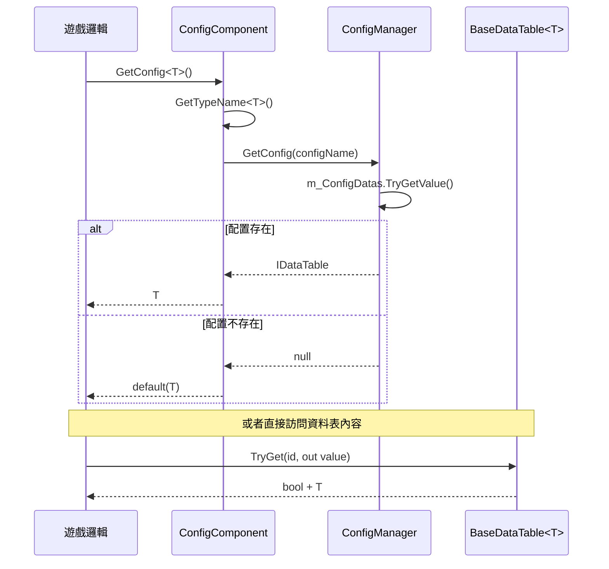

# Config 組件簡介

Config 組件是 GameFrameX 框架中用於管理配置表資料的核心模組。它提供了統一的配置載入、儲存和查詢機制，使配置資料的使用更加簡單高效。

## 概述

GameFrameX Config 組件是一個輕量級、高效能的 Unity 配置管理解決方案，專門為遊戲開發場景設計。該組件採用模組化架構，將配置資料的儲存、查詢和管理分離，提供清晰的分層結構。

### 設計目標

- **簡化配置訪問**：透過泛型介面提供強型別的配置訪問方式
- **高效能查詢**：支援多種 ID 型別（int、long、string）的快速查詢
- **靈活的資料操作**：提供豐富的資料查詢和聚合方法
- **事件驅動**：支援配置載入成功/失敗的事件通知

### 核心特性

1. **強型別支援**：配置資料以泛型 `IDataTable<T>` 形式訪問，編譯時型別安全
2. **多鍵值索引**：支援 `int`、`long`、`string` 三種主鍵型別的查詢
3. **資料聚合能力**：內建 Max、Min、Sum 等聚合函式
4. **非同步載入**：配置資料支援非同步載入模式
5. **執行緒安全**：使用 `ConcurrentDictionary` 保證多執行緒安全

## 架構設計

Config 組件採用三層架構設計，各層職責清晰，依賴關係明確：

```mermaid
graph TD
    subgraph UnityComponent["Unity 組件層"]
        CC[ConfigComponent<br/>配置組件]
    end

    subgraph ManagerLayer["管理器層"]
        ICM[IConfigManager<br/>配置管理器介面]
        CM[ConfigManager<br/>配置管理器實現]
    end

    subgraph DataTableLayer["資料表層"]
        IDataTable[IDataTable<br/>資料表介面]
        IDataTableG[IDataTable&lt;T&gt;<br/>泛型資料表介面]
        BDT[BaseDataTable&lt;T&gt;<br/>資料表基類]
    end

    subgraph EventLayer["事件層"]
        LCSEA[LoadConfigSuccessEventArgs<br/>載入成功事件]
        LCFA[LoadConfigFailureEventArgs<br/>載入失敗事件]
    end

    CC --> ICM
    ICM <|.. CM
    IDataTable <|.. IDataTableG
    IDataTableG <|.. BDT
    CM -.->|儲存| BDT
```

### 各層職責

| 層級 | 組件 | 職責描述 |
|------|------|----------|
| Unity 組件層 | ConfigComponent | 作為 Unity 組件暴露給場景，提供遊戲邏輯呼叫的入口 |
| 管理器層 | ConfigManager | 管理所有配置表的儲存、檢索和生命週期 |
| 資料表層 | `BaseDataTable<T>` | 實現具體配置資料的儲存和查詢邏輯 |
| 事件層 | EventArgs | 提供配置載入狀態的事件通知 |

## 核心概念

### 配置組件 (ConfigComponent)

`ConfigComponent` 是直接掛載在 Unity 場景中的組件，繼承自 `GameFrameworkComponent`。它負責：

- 初始化 `ConfigManager` 模組
- 提供面向遊戲邏輯的配置訪問介面
- 維護型別到配置名稱的對映

> Source: [ConfigComponent.cs](https://github.com/GameFrameX/com.gameframex.unity.config/blob/main/Runtime/Config/ConfigComponent.cs#L46-L185)

### 配置管理器 (ConfigManager)

`ConfigManager` 是框架內部的配置管理模組，實現了 `IConfigManager` 介面。使用 `ConcurrentDictionary<string, IDataTable>` 儲存所有配置表資料。

### 資料表介面 (IDataTable)

資料表介面分為兩個層次：

- **IDataTable**：非泛型基礎介面，定義通用的非同步載入方法
- **`IDataTable<T>`**：泛型介面，繼承自 `IDataTable`，提供強型別的資料訪問方法

> Source: [IDataTable.cs](https://github.com/GameFrameX/com.gameframex.unity.config/blob/main/Runtime/Config/Config/IDataTable.cs#L39-L355)

### 資料表基類 (`BaseDataTable<T>`)

`BaseDataTable<T>` 是所有具體配置資料表的抽象基類，提供了：

- 內部使用 `Dictionary<long, T>` 和 `Dictionary<string, T>` 分別儲存不同主鍵型別的資料
- 實現了 `TryGet` 系列方法用於安全的查詢
- 提供了索引器支援直接透過 `table[id]` 方式訪問
- 實現了 `FirstOrDefault`、`LastOrDefault`、`All` 等便捷屬性
- 提供了 `Find`、`FindList`、`FindListArray` 等查詢方法
- 內建 `Max`、`Min`、`Sum` 等聚合計算方法

> Source: [BaseDataTable.cs](https://github.com/GameFrameX/com.gameframex.unity.config/blob/main/Runtime/Config/Config/BaseDataTable.cs#L40-L520)

## 資料訪問流程

配置資料從建立到訪問的完整流程如下：



## 快速開始

### 基本使用步驟

1. **建立資料表類**：繼承 `BaseDataTable<T>`，實現 `LoadAsync` 方法
2. **掛載組件**：在 Unity 場景中掛載 `ConfigComponent` 組件
3. **獲取配置**：透過 `ConfigComponent.GetConfig<T>()` 獲取配置例項

### 程式碼示例

```csharp
// 1. 定義配置資料型別
public class ItemData
{
    public int Id { get; set; }
    public string Name { get; set; }
    public string Description { get; set; }
}

// 2. 建立具體的資料表實現
public class ItemTable : BaseDataTable<ItemData>
{
    public override async Task LoadAsync()
    {
        // 在這裡實現從檔案或網路載入資料的邏輯
        // 載入完成後將資料新增到字典中
        LongDataMaps.Add(1, new ItemData { Id = 1, Name = "武器", Description = "新手武器" });
        LongDataMaps.Add(2, new ItemData { Id = 2, Name = "護甲", Description = "新手護甲" });
        DataList.AddRange(LongDataMaps.Values);
    }
}

// 3. 在遊戲邏輯中使用配置
public class GameManager : MonoBehaviour
{
    private ConfigComponent _configComponent;
    
    private async void Start()
    {
        _configComponent = UnityEngine.Component.FindObjectOfType<ConfigComponent>();
        
        // 載入配置
        var itemTable = new ItemTable();
        await itemTable.LoadAsync();
        _configComponent.Add("ItemTable", itemTable);
        
        // 訪問配置資料 - 使用 TryGet 安全獲取
        if (itemTable.TryGet(1, out var item))
        {
            Debug.Log($"物品名稱: {item.Name}");
        }
        
        // 使用索引器訪問
        var item2 = itemTable[2];
        
        // 條件查詢
        var foundItems = itemTable.FindList(x => x.Name.Contains("護"));
    }
}
```

> Source: [ConfigComponent.cs](https://github.com/GameFrameX/com.gameframex.unity.config/blob/main/Runtime/Config/ConfigComponent.cs#L108-L127)

## API 概覽

### ConfigComponent 核心方法

| 方法 | 描述 |
|------|------|
| `GetConfig<T>()` | 獲取指定型別的配置表例項 |
| `HasConfig<T>()` | 檢查指定型別的配置是否存在 |
| `RemoveConfig<T>()` | 移除指定型別的配置 |
| `RemoveAllConfigs()` | 移除所有配置 |
| `Add(string, IDataTable)` | 新增新的配置表 |

### `IDataTable<T>` 核心成員

| 成員 | 描述 |
|------|------|
| `TryGet(int/long/string, out T)` | 嘗試根據主鍵獲取資料 |
| `this[int/long/string id]` | 索引器，支援直接透過主鍵訪問 |
| `FirstOrDefault` | 獲取第一個資料元素 |
| `LastOrDefault` | 獲取最後一個資料元素 |
| `All` | 獲取所有資料元素 |
| `Find(Func<T, bool>)` | 查詢第一個匹配的元素 |
| `FindList(Func<T, bool>)` | 查詢所有匹配的元素 |
| `ForEach(Action<T>)` | 遍歷所有元素 |
| `Max/Min<Tk>()` | 獲取最大值/最小值 |
| `Sum()` | 計算總和 |

## 依賴關係

Config 組件依賴以下 GameFrameX 核心模組：

| 依賴模組 | 最低版本 | 用途說明 |
|----------|----------|----------|
| com.gameframex.unity | 1.1.1 | 核心框架基礎 |
| com.gameframex.unity.asset | 1.0.6 | 資源載入支援 |
| com.gameframex.unity.event | 1.0.0 | 事件系統 |

> 詳細依賴要求請參考 [依賴要求](../2-installation/dependencies) 文件

## 相關連結

- [功能特性](./1-overview.features) - 瞭解 Config 組件的完整功能列表
- [安裝方式](../2-installation.install-methods) - 掌握組件的正確安裝步驟
- [基礎使用](../3-getting-started.basic-usage) - 快速上手配置組件的使用
- [資料表定義](../3-getting-started.data-table-definition) - 學習如何定義自己的資料表
- [配置組件詳解](../4-core-concepts.config-component) - ConfigComponent 深入解析
- [配置管理器詳解](../4-core-concepts.config-manager) - ConfigManager 實現細節
- [IDataTable 介面詳解](../4-core-concepts.idata-table) - 資料表介面完整文件
