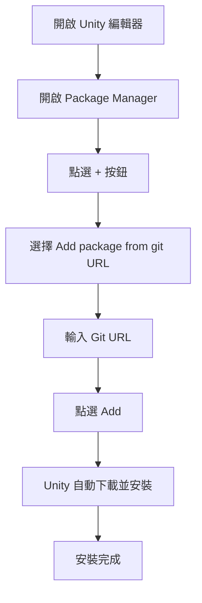

# 安裝方式

本文件介紹 GameFrameX Config 配置組件的多種安裝方式，幫助開發者快速在 Unity 專案中整合該組件。

## 概述

GameFrameX Config 是 GameFrameX 框架的配置表組件，提供配置表相關的介面，使配置功能的使用更加簡單高效。在使用該組件之前，需要先將其正確安裝到 Unity 專案中。

> **當前版本**: 1.1.3  
> **Unity 版本要求**: 2019.4 及以上

## 依賴要求

在安裝 Config 組件之前，需要確保專案中已安裝以下依賴包：

| 依賴包 | 最低版本 | 說明 |
|--------|----------|------|
| com.gameframex.unity | 1.1.1 | GameFrameX 核心框架 |
| com.gameframex.unity.asset | 1.0.6 | 資源管理模組 |
| com.gameframex.unity.event | 1.0.0 | 事件系統模組 |

Config 組件會自動處理依賴包的安裝，當使用 Package Manager 安裝時會自動安裝所有依賴。

## 安裝方式

### 方式一：透過 manifest.json 安裝（推薦）

這是最推薦的安裝方式，方便版本管理和團隊協作。

1. 開啟 Unity 專案中的 `Packages` 資料夾
2. 找到並編輯 `manifest.json` 檔案
3. 在 `dependencies` 節點下新增以下內容：

```json
{
  "dependencies": {
    "com.gameframex.unity.config": "https://github.com/GameFrameX/com.gameframex.unity.config.git"
  }
}
```

4. 儲存檔案後，Unity 會自動下載並安裝依賴包

> **注意**: 使用 Git URL 方式安裝時，Unity 會自動解析並安裝所有依賴項。

### 方式二：透過 Unity Package Manager 安裝

1. 開啟 Unity 編輯器
2. 依次點選選單 **Window** → **Package Manager**
3. 在 Package Manager 視窗中，點選左上角的 **+** 按鈕
4. 選擇 **Add package from git URL...** 選項
5. 在輸入框中貼上以下地址：

```
https://github.com/GameFrameX/com.gameframex.unity.config.git
```

6. 點選 **Add** 按鈕，Unity 會自動下載並安裝包及其依賴



### 方式三：直接放置到 Packages 目錄

適用於需要修改原始碼或進行深度定製的場景。

1. 克隆或下載倉庫：

```bash
git clone https://github.com/GameFrameX/com.gameframex.unity.config.git
```

2. 將下載的倉庫資料夾複製到 Unity 專案的 `Packages` 目錄下
3. Unity 會自動識別並載入包

> **注意**: 這種方式安裝的包不會自動接收更新，需要手動更新。

## 安裝驗證

安裝完成後，可以透過以下方式驗證 Config 組件是否正確安裝：

1. **檢查 Package Manager**: 在 Package Manager 中確認 "Game Frame X Config" 已顯示
2. **檢查 Assembly Definition**: 確認 `GameFrameX.Config.Runtime.asmdef` 已正確編譯
3. **使用組件**: 在場景中嘗試新增 `ConfigComponent` 檢查是否正常工作

```csharp
// 驗證安裝 - 在程式碼中檢查 Config 組件是否可用
using GameFrameX.Runtime;

var configComponent = UnityEngine.GameObject.FindObjectOfType<ConfigComponent>();
if (configComponent != null)
{
    UnityEngine.Debug.Log("Config 組件安裝成功！");
}
```

## 升級與更新

### 自動更新（方式一和二）

使用 Package Manager 安裝的包可以透過以下方式更新：

1. 在 Package Manager 中選擇 GameFrameX Config
2. 點選版本號旁的下拉箭頭
3. 選擇最新版本或點選 "See all versions" 檢視可用版本

### 手動更新（方式三）

對於直接放置到 Packages 目錄的安裝方式：

1. 刪除原有的包資料夾
2. 重新下載最新版本
3. 複製到 Packages 目錄

## 常見安裝問題

### Git URL 無法訪問

如果遇到 Git URL 無法訪問的問題，可以嘗試：
- 使用代理
- 將倉庫 fork 到自己的 GitHub 賬戶
- 下載 ZIP 包後解壓到 Packages 目錄

### 依賴包版本衝突

當出現依賴包版本衝突時：
1. 檢查各個依賴包的版本要求
2. 統一所有 GameFrameX 組件到相同主版本
3. 參考 [依賴要求](./2-installation.dependencies) 文件

### Unity 版本不相容

確認 Unity 編輯器版本是否符合要求（2019.4+），舊版本可能需要升級 Unity 編輯器。

## 相關連結

- [依賴要求](./2-installation.dependencies) - 詳細瞭解組件依賴關係
- [快速開始](./3-getting-started.basic-usage) - 瞭解組件的基本使用
- [Config 組件簡介](./1-overview.introduction) - 瞭解 Config 組件功能
- [GitHub 倉庫](https://github.com/GameFrameX/com.gameframex.unity.config.git) - 獲取最新版本
- [官方文件](https://gameframex.doc.alianblank.com) - 檢視完整文件
