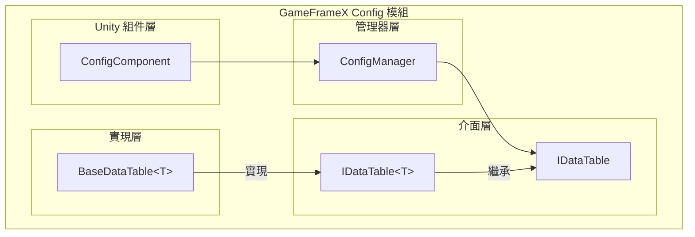

# 基礎使用

Config 組件是 GameFrameX 框架中用於管理遊戲配置資料的核心模組，提供了一套高效、型別安全的配置資料儲存和訪問機制。透過 Config 組件，開發者可以方便地載入和管理遊戲中的各種配置表（如物品表、角色表、關卡表等），並透過強型別介面快速查詢配置資料。

## 概述

Config 組件的設計目標是為遊戲開發提供一個統一的配置資料管理解決方案。在遊戲開發中，配置資料通常儲存在 Excel、CSV 或 JSON 等格式的配置表中，這些資料需要在執行時被快速查詢和訪問。Config 組件透過以下特性滿足這一需求：

- **型別安全**：透過泛型介面提供編譯時的型別檢查，減少執行時錯誤
- **高效查詢**：內部使用 Dictionary 儲存，支援 O(1) 時間複雜度的資料查詢
- **靈活的主鍵支援**：支援 int、long、string 三種主鍵型別，適應不同的配置表需求
- **豐富的查詢操作**：提供 Find、Max、Min、Sum 等常用查詢方法

### 核心組件架構



### 資料訪問流程

```mermaid
sequenceDiagram
    participant Dev as 開發者程式碼
    participant CC as ConfigComponent
    participant CM as ConfigManager
    participant DT as IDataTable&lt;T&gt;

    Dev->>CC: GetConfig&lt;TDataTable&gt;()
    CC->>CM: GetConfig(configName)
    CM->>DT: 返回 IDataTable 例項
    DT-->>Dev: TDataTable 資料表物件
    Dev->>DT: TryGet(id, out value)
    DT-->>Dev: 返回查詢結果
```

## 建立資料表

要使用 Config 組件，首先需要建立自定義的資料表類。資料表類需要繼承 `BaseDataTable<T>` 抽象類，並實現 `LoadAsync` 方法來載入配置資料。

### 定義資料模型

首先，需要定義配置資料的模型類。例如，建立一個物品配置資料模型：

```csharp
using GameFrameX.Config.Runtime;

[Serializable]
public class ItemData
{
    public int Id { get; set; }
    public string Name { get; set; }
    public string Description { get; set; }
    public int Quality { get; set; }
    public int Price { get; set; }
}
```
> Source: [示例程式碼](https://github.com/GameFrameX/com.gameframex.unity.config/blob/main/README.md)

### 建立資料表類

繼承 `BaseDataTable<T>` 並實現 `LoadAsync` 方法：

```csharp
using System.Collections.Generic;
using System.Threading.Tasks;
using GameFrameX.Config.Runtime;

public class ItemDataTable : BaseDataTable<ItemData>
{
    public override async Task LoadAsync()
    {
        // 從配置源載入資料
        // 這裡可以是從檔案、網路或資源系統載入
        var items = new List<ItemData>
        {
            new ItemData { Id = 1001, Name = "生命藥水", Description = "恢復100點生命", Quality = 1, Price = 50 },
            new ItemData { Id = 1002, Name = "魔法藥水", Description = "恢復50點魔法", Quality = 1, Price = 30 },
            new ItemData { Id = 1003, Name = "紫色裝備", Description = "高品質裝備", Quality = 5, Price = 1000 }
        };

        // 將資料新增到字典中
        foreach (var item in items)
        {
            LongDataMaps.Add(item.Id, item);
            DataList.Add(item);
        }
        
        await Task.CompletedTask;
    }
}
```
> Source: [BaseDataTable.cs](https://github.com/GameFrameX/com.gameframex.unity.config/blob/main/Runtime/Config/Config/BaseDataTable.cs#L48-L69)

`BaseDataTable<T>` 類提供了兩個主要的內部字典用於儲存資料：
- `LongDataMaps`：用於儲存長整數主鍵的資料
- `StringDataMaps`：用於儲存字串主鍵的資料
- `DataList`：用於按順序儲存所有資料物件

## 註冊和使用資料表

### 新增 ConfigComponent

在 Unity 場景中建立一個空物體，並新增 ConfigComponent 組件：

1. 在 Unity 編輯器中，右鍵點選 Hierarchy 面板
2. 選擇 `GameObject` → `Create Empty`
3. 在 Inspector 面板中，點選 `Add Component`
4. 搜尋並新增 `ConfigComponent`（位於 GameFrameX/Config 選單下）

```csharp
// 也可以透過程式碼新增
var configEntity = new GameObject("ConfigSystem");
var configComponent = configEntity.AddComponent<GameFrameX.Config.Runtime.ConfigComponent>();
```
> Source: [ConfigComponent.cs](https://github.com/GameFrameX/com.gameframex.unity.config/blob/main/Runtime/Config/ConfigComponent.cs#L46-L48)

### 註冊資料表

將建立的資料表註冊到 ConfigComponent 中：

```csharp
using GameFrameX.Config.Runtime;
using UnityEngine;

public class GameStart : MonoBehaviour
{
    private ConfigComponent _configComponent;

    private void Start()
    {
        // 獲取 ConfigComponent 例項
        _configComponent = GetComponent<ConfigComponent>();
        
        if (_configComponent == null)
        {
            _configComponent = gameObject.AddComponent<ConfigComponent>();
        }

        // 建立並註冊資料表
        var itemDataTable = new ItemDataTable();
        _configComponent.Add("ItemDataTable", itemDataTable);

        // 非同步載入資料
        _ = LoadDataAsync();
    }

    private async Task LoadDataAsync()
    {
        var itemDataTable = _configComponent.GetConfig<ItemDataTable>();
        if (itemDataTable != null)
        {
            await itemDataTable.LoadAsync();
            Debug.Log($"物品表載入完成，共 {itemDataTable.Count} 條資料");
        }
    }
}
```
> Source: [ConfigComponent.cs](https://github.com/GameFrameX/com.gameframex.unity.config/blob/main/Runtime/Config/ConfigComponent.cs#L108-L127)

### 泛型方法便捷訪問

ConfigComponent 提供了泛型方法來簡化資料表的獲取：

```csharp
// 檢查是否存在指定型別的資料表
bool hasTable = _configComponent.HasConfig<ItemDataTable>();

// 獲取資料表例項
var itemDataTable = _configComponent.GetConfig<ItemDataTable>();

// 移除資料表
_configComponent.RemoveConfig<ItemDataTable>();

// 清空所有資料表
_configComponent.RemoveAllConfigs();
```
> Source: [ConfigComponent.cs](https://github.com/GameFrameX/com.gameframex.unity.config/blob/main/Runtime/Config/ConfigComponent.cs#L129-L170)

## 資料查詢

IDataTable<T> 介面提供了豐富的資料查詢方法，支援多種查詢場景。

### 基本查詢

使用索引器或 TryGet 方法查詢資料：

```csharp
var itemDataTable = _configComponent.GetConfig<ItemDataTable>();

// 使用索引器查詢（推薦）
// 根據整數主鍵查詢
ItemData item1 = itemDataTable[1001];

// 根據長整數主鍵查詢
ItemData item2 = itemDataTable[(long)1001];

// 根據字串主鍵查詢
ItemData item3 = itemDataTable["1001"];

// 使用 TryGet 方法查詢（更安全）
if (itemDataTable.TryGet(1001, out ItemData item))
{
    Debug.Log($"找到物品: {item.Name}");
}
```
> Source: [BaseDataTable.cs](https://github.com/GameFrameX/com.gameframex.unity.config/blob/main/Runtime/Config/Config/BaseDataTable.cs#L119-L162)

### 條件查詢

使用 Find 方法進行條件查詢：

```csharp
var itemDataTable = _configComponent.GetConfig<ItemDataTable>();

// 查詢第一個符合條件的物件
ItemData highQualityItem = itemDataTable.Find(item => item.Quality >= 5);

// 查詢所有符合條件的物件
ItemData[] allHighQualityItems = itemDataTable.FindListArray(item => item.Quality >= 3);

// 查詢所有符合條件的物件（返回列表）
List<ItemData> expensiveItems = itemDataTable.FindList(item => item.Price > 100);
```
> Source: [BaseDataTable.cs](https://github.com/GameFrameX/com.gameframex.unity.config/blob/main/Runtime/Config/Config/BaseDataTable.cs#L296-L336)

### 聚合查詢

使用 Max、Min、Sum 方法進行聚合計算：

```csharp
var itemDataTable = _configComponent.GetConfig<ItemDataTable>();

// 獲取指定屬性的最大值
int maxPrice = itemDataTable.Max(item => item.Price);

// 獲取指定屬性的最小值
int minPrice = itemDataTable.Min(item => item.Price);

// 計算屬性總和
int totalPrice = itemDataTable.Sum(item => item.Price);

// 統計元素數量
int count = itemDataTable.Count;

// 獲取所有資料
ItemData[] allItems = itemDataTable.All;
```
> Source: [BaseDataTable.cs](https://github.com/GameFrameX/com.gameframex.unity.config/blob/main/Runtime/Config/Config/BaseDataTable.cs#L351-L449)

### 遍歷操作

使用 ForEach 方法遍歷所有資料：

```csharp
var itemDataTable = _configComponent.GetConfig<ItemDataTable>();

// 遍歷所有資料
itemDataTable.ForEach(item =>
{
    Debug.Log($"物品: {item.Name}, 價格: {item.Price}");
});
```
> Source: [BaseDataTable.cs](https://github.com/GameFrameX/com.gameframex.unity.config/blob/main/Runtime/Config/Config/BaseDataTable.cs#L338-L349)

### 獲取首尾元素

```csharp
var itemDataTable = _configComponent.GetConfig<ItemDataTable>();

// 獲取第一個元素
ItemData first = itemDataTable.FirstOrDefault;

// 獲取最後一個元素
ItemData last = itemDataTable.LastOrDefault;
```
> Source: [BaseDataTable.cs](https://github.com/GameFrameX/com.gameframex.unity.config/blob/main/Runtime/Config/Config/BaseDataTable.cs#L223-L255)

## 完整使用示例

以下是一個完整的配置系統使用示例：

```csharp
using System.Collections.Generic;
using System.Threading.Tasks;
using GameFrameX.Config.Runtime;
using UnityEngine;

// 1. 定義資料模型
[System.Serializable]
public class ItemData
{
    public int Id { get; set; }
    public string Name { get; set; }
    public string Description { get; set; }
    public int Quality { get; set; }
    public int Price { get; set; }
}

// 2. 建立資料表類
public class ItemDataTable : BaseDataTable<ItemData>
{
    public override async Task LoadAsync()
    {
        // 模擬從檔案或網路載入資料
        var items = new List<ItemData>
        {
            new ItemData { Id = 1001, Name = "生命藥水", Description = "恢復100點生命", Quality = 1, Price = 50 },
            new ItemData { Id = 1002, Name = "魔法藥水", Description = "恢復50點魔法", Quality = 1, Price = 30 },
            new ItemData { Id = 1003, Name = "金色武器", Description = "金色傳說武器", Quality = 5, Price = 10000 }
        };

        foreach (var item in items)
        {
            LongDataMaps.Add(item.Id, item);
            DataList.Add(item);
        }
        
        await Task.CompletedTask;
    }
}

// 3. 遊戲啟動指令碼
public class GameConfigManager : MonoBehaviour
{
    private ConfigComponent _configComponent;

    private void Awake()
    {
        // 確保場景中有 ConfigComponent
        _configComponent = GetComponent<ConfigComponent>();
        if (_configComponent == null)
        {
            _configComponent = gameObject.AddComponent<ConfigComponent>();
        }
    }

    private async void Start()
    {
        // 註冊資料表
        var itemTable = new ItemDataTable();
        _configComponent.Add("ItemDataTable", itemTable);

        // 載入資料
        await itemTable.LoadAsync();

        // 查詢資料
        QueryData();
    }

    private void QueryData()
    {
        var itemTable = _configComponent.GetConfig<ItemDataTable>();
        
        // 基本查詢
        var item = itemTable[1001];
        Debug.Log($"查詢結果: {item?.Name}");

        // 條件查詢
        var highQualityItems = itemTable.FindListArray(x => x.Quality >= 3);
        Debug.Log($"高品質物品數量: {highQualityItems.Length}");

        // 聚合查詢
        var totalValue = itemTable.Sum(x => x.Price);
        Debug.Log($"物品總價值: {totalValue}");
    }
}
```
> Source: [BaseDataTable.cs](https://github.com/GameFrameX/com.gameframex.unity.config/blob/main/Runtime/Config/Config/BaseDataTable.cs#L48-L69)

## 配置資料格式

Config 組件支援從多種格式的配置檔案中載入資料：

### 文字格式（TSV）

預設支援 Tab 分隔的文字格式：

```
# 格式：Id	Name	Description	Quality	Price
1001	生命藥水	恢復100點生命	1	50
1002	魔法藥水	恢復50點魔法	1	30
```

每行包含 4 列，以 Tab 鍵分隔。

### 二進位制格式

也支援載入二進位制格式的配置檔案，通常使用 `.bytes` 副檔名。

> 詳細的配置格式說明請參閱 [資料表定義](../3-getting-started.data-table-definition) 文件。

## 最佳實踐

### 資料表命名規範

- 資料表類名使用 PascalCase 命名
- 資料表例項名稱使用有意義的名稱
- 建議使用單例模式管理資料表訪問

### 非同步載入

所有資料載入操作都應使用非同步方式進行，避免阻塞主執行緒：

```csharp
// 推薦：非同步載入
await itemDataTable.LoadAsync();

// 或者使用非同步呼叫
_ = itemDataTable.LoadAsync();
```

### 空值檢查

使用 TryGet 方法進行安全的空值檢查：

```csharp
// 推薦寫法
if (itemDataTable.TryGet(1001, out ItemData item))
{
    // 處理找到的資料
    Debug.Log(item.Name);
}

// 不推薦：如果資料不存在會返回 null
var item = itemDataTable[1001];
if (item != null)
{
    // 處理資料
}
```

## 相關連結

- [Config 組件簡介](../1-overview.introduction)
- [功能特性](../1-overview.features)
- [資料表定義](../3-getting-started.data-table-definition)
- [ConfigComponent 配置組件](../4-core-concepts.config-component)
- [ConfigManager 配置管理器](../4-core-concepts.config-manager)
- [IDataTable 資料表介面](../4-core-concepts.idata-table)
- [API 參考](../5-api-reference.interfaces)
- [事件引數](../5-api-reference.event-args)
