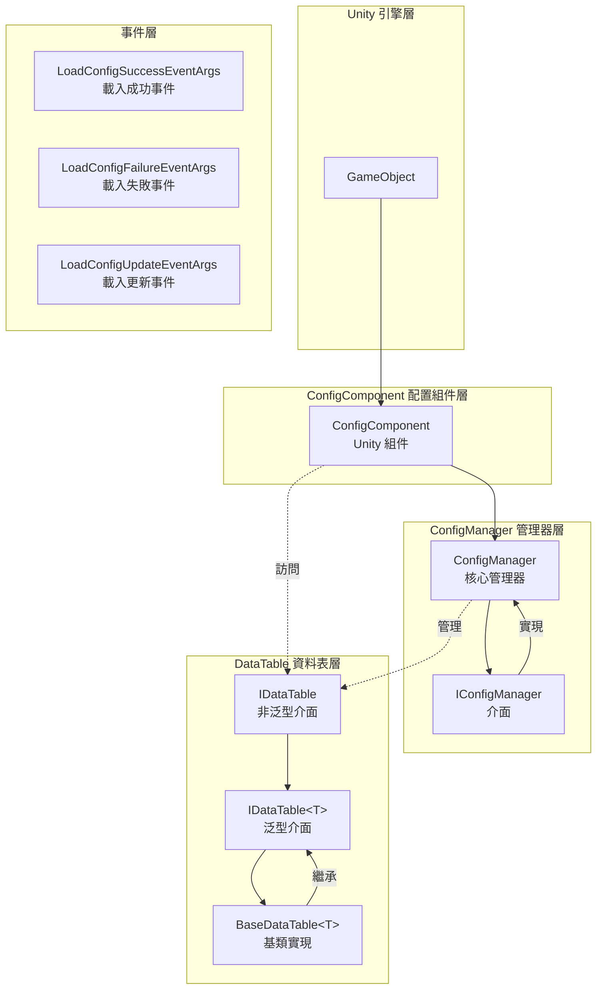
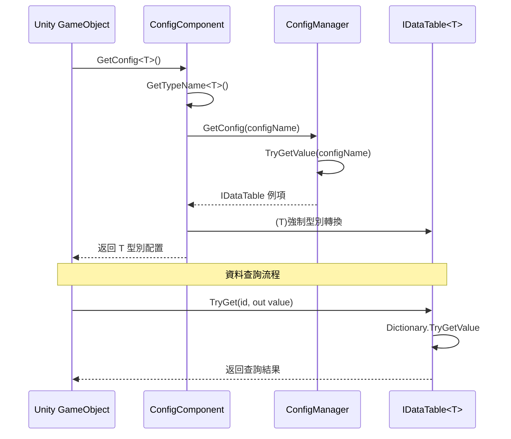

# 功能特性

Config 配置表組件是 GameFrameX 框架的核心模組之一，提供了一套完整的資料配置管理解決方案。該組件支援多種資料格式（文字和二進位制）、靈活的資料表查詢、型別安全的資料訪問，以及完整的事件系統。

## 概述

Config 配置表組件為 Unity 遊戲開發提供高效的配置資料管理能力，主要特性包括：

- **統一配置管理**：透過 ConfigManager 集中管理所有配置資料表
- **型別安全的資料訪問**：基於泛型的資料表介面，提供編譯時型別檢查
- **多種資料格式支援**：支援文字格式（Tab 分隔）和二進位制格式配置表
- **高效能查詢**：使用字典結構實現 O(1) 時間複雜度的資料查詢
- **靈活的資料操作**：提供豐富的查詢、過濾、聚合方法
- **事件驅動架構**：提供載入成功、失敗、更新等事件回呼

## 架構設計

Config 組件採用分層架構設計，各組件職責清晰，協同工作：



### 核心組件說明

| 組件 | 名稱空間 | 說明 |
|------|----------|------|
| ConfigComponent | GameFrameX.Config.Runtime | Unity 組件，提供執行時配置訪問入口 |
| ConfigManager | GameFrameX.Config.Runtime | 核心配置管理器，實現 IConfigManager 介面 |
| IConfigManager | GameFrameX.Config.Runtime | 配置管理器介面，定義配置管理操作 |
| IDataTable | GameFrameX.Config.Runtime | 資料表基礎介面 |
| IDataTable<T> | GameFrameX.Config.Runtime | 泛型資料表介面，提供型別安全訪問 |
| BaseDataTable<T> | GameFrameX.Config.Runtime | 資料表基類，提供具體實現 |

## 核心功能

### 1. 配置資料儲存與管理

ConfigManager 使用執行緒安全的 `ConcurrentDictionary` 儲存配置資料，支援配置的新增、查詢、移除和清空操作。

```csharp
// ConfigManager.cs - 配置管理器核心實現
public sealed partial class ConfigManager : GameFrameworkModule, IConfigManager
{
    private readonly ConcurrentDictionary<string, IDataTable> m_ConfigDatas;

    public ConfigManager()
    {
        m_ConfigDatas = new ConcurrentDictionary<string, IDataTable>(StringComparer.Ordinal);
    }

    public bool HasConfig(string configName)
    {
        return m_ConfigDatas.TryGetValue(configName, out _);
    }

    public void AddConfig(string configName, IDataTable configValue)
    {
        m_ConfigDatas.TryAdd(configName, configValue);
    }

    public IDataTable GetConfig(string configName)
    {
        return m_ConfigDatas.TryGetValue(configName, out var value) ? value : null;
    }

    public bool RemoveConfig(string configName)
    {
        return m_ConfigDatas.TryRemove(configName, out _);
    }

    public void RemoveAllConfigs()
    {
        m_ConfigDatas.Clear();
    }
}
```
> Source: [ConfigManager.cs](https://github.com/GameFrameX/com.gameframex.unity.config/blob/main/Runtime/Config/Config/ConfigManager.cs#L46-L166)

### 2. 泛型資料表介面

`IDataTable<T>` 介面定義了型別安全的資料訪問方式，支援多種鍵型別（int、long、string）的資料查詢：

```csharp
// IDataTable.cs - 泛型資料表介面定義
public interface IDataTable<T> : IDataTable where T : class
{
    // 嘗試根據整數ID獲取物件
    bool TryGet(int id, out T value);

    // 嘗試根據長整數ID獲取物件
    bool TryGet(long id, out T value);

    // 嘗試根據字串ID獲取物件
    bool TryGet(string id, out T value);

    // 索引器 - 支援多種鍵型別
    T this[int id] { get; }
    T this[long id] { get; }
    T this[string id] { get; }

    // 獲取首尾元素
    T FirstOrDefault { get; }
    T LastOrDefault { get; }

    // 獲取所有資料
    T[] All { get; }
    T[] ToArray();
    List<T> ToList();

    // 查詢方法
    T Find(Func<T, bool> func);
    T[] FindListArray(Func<T, bool> func);
    List<T> FindList(Func<T, bool> func);
    void ForEach(Action<T> func);

    // 聚合方法
    Tk Max<Tk>(Func<T, Tk> func) where Tk : IComparable<Tk>;
    Tk Min<Tk>(Func<T, Tk> func) where Tk : IComparable<Tk>;
    int Sum(Func<T, int> func);
    long Sum(Func<T, long> func);
    float Sum(Func<T, float> func);
    double Sum(Func<T, double> func);
    decimal Sum(Func<T, decimal> func);
}
```
> Source: [IDataTable.cs](https://github.com/GameFrameX/com.gameframex.unity.config/blob/main/Runtime/Config/Config/IDataTable.cs#L76-L265)

### 3. 資料表基類實現

`BaseDataTable<T>` 提供了完整的泛型資料表實現，內部使用雙字典結構（`LongDataMaps` 和 `StringDataMaps`）分別儲存長整型和字串鍵的資料：

```csharp
// BaseDataTable.cs - 資料表基類實現
public abstract class BaseDataTable<T> : IDataTable<T> where T : class
{
    private const int DefaultSize = 1024 * 8;
    protected readonly Dictionary<long, T> LongDataMaps = new Dictionary<long, T>(DefaultSize);
    protected readonly Dictionary<string, T> StringDataMaps = new Dictionary<string, T>(DefaultSize);
    protected readonly List<T> DataList = new List<T>(DefaultSize);

    // 快取最佳化
    private bool _cacheInitialized;
    private T _firstOrDefaultCache;
    private T _lastOrDefaultCache;

    public bool TryGet(int id, out T value)
    {
        return LongDataMaps.TryGetValue(id, out value);
    }

    public bool TryGet(long id, out T value)
    {
        return LongDataMaps.TryGetValue(id, out value);
    }

    public bool TryGet(string id, out T value)
    {
        return StringDataMaps.TryGetValue(id, out value);
    }

    // 使用索引器訪問
    public T this[int id] => TryGet(id, out var value) ? value : null;
    public T this[long id] => TryGet(id, out var value) ? value : null;
    public T this[string id] => TryGet(id, out var value) ? value : null;

    // 查詢方法
    public T Find(Func<T, bool> func)
    {
        return DataList.FirstOrDefault(func);
    }

    public T[] FindListArray(Func<T, bool> func)
    {
        return DataList.Where(func).ToArray();
    }
}
```
> Source: [BaseDataTable.cs](https://github.com/GameFrameX/com.gameframex.unity.config/blob/main/Runtime/Config/Config/BaseDataTable.cs#L46-L165)

### 4. Unity 組件整合

`ConfigComponent` 是 Unity 組件，可新增到 GameObject 上，提供配置訪問的便捷介面：

```csharp
// ConfigComponent.cs - Unity 組件
[DisallowMultipleComponent]
[AddComponentMenu("GameFrameX/Config")]
public sealed class ConfigComponent : GameFrameworkComponent
{
    private IConfigManager m_ConfigManager = null;
    private ConcurrentDictionary<Type, string> m_ConfigNameTypeMap = new ConcurrentDictionary<Type, string>();

    protected override void Awake()
    {
        base.Awake();
        m_ConfigManager = GameFrameworkEntry.GetModule<IConfigManager>();
    }

    // 泛型方法獲取配置
    public T GetConfig<T>() where T : IDataTable
    {
        var configName = GetTypeName<T>();
        var config = m_ConfigManager.GetConfig(configName);
        return config != null ? (T)config : default;
    }

    // 檢查配置是否存在
    public bool HasConfig<T>() where T : IDataTable
    {
        var configName = GetTypeName<T>();
        return m_ConfigManager.HasConfig(configName);
    }

    // 移除配置
    public bool RemoveConfig<T>() where T : IDataTable
    {
        var configName = GetTypeName<T>();
        return m_ConfigManager.RemoveConfig(configName);
    }

    // 新增配置
    public void Add(string configName, IDataTable dataTable)
    {
        m_ConfigManager.AddConfig(configName, dataTable);
    }
}
```
> Source: [ConfigComponent.cs](https://github.com/GameFrameX/com.gameframex.unity.config/blob/main/Runtime/Config/ConfigComponent.cs#L46-L185)

### 5. 事件系統

Config 組件提供了完整的事件系統，用於監聽配置載入狀態：

```csharp
// 載入成功事件
public sealed class LoadConfigSuccessEventArgs : GameEventArgs
{
    public static readonly string EventId = typeof(LoadConfigSuccessEventArgs).FullName;
    public string ConfigAssetName { get; private set; }  // 配置資源名稱
    public float Duration { get; private set; }          // 載入耗時
    public object UserData { get; private set; }          // 使用者資料

    public static LoadConfigSuccessEventArgs Create(string dataAssetName, float duration, object userData)
    {
        // 建立事件例項
    }
}

// 載入失敗事件
public sealed class LoadConfigFailureEventArgs : GameEventArgs
{
    public static readonly string EventId = typeof(LoadConfigFailureEventArgs).FullName;
    public string ConfigAssetName { get; private set; }  // 配置資源名稱
    public string ErrorMessage { get; private set; }     // 錯誤資訊
    public object UserData { get; private set; }          // 使用者資料
}

// 載入更新事件（進度）
public sealed class LoadConfigUpdateEventArgs : GameEventArgs
{
    public static readonly string EventId = typeof(LoadConfigUpdateEventArgs).FullName;
    public string ConfigAssetName { get; private set; }  // 配置資源名稱
    public float Progress { get; private set; }           // 載入進度 (0.0 - 1.0)
    public object UserData { get; private set; }          // 使用者資料
}
```
> Sources:
> - [LoadConfigSuccessEventArgs.cs](https://github.com/GameFrameX/com.gameframex.unity.config/blob/main/Runtime/EventArgs/LoadConfigSuccessEventArgs.cs#L43-L137)
> - [LoadConfigFailureEventArgs.cs](https://github.com/GameFrameX/com.gameframex.unity.config/blob/main/Runtime/EventArgs/LoadConfigFailureEventArgs.cs#L43-L137)
> - [LoadConfigUpdateEventArgs.cs](https://github.com/GameFrameX/com.gameframex.unity.config/blob/main/Runtime/EventArgs/LoadConfigUpdateEventArgs.cs#L43-L137)

## 資料訪問流程

以下流程圖展示了從 Unity 組件到資料表的資料訪問過程：



## 使用示例

### 基本配置獲取

```csharp
// 獲取配置組件
var configComponent = GameEntry.GetComponent<ConfigComponent>();

// 檢查配置是否存在
if (configComponent.HasConfig<PlayerConfig>())
{
    // 獲取配置資料表
    var playerConfig = configComponent.GetConfig<PlayerConfig>();
    
    // 使用索引器查詢資料
    var player = playerConfig[1001];  // 根據 ID 查詢
    
    // 使用 TryGet 方法安全查詢
    if (playerConfig.TryGet(1001, out var playerData))
    {
        Debug.Log($"玩家名稱: {playerData.Name}");
    }
}
```

### 資料查詢與過濾

```csharp
var config = configComponent.GetConfig<MonsterConfig>();

// 查詢所有滿足條件的物件
var bossMonsters = config.FindList(m => m.Type == MonsterType.Boss);

// 使用聚合函式
var maxLevel = config.Max(m => m.Level);
var totalHP = config.Sum(m => m.HP);

// 遍歷所有資料
config.ForEach(monster => {
    Debug.Log($"怪物: {monster.Name}, 等級: {monster.Level}");
});
```

## 配置格式支援

Config 組件支援兩種配置表格式：

### 1. 文字格式（Tab 分隔）

文字格式配置使用 Tab 字元作為列分隔符，適用於編輯器預覽和除錯：

```
# 格式：ID    名稱    描述    值
1    config1 配置1   100
2    config2 配置2   200
```

### 2. 二進位制格式（.bytes）

二進位制格式配置檔案字尾為 `.bytes`，適用於生產環境載入，具有更小的體積和更快的解析速度。

> 關於二進位制配置表的詳細內容，請參閱 [二進位制配置表](./6-configuration.binary-config) 文件。

## 相關連結

- [Config 組件簡介](./1-overview.introduction) - Config 組件概述與安裝
- [安裝方式](./2-installation.install-methods) - 組件安裝指南
- [依賴要求](./2-installation.dependencies) - 專案依賴說明
- [ConfigComponent 配置組件](./4-core-concepts.config-component) - Unity 組件詳解
- [ConfigManager 配置管理器](./4-core-concepts.config-manager) - 核心管理器詳解
- [IDataTable 資料表介面](./4-core-concepts.idata-table) - 資料表介面定義
- [API 參考](./5-api-reference.interfaces) - 完整介面文件
- [事件引數](./5-api-reference.event-args) - 事件引數詳情
- [指令碼宏定義](./6-configuration.scripting-define-symbols) - 編譯符號配置
