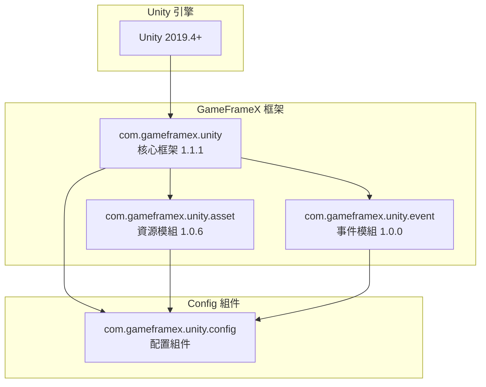

# 依賴要求

本文件詳細介紹 Config 配置組件的依賴要求，包括 Unity 版本要求、GameFrameX 核心包依賴以及內部程式集引用關係。

## 概述

Config 配置組件是 GameFrameX 框架的核心模組之一，用於管理遊戲中的配置資料表。該組件依賴於 GameFrameX 核心框架的其他模組，需要在滿足特定版本要求的 Unity 環境中執行，並正確配置相關依賴包才能正常工作。

## 依賴架構



## Unity 版本要求

| 專案 | 要求 |
|------|------|
| 最低版本 | Unity 2019.4 |
| 推薦版本 | Unity 2020.3 LTS 或更高 |
| 指令碼執行時 | .NET Standard 2.0+ |

> Source: [package.json](https://github.com/GameFrameX/com.gameframex.unity.config/blob/main/package.json#L7)

Unity 版本要求定義在 `package.json` 檔案的 `unity` 欄位中，確保您的專案使用相容的 Unity 版本以獲得最佳相容性。

## GameFrameX 核心包依賴

Config 組件依賴於以下 GameFrameX 官方包，這些依賴在 `package.json` 中宣告：

### 依賴包列表

| 包名 | 最低版本 | 用途說明 |
|------|----------|----------|
| com.gameframex.unity | 1.1.1 | 核心框架，提供基礎組件和模組管理功能 |
| com.gameframex.unity.asset | 1.0.6 | 資源載入模組，用於非同步載入配置表檔案 |
| com.gameframex.unity.event | 1.0.0 | 事件系統，用於配置載入成功/失敗等事件通知 |

```json
{
  "dependencies": {
    "com.gameframex.unity": "1.1.1",
    "com.gameframex.unity.asset": "1.0.6",
    "com.gameframex.unity.event": "1.0.0"
  }
}
```

> Source: [package.json](https://github.com/GameFrameX/com.gameframex.unity.config/blob/main/package.json#L21-L25)

### 依賴關係說明

**com.gameframex.unity (核心框架)**
- 提供 `GameFrameworkComponent` 基類，ConfigComponent 繼承自此類
- 提供模組管理系統，透過 `GameFrameworkEntry` 獲取各模組例項
- 提供程式集工具 `Utility.Assembly` 用於型別反射

**com.gameframex.unity.asset (資源模組)**
- 提供資源非同步載入能力，ConfigManager 使用 `GameFrameX.Asset.Runtime` 名稱空間
- 用於載入配置表二進位制檔案或 JSON/XML 配置檔案
- 支援配置表的按需載入和快取管理

**com.gameframex.unity.event (事件模組)**
- 提供事件系統，用於通知配置載入狀態
- 定義了以下事件引數類：
  - `LoadConfigSuccessEventArgs`: 配置載入成功事件
  - `LoadConfigFailureEventArgs`: 配置載入失敗事件
  - `LoadConfigUpdateEventArgs`: 配置載入更新事件

## 內部程式集引用

Config 組件的執行時程式集 `GameFrameX.Config.Runtime.asmdef` 定義了以下程式集引用：

```csharp
// Runtime/GameFrameX.Config.Runtime.asmdef
{
    "references": [
        "GameFrameX.Runtime",
        "GameFrameX.Event.Runtime",
        "GameFrameX.Asset.Runtime"
    ]
}
```

> Source: [Runtime/GameFrameX.Config.Runtime.asmdef](https://github.com/GameFrameX/com.gameframex.unity.config/blob/main/Runtime/GameFrameX.Config.Runtime.asmdef#L3-L6)

### 程式集引用詳情

| 程式集 | 名稱空間 | 功能說明 |
|--------|----------|----------|
| GameFrameX.Runtime | `GameFrameX.Runtime` | 核心執行時，提供 GameFrameworkComponent、GameFrameworkModule、IConfigManager 介面 |
| GameFrameX.Event.Runtime | `GameFrameX.Event.Runtime` | 事件系統基礎介面和實現 |
| GameFrameX.Asset.Runtime | `GameFrameX.Asset.Runtime` | 資源載入介面和實現 |

### 關鍵型別依賴

Config 組件中使用的關鍵型別及其來源：

```csharp
using GameFrameX.Runtime;           // GameFrameworkComponent, GameFrameworkModule
using GameFrameX.Asset.Runtime;      // 資源載入相關介面
using GameFrameX.Event.Runtime;     // 事件引數基類

// ConfigComponent 繼承關係
public sealed class ConfigComponent : GameFrameworkComponent

// ConfigManager 繼承關係  
public sealed class ConfigManager : GameFrameworkModule, IConfigManager
```

> Source: [Runtime/Config/ConfigComponent.cs](https://github.com/GameFrameX/com.gameframex.unity.config/blob/main/Runtime/Config/ConfigComponent.cs#L48)
> Source: [Runtime/Config/Config/ConfigManager.cs](https://github.com/GameFrameX/com.gameframex.unity.config/blob/main/Runtime/Config/Config/ConfigManager.cs#L47)

## 安裝依賴

### 自動安裝（推薦）

透過 Unity Package Manager 新增包時，依賴包會自動安裝：

1. 開啟 Unity 專案的 `Packages/manifest.json` 檔案
2. 在 `dependencies` 中新增 Config 組件：

```json
{
  "dependencies": {
    "com.gameframex.unity.config": "https://github.com/GameFrameX/com.gameframex.unity.config.git"
  }
}
```

3. Unity 會自動解析並安裝所有必需的依賴包

### 手動安裝

如果需要手動安裝，請確保按以下順序安裝依賴：

1. **安裝核心框架**
   ```json
   { "com.gameframex.unity": "1.1.1" }
   ```

2. **安裝資源模組**
   ```json
   { "com.gameframex.unity.asset": "1.0.6" }
   ```

3. **安裝事件模組**
   ```json
   { "com.gameframex.unity.event": "1.0.0" }
   ```

4. **最後安裝 Config 組件**
   ```json
   { "com.gameframex.unity.config": "1.1.3" }
   ```

## 依賴版本相容性

| Config 版本 | Unity 版本 | 核心框架版本 | 資源模組版本 | 事件模組版本 |
|------------|------------|--------------|--------------|--------------|
| 1.1.3 | 2019.4+ | 1.1.1 | 1.0.6 | 1.0.0 |
| 1.1.2 | 2019.4+ | 1.1.0 | 1.0.5 | 1.0.0 |
| 1.1.1 | 2019.4+ | 1.1.0 | 1.0.5 | 1.0.0 |

建議始終使用最新版本的依賴包以獲得最佳相容性和新功能支援。

## 常見依賴問題

### 問題 1：缺少核心框架依賴

**症狀**: 編譯時報錯找不到 `GameFrameworkComponent` 型別

**解決方案**: 確保已安裝 `com.gameframex.unity` 核心框架包

### 問題 2：事件系統未初始化

**症狀**: 配置載入事件無法觸發

**解決方案**: 確保 `com.gameframex.unity.event` 已正確安裝，並在場景中初始化事件系統

### 問題 3：資源載入失敗

**症狀**: 配置表檔案無法載入

**解決方案**: 確認 `com.gameframex.unity.asset` 版本與要求一致，並檢查資源路徑配置

## 相關連結

- [安裝方式](./2-installation.install-methods) - 瞭解不同的安裝方法
- [ConfigComponent 配置組件](./4-core-concepts.config-component) - 瞭解組件的使用
- [ConfigManager 配置管理器](./4-core-concepts.config-manager) - 瞭解管理器功能
- [IDataTable 資料表介面](./4-core-concepts.idata-table) - 瞭解資料表介面定義
- [官方文件](https://gameframex.doc.alianblank.com/) - GameFrameX 完整文件
