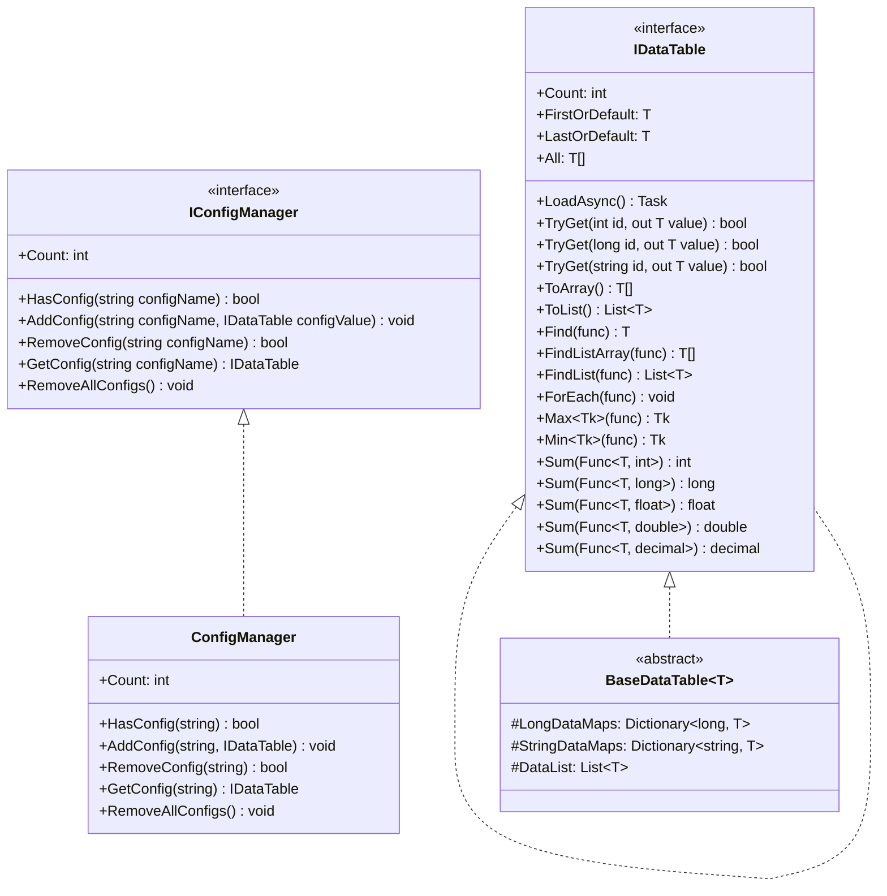
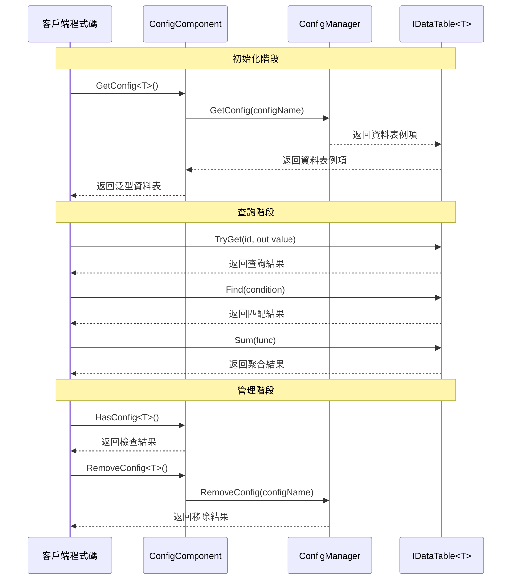

# 介面定義

本文件詳細介紹 GameFrameX Config 配置模組中定義的核心介面，包括資料表介面 IDataTable、泛型資料表介面 IDataTable<T> 以及全域性配置管理器介面 IConfigManager。這些介面為配置系統提供了統一的抽象層，使開發者能夠以型別安全的方式訪問和管理遊戲配置資料。

## 概述

GameFrameX Config 配置模組採用介面驅動設計，透過定義清晰的介面契約來實現配置資料的解耦管理。介面設計遵循以下核心原則：

- **型別安全**：透過泛型介面 IDataTable<T> 確保編譯時的型別檢查
- **靈活查詢**：提供多種資料查詢方式，包括主鍵查詢、條件查詢、聚合運算等
- **非同步載入**：所有資料載入操作均支援非同步模式，避免阻塞遊戲主執行緒
- **事件驅動**：透過事件引數類實現載入狀態的精確通知

## 介面層次結構



如上圖所示，介面之間存在明確的繼承和實現關係。IDataTable<T> 繼承自 IDataTable，新增了強型別的資料訪問方法。BaseDataTable<T> 實現了 IDataTable<T> 介面，提供了資料儲存和查詢的基類實現。ConfigManager 實現了 IConfigManager 介面，負責管理所有的配置資料表例項。

## IDataTable 非泛型介面

IDataTable 是資料表的非泛型基礎介面，定義了所有資料表都必須實現的核心功能。該介面位於 Runtime/Config/Config/IDataTable.cs 檔案中。

> Source: [IDataTable.cs](https://github.com/GameFrameX/com.gameframex.unity.config/blob/main/Runtime/Config/Config/IDataTable.cs#L46-L67)

### 介面定義

```csharp
[Preserve]
public interface IDataTable
{
    [Preserve]
    Task LoadAsync();

    [Preserve]
    int Count { get; }
}
```

### 成員說明

**LoadAsync 方法**
- **簽名**: `Task LoadAsync()`
- **說明**: 非同步載入資料表內容。此方法由具體實現類實現，用於從各種資料來源（如二進位制檔案、JSON、XML 等）載入配置資料
- **返回值**: 表示非同步操作的任務物件

**Count 屬性**
- **簽名**: `int Count { get; }`
- **說明**: 獲取資料表中包含的資料物件數量
- **返回值**: 非負整數，表示資料項總數

## IDataTable<T> 泛型介面

IDataTable<T> 是資料表的泛型介面，繼承自 IDataTable 介面，提供了強型別的資料訪問和查詢能力。該介面同樣位於 Runtime/Config/Config/IDataTable.cs 檔案中。

> Source: [IDataTable.cs](https://github.com/GameFrameX/com.gameframex.unity.config/blob/main/Runtime/Config/Config/IDataTable.cs#L77-L355)

### 介面定義

```csharp
[Preserve]
public interface IDataTable<T> : IDataTable where T : class
{
    // 主鍵查詢方法
    [Obsolete("請使用TryGet方法")]
    [Preserve]
    T Get(int id);

    [Obsolete("請使用TryGet方法")]
    [Preserve]
    T Get(long id);

    [Obsolete("請使用TryGet方法")]
    [Preserve]
    T Get(string id);

    [Preserve]
    bool TryGet(int id, out T value);

    [Preserve]
    bool TryGet(long id, out T value);

    [Preserve]
    bool TryGet(string id, out T value);

    // 索引器
    [Preserve]
    T this[int id] { get; }

    [Preserve]
    T this[long id] { get; }

    [Preserve]
    T this[string id] { get; }

    // 快捷訪問屬性
    [Preserve]
    T FirstOrDefault { get; }

    [Preserve]
    T LastOrDefault { get; }

    [Preserve]
    T[] All { get; }

    // 集合轉換方法
    [Preserve]
    T[] ToArray();

    [Preserve]
    List<T> ToList();

    // 查詢方法
    [Preserve]
    T Find(System.Func<T, bool> func);

    [Preserve]
    T[] FindListArray(System.Func<T, bool> func);

    [Preserve]
    List<T> FindList(Func<T, bool> func);

    [Preserve]
    void ForEach(Action<T> func);

    // 聚合方法
    [Preserve]
    Tk Max<Tk>(Func<T, Tk> func) where Tk : IComparable<Tk>;

    [Preserve]
    Tk Min<Tk>(Func<T, Tk> func) where Tk : IComparable<Tk>;

    [Preserve]
    int Sum(Func<T, int> func);

    [Preserve]
    long Sum(Func<T, long> func);

    [Preserve]
    float Sum(Func<T, float> func);

    [Preserve]
    double Sum(Func<T, double> func);

    [Preserve]
    decimal Sum(Func<T, decimal> func);
}
```

### 成員詳細說明

#### 主鍵查詢方法

**TryGet 方法過載**
- **說明**: 嘗試根據指定的主鍵獲取資料物件。相比已廢棄的 Get 方法，TryGet 方法更加安全，不會丟擲異常
- **引數**:
  - `id`: 資料物件的主鍵，支援 int、long、string 三種型別
  - `value`: 輸出引數，當找到對應主鍵的資料時，返回該資料物件；否則返回預設值
- **返回值**: bool 型別，找到對應主鍵的資料返回 true，否則返回 false

```csharp
// 使用 TryGet 方法安全地獲取資料
if (dataTable.TryGet(1001, out var item))
{
    Debug.Log($"找到資料: {item.Name}");
}
else
{
    Debug.LogWarning("未找到指定資料");
}
```

> Source: [BaseDataTable.cs](https://github.com/GameFrameX/com.gameframex.unity.config/blob/main/Runtime/Config/Config/BaseDataTable.cs#L119-L162)

#### 索引器

**說明**: 提供了三種型別的索引器用於便捷訪問資料。索引器內部呼叫 TryGet 方法實現，當找不到對應資料時返回 null

```csharp
// 使用索引器訪問資料
var item1 = dataTable[1001];      // int 型別主鍵
var item2 = dataTable[10001L];     // long 型別主鍵
var item3 = dataTable["item_001"]; // string 型別主鍵
```

> Source: [BaseDataTable.cs](https://github.com/GameFrameX/com.gameframex.unity.config/blob/main/Runtime/Config/Config/BaseDataTable.cs#L164-L204)

#### 快捷訪問屬性

**FirstOrDefault 屬性**
- **型別**: `T`
- **說明**: 獲取資料表中的第一個資料物件，如果資料表為空則返回 null

**LastOrDefault 屬性**
- **型別**: `T`
- **說明**: 獲取資料表中的最後一個資料物件，如果資料表為空則返回 null

**All 屬性**
- **型別**: `T[]`
- **說明**: 獲取資料表中所有資料物件的陣列副本

```csharp
// 使用快捷屬性訪問資料
var first = dataTable.FirstOrDefault;
var last = dataTable.LastOrDefault;
var allItems = dataTable.All;
```

> Source: [BaseDataTable.cs](https://github.com/GameFrameX/com.gameframex.unity.config/blob/main/Runtime/Config/Config/BaseDataTable.cs#L223-L268)

#### 查詢方法

**Find 方法**
- **簽名**: `T Find(Func<T, bool> func)`
- **說明**: 根據指定的條件查詢第一個匹配的資料物件
- **引數**: `func` - 定義匹配條件的委託函式
- **返回值**: 第一個匹配的物件，如果未找到則返回 null

**FindListArray 方法**
- **簽名**: `T[] FindListArray(Func<T, bool> func)`
- **說明**: 根據指定的條件查詢所有匹配的資料物件，並返回陣列

**FindList 方法**
- **簽名**: `List<T> FindList(Func<T, bool> func)`
- **說明**: 根據指定的條件查詢所有匹配的資料物件，並返回列表

**ForEach 方法**
- **簽名**: `void ForEach(Action<T> func)`
- **說明**: 對資料表中的每個資料物件執行指定的操作

```csharp
// 使用查詢方法
var found = dataTable.Find(item => item.Level > 10);
var matched = dataTable.FindList(item => item.Rarity == "SSR");
var arrayMatched = dataTable.FindListArray(item => item.IsAvailable);

dataTable.ForEach(item => Debug.Log(item.Name));
```

> Source: [BaseDataTable.cs](https://github.com/GameFrameX/com.gameframex.unity.config/blob/main/Runtime/Config/Config/BaseDataTable.cs#L296-L349)

#### 聚合方法

**Max 方法**
- **簽名**: `Tk Max<Tk>(Func<T, Tk> func) where Tk : IComparable<Tk>`
- **說明**: 獲取資料表中指定屬性的最大值
- **泛型約束**: Tk 必須實現 IComparable<Tk> 介面

**Min 方法**
- **簽名**: `Tk Min<Tk>(Func<T, Tk> func) where Tk : IComparable<Tk>`
- **說明**: 獲取資料表中指定屬性的最小值
- **泛型約束**: Tk 必須實現 IComparable<Tk> 介面

**Sum 方法過載**
- **說明**: 計算資料表中指定數值屬性的總和，支援 int、long、float、double、decimal 五種數值型別
- **簽名**: 
  - `int Sum(Func<T, int> func)`
  - `long Sum(Func<T, long> func)`
  - `float Sum(Func<T, float> func)`
  - `double Sum(Func<T, double> func)`
  - `decimal Sum(Func<T, decimal> func)`

```csharp
// 使用聚合方法
var maxLevel = dataTable.Max(item => item.Level);
var minPrice = dataTable.Min(item => item.Price);
var totalDamage = dataTable.Sum(item => item.BaseDamage);
```

> Source: [BaseDataTable.cs](https://github.com/GameFrameX/com.gameframex.unity.config/blob/main/Runtime/Config/Config/BaseDataTable.cs#L351-L449)

## IConfigManager 全域性配置管理器介面

IConfigManager 介面定義了全域性配置管理器的核心功能，負責管理所有的配置資料表例項。該介面位於 Runtime/Config/Config/IConfigManager.cs 檔案中。

> Source: [IConfigManager.cs](https://github.com/GameFrameX/com.gameframex.unity.config/blob/main/Runtime/Config/Config/IConfigManager.cs#L34-L99)

### 介面定義

```csharp
public interface IConfigManager
{
    /// <summary>
    /// 獲取全域性配置項數量。
    /// </summary>
    int Count { get; }

    /// <summary>
    /// 檢查是否存在指定全域性配置項。
    /// </summary>
    bool HasConfig(string configName);

    /// <summary>
    /// 增加指定全域性配置項。
    /// </summary>
    void AddConfig(string configName, IDataTable configValue);

    /// <summary>
    /// 移除指定全域性配置項。
    /// </summary>
    bool RemoveConfig(string configName);

    /// <summary>
    /// 獲取指定全域性配置項。
    /// </summary>
    IDataTable GetConfig(string configName);

    /// <summary>
    /// 清空所有全域性配置項。
    /// </summary>
    void RemoveAllConfigs();
}
```

### 成員詳細說明

**Count 屬性**
- **型別**: `int`
- **說明**: 獲取當前已載入的全域性配置項數量

**HasConfig 方法**
- **簽名**: `bool HasConfig(string configName)`
- **說明**: 檢查是否存在指定名稱的全域性配置項
- **引數**: `configName` - 要檢查的配置項名稱
- **返回值**: 存在返回 true，否則返回 false

**AddConfig 方法**
- **簽名**: `void AddConfig(string configName, IDataTable configValue)`
- **說明**: 新增一個新的全域性配置項
- **引數**:
  - `configName` - 配置項的名稱，用於後續檢索
  - `configValue` - 配置項的資料表例項

**RemoveConfig 方法**
- **簽名**: `bool RemoveConfig(string configName)`
- **說明**: 移除指定名稱的全域性配置項
- **引數**: `configName` - 要移除的配置項名稱
- **返回值**: 移除成功返回 true，否則返回 false

**GetConfig 方法**
- **簽名**: `IDataTable GetConfig(string configName)`
- **說明**: 獲取指定名稱的全域性配置項
- **引數**: `configName` - 要獲取的配置項名稱
- **返回值**: 配置項的資料表例項，如果不存在則返回 null

**RemoveAllConfigs 方法**
- **簽名**: `void RemoveAllConfigs()`
- **說明**: 移除所有已載入的全域性配置項

## 介面使用流程



如序列圖所示，使用介面的基本流程分為三個階段：初始化階段透過 ConfigComponent 獲取泛型資料表例項；查詢階段使用 IDataTable<T> 介面提供的方法進行資料訪問；管理階段透過 ConfigComponent 或 ConfigManager 進行配置項的檢查和移除操作。

## ConfigComponent 組件介面封裝

ConfigComponent 是 Unity 組件，對 IConfigManager 介面進行了面向 Unity 的封裝，提供了更便捷的泛型訪問方式。該組件位於 Runtime/Config/ConfigComponent.cs 檔案中。

> Source: [ConfigComponent.cs](https://github.com/GameFrameX/com.gameframex.unity.config/blob/main/Runtime/Config/ConfigComponent.cs#L40-L185)

### 核心方法

**GetConfig<T> 方法**
- **簽名**: `T GetConfig<T>() where T : IDataTable`
- **說明**: 獲取指定型別的全域性配置項，返回強型別的泛型資料表
- **返回值**: 泛型資料表例項，如果不存在則返回預設值

**HasConfig<T> 方法**
- **簽名**: `bool HasConfig<T>() where T : IDataTable`
- **說明**: 檢查是否存在指定型別的全域性配置項

**RemoveConfig<T> 方法**
- **簽名**: `bool RemoveConfig<T>() where T : IDataTable`
- **說明**: 移除指定型別的全域性配置項

**Add 方法**
- **簽名**: `void Add(string configName, IDataTable dataTable)`
- **說明**: 新增一個新的全域性配置項

```csharp
// ConfigComponent 使用示例
public class MyGameController : MonoBehaviour
{
    private ConfigComponent configComponent;
    
    private void Start()
    {
        configComponent = GetComponent<ConfigComponent>();
        
        // 檢查配置是否存在
        if (configComponent.HasConfig<WeaponDataTable>())
        {
            // 獲取配置
            var weaponTable = configComponent.GetConfig<WeaponDataTable>();
            
            // 查詢資料
            var weapon = weaponTable[1001];
            var fireWeapons = weaponTable.FindList(w => w.Type == WeaponType.Fire);
        }
    }
}
```

## 相關連結

- [ConfigComponent 配置組件](./4-core-concepts.config-component) - 瞭解 ConfigComponent 組件的詳細資訊
- [ConfigManager 配置管理器](./4-core-concepts.config-manager) - 瞭解 ConfigManager 實現細節
- [IDataTable 資料表介面](./4-core-concepts.idata-table) - 瞭解資料表介面的核心概念
- [事件引數](./5-api-reference.event-args) - 瞭解配置載入相關的事件引數
- [基礎使用](./3-getting-started.basic-usage) - 快速開始配置模組的使用
- [資料表定義](./3-getting-started.data-table-definition) - 瞭解如何定義資料表
