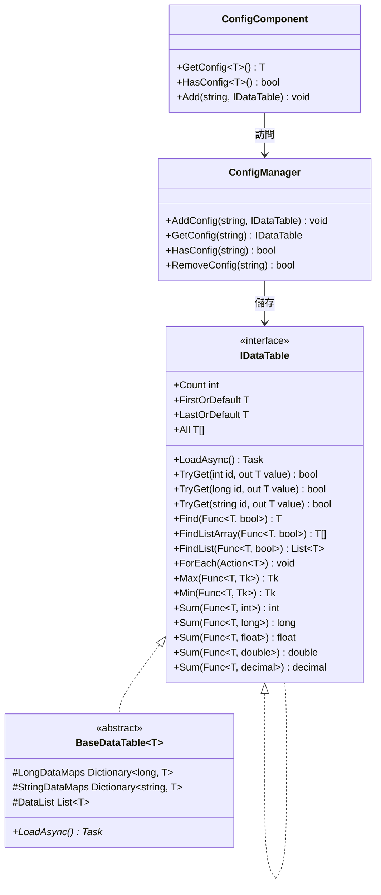
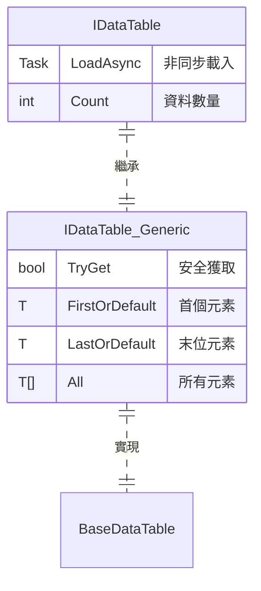

# IDataTable 資料表介面

IDataTable 是 GameFrameX Config 模組的核心介面，提供了對配置資料表的統一訪問方式。該介面支援多種主鍵型別（int、long、string），並提供了豐富的資料查詢和聚合操作。

## 概述

IDataTable 介面是配置資料表的基礎抽象層，設計用於在遊戲開發中管理靜態配置資料。它採用泛型設計，支援強型別的資料訪問，同時保持了靈活的查詢能力。

該介面採用雙層結構設計：
- **IDataTable**：非泛型基礎介面，定義了通用的載入和資料計數功能
- **IDataTable<T>**：泛型介面，繼承自 IDataTable，提供了豐富的資料訪問和查詢方法

### 設計意圖

IDataTable 介面的設計遵循以下原則：

1. **型別安全**：透過泛型介面確保編譯時的型別安全
2. **統一訪問**：提供多種主鍵型別的訪問方式，適應不同的配置資料結構
3. **查詢靈活**：支援 LINQ 風格的條件查詢和聚合計算
4. **非同步載入**：支援非同步載入資料，提升遊戲啟動效能

## 架構

以下是 IDataTable 在 Config 系統中的架構關係：



### 核心組件說明

| 組件 | 職責 |
|------|------|
| **IDataTable** | 非泛型基礎介面，定義載入和計數功能 |
| **IDataTable<T>** | 泛型介面，提供強型別的資料訪問方法 |
| **BaseDataTable<T>** | 抽象基類，實現核心儲存邏輯（字典+列表） |
| **ConfigManager** | 全域性配置管理器，負責儲存和管理所有 IDataTable 例項 |
| **ConfigComponent** | Unity 組件封裝，提供面向使用者的便捷訪問方法 |

## 資料表繼承結構

IDataTable<T> 介面繼承自 IDataTable，形成完整的介面體系：



## 使用示例

### 基礎使用

以下示例展示如何定義一個繼承自 BaseDataTable 的資料表類：

```csharp
using GameFrameX.Config.Runtime;

// 定義資料表元素型別
public class ItemData
{
    public int Id { get; set; }
    public string Name { get; set; }
    public int Level { get; set; }
    public int Price { get; set; }
}

// 定義資料表實現類
public class ItemDataTable : BaseDataTable<ItemData>
{
    public override async Task LoadAsync()
    {
        // 在此處實現資料載入邏輯
        // 示例：從配置檔案中載入資料並填充到 LongDataMaps 和 StringDataMaps
        var dataList = new List<ItemData>
        {
            new ItemData { Id = 1, Name = "武器", Level = 1, Price = 100 },
            new ItemData { Id = 2, Name = "護甲", Level = 1, Price = 80 },
            new ItemData { Id = 3, Name = "藥水", Level = 1, Price = 10 }
        };
        
        foreach (var data in dataList)
        {
            LongDataMaps[data.Id] = data;
            StringDataMaps[data.Name] = data;
            DataList.Add(data);
        }
    }
}
```
> Source: [IDataTable.cs](https://github.com/GameFrameX/com.gameframex.unity.config/blob/main/Runtime/Config/Config/IDataTable.cs#L46-L77)
> Source: [BaseDataTable.cs](https://github.com/GameFrameX/com.gameframex.unity.config/blob/main/Runtime/Config/Config/BaseDataTable.cs#L46-L70)

### 資料查詢

資料表載入後，可以透過多種方式查詢資料：

```csharp
// 獲取資料表例項（透過 ConfigComponent）
var configComponent = UnityEngine.GameObject.FindObjectOfType<ConfigComponent>();
var itemDataTable = configComponent.GetConfig<ItemDataTable>();

// 透過整數主鍵獲取（推薦使用 TryGet）
ItemData item1 = itemDataTable[1];

// 透過字串鍵獲取
ItemData item2 = itemDataTable["武器"];

// 安全獲取（推薦，避免空引用異常）
if (itemDataTable.TryGet(1, out ItemData item3))
{
    UnityEngine.Debug.Log($"找到物品: {item3.Name}");
}

// 獲取第一個和最後一個元素
ItemData first = itemDataTable.FirstOrDefault;
ItemData last = itemDataTable.LastOrDefault;

// 獲取所有元素
ItemData[] allItems = itemDataTable.All;
```
> Source: [BaseDataTable.cs](https://github.com/GameFrameX/com.gameframex.unity.config/blob/main/Runtime/Config/Config/BaseDataTable.cs#L119-L204)

### 條件查詢

使用 LINQ 風格的條件查詢：

```csharp
// 查詢第一個匹配的元素
ItemData found = itemDataTable.Find(item => item.Level == 1);

// 查詢所有匹配的元素（陣列）
ItemData[] level1Items = itemDataTable.FindListArray(item => item.Level == 1);

// 查詢所有匹配的元素（列表）
List<ItemData> cheapItems = itemDataTable.FindList(item => item.Price < 50);

// 遍歷所有元素
itemDataTable.ForEach(item => 
{
    UnityEngine.Debug.Log($"物品: {item.Name}, 價格: {item.Price}");
});
```
> Source: [BaseDataTable.cs](https://github.com/GameFrameX/com.gameframex.unity.config/blob/main/Runtime/Config/Config/BaseDataTable.cs#L296-L349)

### 聚合操作

資料表支援多種聚合計算：

```csharp
// 計算總和
int totalPrice = itemDataTable.Sum(item => item.Price);

// 獲取最大值
int maxLevel = itemDataTable.Max(item => item.Level);

// 獲取最小值
int minPrice = itemDataTable.Min(item => item.Price);

// 獲取元素數量
int count = itemDataTable.Count;
```
> Source: [BaseDataTable.cs](https://github.com/GameFrameX/com.gameframex.unity.config/blob/main/Runtime/Config/Config/BaseDataTable.cs#L351-L449)

## API 參考

### IDataTable 介面

非泛型基礎介面，定義資料表的基本功能。

#### `Task LoadAsync()`

非同步載入資料表。

**返回：** 表示非同步操作的任務

```csharp
await itemDataTable.LoadAsync();
```

#### `int Count { get; }`

獲取資料表中物件的數量。

**返回：** 資料表中物件的數量

---

### IDataTable<T> 介面

泛型介面，提供強型別的資料訪問和查詢功能。

#### `bool TryGet(int id, out T value)`

嘗試根據整數 ID 獲取物件。

**引數：**
- `id` (int): 要獲取的物件的整數 ID
- `value` (out T): 當找到對應 ID 的物件時，返回該物件；否則返回預設值

**返回：** 如果找到對應 ID 的物件則返回 `true`；否則返回 `false`

#### `bool TryGet(long id, out T value)`

嘗試根據長整數 ID 獲取物件。

**引數：**
- `id` (long): 要獲取的物件的長整數 ID
- `value` (out T): 當找到對應 ID 的物件時，返回該物件；否則返回預設值

**返回：** 如果找到對應 ID 的物件則返回 `true`；否則返回 `false`

#### `bool TryGet(string id, out T value)`

嘗試根據字串 ID 獲取物件。

**引數：**
- `id` (string): 要獲取的物件的字串 ID
- `value` (out T): 當找到對應 ID 的物件時，返回該物件；否則返回預設值

**返回：** 如果找到對應 ID 的物件則返回 `true`；否則返回 `false`

#### `T this[int id] { get; }`

根據整數主鍵獲取資料表中的物件。

**引數：**
- `id` (int): 要獲取的物件的整數主鍵

**返回：** 與指定主鍵關聯的資料物件；如果找不到則返回 `null`

#### `T this[long id] { get; }`

根據長整數主鍵獲取資料表中的物件。

**引數：**
- `id` (long): 要獲取的物件的長整數主鍵

**返回：** 與指定主鍵關聯的資料物件；如果找不到則返回 `null`

#### `T this[string id] { get; }`

根據字串鍵獲取資料表中的物件。

**引數：**
- `id` (string): 要獲取的物件的字串鍵

**返回：** 與指定鍵關聯的資料物件；如果找不到則返回 `null`

#### `T FirstOrDefault { get; }`

獲取資料表中第一個物件。

**返回：** 如果資料表為空，則返回 `null`；否則返回第一個物件

#### `T LastOrDefault { get; }`

獲取資料表中最後一個物件。

**返回：** 如果資料表為空，則返回 `null`；否則返回最後一個物件

#### `T[] All { get; }`

獲取資料表中所有物件。

**返回：** 包含資料表中所有物件的陣列

#### `T[] ToArray()`

將資料表中所有物件複製到新陣列。

**返回：** 包含資料表中所有物件的新陣列

#### `List<T> ToList()`

將資料表中所有物件複製到新列表。

**返回：** 包含資料表中所有物件的新列表

#### `T Find(Func<T, bool> func)`

根據條件查詢第一個匹配的物件。

**引數：**
- `func` (Func<T, bool>): 用於定義匹配條件的函式

**返回：** 如果找到匹配的物件，則返回該物件；否則返回 `null`

#### `T[] FindListArray(Func<T, bool> func)`

根據條件查詢所有匹配的物件並返回陣列。

**引數：**
- `func` (Func<T, bool>): 用於定義匹配條件的函式

**返回：** 包含所有匹配物件的陣列

#### `List<T> FindList(Func<T, bool> func)`

根據條件查詢所有匹配的物件並返回列表。

**引數：**
- `func` (Func<T, bool>): 用於定義匹配條件的函式

**返回：** 包含所有匹配物件的列表

#### `void ForEach(Action<T> func)`

對資料表中的每個元素執行指定的操作。

**引數：**
- `func` (Action<T>): 要對每個元素執行的操作

#### `Tk Max<Tk>(Func<T, Tk> func) where Tk : IComparable<Tk>`

獲取資料表中指定屬性的最大值。

**引數：**
- `func` (Func<T, Tk>): 用於獲取比較值的函式

**型別引數：**
- `Tk`: 比較值的型別，必須實現 `IComparable<Tk>` 介面

**返回：** 指定屬性的最大值

#### `Tk Min<Tk>(Func<T, Tk> func) where Tk : IComparable<Tk>`

獲取資料表中指定屬性的最小值。

**引數：**
- `func` (Func<T, Tk>): 用於獲取比較值的函式

**型別引數：**
- `Tk`: 比較值的型別，必須實現 `IComparable<Tk>` 介面

**返回：** 指定屬性的最小值

#### `int Sum(Func<T, int> func)`

計算資料表中指定 `int` 屬性的總和。

**引數：**
- `func` (Func<T, int>): 用於獲取求和值的函式

**返回：** 指定屬性的總和

#### `long Sum(Func<T, long> func)`

計算資料表中指定 `long` 屬性的總和。

**引數：**
- `func` (Func<T, long>): 用於獲取求和值的函式

**返回：** 指定屬性的總和

#### `float Sum(Func<T, float> func)`

計算資料表中指定 `float` 屬性的總和。

**引數：**
- `func` (Func<T, float>): 用於獲取求和值的函式

**返回：** 指定屬性的總和

#### `double Sum(Func<T, double> func)`

計算資料表中指定 `double` 屬性的總和。

**引數：**
- `func` (Func<T, double>): 用於獲取求和值的函式

**返回：** 指定屬性的總和

#### `decimal Sum(Func<T, decimal> func)`

計算資料表中指定 `decimal` 屬性的總和。

**引數：**
- `func` (Func<T, decimal>): 用於獲取求和值的函式

**返回：** 指定屬性的總和

## 相關連結

- [ConfigComponent 配置組件](./4-core-concepts.config-component)
- [ConfigManager 配置管理器](./4-core-concepts.config-manager)
- [API 參考](./5-api-reference.interfaces)
- [資料表定義](./3-getting-started.data-table-definition)
