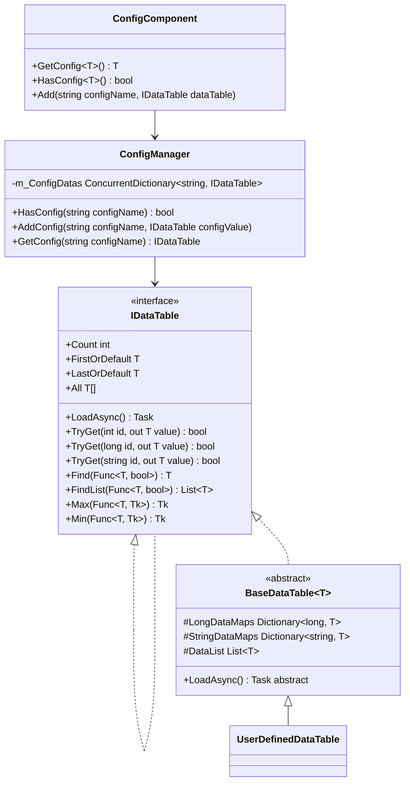
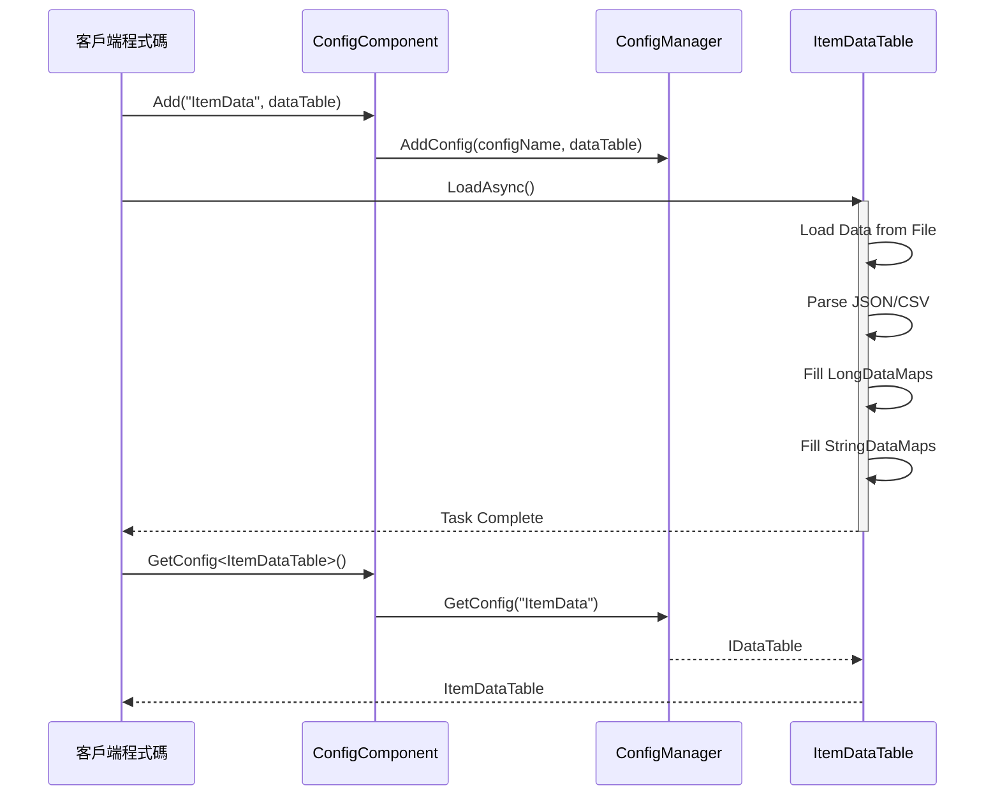

# 資料表定義

資料表（Data Table）是 GameFrameX Config 配置系統中用於儲存和管理配置資料的核心抽象。透過資料表，開發者可以高效地訪問、查詢和管理遊戲配置。

## 概述

資料表是 GameFrameX 配置系統的核心組成部分，提供了一種型別安全的方式來儲存和檢索配置資料。每個資料表本質上是一個鍵值對集合，支援透過整數 ID、長整數 ID 或字串 ID 進行快速查詢。

資料表系統的主要設計目標是：

- **高效能查詢**：使用 Dictionary 實現 O(1) 時間複雜度的資料查詢
- **型別安全**：透過泛型介面確保編譯時型別檢查
- **靈活的資料組織**：支援多種主鍵型別，滿足不同業務場景
- **豐富的查詢操作**：提供類似 LINQ 的查詢介面，支援條件篩選、聚合計算等操作

## 資料表架構

資料表系統採用分層架構設計，從底層到上層依次為：



### 架構層級說明

| 層級 | 組件 | 職責 |
|------|------|------|
| 介面層 | `IDataTable` / `IDataTable<T>` | 定義資料表的抽象操作契約 |
| 實現層 | `BaseDataTable<T>` | 提供資料儲存和查詢的通用實現 |
| 組件層 | `ConfigComponent` | Unity 組件封裝，提供 Inspector 配置介面 |
| 管理層 | `ConfigManager` | 全域性配置管理器，負責配置的統一管理 |

## 定義資料表

### 定義資料模型

首先，需要定義資料表中的資料模型（實體類）。資料模型可以是任何引用型別的類：

```csharp
using UnityEngine;

[System.Serializable]
public class ItemData
{
    public int Id;
    public string Name;
    public string Description;
    public int Quality;
    public int Price;
    public string Icon;
}
```

> Source: [資料模型示例](https://github.com/GameFrameX/com.gameframex.unity.config/blob/main/Runtime/Config/Config/BaseDataTable.cs#L46-L48)

### 繼承 BaseDataTable

然後，建立一個繼承自 `BaseDataTable<T>` 的資料表類，並實現 `LoadAsync` 方法：

```csharp
using GameFrameX.Config.Runtime;
using System.Collections.Generic;
using System.Threading.Tasks;
using UnityEngine;

public class ItemDataTable : BaseDataTable<ItemData>
{
    private const string DataTablePath = "Assets/Game/Configs/ItemData.json";

    public override async Task LoadAsync()
    {
        // 載入資料並填充到字典中
        var jsonText = await LoadJsonAsync(DataTablePath);
        var items = DeserializeItems(jsonText);
        
        foreach (var item in items)
        {
            // 同時新增到長整型和字串索引中
            LongDataMaps.Add(item.Id, item);
            StringDataMaps.Add(item.Name, item);
            DataList.Add(item);
        }
    }
    
    private Task<string> LoadJsonAsync(string path)
    {
        // 實現資源載入邏輯
        return Task.FromResult(string.Empty);
    }
    
    private List<ItemData> DeserializeItems(string json)
    {
        // 實現反序列化邏輯
        return new List<ItemData>();
    }
}
```

> Source: [BaseDataTable 定義](https://github.com/GameFrameX/com.gameframex.unity.config/blob/main/Runtime/Config/Config/BaseDataTable.cs#L48-L69)

### 註冊資料表

在 Unity 場景中新增 ConfigComponent 組件，並註冊資料表：

```csharp
using UnityEngine;
using GameFrameX.Config.Runtime;

public class GameBootstrap : MonoBehaviour
{
    private ConfigComponent _configComponent;
    
    private async void Start()
    {
        _configComponent = FindObjectOfType<ConfigComponent>();
        
        // 建立並載入資料表
        var itemDataTable = new ItemDataTable();
        await itemDataTable.LoadAsync();
        
        // 註冊到 ConfigComponent
        _configComponent.Add("ItemData", itemDataTable);
    }
}
```

> Source: [ConfigComponent.Add 方法](https://github.com/GameFrameX/com.gameframex.unity.config/blob/main/Runtime/Config/ConfigComponent.cs#L181-L184)

## 資料表操作

### 基本查詢

資料表支援多種查詢方式：

```csharp
// 透過索引器獲取（推薦）
var item = _configComponent.GetConfig<ItemDataTable>()[1001];

// 使用 TryGet 方法獲取（安全版本）
if (_configComponent.GetConfig<ItemDataTable>().TryGet(1001, out var item))
{
    Debug.Log($"找到物品: {item.Name}");
}

// 透過字串鍵獲取
var itemByName = _configComponent.GetConfig<ItemDataTable>()["武器"];
```

> Source: [TryGet 實現](https://github.com/GameFrameX/com.gameframex.unity.config/blob/main/Runtime/Config/Config/BaseDataTable.cs#L128-L162)

### 條件查詢

資料表提供了類似 LINQ 的查詢介面：

```csharp
var dataTable = _configComponent.GetConfig<ItemDataTable>();

// 查詢第一個匹配的元素
var firstQualityItem = dataTable.Find(item => item.Quality == 1);

// 查詢所有匹配的元素
var expensiveItems = dataTable.FindList(item => item.Price > 1000);

// 遍歷所有元素
dataTable.ForEach(item => 
{
    Debug.Log($"{item.Name}: {item.Price}");
});
```

> Source: [Find 和 ForEach 方法](https://github.com/GameFrameX/com.gameframex.unity.config/blob/main/Runtime/Config/Config/BaseDataTable.cs#L296-L349)

### 聚合操作

支援常用的聚合計算：

```csharp
var dataTable = _configComponent.GetConfig<ItemDataTable>();

// 計算所有物品的總價
var totalValue = dataTable.Sum(item => item.Price);

// 獲取最高價格的物品
var maxPrice = dataTable.Max(item => item.Price);

// 獲取最低價格的物品
var minPrice = dataTable.Min(item => item.Price);

// 獲取物品數量
var count = dataTable.Count;
```

> Source: [聚合方法實現](https://github.com/GameFrameX/com.gameframex.unity.config/blob/main/Runtime/Config/Config/BaseDataTable.cs#L351-L449)

## 資料載入流程

資料表的載入遵循非同步模式，整個流程如下：



## 核心資料結構

`BaseDataTable<T>` 內部維護三個核心資料結構：

```csharp
protected readonly Dictionary<long, T> LongDataMaps = new Dictionary<long, T>(DefaultSize);
protected readonly Dictionary<string, T> StringDataMaps = new Dictionary<string, T>(DefaultSize);
protected readonly List<T> DataList = new List<T>(DefaultSize);
```

| 資料結構 | 用途 | 訪問方式 |
|---------|------|---------|
| `LongDataMaps` | 儲存以長整數為主鍵的資料 | `TryGet(long id)` |
| `StringDataMaps` | 儲存以字串為主鍵的資料 | `TryGet(string id)` |
| `DataList` | 按插入順序儲存所有資料 | 遍歷、聚合操作 |

這種設計確保了：
- 透過主鍵查詢時具有 O(1) 的時間複雜度
- 支援同時透過多種鍵型別進行查詢
- 保留了資料的插入順序，便於遍歷和批次操作

## 快取機制

為了最佳化效能，`BaseDataTable<T>` 實現了快取機制：

```csharp
private bool _cacheInitialized;
private T _firstOrDefaultCache;
private T _lastOrDefaultCache;
private bool _countCacheInitialized;
private int _countCache;
```

> Source: [快取實現](https://github.com/GameFrameX/com.gameframex.unity.config/blob/main/Runtime/Config/Config/BaseDataTable.cs#L55-L59)

- **首尾快取**：首次訪問 `FirstOrDefault` 或 `LastOrDefault` 時，會遍歷資料列表找到第一個和最後一個非空元素並快取
- **數量快取**：首次訪問 `Count` 屬性時，會計算並快取資料數量

這種懶載入快取策略避免了在資料載入時進行額外的計算，同時確保了後續訪問的高效性。

## 最佳實踐

### 資料模型設計

1. **使用值型別欄位**：對於簡單資料，優先使用值型別（int、float、bool）以減少記憶體佔用
2. **避免巢狀複雜物件**：配置資料應保持扁平化，複雜關係透過 ID 引用實現
3. **新增索引欄位**：為需要頻繁查詢的欄位在資料表中新增對應的索引字典

### 效能最佳化

1. **批次載入**：在遊戲啟動時一次性載入所有配置資料
2. **按需載入**：對於大型配置，可以使用場景或功能模組按需載入
3. **快取查詢結果**：對於頻繁訪問的配置資料，考慮新增應用層快取

### 錯誤處理

資料表載入失敗時，應提供適當的錯誤處理：

```csharp
try
{
    var dataTable = new ItemDataTable();
    await dataTable.LoadAsync();
    _configComponent.Add("ItemData", dataTable);
}
catch (System.Exception ex)
{
    Debug.LogError($"載入配置失敗: {ex.Message}");
    // 使用預設配置或顯示錯誤介面
}
```

## 相關連結

- [ConfigComponent 配置組件](./4-core-concepts.config-component)
- [ConfigManager 配置管理器](./4-core-concepts.config-manager)
- [IDataTable 資料表介面](./4-core-concepts.idata-table)
- [基礎使用](./3-getting-started.basic-usage)
