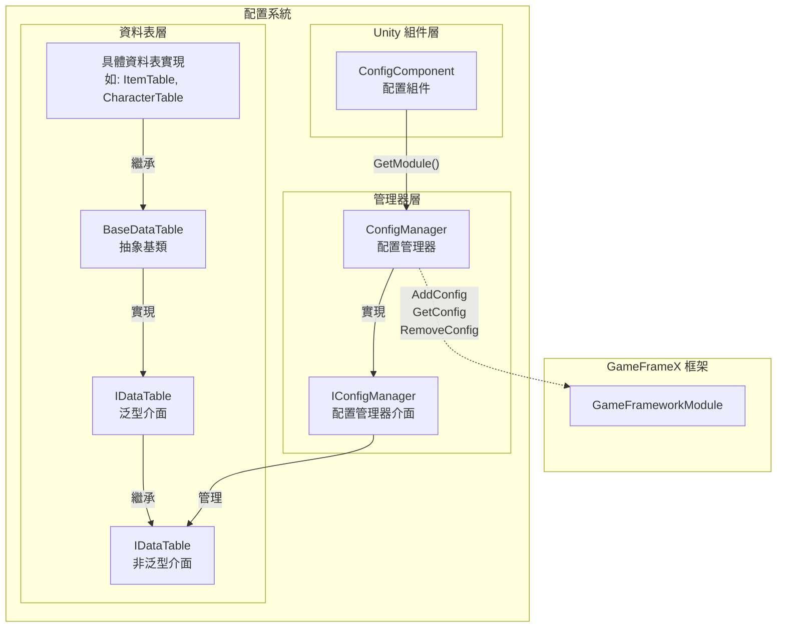
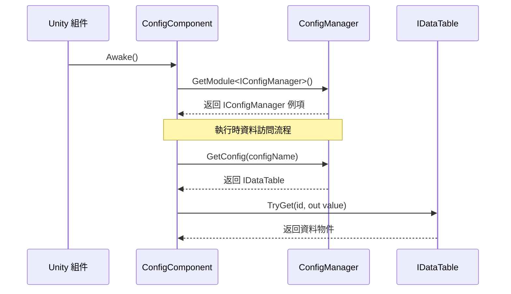

# ConfigManager 配置管理器

ConfigManager 是 GameFrameX 配置系統的核心模組，負責統一管理遊戲中的所有配置資料表。它提供了配置資料的儲存、查詢、新增、移除等核心功能，是遊戲執行時訪問配置資料的主要入口。

## 概述

ConfigManager 作為全域性配置管理器，扮演著配置資料中央倉庫的角色。在遊戲開發中，通常會有大量的配置資料（如物品表、角色屬性表、關卡配置等），這些資料需要統一的管理機制來確保高效訪問。ConfigManager 透過鍵值對的方式管理 `IDataTable` 型別的配置資料表，支援透過配置名稱快速查詢和獲取對應的資料表。

該管理器採用執行緒安全的 `ConcurrentDictionary` 實現，確保在多執行緒環境下也能安全地進行配置資料的訪問和修改。作為 GameFramework 的核心模組之一，ConfigManager 在遊戲啟動時初始化，在遊戲關閉時清理所有配置資料。

### 核心職責

- **配置儲存管理**：統一管理所有遊戲配置資料表的儲存
- **配置查詢**：提供快速的配置資料查詢和獲取功能
- **配置生命週期**：管理配置資料的新增、移除和清空操作
- **執行緒安全保障**：在多執行緒環境下安全地訪問配置資料

## 架構設計



上圖展示了配置系統的整體架構，從 Unity 組件層到資料表層的完整呼叫鏈路。

### 核心類說明

| 類名 | 職責 | 說明 |
|------|------|------|
| ConfigManager | 配置管理器核心實現 | 繼承 GameFrameworkModule，管理所有配置資料表 |
| IConfigManager | 配置管理器介面 | 定義配置管理器的標準操作介面 |
| ConfigComponent | Unity 組件 | 作為 Unity 層面的入口點，獲取 ConfigManager 例項 |
| IDataTable | 資料表基礎介面 | 定義資料表的基本操作 |
| `IDataTable<T>` | 泛型資料表介面 | 提供強型別的資料表查詢能力 |
| `BaseDataTable<T>` | 資料表抽象基類 | 實現資料表的核心功能，如字典儲存、查詢等 |

## 工作流程



## 核心功能

### 配置資料儲存

ConfigManager 使用 `ConcurrentDictionary<string, IDataTable>` 來儲存所有的配置資料表。這種設計具有以下優勢：

- **執行緒安全**：ConcurrentDictionary 是執行緒安全的集合，適用於多執行緒環境
- **高效能查詢**：字典的 O(1) 時間複雜度確保了配置資料的高速訪問
- **鍵值對管理**：透過配置名稱（字串）作為鍵，方便管理和查詢

```csharp
// 原始碼位置: Runtime/Config/Config/ConfigManager.cs#L47-L61
public sealed partial class ConfigManager : GameFrameworkModule, IConfigManager
{
    private readonly ConcurrentDictionary<string, IDataTable> m_ConfigDatas;

    public ConfigManager()
    {
        m_ConfigDatas = new ConcurrentDictionary<string, IDataTable>(StringComparer.Ordinal);
    }
}
```
> Source: [ConfigManager.cs](https://github.com/GameFrameX/com.gameframex.unity.config/blob/main/Runtime/Config/Config/ConfigManager.cs#L47-L61)

### 配置資料操作

ConfigManager 提供了完整的配置資料操作介面，包括檢查、增加、移除和獲取配置：

```csharp
// 檢查配置是否存在
public bool HasConfig(string configName)
{
    return m_ConfigDatas.TryGetValue(configName, out _);
}

// 新增配置
public void AddConfig(string configName, IDataTable configValue)
{
    m_ConfigDatas.TryAdd(configName, configValue);
}

// 移除配置
public bool RemoveConfig(string configName)
{
    return m_ConfigDatas.TryRemove(configName, out _);
}

// 獲取配置
public IDataTable GetConfig(string configName)
{
    return m_ConfigDatas.TryGetValue(configName, out var value) ? value : null;
}

// 清空所有配置
public void RemoveAllConfigs()
{
    m_ConfigDatas.Clear();
}
```
> Source: [ConfigManager.cs](https://github.com/GameFrameX/com.gameframex.unity.config/blob/main/Runtime/Config/Config/ConfigManager.cs#L99-L167)

這些方法的設計遵循了簡單直接的原則，透過字串鍵來管理配置資料表，支援動態新增和移除配置。

## 使用示例

### 透過 ConfigComponent 訪問配置

在遊戲程式碼中，通常透過 ConfigComponent 來訪問配置管理器：

```csharp
// 獲取 ConfigComponent 組件
var configComponent = UnityEngine.Object.FindObjectOfType<ConfigComponent>();

// 檢查配置是否存在
if (configComponent.HasConfig<CharacterTable>())
{
    // 獲取配置資料表
    var characterTable = configComponent.GetConfig<CharacterTable>();
    
    // 根據 ID 查詢角色資料
    if (characterTable.TryGet(1001, out var character))
    {
        UnityEngine.Debug.Log($"角色名稱: {character.Name}");
    }
}
```
> Source: [ConfigComponent.cs](https://github.com/GameFrameX/com.gameframex.unity.config/blob/main/Runtime/Config/ConfigComponent.cs#L117-L142)

### 資料表查詢操作

資料表提供了豐富的查詢方法，支援多種查詢方式：

```csharp
// 根據 ID 查詢（推薦使用 TryGet）
var item = itemTable.TryGet(1001, out var itemData) ? itemData : null;

// 使用索引器查詢
var character = characterTable[1001];

// 查詢所有滿足條件的物件
var allWarriors = characterTable.FindList(c => c.Type == "Warrior");

// 計算屬性總和
var totalAttack = characterTable.Sum(c => c.Attack);

// 遍歷所有資料
characterTable.ForEach(character => {
    UnityEngine.Debug.Log(character.Name);
});
```
> Source: [BaseDataTable.cs](https://github.com/GameFrameX/com.gameframex.unity.config/blob/main/Runtime/Config/Config/BaseDataTable.cs#L296-L349)

### 自定義資料表實現

開發者可以繼承 BaseDataTable 來建立自己的資料表實現：

```csharp
// 示例：定義角色資料表
public class CharacterData
{
    public int Id { get; set; }
    public string Name { get; set; }
    public int Attack { get; set; }
    public int Defense { get; set; }
}

public class CharacterTable : BaseDataTable<CharacterData>
{
    public override async Task LoadAsync()
    {
        // 在這裡實現資料載入邏輯
        // 可以從 Resources、AssetBundle 或網路載入資料
    }
}
```

## API 參考

### IConfigManager 介面

配置管理器的核心介面，定義了配置資料的基本操作：

| 方法 | 返回型別 | 描述 |
|------|----------|------|
| `HasConfig(configName)` | `bool` | 檢查指定名稱的配置是否存在 |
| `AddConfig(configName, configValue)` | `void` | 新增一個新的配置資料表 |
| `RemoveConfig(configName)` | `bool` | 移除指定名稱的配置資料表 |
| `GetConfig(configName)` | `IDataTable` | 獲取指定名稱的配置資料表 |
| `RemoveAllConfigs()` | `void` | 清空所有配置資料表 |
| `Count` | `int` | 獲取配置資料表的數量 |

### IDataTable 介面

資料表的基礎介面，提供資料表的後設資料和載入能力：

| 成員 | 型別 | 描述 |
|------|------|------|
| `LoadAsync()` | `Task` | 非同步載入資料表 |
| `Count` | `int` | 獲取資料表中資料的數量 |

### `IDataTable<T>` 泛型介面

強型別的資料表介面，提供資料查詢和統計功能：

#### 查詢方法

| 方法 | 描述 |
|------|------|
| `TryGet(int id, out T value)` | 根據整數 ID 嘗試獲取資料 |
| `TryGet(long id, out T value)` | 根據長整數 ID 嘗試獲取資料 |
| `TryGet(string id, out T value)` | 根據字串 ID 嘗試獲取資料 |
| `Find(Func<T, bool> func)` | 根據條件查詢第一個匹配項 |
| `FindList(Func<T, bool> func)` | 根據條件查詢所有匹配項並返回列表 |
| `FindListArray(Func<T, bool> func)` | 根據條件查詢所有匹配項並返回陣列 |

#### 索引器

| 索引器 | 描述 |
|--------|------|
| `this[int id]` | 透過整數主鍵獲取資料 |
| `this[long id]` | 透過長整數主鍵獲取資料 |
| `this[string id]` | 透過字串鍵獲取資料 |

#### 聚合方法

| 方法 | 描述 |
|------|------|
| `Max<Tk>(Func<T, Tk> func)` | 獲取指定屬性的最大值 |
| `Min<Tk>(Func<T, Tk> func)` | 獲取指定屬性的最小值 |
| `Sum(Func<T, int> func)` | 計算 int 型別屬性的總和 |
| `Sum(Func<T, long> func)` | 計算 long 型別屬性的總和 |
| `Sum(Func<T, float> func)` | 計算 float 型別屬性的總和 |

#### 轉換方法

| 方法 | 描述 |
|------|------|
| `All` | 獲取所有資料組成的陣列 |
| `ToArray()` | 轉換為陣列 |
| `ToList()` | 轉換為列表 |
| `FirstOrDefault` | 獲取第一個元素 |
| `LastOrDefault` | 獲取最後一個元素 |

## 相關連結

- [ConfigComponent 配置組件](./4-core-concepts.config-component) - Unity 組件層面的配置入口
- [IDataTable 資料表介面](./4-core-concepts.idata-table) - 資料表的介面定義和詳細規範
- [快速開始 - 資料表定義](./3-getting-started.data-table-definition) - 如何定義和使用資料表
- [API 參考 - 介面定義](./5-api-reference.interfaces) - 完整的 API 介面文件
