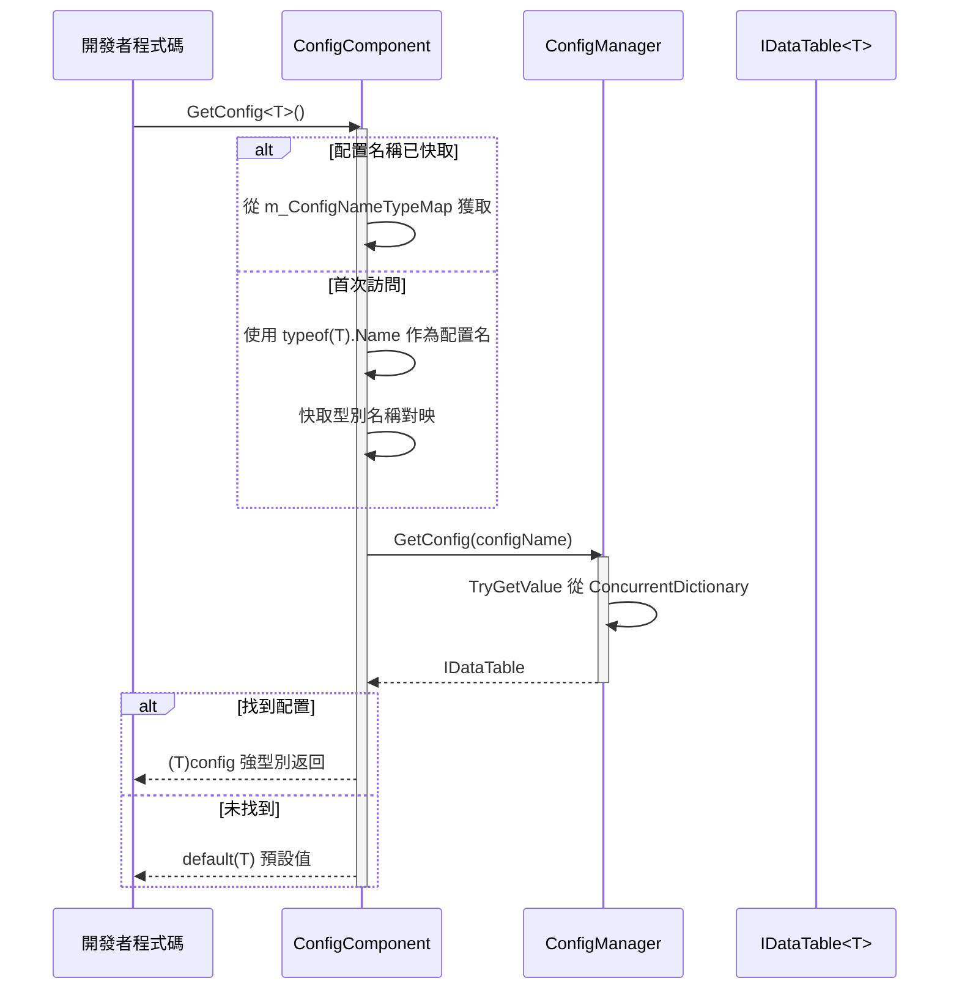
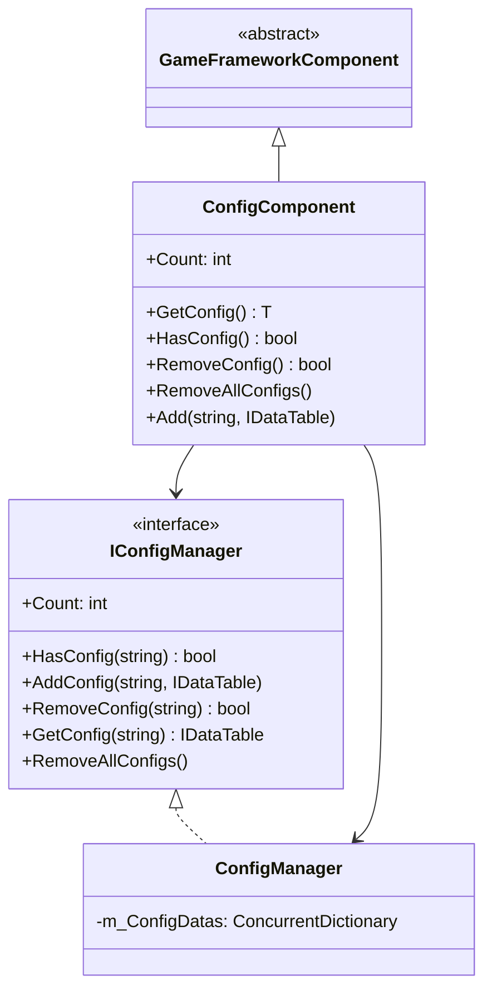

# ConfigComponent 配置組件

ConfigComponent 是 GameFrameX 配置系統的 Unity 組件層，作為遊戲配置管理的核心入口，提供型別安全的配置資料訪問能力。

## 概述

ConfigComponent 是 Unity 場景中的 `MonoBehaviour` 組件，繼承自 `GameFrameworkComponent`。它充當了配置管理系統與 Unity 引擎之間的橋樑，使開發者能夠在遊戲執行時方便地獲取和管理配置資料。

### 核心職責

- **型別安全的配置訪問**：透過泛型方法提供編譯時型別檢查
- **配置快取管理**：維護型別到配置名稱的對映關係
- **統一配置入口**：封裝 ConfigManager 的複雜性，提供簡潔的 API
- **生命週期管理**：在 Awake 階段初始化配置管理器

### 設計意圖

ConfigComponent 採用門面模式（Facade Pattern）設計，旨在簡化配置管理的複雜性。開發者無需直接與 ConfigManager 互動，只需透過 ConfigComponent 即可完成配置的獲取、查詢和管理操作。泛型方法的使用確保了編譯時的型別安全，減少了執行時錯誤。

## 架構

### 組件層次結構

```mermaid
graph TD
    subgraph Unity["Unity 層 (Scene)"]
        ConfigComp["ConfigComponent<br/>(MonoBehaviour)"]
    end
    
    subgraph Framework["GameFrameX 核心層"]
        IConfigMgr["IConfigManager<br/>(介面)"]
        ConfigMgr["ConfigManager<br/>(實現)"]
    end
    
    subgraph Data["資料層"]
        IDataTable["IDataTable<T><br/>(介面)"]
        BaseDataTable["BaseDataTable<T><br/>(基類)"]
        CustomDT["自定義資料表<br/>(繼承BaseDataTable)"]
    end
    
    ConfigComp -->|"獲取配置"| IConfigMgr
    IConfigMgr <|.. ConfigMgr
    ConfigMgr -->|"儲存/查詢"| IDataTable
    IDataTable <|.. BaseDataTable
    BaseDataTable <|-- CustomDT
```

### 配置訪問流程



## 核心功能

### 配置獲取

ConfigComponent 提供了兩種方式獲取配置：

1. **泛型方法獲取**（推薦）：自動使用型別名稱作為配置鍵
2. **手動新增配置**：允許顯式指定配置名稱和例項

### 型別名稱對映機制

內部使用 `ConcurrentDictionary<Type, string>` 快取型別到名稱的對映，避免頻繁呼叫 `typeof(T).Name`：

```csharp
private ConcurrentDictionary<Type, string> m_ConfigNameTypeMap = new ConcurrentDictionary<Type, string>();
```

> Source: [ConfigComponent.cs](https://github.com/GameFrameX/com.gameframex.unity.config/blob/main/Runtime/Config/ConfigComponent.cs#L51)

### 配置數量統計

透過 `Count` 屬性可以快速獲取當前已載入的配置項總數：

```csharp
public int Count
{
    get { return m_ConfigManager.Count; }
}
```

> Source: [ConfigComponent.cs](https://github.com/GameFrameX/com.gameframex.unity.config/blob/main/Runtime/Config/ConfigComponent.cs#L61-L64)

## 使用示例

### 在 Unity 場景中使用

1. 在 Unity 編輯器中建立空物體
2. 新增 `GameFrameX/Config` 組件（自動新增 ConfigComponent）
3. 透過指令碼獲取並使用配置

### 獲取配置資料

```csharp
using GameFrameX.Config.Runtime;

// 獲取配置組件
var configComponent = UnityEngine.GameObject.Find("GameFrameX").GetComponent<ConfigComponent>();

// 檢查配置是否存在
if (configComponent.HasConfig<WeaponDataTable>())
{
    // 獲取配置
    var weaponTable = configComponent.GetConfig<WeaponDataTable>();
    
    // 透過 ID 獲取資料
    var weapon = weaponTable[1001];
    
    // 使用 TryGet 安全獲取
    if (weaponTable.TryGetValue(1001, out var weapon2))
    {
        // 使用 weapon2
    }
}
```

> Source: [ConfigComponent.cs](https://github.com/GameFrameX/com.gameframex.unity.config/blob/main/Runtime/Config/ConfigComponent.cs#L117-L127)

### 新增自定義配置

```csharp
// 手動新增配置
var customTable = new MyCustomDataTable();
configComponent.Add("MyCustomConfig", customTable);

// 移除指定配置
configComponent.RemoveConfig<WeaponDataTable>();

// 清空所有配置
configComponent.RemoveAllConfigs();
```

> Source: [ConfigComponent.cs](https://github.com/GameFrameX/com.gameframex.unity.config/blob/main/Runtime/Config/ConfigComponent.cs#L153-L170)

### 資料表查詢示例

```csharp
var config = configComponent.GetConfig<ItemDataTable>();

// 獲取所有資料
var allItems = config.All;

// 條件查詢
var rareItems = config.FindList(item => item.Quality >= 4);

// 聚合操作
var maxPrice = config.Max(item => item.Price);
var totalCount = config.Sum(item => item.Count);

// 遍歷操作
config.ForEach(item => {
    UnityEngine.Debug.Log(item.Name);
});
```

> Source: [BaseDataTable.cs](https://github.com/GameFrameX/com.gameframex.unity.config/blob/main/Runtime/Config/Config/BaseDataTable.cs#L296-L349)

## API 參考

### 屬性

#### `Count: int`

獲取全域性配置項數量。

```csharp
int count = configComponent.Count;
```

| 屬性 | 值 |
|------|-----|
| 型別 | `int` |
| 訪問 | 只讀 |
| 說明 | 返回 ConfigManager 中儲存的配置項總數 |

### 方法

#### `GetConfig<T>(): T`

獲取指定型別的全域性配置項。

```csharp
var config = configComponent.GetConfig<WeaponDataTable>();
```

| 引數 | 型別 | 說明 |
|------|------|------|
| T | 泛型引數 | 配置項型別，必須實現 `IDataTable` 介面 |

| 返回值 | 說明 |
|--------|------|
| T | 找到的配置項；未找到時返回 `default(T)` |

> Source: [ConfigComponent.cs](https://github.com/GameFrameX/com.gameframex.unity.config/blob/main/Runtime/Config/ConfigComponent.cs#L117-L127)

---

#### `HasConfig<T>(): bool`

檢查指定型別的配置項是否存在。

```csharp
bool exists = configComponent.HasConfig<MonsterDataTable>();
```

| 引數 | 型別 | 說明 |
|------|------|------|
| T | 泛型引數 | 配置項型別，必須實現 `IDataTable` 介面 |

| 返回值 | 說明 |
|--------|------|
| `bool` | 配置項存在返回 `true`，否則返回 `false` |

> Source: [ConfigComponent.cs](https://github.com/GameFrameX/com.gameframex.unity.config/blob/main/Runtime/Config/ConfigComponent.cs#L138-L142)

---

#### `RemoveConfig<T>(): bool`

移除指定型別的配置項。

```csharp
bool success = configComponent.RemoveConfig<WeaponDataTable>();
```

| 引數 | 型別 | 說明 |
|------|------|------|
| T | 泛型引數 | 配置項型別，必須實現 `IDataTable` 介面 |

| 返回值 | 說明 |
|--------|------|
| `bool` | 移除成功返回 `true`；配置不存在返回 `false` |

> Source: [ConfigComponent.cs](https://github.com/GameFrameX/com.gameframex.unity.config/blob/main/Runtime/Config/ConfigComponent.cs#L153-L157)

---

#### `RemoveAllConfigs(): void`

清空所有全域性配置項。

```csharp
configComponent.RemoveAllConfigs();
```

> Source: [ConfigComponent.cs](https://github.com/GameFrameX/com.gameframex.unity.config/blob/main/Runtime/Config/ConfigComponent.cs#L166-L170)

---

#### `Add(configName: string, dataTable: IDataTable): void`

增加指定的全域性配置項。

```csharp
configComponent.Add("MyConfig", myDataTable);
```

| 引數 | 型別 | 說明 |
|------|------|------|
| configName | `string` | 全域性配置項的名稱 |
| dataTable | `IDataTable` | 全域性配置項的資料表例項 |

> Source: [ConfigComponent.cs](https://github.com/GameFrameX/com.gameframex.unity.config/blob/main/Runtime/Config/ConfigComponent.cs#L181-L184)

## 繼承結構



## 相關連結

- [ConfigManager 配置管理器](./4-core-concepts.config-manager)
- [IDataTable 資料表介面](./4-core-concepts.idata-table)
- [介面定義](./5-api-reference.interfaces)
- [事件引數](./5-api-reference.event-args)
- [二進位制配置表](./6-configuration.binary-config)
- [指令碼宏定義](./6-configuration.scripting-define-symbols)
