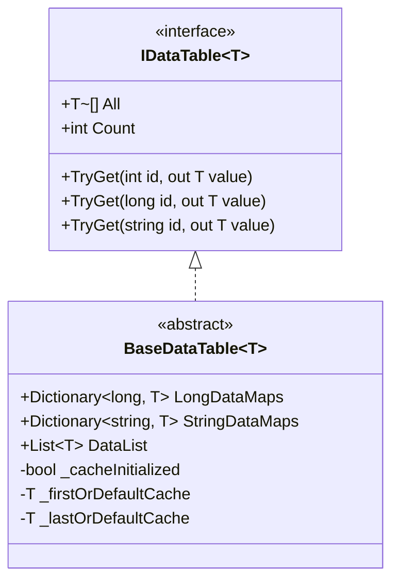

# 二進位制配置表

二進位制配置表是 GameFrameX Config 配置系統的重要組成部分，用於以二進位制格式儲存和載入遊戲配置資料。相比文字格式，二進位制配置表具有載入速度快、佔用空間小、解析效率高等優點，特別適合對效能要求較高的遊戲場景。

## 概述

二進位制配置表功能允許開發者在 Unity 專案中使用 `.bytes` 格式的二進位制配置檔案。系統透過副檔名自動識別配置型別：當配置資源名稱以 `.bytes` 結尾時，系統會將其作為二進位制資料進行解析；否則按文字格式處理。

這種設計提供了極大的靈活性，開發者可以根據實際需求選擇使用文字配置表或二進位制配置表，甚至可以在同一個專案中混合使用兩種格式。

### 二進位制配置的核心優勢

**載入效能**：二進位制資料無需進行字串解析，直接透過 BinaryReader 讀取即可，能夠顯著減少載入時間。在大型遊戲或多配置場景下，這一優勢尤為明顯。

**儲存效率**：二進位制格式將資料緊湊儲存，相比文字格式（如 JSON、XML）能夠節省 30%-50% 的儲存空間，同時減少執行時記憶體佔用。

**安全性**：二進位制配置表不易被直接閱讀和修改，為遊戲資料提供了一定程度的保護。雖然不能完全防止破解，但相比明文儲存的文字配置檔案安全係數更高。

## 架構設計

```mermaid
flowchart TD
    subgraph ConfigSystem["配置系統架構"]
        subgraph UnityLayer["Unity 層"]
            CC[ConfigComponent<br/>配置組件]
        end
        
        subgraph ManagerLayer["管理層"]
            CM[ConfigManager<br/>配置管理器]
        end
        
        subgraph DataLayer["資料層"]
            DT[IDataTable&lt;T&gt;<br/>資料表介面]
            BDT[BaseDataTable&lt;T&gt;<br/>資料表基類]
        end
        
        subgraph StorageLayer["儲存層"]
            DictLong[Dictionary&lt;long, T&gt;<br/>長整型索引]
            DictStr[Dictionary&lt;string, T&gt;<br/>字串索引]
            List[List&lt;T&gt;<br/>資料列表]
        end
    end
    
    CC --> CM
    CM --> DT
    DT <|-- BDT
    BDT --> DictLong
    BDT --> DictStr
    BDT --> List
```

### 核心組件職責

**ConfigComponent** 是 Unity 層面的入口組件，繼承自 GameFrameworkComponent，透過掛載到遊戲物體上提供配置功能。它負責初始化 ConfigManager 並暴露配置訪問介面給遊戲邏輯層。

**ConfigManager** 實現 IConfigManager 介面，是整個配置系統的核心管理器。它維護一個執行緒安全的 ConcurrentDictionary，用於儲存所有已載入的配置表例項，並提供配置的查詢、新增、移除等操作。

**BaseDataTable<T>** 是所有資料表的泛型基類，提供了資料儲存和查詢的完整實現。它內部維護三個資料結構：LongDataMaps 用於長整型 ID 索引、StringDataMaps 用於字串 ID 索引、DataList 用於順序遍歷和批次操作。

## 二進位制配置載入流程

```mermaid
sequenceDiagram
    participant Game as 遊戲邏輯
    participant CC as ConfigComponent
    participant CM as ConfigManager
    participant RC as ResourceComponent
    participant Parser as 配置解析器

    Game->>CC: 請求載入配置
    CC->>CM: GetConfig&lt;T&gt;()
    CM->>RC: LoadAsset(configName.bytes)
    RC-->>CM: 返回 TextAsset.bytes
    CM->>Parser: ParseData(bytes)
    
    alt 副檔名為 .bytes
        Parser->>Parser: 使用 BinaryReader 解析
        Parser->>Parser: 迴圈讀取 string-key 和 string-value
    else 其他副檔名
        Parser->>Parser: 使用文字解析器
    end
    
    Parser-->>CM: 返回解析結果
    CM-->>CM: 儲存到 Dictionary
    CM-->>CC: 返回 IDataTable
    CC-->>Game: 返回配置資料
```

## 指令碼宏定義

二進位制配置功能透過 Unity 指令碼宏定義（Scripting Define Symbols）進行控制。Editor 目錄下提供了 ConfigDefineSymbols 工具類來管理此宏定義。

### 啟用二進位制配置

在 Unity 編輯器中，可以透過選單操作來啟用或禁用二進位制配置功能：

```csharp
// Source: [Editor/ConfigDefineSymbols.cs](https://github.com/GameFrameX/com.gameframex.unity.config/blob/main/Editor/ConfigDefineSymbols.cs#L1-L31)

namespace GameFrameX.Config.Editor
{
    /// <summary>
    /// 配置表二進位制功能指令碼宏定義。
    /// </summary>
    public static class ConfigDefineSymbols
    {
        public const string EnableBinaryConfigScriptingDefineSymbol = "ENABLE_BINARY_CONFIG";

        /// <summary>
        /// 開啟配置表為二進位制的指令碼宏定義。
        /// </summary>
        [MenuItem("GameFrameX/Scripting Define Symbols/Enable Binary Config(開啟二進位制配置表)", false, 501)]
        public static void EnableBinaryConfig()
        {
            ScriptingDefineSymbols.AddScriptingDefineSymbol(EnableBinaryConfigScriptingDefineSymbol);
        }

        /// <summary>
        /// 禁用配置表為二進位制的指令碼宏定義。
        /// </summary>
        [MenuItem("GameFrameX/Scripting Define Symbols/Disable Binary Config(關閉二進位制配置表)", false, 500)]
        public static void DisableBinaryConfig()
        {
            ScriptingDefineSymbols.RemoveScriptingDefineSymbol(EnableBinaryConfigScriptingDefineSymbol);
        }
    }
}
```

透過選單 **GameFrameX → Scripting Define Symbols → Enable Binary Config(開啟二進位制配置表)** 即可啟用二進位制配置支援。

## 二進位制配置格式

二進位制配置表採用簡單的鍵值對格式儲存資料，每條記錄包含兩個字串：配置名稱（鍵）和配置值（值）。

### 二進位制格式規範

二進位制檔案使用 BinaryWriter 按以下順序寫入資料：

```
[配置名稱1 (string)] [配置值1 (string)]
[配置名稱2 (string)] [配置值2 (string)]
...
```

每個字串使用 UTF-8 編碼，並透過 BinaryWriter.Write(string) 方法寫入。

### 資料解析實現

系統使用 BinaryReader 進行二進位制資料的解析，核心實現邏輯如下：

```csharp
// Source: [Runtime/Config/DefaultConfigHelper.cs](https://github.com/GameFrameX/com.gameframex.unity.config/blob/main/Runtime/Config/DefaultConfigHelper.cs#L147-L184)

/// <summary>
/// 解析全域性配置（二進位制格式）。
/// </summary>
public override bool ParseData(IConfigManager configManager, byte[] configBytes, int startIndex, int length, object userData)
{
    try
    {
        using (MemoryStream memoryStream = new MemoryStream(configBytes, startIndex, length, false))
        {
            using (BinaryReader binaryReader = new BinaryReader(memoryStream, Encoding.UTF8))
            {
                while (binaryReader.BaseStream.Position < binaryReader.BaseStream.Length)
                {
                    string configName = binaryReader.ReadString();
                    string configValue = binaryReader.ReadString();
                    if (!configManager.AddConfig(configName, configValue))
                    {
                        Log.Warning("Can not add config with config name '{0}' which may be invalid or duplicate.", configName);
                        return false;
                    }
                }
            }
        }

        return true;
    }
    catch (Exception exception)
    {
        Log.Warning("Can not parse config bytes with exception '{0}'.", exception);
        return false;
    }
}
```

解析過程中，系統會持續讀取字串對，直到流末尾。每讀取到一個配置項，就呼叫 AddConfig 方法將其新增到配置管理器中。

### 副檔名識別

系統透過資源副檔名自動判斷配置型別：

```csharp
// Source: [Runtime/Config/DefaultConfigHelper.cs](https://github.com/GameFrameX/com.gameframex.unity.config/blob/main/Runtime/Config/DefaultConfigHelper.cs#L61-L78)

private static readonly string BytesAssetExtension = ".bytes";

public override bool ReadData(IConfigManager configManager, string configAssetName, object configAsset, object userData)
{
    TextAsset configTextAsset = configAsset as TextAsset;
    if (configTextAsset != null)
    {
        if (configAssetName.EndsWith(BytesAssetExtension, StringComparison.Ordinal))
        {
            // 二進位制格式解析
            return configManager.ParseData(configTextAsset.bytes, userData);
        }
        else
        {
            // 文字格式解析
            return configManager.ParseData(configTextAsset.text, userData);
        }
    }

    Log.Warning("Config asset '{0}' is invalid.", configAssetName);
    return false;
}
```

## 資料表儲存結構

BaseDataTable<T> 使用多種資料結構來滿足不同的查詢需求，這種設計在保證功能完整性的同時，也最佳化了常見操作的效能。



### 儲存結構說明

**LongDataMaps**：使用 Dictionary<long, T> 儲存以長整數作為主鍵的配置資料，提供 O(1) 時間複雜度的按 ID 查詢。

**StringDataMaps**：使用 Dictionary<string, T> 儲存以字串作為主鍵的配置資料，適用於需要使用字串識別符號的場景。

**DataList**：使用 List<T> 儲存所有配置資料物件，支援順序遍歷、批次操作以及 First/Last 查詢。

**快取機制**：BaseDataTable 實現了快取機制，用於快取資料表中的首尾元素和數量統計，避免頻繁遍歷底層資料結構。

## 配置查詢示例

資料表支援多種查詢方式，開發者可以根據實際場景選擇最合適的方法：

```csharp
// Source: [Runtime/Config/Config/BaseDataTable.cs](https://github.com/GameFrameX/com.gameframex.unity.config/blob/main/Runtime/Config/Config/BaseDataTable.cs#L119-L162)

/// <summary>
/// 嘗試根據整數ID獲取物件。
/// </summary>
public bool TryGet(int id, out T value)
{
    return LongDataMaps.TryGetValue(id, out value);
}

/// <summary>
/// 嘗試根據長整數ID獲取物件。
/// </summary>
public bool TryGet(long id, out T value)
{
    return LongDataMaps.TryGetValue(id, out value);
}

/// <summary>
/// 嘗試根據字串ID獲取物件。
/// </summary>
public bool TryGet(string id, out T value)
{
    return StringDataMaps.TryGetValue(id, out value);
}
```

### 常用查詢方法

| 方法 | 描述 | 返回型別 |
|------|------|----------|
| TryGet(int id) | 根據整數 ID 嘗試獲取資料 | bool |
| TryGet(long id) | 根據長整數 ID 嘗試獲取資料 | bool |
| TryGet(string id) | 根據字串 ID 嘗試獲取資料 | bool |
| Find(func) | 根據條件查詢第一個匹配物件 | T |
| FindListArray(func) | 根據條件查詢所有匹配物件 | T[] |
| FirstOrDefault | 獲取第一個物件 | T |
| LastOrDefault | 獲取最後一個物件 | T |
| All | 獲取所有物件陣列 | T[] |

## 相關連結

- [Config 組件簡介](./1-overview.introduction)
- [功能特性](./1-overview.features)
- [安裝方式](./2-installation.install-methods)
- [依賴要求](./2-installation.dependencies)
- [基礎使用](./3-getting-started.basic-usage)
- [資料表定義](./3-getting-started.data-table-definition)
- [ConfigComponent 配置組件](./4-core-concepts.config-component)
- [ConfigManager 配置管理器](./4-core-concepts.config-manager)
- [IDataTable 資料表介面](./4-core-concepts.idata-table)
- [介面定義](./5-api-reference.interfaces)
- [事件引數](./5-api-reference.event-args)
- [指令碼宏定義](./6-configuration.scripting-define-symbols)
- [常見問題](./7-troubleshooting)
