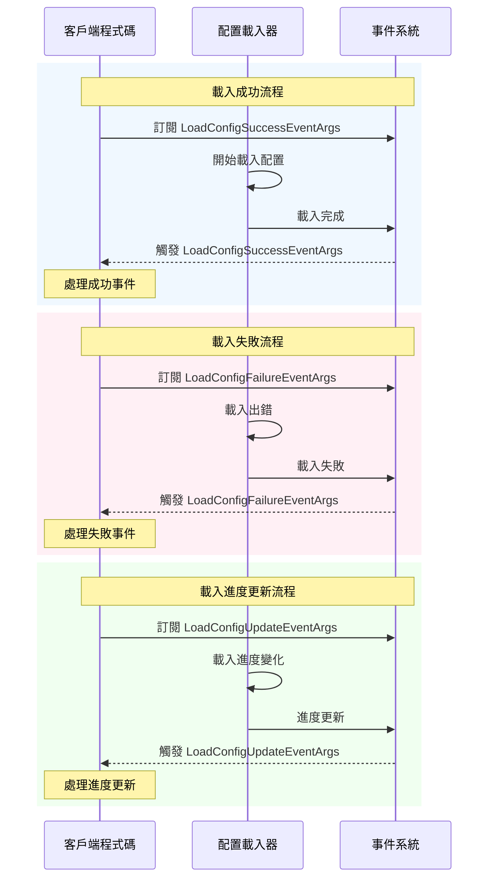

# 事件引數

本文件介紹 GameFrameX 配置模組中定義的事件引數型別，用於在配置載入過程中傳遞事件資料。

## 概述

事件引數是 GameFrameX 配置系統中觀察者模式的重要組成部分。當配置資源進行非同步載入時，系統會觸發不同型別的事件來通知關注該程序的程式碼。這些事件包括：載入成功、載入失敗、載入進度更新。

事件引數類統一繼承自 `GameFrameX.Event.Runtime.GameEventArgs` 基類，使用物件池模式來最佳化記憶體分配。每個事件類都提供了靜態的 `EventId` 屬性用於事件標識，以及靜態的 `Create` 工廠方法用於建立事件例項。

## 事件引數類

### 1. LoadConfigSuccessEventArgs - 載入成功事件

當全域性配置資源載入成功時觸發此事件。

```csharp
public sealed class LoadConfigSuccessEventArgs : GameEventArgs
{
    /// <summary>
    /// 載入全域性配置成功事件編號。
    /// </summary>
    public static readonly string EventId = typeof(LoadConfigSuccessEventArgs).FullName;

    /// <summary>
    /// 獲取全域性配置資源名稱。
    /// </summary>
    public string ConfigAssetName { get; private set; }

    /// <summary>
    /// 獲取載入持續時間。
    /// </summary>
    /// <remarks>
    /// 載入持續時間，以秒為單位
    /// </remarks>
    public float Duration { get; private set; }

    /// <summary>
    /// 獲取使用者自定義資料。
    /// </summary>
    public object UserData { get; private set; }

    /// <summary>
    /// 建立載入全域性配置成功事件。
    /// </summary>
    public static LoadConfigSuccessEventArgs Create(string dataAssetName, float duration, object userData)
    {
        LoadConfigSuccessEventArgs loadConfigSuccessEventArgs = ReferencePool.Acquire<LoadConfigSuccessEventArgs>();
        loadConfigSuccessEventArgs.ConfigAssetName = dataAssetName;
        loadConfigSuccessEventArgs.Duration = duration;
        loadConfigSuccessEventArgs.UserData = userData;
        return loadConfigSuccessEventArgs;
    }

    /// <summary>
    /// 清理載入全域性配置成功事件。
    /// </summary>
    public override void Clear()
    {
        ConfigAssetName = null;
        Duration = 0f;
        UserData = null;
    }
}
```

> Source: [LoadConfigSuccessEventArgs.cs](https://github.com/GameFrameX/com.gameframex.unity.config/blob/main/Runtime/EventArgs/LoadConfigSuccessEventArgs.cs#L43-L137)

### 2. LoadConfigFailureEventArgs - 載入失敗事件

當全域性配置資源載入失敗時觸發此事件。

```csharp
public sealed class LoadConfigFailureEventArgs : GameEventArgs
{
    /// <summary>
    /// 載入全域性配置失敗事件編號。
    /// </summary>
    public static readonly string EventId = typeof(LoadConfigFailureEventArgs).FullName;

    /// <summary>
    /// 獲取全域性配置資源名稱。
    /// </summary>
    public string ConfigAssetName { get; private set; }

    /// <summary>
    /// 獲取錯誤資訊。
    /// </summary>
    public string ErrorMessage { get; private set; }

    /// <summary>
    /// 獲取使用者自定義資料。
    /// </summary>
    public object UserData { get; private set; }

    /// <summary>
    /// 建立載入全域性配置失敗事件。
    /// </summary>
    public static LoadConfigFailureEventArgs Create(string dataAssetName, string errorMessage, object userData)
    {
        LoadConfigFailureEventArgs loadConfigFailureEventArgs = ReferencePool.Acquire<LoadConfigFailureEventArgs>();
        loadConfigFailureEventArgs.ConfigAssetName = dataAssetName;
        loadConfigFailureEventArgs.ErrorMessage = errorMessage;
        loadConfigFailureEventArgs.UserData = userData;
        return loadConfigFailureEventArgs;
    }

    /// <summary>
    /// 清理載入全域性配置失敗事件。
    /// </summary>
    public override void Clear()
    {
        ConfigAssetName = null;
        ErrorMessage = null;
        UserData = null;
    }
}
```

> Source: [LoadConfigFailureEventArgs.cs](https://github.com/GameFrameX/com.gameframex.unity.config/blob/main/Runtime/EventArgs/LoadConfigFailureEventArgs.cs#L43-L137)

### 3. LoadConfigUpdateEventArgs - 載入進度更新事件

當全域性配置資源載入進度更新時觸發此事件。

```csharp
public sealed class LoadConfigUpdateEventArgs : GameEventArgs
{
    /// <summary>
    /// 載入全域性配置更新事件編號。
    /// </summary>
    public static readonly string EventId = typeof(LoadConfigUpdateEventArgs).FullName;

    /// <summary>
    /// 獲取全域性配置資源名稱。
    /// </summary>
    public string ConfigAssetName { get; private set; }

    /// <summary>
    /// 獲取載入全域性配置進度。
    /// </summary>
    /// <remarks>
    /// 載入進度，範圍為 0.0 到 1.0
    /// </remarks>
    public float Progress { get; private set; }

    /// <summary>
    /// 獲取使用者自定義資料。
    /// </summary>
    public object UserData { get; private set; }

    /// <summary>
    /// 建立載入全域性配置更新事件。
    /// </summary>
    public static LoadConfigUpdateEventArgs Create(string dataAssetName, float progress, object userData)
    {
        LoadConfigUpdateEventArgs loadConfigUpdateEventArgs = ReferencePool.Acquire<LoadConfigUpdateEventArgs>();
        loadConfigUpdateEventArgs.ConfigAssetName = dataAssetName;
        loadConfigUpdateEventArgs.Progress = progress;
        loadConfigUpdateEventArgs.UserData = userData;
        return loadConfigUpdateEventArgs;
    }

    /// <summary>
    /// 清理載入全域性配置更新事件。
    /// </summary>
    public override void Clear()
    {
        ConfigAssetName = null;
        Progress = 0f;
        UserData = null;
    }
}
```

> Source: [LoadConfigUpdateEventArgs.cs](https://github.com/GameFrameX/com.gameframex.unity.config/blob/main/Runtime/EventArgs/LoadConfigUpdateEventArgs.cs#L43-L137)

## 事件關係類圖

```mermaid
classDiagram
    class GameEventArgs {
        <<abstract>>
        +Id: string {get; abstract}
        +Clear() void$ abstract
    }
    
    class LoadConfigSuccessEventArgs {
        +EventId: string
        +ConfigAssetName: string
        +Duration: float
        +UserData: object
        +Create(dataAssetName, duration, userData)$ LoadConfigSuccessEventArgs
    }
    
    class LoadConfigFailureEventArgs {
        +EventId: string
        +ConfigAssetName: string
        +ErrorMessage: string
        +UserData: object
        +Create(dataAssetName, errorMessage, userData)$ LoadConfigFailureEventArgs
    }
    
    class LoadConfigUpdateEventArgs {
        +EventId: string
        +ConfigAssetName: string
        +Progress: float
        +UserData: object
        +Create(dataAssetName, progress, userData)$ LoadConfigUpdateEventArgs
    }
    
    GameEventArgs <|-- LoadConfigSuccessEventArgs
    GameEventArgs <|-- LoadConfigFailureEventArgs
    GameEventArgs <|-- LoadConfigUpdateEventArgs
```

## 事件流程



## API 參考

### LoadConfigSuccessEventArgs

**名稱空間：** `GameFrameX.Config.Runtime`

**繼承：** `GameEventArgs`

#### 屬性

| 屬性 | 型別 | 只讀 | 描述 |
|------|------|------|------|
| EventId | string | 是 | 事件唯一識別符號，值為型別的完全限定名 |
| ConfigAssetName | string | 是 | 載入成功的配置資源名稱 |
| Duration | float | 是 | 載入所花費的時間，單位為秒 |
| UserData | object | 是 | 使用者自定義資料，用於在事件間傳遞上下文 |

#### 方法

| 方法 | 返回型別 | 描述 |
|------|----------|------|
| Create(string, float, object) | LoadConfigSuccessEventArgs | 靜態工廠方法，從物件池獲取例項並初始化 |
| Clear() | void | 清理所有屬性值，將例項歸還物件池 |

---

### LoadConfigFailureEventArgs

**名稱空間：** `GameFrameX.Config.Runtime`

**繼承：** `GameEventArgs`

#### 屬性

| 屬性 | 型別 | 只讀 | 描述 |
|------|------|------|------|
| EventId | string | 是 | 事件唯一識別符號，值為型別的完全限定名 |
| ConfigAssetName | string | 是 | 載入失敗的配置資源名稱 |
| ErrorMessage | string | 是 | 描述失敗原因的錯誤資訊 |
| UserData | object | 是 | 使用者自定義資料，用於在事件間傳遞上下文 |

#### 方法

| 方法 | 返回型別 | 描述 |
|------|----------|------|
| Create(string, string, object) | LoadConfigFailureEventArgs | 靜態工廠方法，從物件池獲取例項並初始化 |
| Clear() | void | 清理所有屬性值，將例項歸還物件池 |

---

### LoadConfigUpdateEventArgs

**名稱空間：** `GameFrameX.Config.Runtime`

**繼承：** `GameEventArgs`

#### 屬性

| 屬性 | 型別 | 只讀 | 描述 |
|------|------|------|------|
| EventId | string | 是 | 事件唯一識別符號，值為型別的完全限定名 |
| ConfigAssetName | string | 是 | 正在載入的配置資源名稱 |
| Progress | float | 是 | 載入進度，範圍從 0.0 到 1.0 |
| UserData | object | 是 | 使用者自定義資料，用於在事件間傳遞上下文 |

#### 方法

| 方法 | 返回型別 | 描述 |
|------|----------|------|
| Create(string, float, object) | LoadConfigUpdateEventArgs | 靜態工廠方法，從物件池獲取例項並初始化 |
| Clear() | void | 清理所有屬性值，將例項歸還物件池 |

## 使用示例

### 訂閱配置載入事件

```csharp
using GameFrameX.Event.Runtime;
using GameFrameX.Config.Runtime;

// 訂閱配置載入成功事件
EventSystem.EventSubscribe<LoadConfigSuccessEventArgs>(OnLoadConfigSuccess);

// 訂閱配置載入失敗事件
EventSystem.EventSubscribe<LoadConfigFailureEventArgs>(OnLoadConfigFailure);

// 訂閱配置載入進度更新事件
EventSystem.EventSubscribe<LoadConfigUpdateEventArgs>(OnLoadConfigUpdate);

private void OnLoadConfigSuccess(object sender, LoadConfigSuccessEventArgs e)
{
    UnityEngine.Debug.Log($"配置載入成功: {e.ConfigAssetName}, 耗時: {e.Duration}秒");
    // 處理載入成功的邏輯
    // 注意：使用完畢後需要歸還事件物件到物件池
    ReferencePool.Release(e);
}

private void OnLoadConfigFailure(object sender, LoadConfigFailureEventArgs e)
{
    UnityEngine.Debug.LogError($"配置載入失敗: {e.ConfigAssetName}, 錯誤: {e.ErrorMessage}");
    ReferencePool.Release(e);
}

private void OnLoadConfigUpdate(object sender, LoadConfigUpdateEventArgs e)
{
    UnityEngine.Debug.Log($"載入進度: {e.ConfigAssetName} - {e.Progress * 100}%");
    ReferencePool.Release(e);
}
```

> Source: [LoadConfigSuccessEventArgs.cs](https://github.com/GameFrameX/com.gameframex.unity.config/blob/main/Runtime/EventArgs/LoadConfigSuccessEventArgs.cs#L116-L123)
> Source: [LoadConfigFailureEventArgs.cs](https://github.com/GameFrameX/com.gameframex.unity.config/blob/main/Runtime/EventArgs/LoadConfigFailureEventArgs.cs#L116-L123)
> Source: [LoadConfigUpdateEventArgs.cs](https://github.com/GameFrameX/com.gameframex.unity.config/blob/main/Runtime/EventArgs/LoadConfigUpdateEventArgs.cs#L116-L123)

## 相關連結

- [介面定義](./5-api-reference.interfaces) - 配置管理器的介面定義
- [ConfigComponent 配置組件](./4-core-concepts.config-component) - 配置組件的詳細介紹
- [ConfigManager 配置管理器](./4-core-concepts.config-manager) - 配置管理器的詳細介紹
- [IDataTable 資料表介面](./4-core-concepts.idata-table) - 資料表介面的詳細定義
