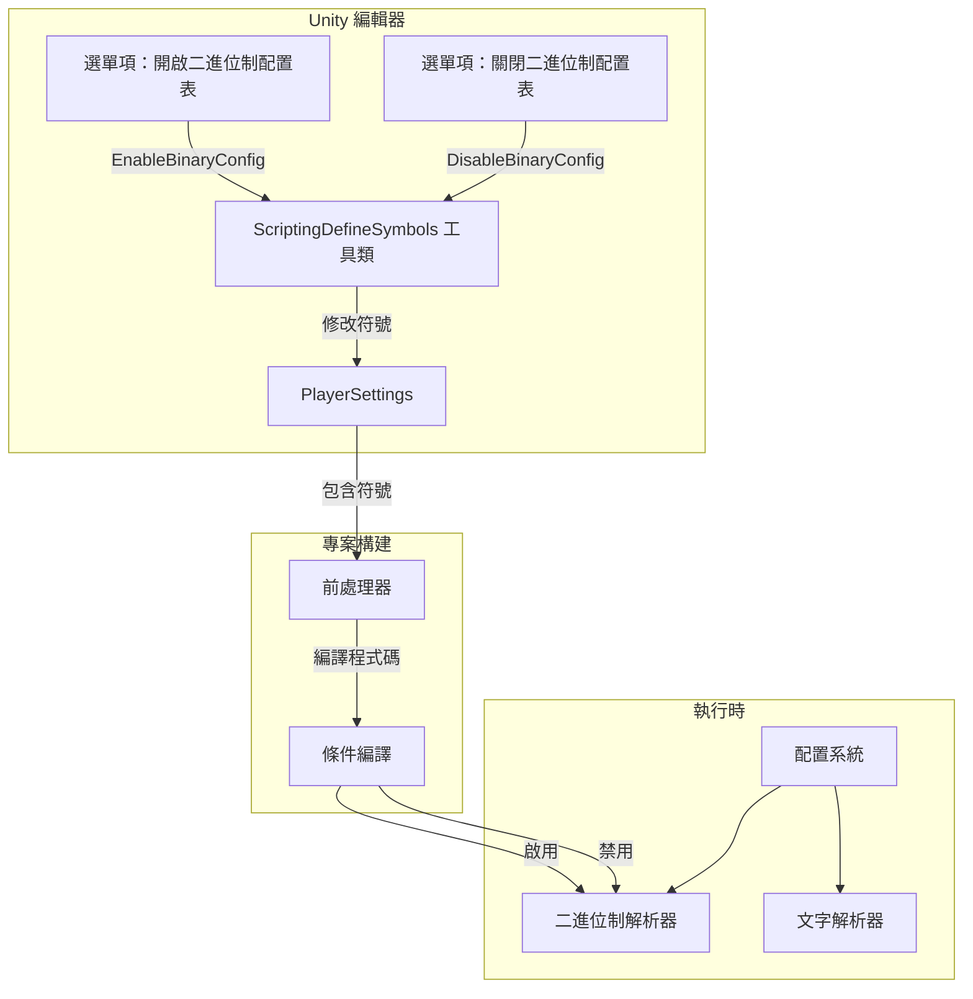
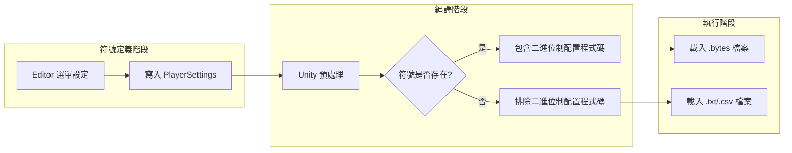

# 指令碼宏定義

指令碼宏定義（Scripting Define Symbols）是 Unity 專案中用於條件編譯的前處理器符號。GameFrameX Config 組件透過指令碼宏定義來控制二進位制配置表功能的開啟與關閉。

## 概述

指令碼宏定義是 Unity 編譯器的一個特性，允許開發者在程式碼中根據不同的編譯條件包含或排除特定程式碼段。GameFrameX Config 組件使用 `ENABLE_BINARY_CONFIG` 指令碼宏來控制是否啟用二進位制配置表功能。

### 什麼是二進位制配置表

二進位制配置表是一種以二進位制格式儲存配置資料的方式，相比文字格式（CSV、TSV）具有以下優勢：

- **載入速度更快**：二進位制資料無需解析，可直接讀取
- **檔案體積更小**：資料以緊湊的二進位制格式儲存
- **安全性更高**：二進位制資料不易被直接閱讀和修改
- **解析開銷更低**：無需字串分割和型別轉換

## 工作原理

### 架構流程



### 符號作用機制



## 使用方法

### 開啟二進位制配置表

在 Unity 編輯器中，透過選單操作開啟二進位制配置功能：

1. 開啟 Unity 編輯器
2. 依次點選選單：`GameFrameX` → `Scripting Define Symbols` → `Enable Binary Config(開啟二進位制配置表)`
3. 等待 Unity 重新編譯指令碼

### 關閉二進位制配置表

如需切換回文字格式配置：

1. 依次點選選單：`GameFrameX` → `Scripting Define Symbols` → `Disable Binary Config(關閉二進位制配置表)`
2. 等待 Unity 重新編譯指令碼

## API 參考

### ConfigDefineSymbols

名稱空間：`GameFrameX.Config.Editor`

```csharp
public static class ConfigDefineSymbols
```

配置表二進位制功能的指令碼宏定義類，提供二進位制配置表開關功能。

#### 欄位

| 欄位 | 型別 | 描述 |
|------|------|------|
| `EnableBinaryConfigScriptingDefineSymbol` | `const string` | 二進位制配置表指令碼宏定義的常量值：`"ENABLE_BINARY_CONFIG"` |

#### 方法

##### EnableBinaryConfig

```csharp
[MenuItem("GameFrameX/Scripting Define Symbols/Enable Binary Config(開啟二進位制配置表)", false, 501)]
public static void EnableBinaryConfig()
```

開啟二進位制配置表功能的指令碼宏定義。

**功能說明：**
將 `ENABLE_BINARY_CONFIG` 符號新增到專案的 PlayerSettings 中，使專案在編譯時包含二進位制配置相關的程式碼。

> Source: [ConfigDefineSymbols.cs](https://github.com/GameFrameX/com.gameframex.unity.config/blob/main/Editor/ConfigDefineSymbols.cs#L25-L29)

---

##### DisableBinaryConfig

```csharp
[MenuItem("GameFrameX/Scripting Define Symbols/Disable Binary Config(關閉二進位制配置表)", false, 500)]
public static void DisableBinaryConfig()
```

關閉二進位制配置表功能的指令碼宏定義。

**功能說明：**
從專案的 PlayerSettings 中移除 `ENABLE_BINARY_CONFIG` 符號，使專案在編譯時不包含二進位制配置相關的程式碼。

> Source: [ConfigDefineSymbols.cs](https://github.com/GameFrameX/com.gameframex.unity.config/blob/main/Editor/ConfigDefineSymbols.cs#L16-L20)

## 配置選項

| 配置項 | 型別 | 預設值 | 描述 |
|--------|------|--------|------|
| `ENABLE_BINARY_CONFIG` | 指令碼宏 | 未定義 | 控制二進位制配置表功能的開關 |

## 注意事項

1. **編譯過載**：修改指令碼宏定義後，Unity 會自動重新編譯指令碼，此時可能短暫卡頓，屬正常現象。

2. **平臺差異**：指令碼宏定義是全域性的，對所有平臺生效。如需針對特定平臺設定，請手動在 PlayerSettings 中修改。

3. **資源格式**：開啟二進位制配置後，需要確保配置資原始檔為 `.bytes` 格式。

4. **資料相容性**：二進位制格式和文字格式的資料結構可能不同，切換時需確保資料已正確轉換。

## 相關連結

- [二進位制配置表](./6-configuration.binary-config)
- [ConfigComponent 配置組件](./4-core-concepts.config-component)
- [ConfigManager 配置管理器](./4-core-concepts.config-manager)
- [IDataTable 資料表介面](./4-core-concepts.idata-table)
