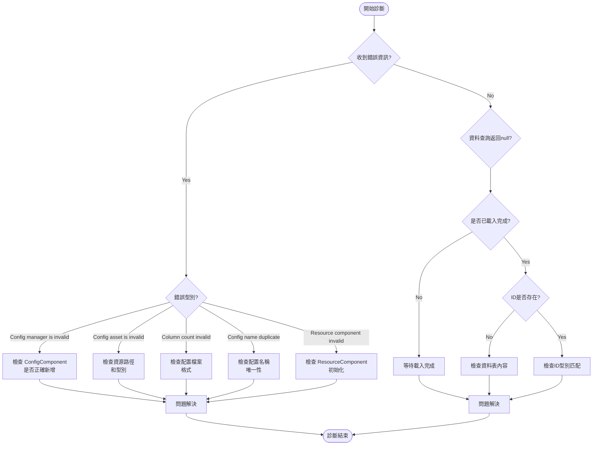

# 常見問題

本文件彙總了使用 Config 配置表組件時可能遇到的常見問題、錯誤資訊及其解決方案。

## 概述

Config 配置表組件為 Unity 遊戲提供了一套完整的配置資料管理解決方案。在實際使用過程中，開發者可能會遇到配置載入失敗、資料解析錯誤、組件未正確初始化等問題。本文件旨在幫助開發者快速定位和解決這些問題。

## 常見問題列表

### 1. Config Manager 未初始化

**錯誤資訊：**
```
Config manager is invalid.
```

**原因分析：**
此錯誤表示 `ConfigComponent` 在初始化時無法從 GameFrameworkEntry 獲取到 `IConfigManager` 模組。這通常發生在框架初始化順序不正確的情況下。

**解決方案：**

1. 確保在場景中正確新增了 `ConfigComponent` 組件：
```csharp
// 在 Unity 場景中新增 ConfigComponent
// GameObject -> Add Component -> GameFrameX -> Config
```

2. 確保 GameFramework 核心組件已正確初始化。檢查場景中是否存在 `GameEntry` 物件：
> 詳情請參考 [核心概念 - ConfigComponent](./4-core-concepts.config-component)

---

### 2. 配置資源型別無效

**錯誤資訊：**
```
Config asset 'xxx' is invalid.
```

**原因分析：**
此警告表示系統無法將載入的資產識別為有效的配置資源。可能原因包括：
- 資源路徑不正確
- 資源型別不是 `TextAsset` 或 `.bytes` 檔案
- 資原始檔損壞

**解決方案：**

1. 檢查配置檔案的路徑是否正確
2. 確保配置檔案是純文字檔案（`.txt`）或二進位制檔案（`.bytes`）
3. 驗證資源已正確打包到最終的遊戲構建中

---

### 3. 配置列數不匹配

**錯誤資訊：**
```
Can not parse config line string 'xxx' which column count is invalid.
```

**原因分析：**
在解析文字格式的配置檔案時，解析器期望每行有 4 列資料（使用 Tab 分隔）。如果列數不符合預期，解析將失敗。

配置檔案格式要求：
```
#ID    名稱    註釋    值
1      config1 示例     value1
2      config2 示例     value2
```

**解決方案：**

1. 檢查配置檔案的列數是否正確（應為 4 列）
2. 確保使用 Tab 字元作為列分隔符
3. 檢查是否有空行或格式不正確的行

> 詳情請參考 [配置選項 - 二進位制配置表](./6-configuration.binary-config)

---

### 4. 配置名稱重複或無效

**錯誤資訊：**
```
Can not add config with config name 'xxx' which may be invalid or duplicate.
```

**原因分析：**
此警告表示嘗試新增的配置名稱無效或已存在。每個配置名稱必須是唯一的。

**解決方案：**

1. 檢查是否存在重複的配置名稱
2. 確保配置名稱不為空字串
3. 使用唯一識別符號作為配置名稱

---

### 5. Resource Component 未找到

**錯誤資訊：**
```
Resource component is invalid.
```

**原因分析：**
`DefaultConfigHelper` 依賴 `ResourceComponent` 來載入配置資源。如果 `ResourceComponent` 未正確初始化，配置將無法載入。

**解決方案：**

1. 確保場景中存在 `ResourceComponent` 組件
2. 檢查資源系統的初始化順序
3. 確保資源包已正確載入

---

### 6. 二進位制配置表不生效

**問題描述：**
啟用 `ENABLE_BINARY_CONFIG` 宏定義後，二進位制配置表功能未生效。

**解決方案：**

1. 在 Unity 選單中啟用二進位制配置：
   - 開啟選單：`GameFrameX -> Scripting Define Symbols -> Enable Binary Config(開啟二進位制配置表)`

2. 確保配置副檔名為 `.bytes`

> 詳情請參考 [配置選項 - 指令碼宏定義](./6-configuration.scripting-define-symbols)

---

### 7. 資料表載入失敗

**問題描述：**
呼叫 `IDataTable.LoadAsync()` 方法後，資料未正確載入。

**排查步驟：**

1. 檢查非同步載入是否完成：
```csharp
// 正確等待載入完成
IDataTable<MyConfig> configTable = component.GetConfig<MyConfigTable>();
await configTable.LoadAsync();

// 檢查是否載入成功
if (component.HasConfig<MyConfigTable>()) {
    // 配置已載入
}
```

2. 檢查事件是否捕獲到錯誤：
> 詳情請參考 [API 參考 - 事件引數](./5-api-reference.event-args)

---

### 8. 資料查詢返回 null

**問題描述：**
使用 `TryGet` 方法查詢配置資料時，返回 `false` 或 `null`。

**可能原因：**

1. 資料表尚未載入完成
2. 查詢的 ID 不存在
3. 資料表型別不匹配

**解決方案：**

1. 確保在資料載入完成後再進行查詢
2. 使用 `HasConfig<T>()` 方法先檢查配置是否存在
3. 驗證查詢的 ID 型別（int/long/string）與資料表定義一致

```csharp
// 正確的資料查詢流程
var configTable = component.GetConfig<MyConfigTable>();
if (component.HasConfig<MyConfigTable>()) {
    if (configTable.TryGet(1, out var config)) {
        // 成功獲取配置
    }
}
```

---

## 診斷流程



## 除錯技巧

### 1. 啟用日誌除錯

Config 組件會輸出詳細的日誌資訊。在開發階段，確保日誌級別設定為 `Debug` 或 `Info`：

```csharp
// 在遊戲啟動時設定日誌級別
Log.SetLogHelper(new DebugLogHelper());
```

### 2. 使用事件監聽

監聽配置載入事件可以幫助快速定位問題：

```csharp
// 監聽配置載入成功事件
GameEntry.Event.Subscribe(LoadConfigSuccessEventArgs.EventId, OnLoadConfigSuccess);

// 監聽配置載入失敗事件
GameEntry.Event.Subscribe(LoadConfigFailureEventArgs.EventId, OnLoadConfigFailure);

private void OnLoadConfigSuccess(object sender, LoadConfigSuccessEventArgs e)
{
    UnityEngine.Debug.Log($"配置載入成功: {e.ConfigAssetName}, 耗時: {e.Duration}秒");
}

private void OnLoadConfigFailure(object sender, LoadConfigFailureEventArgs e)
{
    UnityEngine.Debug.LogError($"配置載入失敗: {e.ConfigAssetName}, 錯誤: {e.ErrorMessage}");
}
```

### 3. 檢查配置數量

在除錯時，可以檢查當前載入的配置數量：

```csharp
var configComponent = GameEntry.GetComponent<ConfigComponent>();
UnityEngine.Debug.Log($"當前配置數量: {configComponent.Count}");
```

---

## 最佳實踐

1. **始終使用 TryGet 方法**：避免使用已標記為 `[Obsolete]` 的 `Get` 方法
2. **檢查配置存在性**：在使用配置前先呼叫 `HasConfig<T>()` 方法
3. **非同步載入**：配置載入是非同步的，確保在載入完成後再使用資料
4. **錯誤處理**：訂閱載入失敗事件，以便及時發現和處理錯誤

---

## 相關連結

- [核心概念 - ConfigComponent](./4-core-concepts.config-component)
- [核心概念 - ConfigManager](./4-core-concepts.config-manager)
- [核心概念 - IDataTable](./4-core-concepts.idata-table)
- [API 參考 - 介面定義](./5-api-reference.interfaces)
- [API 參考 - 事件引數](./5-api-reference.event-args)
- [配置選項 - 二進位制配置表](./6-configuration.binary-config)
- [配置選項 - 指令碼宏定義](./6-configuration.scripting-define-symbols)
