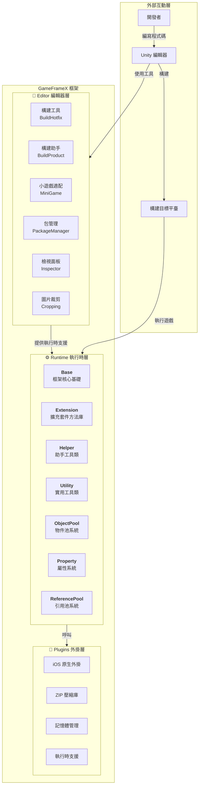
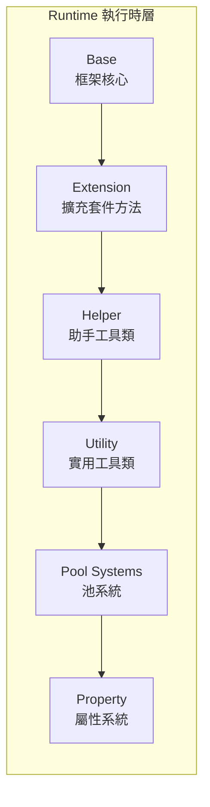

# 概述

GameFrameX 是一個專為獨立遊戲開發者設計的現代化 Unity 遊戲框架，提供完整的前後端一體化解決方案。框架採用**三層模組化架構**設計，內建豐富的遊戲開發工具和組件，幫助開發者快速構建高質量的遊戲專案。

> Source: [README.zh-CN.md](https://github.com/GameFrameX/com.gameframex.unity/blob/main/README.zh-CN.md#L1-L60)

---

## 專案簡介

GameFrameX 旨在為獨立遊戲開發者提供一個功能強大、易於使用、高度可擴充套件的遊戲開發框架。框架經過精心設計，能夠滿足從小型個人專案到中型商業遊戲的各種需求。

### 核心特性

| 特性 | 描述 |
|------|------|
| **三層架構** | Runtime（執行時）、Plugins（外掛）、Editor（編輯器）清晰分層 |
| **豐富工具集** | 內建多種開發輔助工具和編輯器擴充套件 |
| **物件池管理** | 高效的記憶體管理和物件複用機制 |
| **擴充套件方法庫** | 豐富的 Unity 引擎擴充套件方法 |
| **實用工具類** | 涵蓋加密、壓縮、網路等常用功能 |
| **多平臺支援** | 支援 PC、移動端、WebGL 等多平臺部署 |
| **熱更新支援** | 內建 HybridCLR 熱更新解決方案 |
| **小遊戲適配** | 一鍵切換多平臺小遊戲環境 |

### 系統要求

| 要求 | 規格 |
|------|------|
| **Unity 版本** | 2019.4 或更高版本 |
| **平臺支援** | Windows, macOS, Linux, iOS, Android, WebGL |
| **.NET 版本** | .NET Standard 2.0+ |

---

## 架構概覽

GameFrameX 採用清晰的三層架構設計，每個模組各司其職，協同工作。這種分層設計確保了程式碼的高內聚低耦合，便於維護和擴充套件。



### 架構設計理念

1. **模組化設計**：每個模組獨立負責特定功能，便於單獨測試和維護
2. **介面分離**：透過介面實現解耦，模組之間透過抽象進行通訊
3. **按需載入**：組件按需初始化，避免不必要的效能開銷
4. **可擴充套件性**：提供豐富的擴充套件點，開發者可以輕鬆新增自定義功能

---

## 核心模組詳解

### Runtime 執行時層

執行時核心程式碼，提供遊戲執行時所需的所有功能。



| 子模組 | 描述 | 主要功能 |
|--------|------|----------|
| **Base** | 框架核心基礎 | 組件管理、事件池、日誌系統、引用池、任務池、變數系統、生命週期管理、單例模式 |
| **Extension** | 擴充套件方法庫 | 通用擴充套件（字串、集合、日期）、Unity型別擴充套件（Transform、Vector）、序列讀取器、GameObject擴充套件 |
| **Helper** | 助手工具類 | 應用、相機、檔案、路徑、數學、隨機、計時器、網路、JSON、渲染、位置等全方位輔助功能 |
| **ObjectPool** | 物件池系統 | 物件複用、記憶體最佳化、效能提升 |
| **Property** | 屬性系統 | 可繫結屬性、資料監聽、MVVM 支援 |
| **ReferencePool** | 引用池系統 | 引用型別物件管理、GC 最佳化 |
| **Utility** | 實用工具類 | 加密解密（AES/RSA/DSA）、壓縮解壓、雜湊計算（MD5/SHA1/HMAC）、CRC校驗、JSON序列化、檔案操作、ID生成、型別轉換、文字處理、日誌等 |

### Plugins 外掛層

原生平臺外掛和第三方依賴庫。

| 子模組 | 描述 | 依賴庫 |
|--------|------|--------|
| **iOS 外掛** | iOS 原生平臺功能 | GameFrameX.mm |
| **壓縮庫** | ZIP 檔案壓縮/解壓 | SharpZipLib |
| **記憶體管理** | 高效記憶體操作 | StringTools, Memory, Buffers |
| **執行時支援** | .NET 執行時擴充套件 | CompilerServices.Unsafe |

### Editor 編輯器層

編輯器工具和擴充套件，提升開發效率。

| 子模組 | 描述 | 主要功能 |
|--------|------|----------|
| **BuildHotfix** | 熱更新構建 | HybridCLR 熱更新程式集構建和管理 |
| **BuildProduct** | 產品構建 | 構建流程自動化、前後置處理鉤子 |
| **BuildWebGLTools** | WebGL 構建 | WebGL 平臺專用構建工具 |
| **Cropping** | 圖片裁剪 | 視覺化圖片裁剪工具 |
| **Inspector** | 自定義檢視面板 | 物件池、引用池視覺化監控 |
| **InspectorLockShortcut** | 面板鎖定 | 快捷鍵鎖定 Inspector 面板 |
| **MiniGame** | 小遊戲適配 | 一鍵切換21個小遊戲平臺 |
| **PackageManager** | 包管理 | 視覺化包管理介面 |
| **UpdatePackages** | 包更新 | 批次更新專案依賴 |
| **Welcome** | 歡迎介面 | 新使用者引導和快速入口 |

---

## 平臺支援

### 作業系統平臺

| 平臺 | 狀態 | 支援版本 |
|------|------|----------|
| Windows | ✅ 已支援 | Unity 2019.4+ |
| macOS | ✅ 已支援 | Unity 2019.4+ |
| Linux | ✅ 已支援 | Unity 2019.4+ |
| iOS | ✅ 已支援 | Unity 2019.4+ |
| Android | ✅ 已支援 | Unity 2019.4+ |
| WebGL | ✅ 已支援 | Unity 2019.4+ |

### 小遊戲平臺適配

GameFrameX 提供一鍵切換的小遊戲平臺適配功能，支援**全球21個主流小遊戲平臺**：

#### 🇨🇳 國內小遊戲（9個）

微信、支付寶、抖音、快手、百度、京東、淘寶、美團、Bilibili

#### 🌍 國際小遊戲（7個）

Discord、YouTube、Facebook、Google Play、TikTok、CrazyGames、Poki

#### 📱 裝置廠商（4個）

華為、OPPO、vivo、小米

#### 🎮 遊戲平臺（1個）

TapTap

---

## 核心概念

### 遊戲入口

GameFrameX 使用 `GameEntry` 作為遊戲入口點，透過 `GameFrameworkEntry` 管理所有框架模組。

```csharp
using GameFrameX.Runtime;

// 獲取物件池組件
var objectPool = GameEntry.GetComponent<ObjectPoolComponent>();

// 獲取引用池組件
var referencePool = GameEntry.GetComponent<ReferencePoolComponent>();

// 使用擴充套件方法
transform.SetPositionX(10f);
gameObject.SetActiveOptimized(true);
```
> Source: [README.zh-CN.md](https://github.com/GameFrameX/com.gameframex.unity/blob/main/README.zh-CN.md#L366-L386)

### 組件系統

GameFrameX 採用組件化設計，所有功能都透過組件（Component）提供。組件繼承自 `GameFrameworkComponent` 基類，可以透過 `GameEntry.GetComponent<T>()` 方法獲取。

```csharp
public sealed class ObjectPoolComponent : GameFrameworkComponent
{
    // 物件池管理實現
}
```
> Source: [Runtime/ObjectPool/ObjectPoolComponent.cs](https://github.com/GameFrameX/com.gameframex.unity/blob/main/Runtime/ObjectPool/ObjectPoolComponent.cs#L45-L46)

### 模組系統

框架模組（Module）透過介面提供更高層次的抽象，支援按需建立和懶載入。

```csharp
public static T GetModule<T>() where T : class
{
    // 自動建立模組（如果不存在）
    return GetModule(moduleType) as T;
}
```
> Source: [Runtime/Base/GameFrameworkEntry.cs](https://github.com/GameFrameX/com.gameframex.unity/blob/main/Runtime/Base/GameFrameworkEntry.cs#L95-L120)

---

## 版本資訊

| 專案 | 資訊 |
|------|------|
| **包名** | com.gameframex.unity |
| **版本** | 1.10.0 |
| **Unity 版本** | 2019.4+ |
| **許可證** | MIT + Apache 2.0 |
| **作者** | Blank |

---

## 相關連結

- [📖 完整文件](https://gameframex.doc.alianblank.com)
- [🔧 安裝指南](./2-installation)
- [🚀 快速入門](./3-quick-start)
- [💡 核心概念](./4-core-concepts)
- [📦 執行時模組](./5-runtime.base)
- [🛠️ 編輯器工具](./6-editor-tools.build-tools)
- [🌐 平臺支援](./7-platforms)
- [📚 API 參考](./8-api-reference)
- [❓ 常見問題](./9-troubleshooting)

---

## 社群與支援

- 💬 **QQ 討論群**: 467608841
- 🐛 **問題反饋**: [GitHub Issues](https://github.com/GameFrameX/com.gameframex.unity/issues)
- 💡 **功能建議**: [GitHub Discussions](https://github.com/GameFrameX/com.gameframex.unity/discussions)

---

如果這個專案對你有幫助，請給我們一個 ⭐ Star！

