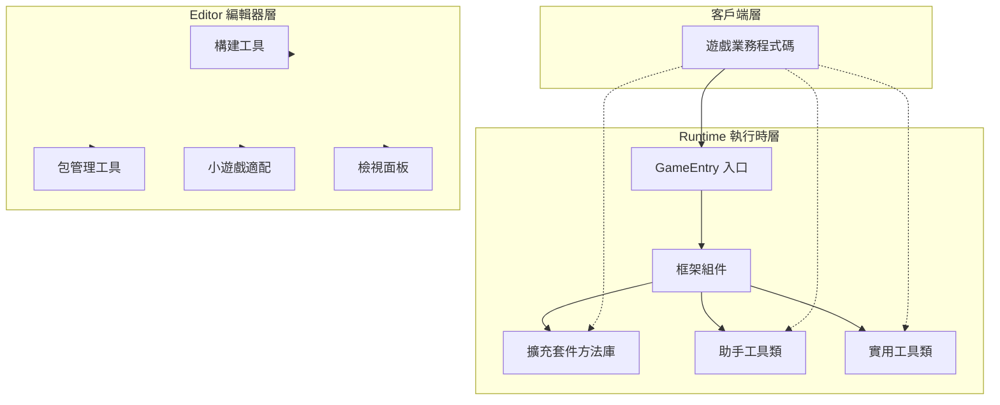
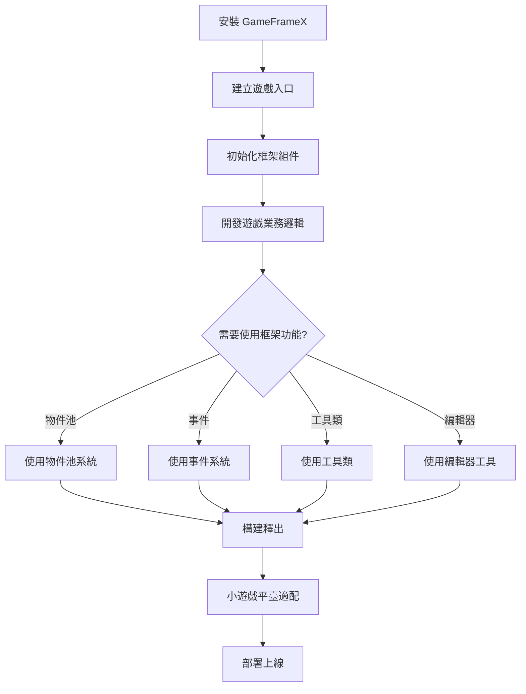
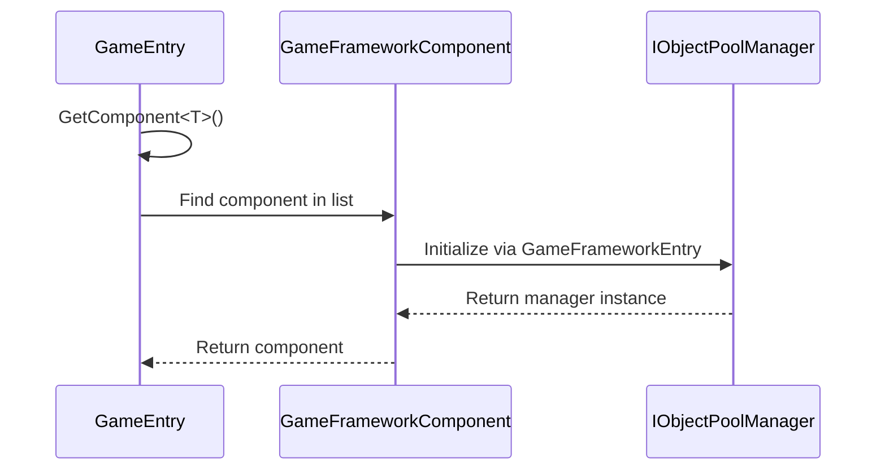

# 快速入門

GameFrameX 是一個專為獨立遊戲開發者設計的現代化 Unity 遊戲框架，採用三層模組化架構設計，提供完整的前後端一體化解決方案，幫助開發者快速構建高質量的遊戲專案。

## 概述

GameFrameX 框架提供了豐富的執行時組件和編輯器工具，包括：

- **物件池系統**：高效的記憶體管理和物件複用機制
- **事件系統**：基於釋出-訂閱模式的解耦通訊
- **引用池系統**：引用型別物件的記憶體最佳化
- **擴充套件方法庫**：豐富的 Unity 引擎擴充套件方法
- **實用工具類**：加密、壓縮、網路、JSON 等常用功能
- **編輯器工具**：構建工具、包管理、小遊戲平臺適配等

### 系統要求

| 要求 | 規格 |
|------|------|
| Unity 版本 | 2019.4 或更高 |
| .NET 版本 | .NET Standard 2.0+ |
| 支援平臺 | Windows, macOS, Linux, iOS, Android, WebGL |

## 架構概覽



## 安裝指南

### 方式一：Unity Package Manager（推薦）

1. 開啟 Unity 編輯器
2. 開啟 `Window` → `Package Manager`
3. 點選左上角的 `+` 按鈕
4. 選擇 `Add package from git URL`
5. 輸入: `https://github.com/GameFrameX/com.gameframex.unity.git`

### 方式二：手動下載

1. 下載最新的 [Release](https://github.com/GameFrameX/com.gameframex.unity/releases)
2. 解壓到專案的 `Packages` 目錄下

## 基礎使用

### 遊戲入口

GameFrameX 使用 `GameEntry` 作為靜態入口點來訪問所有框架組件：

```csharp
using GameFrameX.Runtime;

public class GameManager : MonoBehaviour
{
    void Start()
    {
        // 獲取物件池組件
        var objectPool = GameEntry.GetComponent<ObjectPoolComponent>();
        
        // 獲取引用池組件
        var referencePool = GameEntry.GetComponent<ReferencePoolComponent>();
        
        // 使用擴充套件方法
        transform.SetPositionX(10f);
        gameObject.SetActiveOptimized(true);
    }
}
```

> Source: [Runtime/Base/GameEntry.cs](https://github.com/GameFrameX/com.gameframex.unity/blob/main/Runtime/Base/GameEntry.cs#L46-L70)

### 框架組件

GameFrameX 提供多種框架組件，均可透過 `GameEntry.GetComponent<T>()` 獲取：

```csharp
// 物件池組件 - 高效管理可複用物件
var objectPool = GameEntry.GetComponent<ObjectPoolComponent>();

// 引用池組件 - 最佳化引用型別記憶體管理
var referencePool = GameEntry.GetComponent<ReferencePoolComponent>();
```

> Source: [Runtime/ObjectPool/ObjectPoolComponent.cs](https://github.com/GameFrameX/com.gameframex.unity/blob/main/Runtime/ObjectPool/ObjectPoolComponent.cs#L45-L72)

## 核心功能示例

### 物件池系統

物件池系統用於最佳化遊戲效能，避免頻繁建立和銷燬物件：

```csharp
// 獲取物件池組件
var objectPool = GameEntry.GetComponent<ObjectPoolComponent>();

// 建立物件池 (單次獲取模式)
objectPool.CreateSingleSpawnObjectPool<MyObject>("MyObjectPool", 10, 60f);

// 從池中獲取物件
var obj = objectPool.Spawn<MyObject>("MyObjectPool");

// 歸還物件到池中
objectPool.Unspawn(obj);

// 建立物件池 (多次獲取模式)
objectPool.CreateMultiSpawnObjectPool<MyObject>("MyObjectMultiPool", 100, 60f);

// 銷燬物件池
objectPool.DestroyPool("MyObjectPool");
```

### 擴充套件方法

GameFrameX 提供了豐富的擴充套件方法，簡化常見操作：

#### Transform 擴充套件

```csharp
// 設定位置分量
transform.SetPositionX(10f);
transform.SetPositionY(20f);
transform.SetPositionZ(30f);

// 設定區域性縮放分量
transform.SetLocalScaleX(2f);
transform.SetLocalScaleY(2f);
transform.SetLocalScaleZ(2f);

// 設定區域性縮放 XYZ
transform.SetLocalScaleXYZ(2f, 2f, 2f);

// 重置變換
transform.ResetTransformation();
```

> Source: [Runtime/Extension/UnityEngine.Transform/UnityEngine.TransformExtension.cs](https://github.com/GameFrameX/com.gameframex.unity/blob/main/Runtime/Extension/UnityEngine.Transform/UnityEngine.TransformExtension.cs#L55-L60)

#### Vector3 擴充套件

```csharp
Vector3 pos = transform.position;

// 建立新向量，修改指定分量
pos = pos.WithX(5f).WithY(10f);

// 向量運算擴充套件
Vector3 direction = Vector3.Right;
direction = direction.RotateBy(45f, Vector3.Up);
```

#### GameObject 擴充套件

```csharp
// 最佳化設定啟用狀態
gameObject.SetActiveOptimized(true);

// 遞迴設定層級
gameObject.SetLayerRecursively(LayerMask.NameToLayer("UI"));

// 獲取或新增組件
var component = gameObject.GetOrAddComponent<MyComponent>();
```

### 實用工具類

GameFrameX 提供靜態工具類，涵蓋各種常用功能：

#### 檔案操作

```csharp
// 寫入位元組陣列
Utility.File.WriteAllBytes("path/to/file", data);

// 讀取位元組陣列
byte[] content = Utility.File.ReadAllBytes("path/to/file");

// 寫入文字
Utility.File.WriteAllText("path/to/file", "content");

// 讀取文字
string text = Utility.File.ReadAllText("path/to/file");
```

#### AES 加密解密

```csharp
// AES 加密
string encrypted = Utility.Encryption.Aes.Encrypt("plaintext", "key");

// AES 解密
string decrypted = Utility.Encryption.Aes.Decrypt(encrypted, "key");
```

#### 雜湊計算

```csharp
// MD5 雜湊
string md5 = Utility.Hash.Md5.ComputeHash("input");

// SHA1 雜湊
string sha1 = Utility.Hash.Sha1.ComputeHash("input");

// HMAC SHA256
string hmac = Utility.Hash.HMACSha256.ComputeHash("input", "key");
```

#### JSON 序列化

```csharp
// 物件轉 JSON
string json = Utility.Json.ToJson(myObject);

// JSON 轉物件
var obj = Utility.Json.FromJson<MyClass>(json);
```

#### 壓縮解壓

```csharp
// 壓縮資料
byte[] compressed = Utility.Compression.Compress(data);

// 解壓資料
byte[] decompressed = Utility.Compression.Decompress(compressed);
```

### 事件系統

事件系統採用釋出-訂閱模式，實現組件間的解耦通訊：

```csharp
// 定義事件引數
public class PlayerDeadEventArgs : BaseEventArgs
{
    public int PlayerId { get; set; }
    public float Damage { get; set; }
    
    public static PlayerDeadEventArgs Create(int playerId, float damage)
    {
        var args = ReferencePool.Acquire<PlayerDeadEventArgs>();
        args.PlayerId = playerId;
        args.Damage = damage;
        return args;
    }
}

// 訂閱事件
GameEntry.Event.Subscribe(PlayerDeadEventArgs.EventId, OnPlayerDead);

// 傳送事件
GameEntry.Event.Fire(this, PlayerDeadEventArgs.Create(playerId, damage));

// 取消訂閱
GameEntry.Event.Unsubscribe(PlayerDeadEventArgs.EventId, OnPlayerDead);
```

> Source: [Runtime/Base/EventPool/EventPool.cs](https://github.com/GameFrameX/com.gameframex.unity/blob/main/Runtime/Base/EventPool/EventPool.cs)

## 編輯器工具

GameFrameX 提供豐富的編輯器工具，位於 `GameFrameX` 選單下：

### 構建工具

```
GameFrameX/
├── Build/
│   ├── Windows X64
│   ├── Windows X32
│   ├── Mac Os
│   ├── Linux
│   ├── iOS
│   ├── Android
│   └── WebGL
├── Build Hotfix
└── Build WebGL With HybridCLR
```

### 包管理工具

```
GameFrameX/
├── Package Manager (包管理器)
└── Update All Packages (更新所有包)
```

### 小遊戲平臺適配

GameFrameX 支援一鍵切換 **21 個主流小遊戲平臺**：

```
GameFrameX/
├── Scripting Define Symbols/
│   ├── Domestic Mini Games/
│   │   ├── Enable WeChat Mini Game
│   │   ├── Enable Alipay Mini Game
│   │   ├── Enable DouYin Mini Game
│   │   ├── Enable KuaiShou Mini Game
│   │   ├── Enable Baidu Mini Game
│   │   ├── Enable JingDong Mini Game
│   │   ├── Enable Meituan Mini Game
│   │   ├── Enable Taobao Mini Game
│   │   └── Enable Bilibili Mini Game
│   ├── International Mini Games/
│   │   ├── Enable Discord Mini Game
│   │   ├── Enable YouTube Mini Game
│   │   ├── Enable Facebook Mini Game
│   │   ├── Enable Google Play Mini Game
│   │   ├── Enable TikTok Mini Game
│   │   ├── Enable CrazyGames Mini Game
│   │   └── Enable Poki Mini Game
│   ├── Device OEMs/
│   │   ├── Enable Huawei Mini Game
│   │   ├── Enable OPPO Mini Game
│   │   ├── Enable Vivo Mini Game
│   │   └── Enable Xiaomi Mini Game
│   └── Game Platforms/
│       └── Enable TapTap Mini Game
```

### 日誌控制

```
GameFrameX/
├── Scripting Define Symbols/
│   ├── Disable All Logs
│   ├── Enable All Logs
│   ├── Enable Debug And Above Logs
│   ├── Enable Info And Above Logs
│   ├── Enable Warning And Above Logs
│   ├── Enable Error And Above Logs
│   └── Enable Fatal And Above Logs
```

### 實用工具

```
GameFrameX/
├── Open Folder/
│   ├── Data Path
│   ├── Persistent Data Path
│   ├── Streaming Assets Path
│   ├── Temporary Cache Path
│   └── Console Log Path
├── Cropping (圖片裁剪工具)
└── Welcome (歡迎視窗)
```

## 工作流程

### 典型遊戲開發流程



### 組件初始化流程



## 快速入門檢查清單

- [ ] 安裝 GameFrameX 包
- [ ] 瞭解 GameEntry 入口點
- [ ] 學習物件池系統的使用
- [ ] 掌握擴充套件方法的用法
- [ ] 熟悉實用工具類
- [ ] 使用編輯器工具提升效率
- [ ] 根據需要配置小遊戲平臺

## 相關連結

- [核心概念](./4-core-concepts) - 深入瞭解框架核心設計
- [執行時模組](./5-runtime.base) - 基礎組件詳解
- [事件系統](./5-runtime.event-system) - 事件驅動程式設計
- [物件池系統](./5-runtime.object-pool) - 效能最佳化
- [擴充套件方法庫](./5-runtime.extension-methods) - 擴充套件方法完整參考
- [實用工具類](./5-runtime.utility-classes) - 工具類詳解
- [編輯器工具](./6-editor-tools.build-tools) - 構建工具
- [小遊戲平臺適配](./6-editor-tools.mini-game-platform) - 21平臺支援
- [平臺支援](./7-platforms) - 多平臺部署指南
- [安裝指南](./2-installation) - 詳細安裝說明
