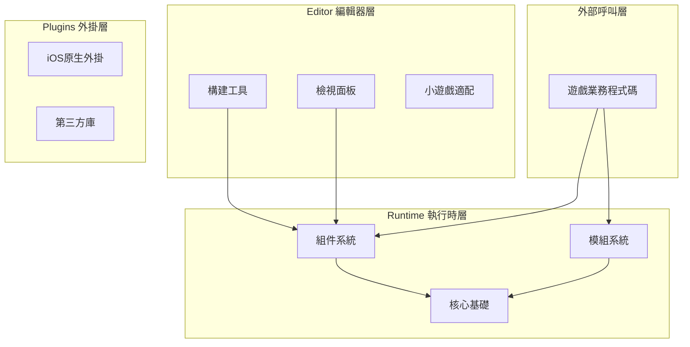
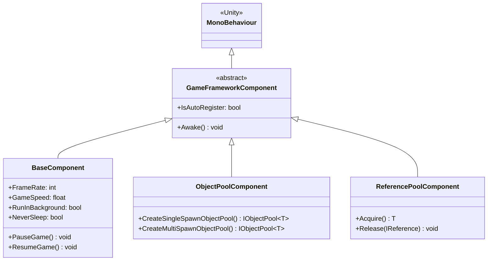
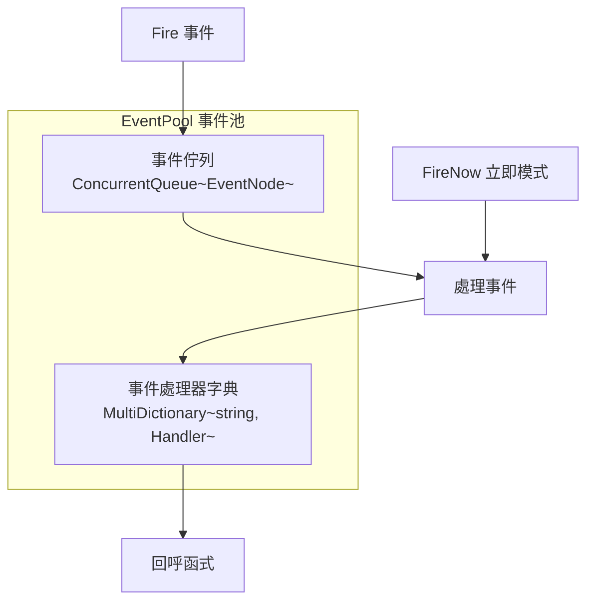
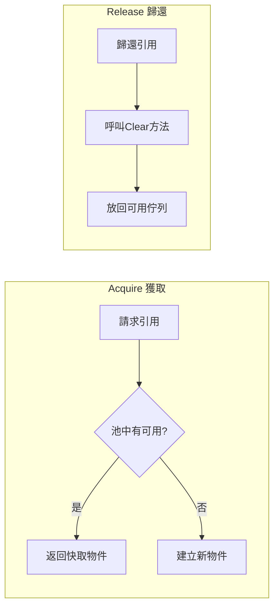

# 核心概念

GameFrameX 框架採用現代化的三層模組化架構設計，為獨立遊戲開發者提供完整的前後端一體化解決方案。本文件詳細介紹框架的核心概念、架構設計和關鍵設計模式。

## 概述

GameFrameX 是一個專為 Unity 遊戲開發者設計的現代化框架，其核心理念是透過模組化架構和豐富的內建工具，幫助開發者快速構建高質量的遊戲專案。框架採用**組件化設計**，將各種功能封裝為獨立的組件，開發者可以根據專案需求靈活組合使用。

### 設計目標

框架的設計遵循以下核心原則：

1. **模組化設計**：每個功能模組獨立封裝，透過介面進行通訊，便於替換和擴充套件
2. **效能優先**：透過物件池、引用池等技術最佳化記憶體分配，減少垃圾回收壓力
3. **開發效率**：提供豐富的擴充套件方法、工具類和編輯器工具，提升開發效率
4. **跨平臺支援**：支援 PC、移動端、WebGL 以及多種小遊戲平臺

### 系統架構

GameFrameX 框架採用清晰的三層架構設計：



## 核心組件系統

GameFrameX 的核心是組件系統，所有功能都透過組件的方式提供。組件系統分為兩大類：**組件（Component）** 和 **模組（Module）**。

### 組件（Component）

組件繼承自 `MonoBehaviour`，是附著在 GameObject 上的 Unity 組件。每個組件在遊戲啟動時自動註冊到 `GameEntry` 中，可以透過 `GameEntry.GetComponent<T>()` 方法獲取。



> Source: [GameFrameworkComponent.cs](https://github.com/GameFrameX/com.gameframex.unity/blob/main/Runtime/Base/GameFrameworkComponent.cs#L44-L95)

#### 組件序號產生器制

組件在 `Awake()` 方法中自動註冊到 `GameEntry`：

```csharp
protected virtual void Awake()
{
    GameEntry.RegisterComponent(this);
    if (IsAutoRegister)
    {
        GameFrameworkEntry.RegisterModule(InterfaceComponentType, ImplementationComponentType);
    }
}
```

> Source: [GameFrameworkComponent.cs](https://github.com/GameFrameX/com.gameframex.unity/blob/main/Runtime/Base/GameFrameworkComponent.cs#L85-L94)

### 模組（Module）

模組是純 C# 類，不依賴 Unity 的 `MonoBehaviour`，用於實現與 Unity 生命週期無關的邏輯服務。模組具有優先順序概念，在 `Update` 輪詢和 `Shutdown` 時按照優先順序順序執行。

```csharp
public abstract class GameFrameworkModule
{
    /// <summary>
    /// 獲取遊戲框架模組優先順序
    /// </summary>
    protected internal virtual int Priority
    {
        get { return 0; }
    }

    /// <summary>
    /// 遊戲框架模組輪詢
    /// </summary>
    protected internal abstract void Update(float elapseSeconds, float realElapseSeconds);

    /// <summary>
    /// 關閉並清理遊戲框架模組
    /// </summary>
    protected internal abstract void Shutdown();
}
```

> Source: [GameFrameworkModule.cs](https://github.com/GameFrameX/com.gameframex.unity/blob/main/Runtime/Base/GameFrameworkModule.cs#L40-L70)

### 框架入口（GameEntry）

`GameEntry` 是框架的靜態入口點，負責管理所有組件的註冊和獲取：

```csharp
public static class GameEntry
{
    private static readonly GameFrameworkLinkedList<GameFrameworkComponent> GameFrameworkComponents = new GameFrameworkLinkedList<GameFrameworkComponent>();

    /// <summary>
    /// 獲取遊戲框架組件
    /// </summary>
    public static T GetComponent<T>() where T : GameFrameworkComponent
    {
        return (T)GetComponent(typeof(T));
    }

    /// <summary>
    /// 註冊遊戲框架組件
    /// </summary>
    internal static void RegisterComponent(GameFrameworkComponent gameFrameworkComponent)
    {
        // 組件註冊邏輯...
    }
}
```

> Source: [GameEntry.cs](https://github.com/GameFrameX/com.gameframex.unity/blob/main/Runtime/Base/GameEntry.cs#L46-L195)

## 事件系統

GameFrameX 提供了功能強大的事件池系統，支援**執行緒安全的非同步事件分發**和**同步立即事件分發**兩種模式。事件系統採用釋出-訂閱模式，實現模組間的松耦合通訊。

### 事件池架構



### 事件使用示例

```csharp
// 定義事件引數
public class PlayerDeadEventArgs : BaseEventArgs
{
    public static int EventId => typeof(PlayerDeadEventArgs).GetHashCode();
    public int PlayerId { get; private set; }
    public float Damage { get; private set; }
    
    public static PlayerDeadEventArgs Create(int playerId, float damage)
    {
        var args = ReferencePool.Acquire<PlayerDeadEventArgs>();
        args.PlayerId = playerId;
        args.Damage = damage;
        return args;
    }
    
    public override void Clear()
    {
        PlayerId = 0;
        Damage = 0;
    }
}

// 訂閱事件
GameEntry.Event.Subscribe(PlayerDeadEventArgs.EventId, OnPlayerDead);

// 傳送事件（非同步，在下一幀處理）
GameEntry.Event.Fire(this, PlayerDeadEventArgs.Create(playerId, damage));

// 傳送事件（同步，立即處理）
GameEntry.Event.FireNow(this, PlayerDeadEventArgs.Create(playerId, damage));

// 取消訂閱
GameEntry.Event.Unsubscribe(PlayerDeadEventArgs.EventId, OnPlayerDead);
```

> Source: [EventPool.cs](https://github.com/GameFrameX/com.gameframex.unity/blob/main/Runtime/Base/EventPool/EventPool.cs#L200-L335)

### 事件池模式

事件池支援多種模式，可以透過組合來實現不同的行為：

| 模式 | 說明 |
|------|------|
| `AllowMultiHandler` | 允許同一事件有多個處理器 |
| `AllowDuplicateHandler` | 允許重複的處理器 |
| `AllowNoHandler` | 允許事件沒有處理器 |

```csharp
// 建立支援多處理器的事件池
var eventPool = new EventPool<MyEventArgs>(EventPoolMode.AllowMultiHandler | EventPoolMode.AllowDuplicateHandler);
```

> Source: [EventPoolMode.cs](https://github.com/GameFrameX/com.gameframex.unity/blob/main/Runtime/Base/EventPool/EventPoolMode.cs)

## 引用池系統

引用池是 GameFrameX 框架的核心記憶體最佳化技術之一，專門用於管理**非 Unity 物件**的記憶體分配。透過引用池，可以避免頻繁建立和銷燬物件帶來的垃圾回收壓力。

### 引用池原理



### 使用方式

任何需要使用引用池的類，都需要實現 `IReference` 介面：

```csharp
public class MyData : IReference
{
    public int Id { get; set; }
    public string Name { get; set; }
    public float Value { get; set; }
    
    // 必須實現 Clear 方法
    public void Clear()
    {
        Id = 0;
        Name = null;
        Value = 0;
    }
}

// 從引用池獲取物件
var data = ReferencePool.Acquire<MyData>();
data.Id = 1;
data.Name = "Test";
data.Value = 100f;

// 歸還到引用池
ReferencePool.Release(data);

// 新增預分配的引用
ReferencePool.Add<MyData>(10);
```

> Source: [ReferencePool.cs](https://github.com/GameFrameX/com.gameframex.unity/blob/main/Runtime/Base/ReferencePool/ReferencePool.cs#L120-L167)

## 物件池系統

物件池系統專門用於管理 **Unity 物件**（如 GameObject、Component）的複用，是遊戲開發中最佳化效能的重要手段。

### 物件池型別

| 型別 | 說明 | 適用場景 |
|------|------|----------|
| `SingleSpawnObjectPool` | 單次獲取池 | 子彈、道具等一次性物件 |
| `MultiSpawnObjectPool` | 多次獲取池 | NPC、UI 元素等可複用物件 |

### 使用示例

```csharp
// 建立物件池
var pool = GameEntry.ObjectPool.CreateMultiSpawnObjectPool<MyObject>("MyPool", 10, 60f, 100);

// 從池中獲取物件
var obj = pool.Spawn();

// 歸還物件到池中
pool.Unspawn(obj);

// 銷燬物件池
GameEntry.ObjectPool.DestroyObjectPool<MyObject>("MyPool");
```

> Source: [ObjectPoolComponent.cs](https://github.com/GameFrameX/com.gameframex.unity/blob/main/Runtime/ObjectPool/ObjectPoolComponent.cs#L650-L1045)

### 過期時間與自動釋放

物件池支援設定物件的過期時間，超時未使用的物件會自動釋放：

```csharp
// 建立帶過期時間的物件池（60秒後過期）
var pool = GameEntry.ObjectPool.CreateMultiSpawnObjectPool<MyObject>("ExpirePool", 60f);

// 設定自動釋放間隔（每30秒檢查一次）
pool.AutoReleaseInterval = 30f;
```

## 單例模式

GameFrameX 提供了兩種單例基類，分別用於不同的場景。

### 普通單例（GameFrameworkSingleton）

適用於純 C# 類，使用雙重鎖定檢查確保執行緒安全：

```csharp
public class MySingleton : GameFrameworkSingleton<MySingleton>
{
    public void DoSomething()
    {
        // 業務邏輯
    }
}

// 使用
MySingleton.Instance.DoSomething();
```

> Source: [GameFrameworkSingleton.cs](https://github.com/GameFrameX/com.gameframex.unity/blob/main/Runtime/Base/GameFrameworkSingleton.cs#L11-L46)

### Mono 單例（GameFrameworkMonoSingleton）

適用於需要掛載到 GameObject 上的組件：

```csharp
public class MyMonoSingleton : GameFrameworkMonoSingleton<MyMonoSingleton>
{
    protected override void OnWake()
    {
        // 初始化邏輯
    }
}

// 使用
MyMonoSingleton.Instance.DoSomething();
```

> Source: [GameFrameworkMonoSingleton.cs](https://github.com/GameFrameX/com.gameframex.unity/blob/main/Runtime/Base/GameFrameworkMonoSingleton.cs)

## 屬性系統

屬性系統（BindableProperty）為 MVVM 架構模式提供了支援，允許屬性值變化時自動通知觀察者。

### 可繫結屬性

```csharp
// 定義可繫結屬性
public BindableProperty<int> Score = new BindableProperty<int>(0);
public BindableProperty<string> PlayerName = new BindableProperty<string>("Player");

// 訂閱值變化事件
Score.Add(OnScoreChanged);
PlayerName.RegisterWithInitValue(OnNameChanged);

// 值變化時自動觸發回呼
Score.Value = 100;  // 觸發 OnScoreChanged(100)

// 移除事件
Score.Remove(OnScoreChanged);

// 清除所有事件
Score.Clear();
```

> Source: [BindableProperty.cs](https://github.com/GameFrameX/com.gameframex.unity/blob/main/Runtime/Property/BindableProperty.cs#L7-L89)

### MVVM 模式應用

BindableProperty 可以很好地支援 MVVM 架構：

```csharp
// Model - 資料模型
public class PlayerModel
{
    public BindableProperty<int> Health = new BindableProperty<int>(100);
    public BindableProperty<int> Mana = new BindableProperty<int>(50);
    public BindableProperty<Vector3> Position = new BindableProperty<Vector3>();
}

// ViewModel - 檢視模型
public class PlayerViewModel
{
    private readonly PlayerModel _model;
    
    public PlayerViewModel(PlayerModel model)
    {
        _model = model;
    }
    
    public void TakeDamage(int damage)
    {
        _model.Health.Value -= damage;
    }
}

// View - 檢視（在 UI 指令碼中）
public class PlayerHUD : MonoBehaviour
{
    public Text healthText;
    private PlayerModel _model;
    
    public void Bind(PlayerModel model)
    {
        _model = model;
        _model.Health.RegisterWithInitValue(OnHealthChanged);
    }
    
    private void OnHealthChanged(int health)
    {
        healthText.text = $"HP: {health}";
    }
}
```

## 擴充套件方法庫

GameFrameX 提供了豐富的擴充套件方法庫，涵蓋字串、集合、日期時間、Unity 型別等多個領域。

### Transform 擴充套件

```csharp
// 設定位置分量
transform.SetPositionX(10f);
transform.SetPositionY(20f);
transform.SetPositionZ(30f);

// 批次設定
transform.SetLocalScaleXYZ(2f, 2f, 2f);

// 重置變換
transform.ResetTransformation();

// 查詢子物體
var child = transform.FindChildRecursive("ChildName");
```

### Vector 擴充套件

```csharp
Vector3 pos = transform.position;
pos = pos.WithX(5f).WithY(10f);  // 建立新值，保留其他分量
Vector3 direction = pos.NormalizeTo();
float angle = transform.forward.AngleTo(Vector3.forward);
```

### GameObject 擴充套件

```csharp
// 最佳化的啟用/禁用
gameObject.SetActiveOptimized(true);

// 遞迴設定層級
gameObject.SetLayerRecursively(LayerMask.NameToLayer("UI"));

// 獲取或新增組件
var component = gameObject.GetOrAddComponent<MyComponent>();
```

> Source: [UnityEngage.GameObjectExtension.cs](https://github.com/GameFrameX/com.gameframex.unity/blob/main/Runtime/Extension/UnityEngage.GameObject/UnityEngage.GameObjectExtension.cs)

## 實用工具類

框架提供了全面的工具類，涵蓋加密、壓縮、檔案操作、網路等多個方面。

### 加密解密

```csharp
// AES 加密
string encrypted = Utility.Encryption.Aes.Encrypt("plaintext", "key");
string decrypted = Utility.Encryption.Aes.Decrypt(encrypted, "key");

// MD5 雜湊
string md5 = Utility.Hash.Md5.ComputeHash("input");

// SHA1 雜湊
string sha1 = Utility.Hash.Sha1.ComputeHash("input");
```

### 檔案操作

```csharp
// 讀取檔案
byte[] data = Utility.File.ReadAllBytes("path/to/file");
string content = Utility.File.ReadAllString("path/to/file");

// 寫入檔案
Utility.File.WriteAllBytes("path/to/file", data);
Utility.File.WriteAllString("path/to/file", content);
```

### JSON 序列化

```csharp
// 物件轉 JSON
string json = Utility.Json.ToJson(myObject);

// JSON 轉物件
var obj = Utility.Json.FromJson<MyClass>(json);
```

## 相關連結

- [基礎組件](./5-runtime.base)
- [事件系統](./5-runtime.event-system)
- [物件池系統](./5-runtime.object-pool)
- [引用池系統](./5-runtime.reference-pool)
- [屬性系統](./5-runtime.property-system)
- [擴充套件方法庫](./5-runtime.extension-methods)
- [工具類](./5-runtime.utility-classes)
- [API 參考](./8-api-reference)
