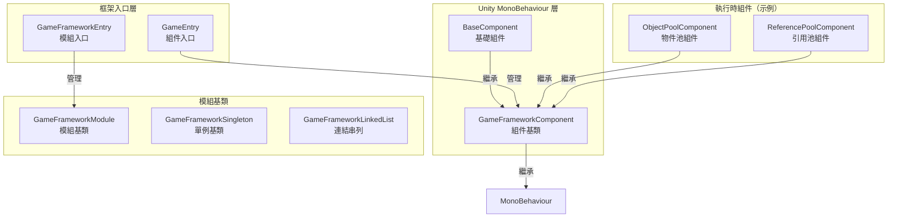
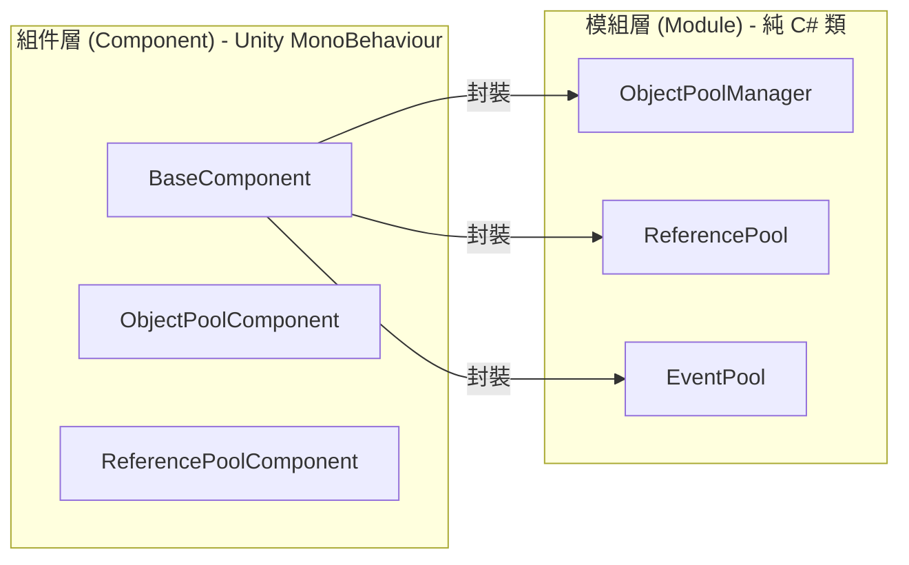
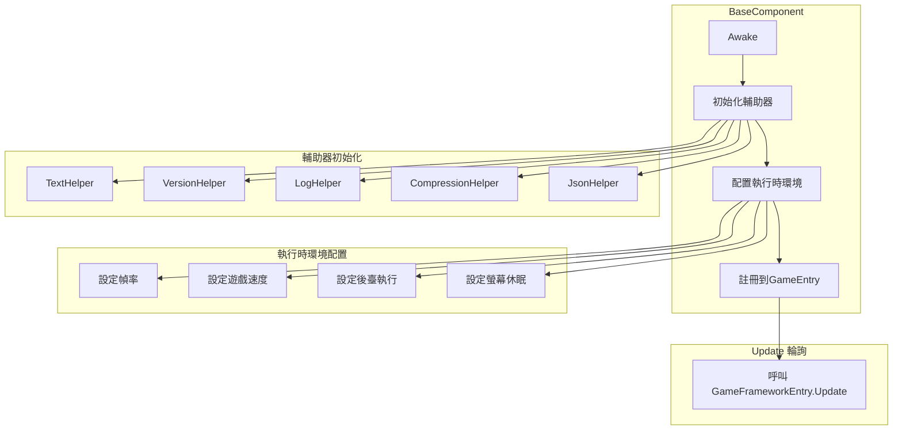
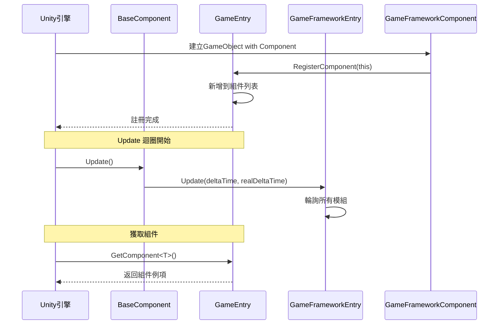

# 基礎組件

基礎組件是 GameFrameX 框架的核心底層架構，提供了遊戲執行時所需的基礎功能和組件管理機制。它們構成了整個框架的支柱，其他所有功能模組都依賴於這些基礎組件。

## 概述

GameFrameX 的基礎組件位於 `Runtime/Base` 目錄下，包含了框架的核心入口、組件基類、模組基類以及基礎資料結構。這些組件負責：

- **遊戲執行時環境配置**：幀率、遊戲速度、後臺執行、螢幕休眠等
- **組件生命週期管理**：註冊、獲取、銷燬
- **模組系統**：模組的建立、輪詢、關閉
- **單例與資料結構**：提供常用的設計模式實現

### 核心類關係



## 架構詳解

### 組件系統架構

GameFrameX 採用雙層架構設計：組件層（Component）和模組層（Module）。



**設計意圖：**
- **組件層**繼承自 `MonoBehaviour`，可以直接掛載到 Unity 場景中的 GameObject 上
- **模組層**是純 C# 類，負責具體的業務邏輯實現
- 組件層作為模組層的門面（Facade），對外提供統一的訪問方式

### BaseComponent 詳解

`BaseComponent` 是框架的核心組件，必須掛載在場景中。它負責初始化遊戲執行時環境和各種輔助工具。



### 組件註冊與獲取流程



## 核心功能

### 1. 執行時環境控制

BaseComponent 提供了對遊戲執行時環境的全面控制能力：

| 功能 | 屬性 | 說明 |
|------|------|------|
| 幀率控制 | `FrameRate` | 設定 `Application.targetFrameRate` |
| 遊戲速度 | `GameSpeed` | 控制 `Time.timeScale`，支援慢動作 |
| 暫停狀態 | `IsGamePaused` | 讀取遊戲是否已暫停 |
| 正常速度 | `IsNormalGameSpeed` | 檢查是否以1x速度執行 |
| 後臺執行 | `RunInBackground` | 設定 `Application.runInBackground` |
| 螢幕休眠 | `NeverSleep` | 控制 `Screen.sleepTimeout` |

**程式碼示例：**

```csharp
// 獲取基礎組件
var baseComponent = GameEntry.GetComponent<BaseComponent>();

// 控制幀率
baseComponent.FrameRate = 60;

// 暫停遊戲
baseComponent.PauseGame();

// 恢復遊戲
baseComponent.ResumeGame();

// 禁止休眠
baseComponent.NeverSleep = true;
```
> Source: [BaseComponent.cs](https://github.com/GameFrameX/com.gameframex.unity/blob/main/Runtime/Base/BaseComponent.cs#L220-L243)

### 2. 組件訪問

透過 `GameEntry` 靜態類可以訪問所有已註冊的框架組件：

```csharp
// 透過泛型獲取組件
var baseComponent = GameEntry.GetComponent<BaseComponent>();
var objectPool = GameEntry.GetComponent<ObjectPoolComponent>();

// 透過型別獲取組件
var component = GameEntry.GetComponent(typeof(BaseComponent));

// 透過型別名稱獲取組件
var component = GameEntry.GetComponent("BaseComponent");
```
> Source: [GameEntry.cs](https://github.com/GameFrameX/com.gameframex.unity/blob/main/Runtime/Base/GameEntry.cs#L67-L121)

### 3. 模組管理

`GameFrameworkEntry` 負責管理所有框架模組的建立、輪詢和銷燬：

```csharp
// 獲取模組（透過介面）
var module = GameFrameworkEntry.GetModule<IObjectPoolManager>();

// 模組會自動按優先順序排序
// Update 會在每一幀被呼叫
```
> Source: [GameFrameworkEntry.cs](https://github.com/GameFrameX/com.gameframex.unity/blob/main/Runtime/Base/GameFrameworkEntry.cs#L95-L120)

### 4. 框架關閉

框架支援三種關閉模式：

```csharp
// 僅關閉框架（不退出）
GameEntry.Shutdown(ShutdownType.None);

// 關閉並重啟遊戲
GameEntry.Shutdown(ShutdownType.Restart);

// 關閉並退出遊戲
GameEntry.Shutdown(ShutdownType.Quit);
```
> Source: [ShutdownType.cs](https://github.com/GameFrameX/com.gameframex.unity/blob/main/Runtime/Base/ShutdownType.cs#L41-L66)

## 基礎資料結構

### 單例模式

GameFrameX 提供了執行緒安全的單例基類：

```csharp
public class MySingleton : GameFrameworkSingleton<MySingleton>
{
    public void DoSomething()
    {
        // 單例方法
    }
}

// 使用
MySingleton.Instance.DoSomething();
```
> Source: [GameFrameworkSingleton.cs](https://github.com/GameFrameX/com.gameframex.unity/blob/main/Runtime/Base/GameFrameworkSingleton.cs#L1-L47)

### 連結串列資料結構

自定義連結串列實現，帶有節點快取機制：

```csharp
var list = new GameFrameworkLinkedList<GameFrameworkComponent>();
list.AddLast(component);
var node = list.First;
// ... 使用連結串列
```
> Source: [GameFrameworkLinkedList.cs](https://github.com/GameFrameX/com.gameframex.unity/blob/main/Runtime/Base/GameFrameworkLinkedList.cs#L47-L59)

## 配置選項

在 Unity 編輯器中，BaseComponent 提供了以下可配置項：

| 配置項 | 型別 | 預設值 | 說明 |
|--------|------|--------|------|
| TextHelperTypeName | string | "UnityGameFramework.Runtime.DefaultTextHelper" | 文字輔助器型別 |
| VersionHelperTypeName | string | "UnityGameFramework.Runtime.DefaultVersionHelper" | 版本輔助器型別 |
| LogHelperTypeName | string | "UnityGameFramework.Runtime.DefaultLogHelper" | 日誌輔助器型別 |
| CompressionHelperTypeName | string | "UnityGameFramework.Runtime.DefaultCompressionHelper" | 壓縮輔助器型別 |
| JsonHelperTypeName | string | "UnityGameFramework.Runtime.DefaultJsonHelper" | JSON輔助器型別 |
| FrameRate | int | 30 | 遊戲目標幀率 |
| GameSpeed | float | 1f | 遊戲執行速度 |
| RunInBackground | bool | true | 是否允許後臺執行 |
| NeverSleep | bool | true | 是否禁止螢幕休眠 |

## API 參考

### `BaseComponent`

遊戲基礎組件，提供執行時環境配置。

#### 屬性

| 屬性 | 型別 | 說明 |
|------|------|------|
| `FrameRate` | int | 獲取或設定遊戲幀率 |
| `GameSpeed` | float | 獲取或設定遊戲速度 |
| `IsGamePaused` | bool | 獲取遊戲是否已暫停 |
| `IsNormalGameSpeed` | bool | 獲取遊戲是否以正常速度執行 |
| `RunInBackground` | bool | 獲取或設定是否允許後臺執行 |
| `NeverSleep` | bool | 獲取或設定是否禁止休眠 |

#### 方法

| 方法 | 返回型別 | 說明 |
|------|----------|------|
| `PauseGame()` | void | 暫停遊戲 |
| `ResumeGame()` | void | 恢復遊戲 |
| `ResetNormalGameSpeed()` | void | 重置為正常遊戲速度 |

### `GameEntry`

框架組件訪問入口點。

#### 方法

| 方法 | 返回型別 | 說明 |
|------|----------|------|
| `GetComponent<T>()` | T | 獲取指定型別的組件 |
| `GetComponent(Type)` | GameFrameworkComponent | 透過型別獲取組件 |
| `GetComponent(string)` | GameFrameworkComponent | 透過型別名稱獲取組件 |
| `Shutdown(ShutdownType)` | void | 關閉框架 |

### `GameFrameworkEntry`

框架模組管理入口。

#### 方法

| 方法 | 返回型別 | 說明 |
|------|----------|------|
| `GetModule<T>()` | T | 獲取指定介面的模組 |
| `GetModule(Type)` | GameFrameworkModule | 透過型別獲取模組 |
| `Update(float, float)` | void | 輪詢所有模組 |
| `Shutdown()` | void | 關閉所有模組 |

### `GameFrameworkComponent`

組件抽象基類。

#### 屬性

| 屬性 | 型別 | 說明 |
|------|------|------|
| `IsAutoRegister` | bool | 獲取或設定是否自動註冊 |
| `ImplementationComponentType` | Type | 實現類型別 |
| `InterfaceComponentType` | Type | 介面類型別 |

### `GameFrameworkModule`

模組抽象基類。

#### 屬性

| 屬性 | 型別 | 說明 |
|------|------|------|
| `Priority` | int | 模組優先順序，優先順序高的先輪詢 |

#### 方法

| 方法 | 返回型別 | 說明 |
|------|----------|------|
| `Update(float, float)` | void | 輪詢模組 |
| `Shutdown()` | void | 關閉並清理模組 |

## 使用示例

### 初始化框架

1. 在 Unity 場景中建立一個空 GameObject，命名為 "GameFrame"
2. 新增 `BaseComponent` 組件
3. 根據需要配置各項引數
4. 執行遊戲

```csharp
// GameEntry.cs 會被自動建立
// BaseComponent 在 Awake 中完成初始化
```
> Source: [BaseComponent.cs](https://github.com/GameFrameX/com.gameframex.unity/blob/main/Runtime/Base/BaseComponent.cs#L153-L192)

### 暫停/恢復遊戲

```csharp
var baseComponent = GameEntry.GetComponent<BaseComponent>();

// 暫停遊戲（時間靜止）
baseComponent.PauseGame();

// 檢查是否暫停
if (baseComponent.IsGamePaused)
{
    Debug.Log("遊戲已暫停");
}

// 恢復遊戲
baseComponent.ResumeGame();

// 或者重置為正常速度
baseComponent.ResetNormalGameSpeed();
```
> Source: [BaseComponent.cs](https://github.com/GameFrameX/com.gameframex.unity/blob/main/Runtime/Base/BaseComponent.cs#L216-L257)

### 建立自定義模組

```csharp
public interface IMyModule : GameFramework.IModule
{
    void DoSomething();
}

public class MyModule : GameFrameworkModule, IMyModule
{
    // 優先順序：數值越大越先被處理
    internal override int Priority => 10;

    // 每幀輪詢
    protected internal override void Update(float elapseSeconds, float realElapseSeconds)
    {
        // 輪詢邏輯
    }

    // 關閉時清理資源
    protected internal override void Shutdown()
    {
        // 清理邏輯
    }

    public void DoSomething()
    {
        // 業務邏輯
    }
}
```
> Source: [GameFrameworkModule.cs](https://github.com/GameFrameX/com.gameframex.unity/blob/main/Runtime/Base/GameFrameworkModule.cs#L40-L70)

## 相關連結

- [事件系統](./5-runtime.event-system) - 框架內建的事件系統
- [物件池系統](./5-runtime.object-pool) - 物件池管理
- [引用池系統](./5-runtime.reference-pool) - 引用池管理
- [任務池系統](./5-runtime.task-pool) - 非同步任務管理
- [擴充套件方法庫](./5-runtime.extension-methods) - 常用擴充套件方法
- [API 參考](./8-api-reference) - 完整 API 文件
