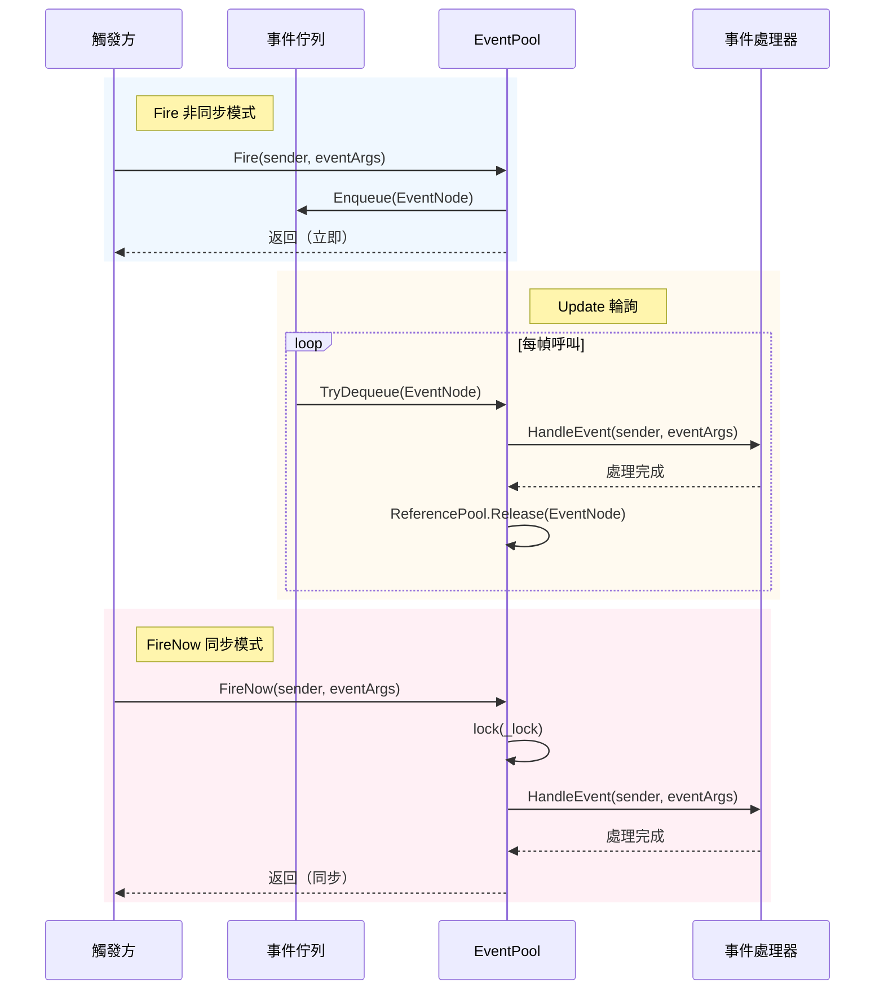
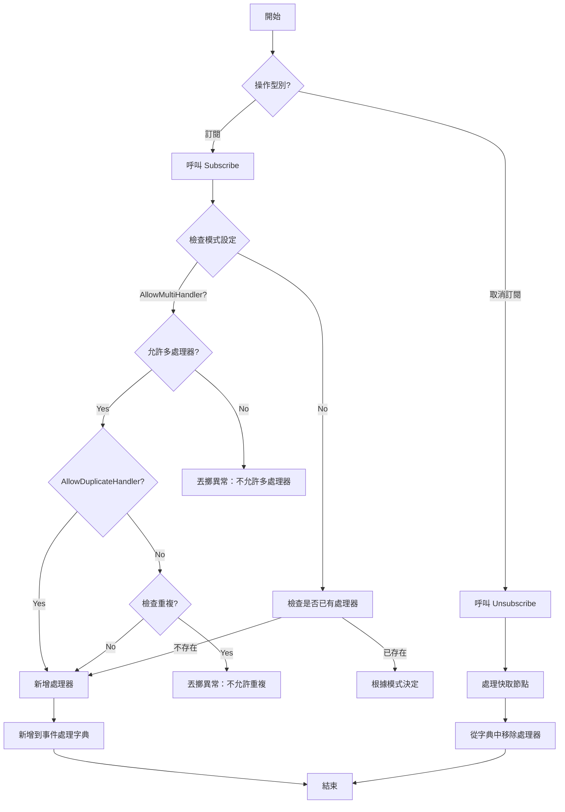

# 事件系統

GameFrameX 事件系統是一個輕量級、高效能的跨組件通訊解決方案，採用釋出-訂閱模式實現解耦。

## 概述

事件系統是 GameFrameX 框架的核心模組之一，提供了一套完整的遊戲事件管理機制。它採用**釋出-訂閱（Publish-Subscribe）模式**，允許遊戲中的不同模組在不直接相互依賴的情況下進行通訊。

### 核心特性

- **泛型事件池**：基於 `EventPool<T>` 泛型類，支援型別安全的事件處理
- **執行緒安全**：支援在後臺執行緒觸發事件，在主執行緒回呼處理
- **雙模式分發**：支援非同步佇列模式（`Fire`）和同步立即模式（`FireNow`）
- **靈活配置**：透過 `EventPoolMode` 標誌列舉，可配置是否允許多處理器、重複處理器等
- **記憶體最佳化**：使用引用池技術複用事件節點，減少垃圾回收壓力

### 適用場景

- UI 與遊戲邏輯的解耦通訊
- 模組間的松耦合互動
- 非同步事件處理（如網路響應、資源載入完成等）
- 多模組狀態同步

## 架構

```mermaid
classDiagram
    class GameFrameworkEventArgs {
        <<abstract>>
        +Clear() void
    }
    
    class BaseEventArgs {
        <<abstract>>
        +Id: string { get }
    }
    
    class EventPoolMode {
        <<enum>>
        +Default
        +AllowNoHandler
        +AllowMultiHandler
        +AllowDuplicateHandler
    }
    
    class EventPool~T~ {
        -_lock: object
        -_eventHandlers: GameFrameworkMultiDictionary
        -_events: ConcurrentQueue~EventNode~
        -_eventPoolMode: EventPoolMode
        +Subscribe(id, handler) void
        +Unsubscribe(id, handler) void
        +Fire(sender, e) void
        +FireNow(sender, e) void
        +Update(elapseSeconds, realElapseSeconds) void
    }
    
    class EventNode {
        <<internal>>
        -_sender: object
        -_eventArgs: T
        +Sender: object
        +EventArgs: T
        +Create(sender, e): EventNode
        +Clear() void
    }
    
    GameFrameworkEventArgs <|-- BaseEventArgs
    BaseEventArgs <|-- T
    EventPoolMode --* EventPool
    EventPool *-- EventNode
    EventNode ..> T
```

### 組件說明

| 組件 | 說明 |
|------|------|
| `GameFrameworkEventArgs` | 所有事件引數的基類，繼承自 `EventArgs` 並實現 `IReference` 介面 |
| `BaseEventArgs` | 框架事件引數基類，定義了事件 ID 屬性 |
| `EventPool<T>` | 泛型事件池，管理特定型別事件的訂閱、取消訂閱和分發 |
| `EventNode` | 內部類，用於包裝事件以進行佇列處理 |
| `EventPoolMode` | 事件池模式列舉，控制事件處理行為 |

## 核心概念

### 事件引數

所有自定義事件引數必須繼承自 `BaseEventArgs`，並實現 `Id` 屬性以標識事件型別。

```csharp
public sealed class PlayerhpChangedEventArgs : BaseEventArgs
{
    public override string Id => "PlayerHpChanged";
    
    public int OldHp { get; private set; }
    public int NewHp { get; private set; }
    
    public static PlayerHpChangedEventArgs Create(int oldHp, int newHp)
    {
        var args = ReferencePool.Acquire<PlayerHpChangedEventArgs>();
        args.OldHp = oldHp;
        args.NewHp = newHp;
        return args;
    }
    
    public override void Clear()
    {
        OldHp = 0;
        NewHp = 0;
    }
}
```

> Source: [BaseEventArgs.cs](https://github.com/GameFrameX/com.gameframex.unity/blob/main/Runtime/Base/EventPool/BaseEventArgs.cs#L34-L54)

### 事件池模式

`EventPoolMode` 是 flags 列舉，支援以下選項：

| 模式 | 說明 |
|------|------|
| `Default` | 預設模式，必須存在且僅一個事件處理函式 |
| `AllowNoHandler` | 允許不存在事件處理函式時丟擲事件 |
| `AllowMultiHandler` | 允許存在多個事件處理函式 |
| `AllowDuplicateHandler` | 允許重複的事件處理函式（需配合 AllowMultiHandler） |

```csharp
[Flags]
public enum EventPoolMode : byte
{
    Default = 0,
    AllowNoHandler = 1,
    AllowMultiHandler = 2,
    AllowDuplicateHandler = 4
}
```

> Source: [EventPoolMode.cs](https://github.com/GameFrameX/com.gameframex.unity/blob/main/Runtime/Base/EventPool/EventPoolMode.cs#L37-L77)

## 工作流程

### 事件分發流程



### 事件訂閱與取消訂閱



## 使用示例

### 基本用法

#### 1. 定義事件引數

```csharp
public sealed class ScoreChangedEventArgs : BaseEventArgs
{
    public override string Id => "ScoreChanged";
    
    public int OldScore { get; private set; }
    public int NewScore { get; private set; }
    
    public static ScoreChangedEventArgs Create(int oldScore, int newScore)
    {
        var args = ReferencePool.Acquire<ScoreChangedEventArgs>();
        args.OldScore = oldScore;
        args.NewScore = newScore;
        return args;
    }
    
    public override void Clear()
    {
        OldScore = 0;
        NewScore = 0;
    }
}
```

#### 2. 建立事件池並訂閱

```csharp
// 建立事件池（支援多處理器）
var eventPool = new EventPool<ScoreChangedEventArgs>(EventPoolMode.AllowMultiHandler);

// 訂閱事件
EventHandler<ScoreChangedEventArgs> handler = (sender, e) =>
{
    Debug.Log($"分數變化: {e.OldScore} -> {e.NewScore}");
};
eventPool.Subscribe("ScoreChanged", handler);

// 觸發事件（非同步，在下一幀處理）
eventPool.Fire(this, ScoreChangedEventArgs.Create(100, 150));

// 觸發事件（同步，立即處理）
eventPool.FireNow(this, ScoreChangedEventArgs.Create(150, 200));

// 取消訂閱
eventPool.Unsubscribe("ScoreChanged", handler);
```

> Source: [EventPool.cs](https://github.com/GameFrameX/com.gameframex.unity/blob/main/Runtime/Base/EventPool/EventPool.cs#L200-L335)

#### 3. 在 Update 中輪詢處理事件

```csharp
private EventPool<ScoreChangedEventArgs> _eventPool;

void Update(float elapseSeconds, float realElapseSeconds)
{
    // 必須定期呼叫 Update 處理佇列中的事件
    _eventPool.Update(elapseSeconds, realElapseSeconds);
}
```

### 高階用法

#### 設定預設處理器

當事件沒有註冊任何處理器時，預設處理器會被呼叫：

```csharp
var eventPool = new EventPool<ScoreChangedEventArgs>(EventPoolMode.AllowNoHandler);

eventPool.SetDefaultHandler((sender, e) =>
{
    Debug.Log($"預設處理器: 分數變化 {e.OldScore} -> {e.NewScore}");
});

// 即使沒有訂閱者，也會呼叫預設處理器
eventPool.Fire(this, ScoreChangedEventArgs.Create(0, 100));
```

#### 組合模式

可以組合多個模式標誌：

```csharp
// 允許多處理器且允許無處理器
var mode = EventPoolMode.AllowMultiHandler | EventPoolMode.AllowNoHandler;
var eventPool = new EventPool<ScoreChangedEventArgs>(mode);
```

#### 執行緒安全事件觸發

在後臺執行緒中安全地觸發事件，事件會在主執行緒的 Update 中處理：

```csharp
// 在後臺執行緒中觸發
Task.Run(() =>
{
    // 執行緒安全 - 事件會被加入佇列
    eventPool.Fire(networkClient, ScoreChangedEventArgs.Create(oldScore, newScore));
});

// 在主執行緒的 Update 中處理
void Update(float elapseSeconds, float realElapseSeconds)
{
    eventPool.Update(elapseSeconds, realElapseSeconds);
}
```

## API 參考

### EventPool<T>

泛型事件池類，管理特定型別事件的訂閱、取消訂閱和分發。

#### 建構函式

```csharp
public EventPool(EventPoolMode mode)
```

**引數：**
- `mode` (EventPoolMode): 事件池模式，控制處理器行為

**示例：**
```csharp
var eventPool = new EventPool<ScoreChangedEventArgs>(EventPoolMode.Default);
```

#### 屬性

| 屬性 | 型別 | 說明 |
|------|------|------|
| `EventHandlerCount` | int | 獲取已註冊的事件處理函式數量 |
| `EventCount` | int | 獲取佇列中等待處理的事件數量 |

#### 方法

##### Subscribe

訂閱事件處理函式。

```csharp
public void Subscribe(string id, EventHandler<T> handler)
```

**引數：**
- `id` (string): 事件型別標識
- `handler` (EventHandler<T>): 要訂閱的事件處理函式

**異常：**
- `GameFrameworkException`: 當不允許多處理器但已存在處理器，或不允許重複處理器時

---

##### Unsubscribe

取消訂閱事件處理函式。

```csharp
public void Unsubscribe(string id, EventHandler<T> handler)
```

**引數：**
- `id` (string): 事件型別標識
- `handler` (EventHandler<T>): 要取消訂閱的事件處理函式

---

##### Fire

以非同步模式觸發事件（執行緒安全，事件在下一幀分發）。

```csharp
public void Fire(object sender, T e)
```

**引數：**
- `sender` (object): 事件傳送者
- `e` (T): 事件引數

**異常：**
- `GameFrameworkException`: 當事件引數為空時

---

##### FireNow

以同步模式立即觸發事件（非執行緒安全）。

```csharp
public void FireNow(object sender, T e)
```

**引數：**
- `sender` (object): 事件傳送者
- `e` (T): 事件引數

---

##### Update

輪詢並處理佇列中的所有事件。

```csharp
public void Update(float elapseSeconds, float realElapseSeconds)
```

**引數：**
- `elapseSeconds` (float): 邏輯流逝時間（秒）
- `realElapseSeconds` (float): 真實流逝時間（秒）

---

##### Shutdown

關閉並清理事件池。

```csharp
public void Shutdown()
```

---

##### Check

檢查是否存在指定的事件處理函式。

```csharp
public bool Check(string id, EventHandler<T> handler)
```

**引數：**
- `id` (string): 事件型別標識
- `handler` (EventHandler<T>): 要檢查的事件處理函式

**返回：** 是否存在該處理函式

---

##### Count

獲取指定事件型別的處理函式數量。

```csharp
public int Count(string id)
```

**引數：**
- `id` (string): 事件型別標識

**返回：** 處理函式數量

---

##### SetDefaultHandler

設定預設事件處理函式。

```csharp
public void SetDefaultHandler(EventHandler<T> handler)
```

**引數：**
- `handler` (EventHandler<T>): 預設事件處理函式

---

### BaseEventArgs

所有自定義事件引數的基類。

```csharp
public abstract class BaseEventArgs : GameFrameworkEventArgs
{
    public abstract string Id { get; }
}
```

**屬性：**
- `Id` (string): 事件型別唯一標識（抽象屬性，必須實現）

---

### EventPoolMode

事件池模式列舉（Flags）。

```csharp
[Flags]
public enum EventPoolMode : byte
{
    Default = 0,
    AllowNoHandler = 1,
    AllowMultiHandler = 2,
    AllowDuplicateHandler = 4
}
```

## 最佳實踐

### 事件定義規範

1. **使用有意義的 ID**：事件 ID 應清晰描述事件型別，如 `"PlayerHpChanged"`、`"GameStart"`
2. **實現 Create 工廠方法**：提供靜態 Create 方法從引用池獲取例項
3. **實現 Clear 方法**：重寫 Clear 方法清理所有資料，確保物件可複用
4. **使用引用池**：透過 ReferencePool 獲取和釋放事件引數，減少記憶體分配

### 效能最佳化

1. **避免頻繁訂閱/取消訂閱**：在模組初始化時訂閱，銷燬時取消訂閱
2. **使用非同步模式**：對於後臺執行緒觸發的事件，使用 Fire 而非 FireNow
3. **合理設定模式**：根據實際需求選擇合適的 EventPoolMode，避免不必要的檢查

### 錯誤處理

1. **檢查處理器存在性**：使用 Check 方法在取消訂閱前驗證
2. **異常捕獲**：事件處理器中的異常會被捕獲並記錄，但不會中斷其他處理器
3. **空值檢查**：Fire 和 FireNow 會對事件引數進行空值檢查

## 相關連結

- [引用池系統](./5-runtime.reference-pool) - 事件系統使用引用池管理事件節點和事件引數的記憶體
- [物件池系統](./5-runtime.object-pool) - 類似的池化技術用於遊戲物件管理
- [任務池系統](./5-runtime.task-pool) - 與事件系統配合使用的非同步任務管理
- [基礎組件](./5-runtime.base) - GameFrameX 框架的基礎組件架構
