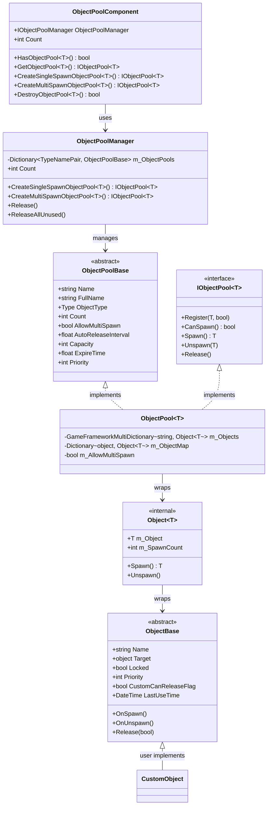
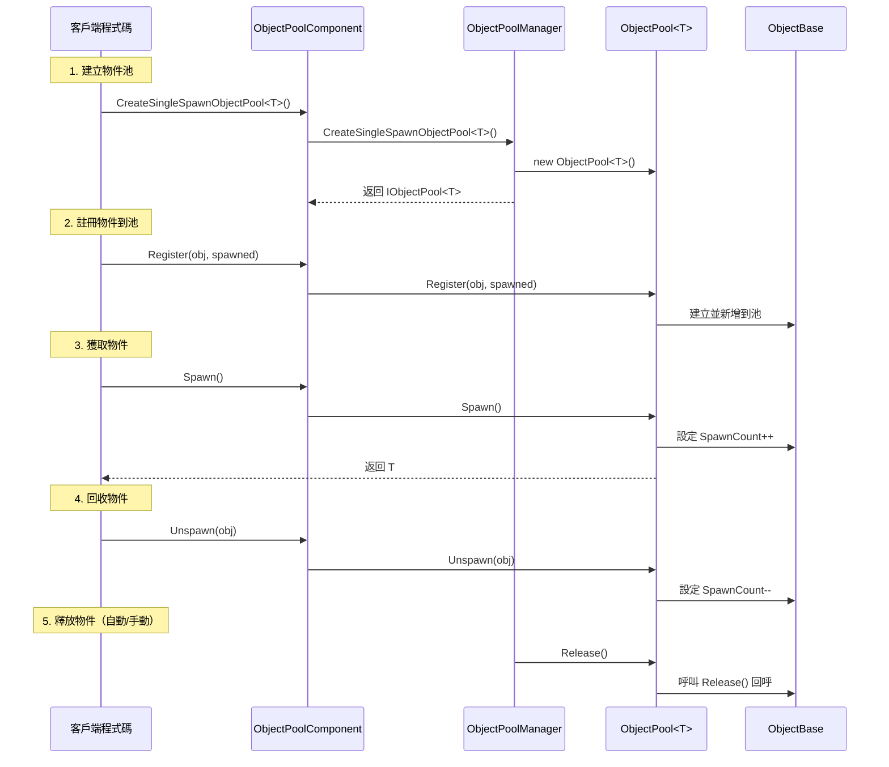

# 物件池系統

物件池系統是 GameFrameX 框架的核心模組之一，用於管理遊戲物件的複用，避免頻繁的物件建立和銷燬帶來的效能開銷和 GC 壓力。該系統提供了完整的物件生命週期管理，包括物件的獲取、回收、自動釋放等功能。

## 概述

在遊戲開發中，頻繁建立和銷燬物件（如子彈、特效、UI 元素等）是常見的效能瓶頸。物件池系統透過預先建立一定數量的物件並重複利用，顯著降低了記憶體分配開銷和 GC 觸發頻率。

GameFrameX 物件池系統提供以下核心功能：

- **型別安全的泛型池管理**：支援強型別的物件池操作
- **單次/多次獲取模式**：靈活控制物件的複用策略
- **自動釋放機制**：基於時間過期和容量閾值的自動回收
- **優先順序系統**：精細控制物件釋放優先順序
- **鎖定機制**：保護重要物件不被意外釋放

## 架構



### 組件說明

| 組件 | 描述 | 層級 |
|------|------|------|
| `ObjectPoolComponent` | Unity 組件，掛在 GameObject 上供場景使用 | API 層 |
| `ObjectPoolManager` | 核心管理器，管理所有物件池 | 核心層 |
| `ObjectPoolBase` | 物件池抽象基類 | 抽象層 |
| `ObjectPool<T>` | 泛型物件池實現 | 實現層 |
| `ObjectBase` | 可池化物件的抽象基類 | 抽象層 |
| `Object<T>` | 內部物件包裝器 | 內部實現 |

## 核心概念

### 物件池型別

系統支援兩種物件池型別：

**1. 單次獲取物件池 (Single Spawn)**
- 同一時間只能有一個消費者使用物件
- 適用於獨佔性資源，如玩家角色、載具等

```csharp
// 建立一個單次獲取物件池
IObjectPool<Bullet> bulletPool = objectPoolComponent.CreateSingleSpawnObjectPool<Bullet>("Bullet Pool", 100, 60f, 10);
```

> Source: [Runtime/ObjectPool/ObjectPoolComponent.cs](https://github.com/GameFrameX/com.gameframex.unity/blob/main/Runtime/ObjectPool/ObjectPoolComponent.cs#L257-L260)

**2. 多次獲取物件池 (Multi Spawn)**
- 同一時間可以同時被多個消費者使用
- 適用於可複用資源，如子彈、特效等

```csharp
// 建立一個多次獲取物件池
IObjectPool<Effect> effectPool = objectPoolComponent.CreateMultiSpawnObjectPool<Effect>("Effect Pool", 50, 30f, 5);
```

> Source: [Runtime/ObjectPool/ObjectPoolComponent.cs](https://github.com/GameFrameX/com.gameframex.unity/blob/main/Runtime/ObjectPool/ObjectPoolComponent.cs#L655-L658)

### 關鍵引數

| 引數 | 說明 | 預設值 |
|------|------|--------|
| `name` | 物件池名稱，用於標識和查詢 | 空字串 |
| `capacity` | 物件池容量，最大物件數量 | int.MaxValue |
| `expireTime` | 物件過期時間（秒），超過此時間未使用則可被釋放 | float.MaxValue（永不過期） |
| `autoReleaseInterval` | 自動釋放間隔（秒），每隔此時間嘗試釋放過期物件 | 依賴建立引數 |
| `priority` | 物件池優先順序，影響釋放順序 | 0 |

## 使用流程



## 建立可池化物件

要使用物件池系統，需要繼承 `ObjectBase` 類並實現相關方法：

```csharp
using GameFrameX.ObjectPool;
using GameFrameX.Runtime;

public class Bullet : ObjectBase
{
    private BulletController m_Controller;
    
    // 初始化物件
    public void Initialize(BulletController controller)
    {
        Initialize(null, controller.Target, 0);
        m_Controller = controller;
    }
    
    // 物件被獲取時呼叫
    protected internal override void OnSpawn()
    {
        base.OnSpawn();
        m_Controller.gameObject.SetActive(true);
    }
    
    // 物件被回收時呼叫
    protected internal override void OnUnspawn()
    {
        base.OnUnspawn();
        m_Controller.gameObject.SetActive(false);
    }
    
    // 物件被釋放時呼叫
    protected internal override void Release(bool isShutdown)
    {
        if (isShutdown || m_Controller == null)
        {
            if (m_Controller != null)
            {
                UnityEngine.Object.Destroy(m_Controller.gameObject);
            }
        }
        m_Controller = null;
    }
}
```

> Source: [Runtime/ObjectPool/ObjectBase.cs](https://github.com/GameFrameX/com.gameframex.unity/blob/main/Runtime/ObjectPool/ObjectBase.cs#L201-L223)

### 擴充套件方法

系統還提供了擴充套件方法方便使用者使用：

```csharp
// 擴充套件方法示例（虛擬碼）
public static class ObjectPoolExtensions
{
    public static T Spawn<T>(this IObjectPool<T> pool) where T : ObjectBase
    {
        return pool.Spawn();
    }
    
    public static void Unspawn<T>(this IObjectPool<T> pool, T obj) where T : ObjectBase
    {
        pool.Unspawn(obj);
    }
}
```

## 使用示例

### 基本用法

```csharp
using GameFrameX.Runtime;
using GameFrameX.ObjectPool;
using UnityEngine;

// 1. 獲取物件池組件
var objectPoolComponent = UnityEngine.Object.FindObjectOfType<ObjectPoolComponent>();

// 2. 建立物件池（多次獲取模式，適合子彈）
var bulletPool = objectPoolComponent.CreateMultiSpawnObjectPool<Bullet>("Bullet Pool", 100, 60f);

// 3. 註冊物件到池中
var bulletObj = new Bullet();
bulletObj.Initialize(bulletController);
bulletPool.Register(bulletObj, false);

// 4. 從池中獲取物件
var bullet = bulletPool.Spawn();

// 5. 使用完畢後回收物件
bulletPool.Unspawn(bullet);
```

> Source: [Runtime/ObjectPool/ObjectPoolManager.ObjectPool.cs](https://github.com/GameFrameX/com.gameframex.unity/blob/main/Runtime/ObjectPool/ObjectPoolManager.ObjectPool.cs#L256-L292)

### 高階用法：自定義釋放策略

```csharp
// 自定義釋放過濾器
IObjectPool<Bullet> bulletPool = objectPoolComponent.GetObjectPool<Bullet>("Bullet Pool");

// 釋放符合條件的物件
bulletPool.Release(10, (candidateObjects, toReleaseCount, expireTime) =>
{
    // 優先釋放優先順序低的物件
    var releaseList = new List<Bullet>();
    var sorted = candidateObjects.OrderByDescending(b => b.Priority)
                                 .ThenBy(b => b.LastUseTime);
    
    int count = 0;
    foreach (var bullet in sorted)
    {
        if (count >= toReleaseCount) break;
        releaseList.Add(bullet);
        count++;
    }
    return releaseList;
});
```

> Source: [Runtime/ObjectPool/ObjectPoolManager.ObjectPool.cs](https://github.com/GameFrameX/com.gameframex.unity/blob/main/Runtime/ObjectPool/ObjectPoolManager.ObjectPool.cs#L498-L529)

### 高階用法：物件鎖定

```csharp
// 鎖定物件，防止被自動釋放
bulletPool.SetLocked(bullet, true);

// 解鎖物件，允許被釋放
bulletPool.SetLocked(bullet, false);
```

> Source: [Runtime/ObjectPool/ObjectPoolManager.ObjectPool.cs](https://github.com/GameFrameX/com.gameframex.unity/blob/main/Runtime/ObjectPool/ObjectPoolManager.ObjectPool.cs#L336-L374)

### 高階用法：設定優先順序

```csharp
// 設定物件優先順序（數值越大優先順序越高，越晚被釋放）
bulletPool.SetPriority(bullet, 100);
```

> Source: [Runtime/ObjectPool/ObjectPoolManager.ObjectPool.cs](https://github.com/GameFrameX/com.gameframex.unity/blob/main/Runtime/ObjectPool/ObjectPoolManager.ObjectPool.cs#L376-L414)

## 配置選項

### ObjectPoolComponent 配置

在 Unity 編輯器中，`ObjectPoolComponent` 組件提供以下可配置項：

| 配置項 | 型別 | 說明 |
|--------|------|------|
| ImplementationComponentType | Type | 物件池管理器實現型別 |
| InterfaceComponentType | Type | 物件池管理器介面型別 |

> 詳情請參考 ObjectPoolComponent 原始碼

### 物件池引數配置

| 引數 | 型別 | 預設值 | 說明 |
|------|------|--------|------|
| name | string | "" | 物件池名稱 |
| capacity | int | int.MaxValue | 物件池容量 |
| expireTime | float | float.MaxValue | 物件過期時間（秒） |
| autoReleaseInterval | float | float.MaxValue | 自動釋放間隔 |
| priority | int | 0 | 物件池優先順序 |

## API 參考

### ObjectPoolComponent

```csharp
// 建立單次獲取物件池
IObjectPool<T> CreateSingleSpawnObjectPool<T>(string name, float autoReleaseInterval, int capacity, float expireTime, int priority)
```

**引數：**
- `name` (string): 物件池名稱
- `autoReleaseInterval` (float): 自動釋放間隔秒數
- `capacity` (int): 物件池容量
- `expireTime` (float): 物件過期秒數
- `priority` (int): 物件池優先順序

```csharp
// 建立多次獲取物件池
IObjectPool<T> CreateMultiSpawnObjectPool<T>(string name, float autoReleaseInterval, int capacity, float expireTime, int priority)
```

> Source: [Runtime/ObjectPool/ObjectPoolComponent.cs](https://github.com/GameFrameX/com.gameframex.unity/blob/main/Runtime/ObjectPool/ObjectPoolComponent.cs#L1026-L1029)

### IObjectPool<T>

```csharp
// 註冊物件到池
void Register(T obj, bool spawned)

// 檢查是否可以獲取物件
bool CanSpawn(string name)

// 獲取物件
T Spawn(string name)

// 回收物件
void Unspawn(T obj)

// 釋放物件
void Release()
```

> Source: [Runtime/ObjectPool/IObjectPool.cs](https://github.com/GameFrameX/com.gameframex.unity/blob/main/Runtime/ObjectPool/IObjectPool.cs#L92-L129)

## 相關連結

- [引用池系統](./5-runtime.reference-pool) - 另一種池化機制，用於管理引用型別物件
- [任務池系統](./5-runtime.task-pool) - 非同步任務池管理
- [基礎組件](./5-runtime.base) - GameFramework 基礎組件
- [API 參考](./8-api-reference) - 完整的 API 文件
