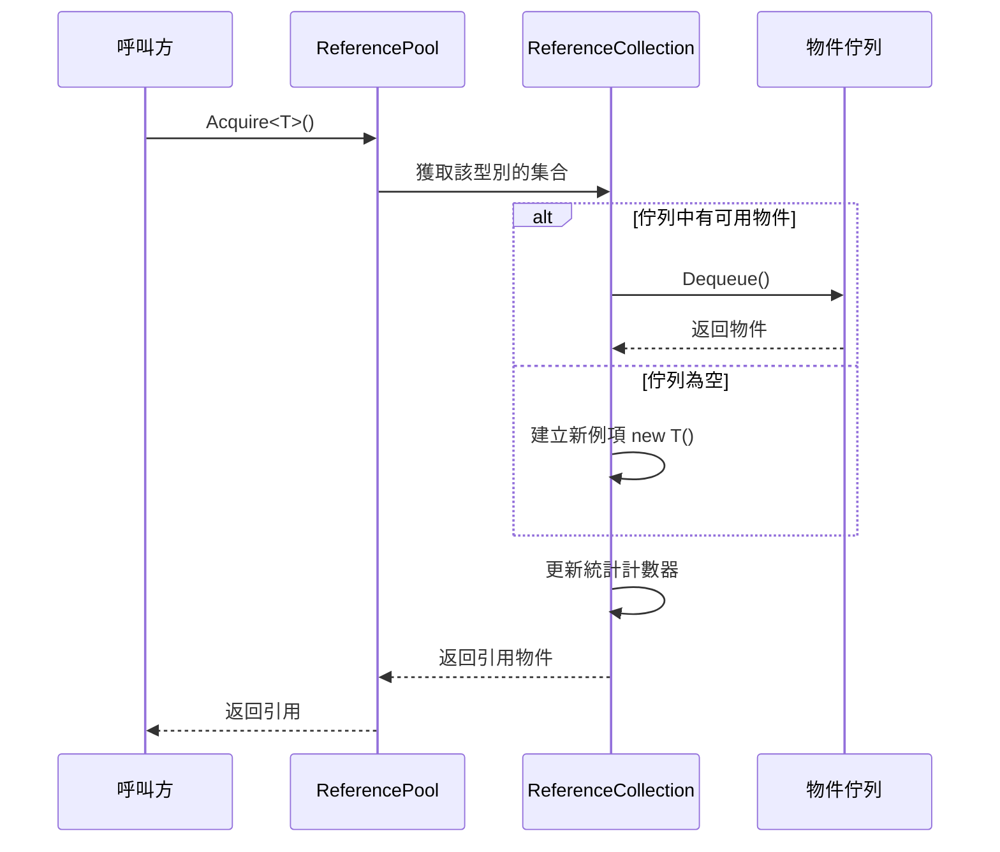
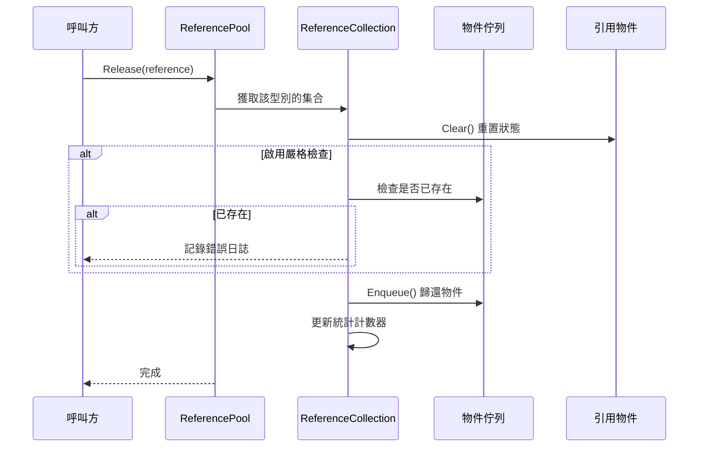

# 引用池系統

引用池系統是 GameFrameX 框架的核心組件之一，用於管理可複用的引用物件，透過物件複用來減少垃圾回收（GC）帶來的效能開銷。

## 概述

在遊戲開發中，頻繁建立和銷燬物件是導致效能問題的主要原因之一。特別是在高頻場景（如粒子系統、事件系統、網路訊息處理等）中，每秒可能建立數千個臨時物件，這會觸發頻繁的垃圾回收，導致遊戲卡頓。

引用池系統透過以下方式解決這一問題：

1. **物件複用**：從池中獲取物件使用，使用完畢後歸還池中，避免頻繁建立銷燬
2. **按型別管理**：每種型別的引用有獨立的子池，確保型別安全
3. **狀態重置**：歸還時自動呼叫 `Clear()` 方法重置物件狀態
4. **統計監控**：提供完整的獲取/歸還/新增/移除統計，便於效能調優

## 架構

```mermaid
graph TD
    subgraph External["外部呼叫"]
        Developer["開發者程式碼"]
    end

    subgraph API["引用池 API"]
        RP["ReferencePool 靜態類"]
    end

    subgraph Internal["內部實現"]
        RC["ReferenceCollection<br/>(每型別一個)"]
        Queue["Queue~IReference~<br/>(物件佇列)"]
    end

    subgraph Data["資料模型"]
        IRef["IReference 介面"]
        Info["ReferencePoolInfo<br/>(統計資訊)"]
    end

    subgraph Unity["Unity 整合"]
        RPC["ReferencePoolComponent<br/>(Unity 組件)"]
        RSCT["ReferenceStrictCheckType<br/>(檢查模式列舉)"]
    end

    Developer --> RP
    RP --> RC
    RC --> Queue
    IRef -.->|"實現|", Queue
    RC --> Info
    RPC -.-> RP
    RP -.-> RSCT
```

### 核心組件

| 組件 | 型別 | 說明 |
|------|------|------|
| `IReference` | 介面 | 所有可池化物件必須實現的介面，包含 `Clear()` 方法 |
| `ReferencePool` | 靜態類 | 引用池的主 API，提供獲取/歸還/新增/移除等操作 |
| `ReferenceCollection` | 內部類 | 管理特定型別引用物件的內部集合 |
| `ReferencePoolInfo` | 結構體 | 包含引用池的統計資訊 |
| `ReferencePoolComponent` | Unity 組件 | Unity 整合組件，用於配置和監控引用池 |

## 工作原理

### 引用獲取流程



### 引用歸還流程



### 嚴格檢查模式

引用池支援三種嚴格檢查模式，透過 `ReferenceStrictCheckType` 列舉配置：

| 模式 | 說明 | 適用場景 |
|------|------|----------|
| `AlwaysEnable` | 始終啟用嚴格檢查 | 除錯階段捕獲重複歸還 |
| `OnlyEnableWhenDevelopment` | 僅在開發構建時啟用 | 開發時除錯，生產環境保持效能 |
| `OnlyEnableInEditor` | 僅在編輯器中啟用 | 純編輯器除錯 |
| `AlwaysDisable` | 始終禁用嚴格檢查 | 生產環境最大化效能 |

嚴格檢查會在歸還引用時驗證該物件是否已在池中，避免重複歸還導致的記憶體問題。

## 使用示例

### 基本用法

首先，需要實現 `IReference` 介面建立可池化的引用類：

```csharp
using GameFrameX.Runtime;

public class MyData : IReference
{
    public string Name;
    public int Value;
    public Dictionary<string, object> ExtraData;

    public void Clear()
    {
        Name = null;
        Value = 0;
        ExtraData?.Clear();
    }
}
```

然後使用引用池獲取和歸還物件：

```csharp
// 從池中獲取引用
MyData data = ReferencePool.Acquire<MyData>();
data.Name = "Test";
data.Value = 100;

// 使用完畢歸還池中
ReferencePool.Release(data);
```

### 預熱池

可以在遊戲開始時預熱池，提前建立一定數量的引用物件：

```csharp
// 預熱：為某種型別預先新增 100 個引用
ReferencePool.Add<MyData>(100);
```

### 獲取池統計資訊

在執行時監控引用池狀態：

```csharp
// 獲取所有引用池的統計資訊
ReferencePoolInfo[] infos = ReferencePool.GetAllReferencePoolInfos();

foreach (var info in infos)
{
    Debug.Log($"Type: {info.Type.Name}");
    Debug.Log($"未使用: {info.UnusedReferenceCount}");
    Debug.Log($"使用中: {info.UsingReferenceCount}");
    Debug.Log($"獲取次數: {info.AcquireReferenceCount}");
    Debug.Log($"歸還次數: {info.ReleaseReferenceCount}");
}
```

### 清空池

在適當的時機清空所有引用池：

```csharp
// 清空所有引用池
ReferencePool.ClearAll();
```

### 使用 Unity 組件配置

在 Unity 場景中新增引用池組件：

```csharp
// 在 Inspector 中配置嚴格檢查模式
// ReferencePoolComponent 會自動初始化引用池配置
```

> Source: [ReferencePoolComponent.cs](https://github.com/GameFrameX/com.gameframex.unity/blob/main/Runtime/ReferencePool/ReferencePoolComponent.cs#L42-L95)

## API 參考

### `ReferencePool`

引用池的靜態主類，提供所有池操作。

#### `Acquire<T>() where T : class, IReference, new(): T`

從引用池獲取指定型別的引用。

```csharp
T item = ReferencePool.Acquire<T>();
```
> Source: [ReferencePool.cs](https://github.com/GameFrameX/com.gameframex.unity/blob/main/Runtime/Base/ReferencePool/ReferencePool.cs#L129-L132)

**引數：**
- 無（泛型引數 `T` 指定引用型別）

**返回：** 獲取的引用例項

**說明：** 如果池中有可用引用則取出，否則建立新例項

---

#### `Acquire(Type referenceType): IReference`

從引用池獲取指定型別的引用（使用 Type 引數）。

```csharp
IReference item = ReferencePool.Acquire(typeof(MyData));
```
> Source: [ReferencePool.cs](https://github.com/GameFrameX/com.gameframex.unity/blob/main/Runtime/Base/ReferencePool/ReferencePool.cs#L143-L147)

**引數：**
- `referenceType` (Type): 引用的型別

**返回：** 獲取的引用例項

---

#### `Release(IReference reference): void`

將引用歸還到引用池。

```csharp
ReferencePool.Release(myData);
```
> Source: [ReferencePool.cs](https://github.com/GameFrameX/com.gameframex.unity/blob/main/Runtime/Base/ReferencePool/ReferencePool.cs#L157-L167)

**引數：**
- `reference` (IReference): 要歸還的引用

**丟擲：**
- `GameFrameworkException`: 當引用為 null 時

---

#### `Add<T>(int count) where T : class, IReference, new(): void`

向引用池中追加指定數量的引用。

```csharp
// 預熱：新增 100 個引用
ReferencePool.Add<MyData>(100);
```
> Source: [ReferencePool.cs](https://github.com/GameFrameX/com.gameframex.unity/blob/main/Runtime/Base/ReferencePool/ReferencePool.cs#L178-L181)

**引數：**
- `count` (int): 要新增的數量

---

#### `Remove<T>(int count) where T : class, IReference: void`

從引用池中移除指定數量的未使用引用。

```csharp
ReferencePool.Remove<MyData>(10);
```
> Source: [ReferencePool.cs](https://github.com/GameFrameX/com.gameframex.unity/blob/main/Runtime/Base/ReferencePool/ReferencePool.cs#L207-L210)

**引數：**
- `count` (int): 要移除的數量

---

#### `RemoveAll<T>() where T : class, IReference: void`

從引用池中移除指定型別的所有未使用引用。

```csharp
ReferencePool.RemoveAll<MyData>();
```
> Source: [ReferencePool.cs](https://github.com/GameFrameX/com.gameframex.unity/blob/main/Runtime/Base/ReferencePool/ReferencePool.cs#L235-L238)

---

#### `ClearAll(): void`

清除所有引用池中的所有引用。

```csharp
ReferencePool.ClearAll();
```
> Source: [ReferencePool.cs](https://github.com/GameFrameX/com.gameframex.unity/blob/main/Runtime/Base/ReferencePool/ReferencePool.cs#L107-L118)

---

#### `GetAllReferencePoolInfos(): ReferencePoolInfo[]`

獲取所有引用池的統計資訊。

```csharp
ReferencePoolInfo[] infos = ReferencePool.GetAllReferencePoolInfos();
```
> Source: [ReferencePool.cs](https://github.com/GameFrameX/com.gameframex.unity/blob/main/Runtime/Base/ReferencePool/ReferencePool.cs#L82-L98)

**返回：** 包含所有引用池資訊的陣列

---

#### `EnableStrictCheck: bool`

獲取或設定是否啟用嚴格檢查模式。

```csharp
// 啟用嚴格檢查
ReferencePool.EnableStrictCheck = true;

// 檢查當前狀態
if (ReferencePool.EnableStrictCheck)
{
    // ...
}
```
> Source: [ReferencePool.cs](https://github.com/GameFrameX/com.gameframex.unity/blob/main/Runtime/Base/ReferencePool/ReferencePool.cs#L56-L60)

---

#### `Count: int`

獲取當前管理的引用池數量。

```csharp
int poolCount = ReferencePool.Count;
```
> Source: [ReferencePool.cs](https://github.com/GameFrameX/com.gameframex.unity/blob/main/Runtime/Base/ReferencePool/ReferencePool.cs#L69-L72)

---

### `IReference`

所有可池化物件必須實現的介面。

```csharp
public interface IReference
{
    void Clear();
}
```
> Source: [IReference.cs](https://github.com/GameFrameX/com.gameframex.unity/blob/main/Runtime/Base/ReferencePool/IReference.cs#L40-L49)

#### `Clear(): void`

清理引用，將物件重置為初始狀態。該方法在物件從池中取出時**不會**被呼叫，僅在物件歸還池中時由系統自動呼叫。

```csharp
public class MyData : IReference
{
    public string Name;
    public int Value;

    public void Clear()
    {
        Name = null;
        Value = 0;
    }
}
```

**實現建議：**
- 將所有可寫屬性重置為預設值
- 釋放或清空內部引用的非託管資源（如有）
- 清空集合類成員（如 List、Dictionary）

---

### `ReferencePoolInfo`

包含引用池統計資訊的結構體。

> Source: [ReferencePoolInfo.cs](https://github.com/GameFrameX/com.gameframex.unity/blob/main/Runtime/Base/ReferencePool/ReferencePoolInfo.cs#L44-L162)

| 屬性 | 型別 | 說明 |
|------|------|------|
| `Type` | Type | 引用池管理的型別 |
| `UnusedReferenceCount` | int | 池中未使用（可用）的引用數量 |
| `UsingReferenceCount` | int | 當前正在被使用的引用數量 |
| `AcquireReferenceCount` | int | 總共獲取引用的次數 |
| `ReleaseReferenceCount` | int | 總共歸還引用的次數 |
| `AddReferenceCount` | int | 總共新增引用的次數 |
| `RemoveReferenceCount` | int | 總共移除引用的次數 |

---

### `ReferenceStrictCheckType`

引用嚴格檢查模式的列舉型別。

> Source: [ReferenceStrictCheckType.cs](https://github.com/GameFrameX/com.gameframex.unity/blob/main/Runtime/ReferencePool/ReferenceStrictCheckType.cs#L40-L61)

| 值 | 說明 |
|------|------|
| `AlwaysEnable` | 始終啟用嚴格檢查 |
| `OnlyEnableWhenDevelopment` | 僅在開發構建時啟用 |
| `OnlyEnableInEditor` | 僅在編輯器中啟用 |
| `AlwaysDisable` | 始終禁用嚴格檢查 |

---

## 效能最佳化建議

### 1. 預熱池

在遊戲開始或切換場景時預熱池：

```csharp
void WarmUpPools()
{
    // 根據預估使用量預熱
    ReferencePool.Add<MyData>(50);
    ReferencePool.Add<AnotherData>(30);
}
```

### 2. 合理實現 Clear 方法

確保 `Clear()` 方法高效執行：

```csharp
// ✅ 推薦：直接賦值而非建立新例項
public void Clear()
{
    Name = null;
    Value = 0;
    ExtraData.Clear(); // 清空而非置空
}

// ❌ 避免：建立新例項
public void Clear()
{
    ExtraData = new Dictionary<string, object>(); // 每次建立新物件
}
```

### 3. 生產環境禁用嚴格檢查

在釋出版本中禁用嚴格檢查以獲得最佳效能：

```csharp
// 在 Release 構建設定
ReferencePool.EnableStrictCheck = false;

// 或透過組件配置
// 將 ReferencePoolComponent 的 Strict Check Type 設定為 AlwaysDisable
```

### 4. 監控池狀態

定期檢查池狀態，識別潛在的記憶體問題：

```csharp
void LogPoolStats()
{
    foreach (var info in ReferencePool.GetAllReferencePoolInfos())
    {
        // 檢查是否有洩漏（使用中很多但未使用很少）
        if (info.UsingReferenceCount > 100 && info.UnusedReferenceCount < 5)
        {
            Debug.LogWarning($"Potential leak: {info.Type.Name}");
        }
    }
}
```

## 常見問題

### Q: 引用池和物件池有什麼區別？

引用池專門用於實現 `IReference` 介面的物件，強調輕量級複用。物件池（Object Pool）概念更廣泛，可以用於任何可複用的物件。GameFrameX 同時提供了引用池和物件池系統，詳情請參閱 [物件池系統](./5-runtime.object-pool)。

### Q: 為什麼 Clear 方法在獲取時不被呼叫？

設計決策：獲取時保持物件最近一次使用的資料可以提高快取命中率。如果需要乾淨的物件，可以手動呼叫 `Clear()` 或使用 `ReferencePool.Release()` 後再獲取新物件。

### Q: 如何處理引用池的記憶體佔用？

- 使用 `Remove()` 方法移除多餘的空閒引用
- 使用 `ClearAll()` 在適當場景清空所有池
- 監控 `UnusedReferenceCount` 避免過多空閒物件

---

## 相關連結

- [物件池系統](./5-runtime.object-pool) - 另一種物件複用機制
- [任務池系統](./5-runtime.task-pool) - 非同步任務管理
- [API 參考](./8-api-reference) - 完整 API 文件
