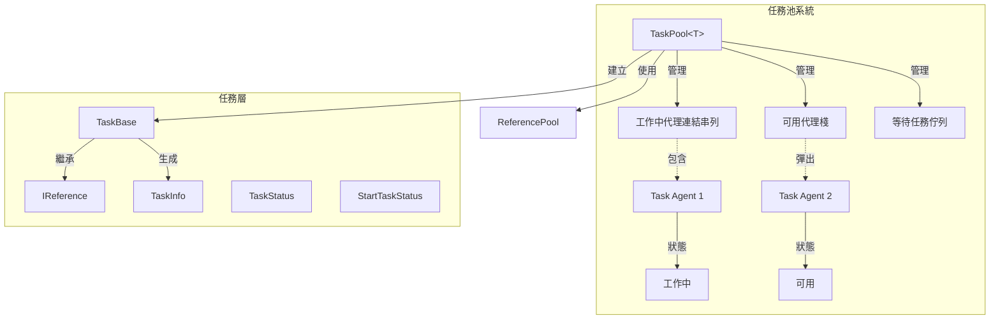
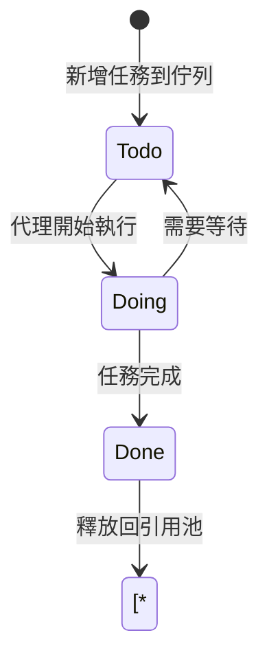
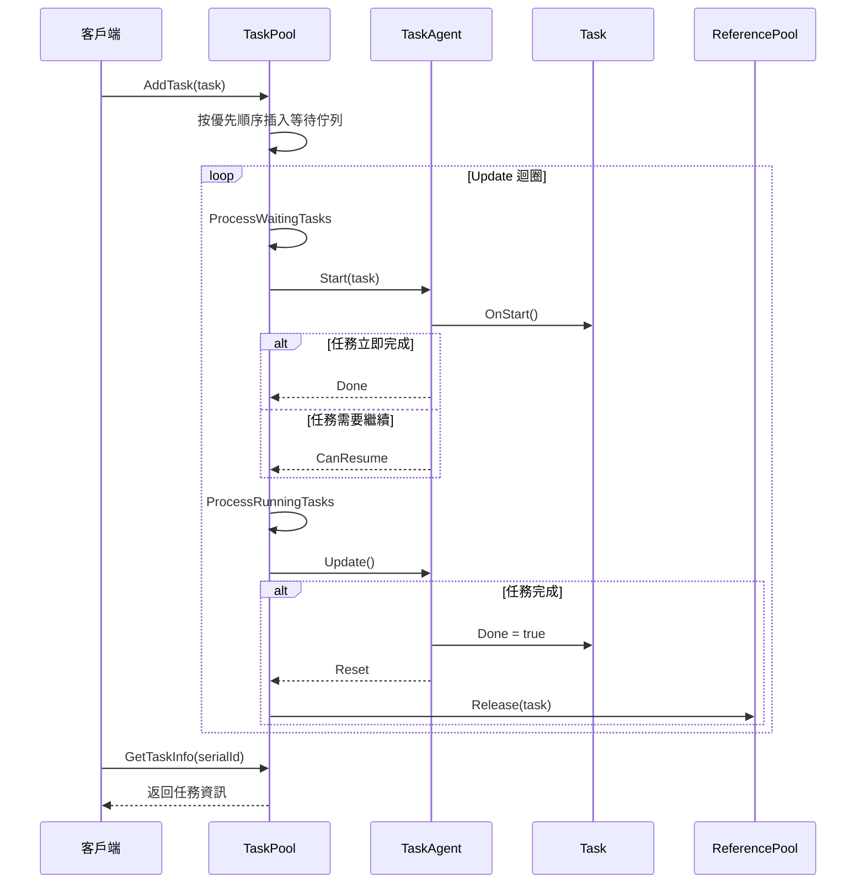

# 任務池系統

任務池系統是 GameFrameX 框架的核心模組之一，提供通用的任務管理和排程功能。透過任務池，開發者可以將耗時的操作封裝為任務，利用多工代理並行處理，提高遊戲效能表現。

## 概述

任務池系統採用**代理-任務**模式設計，包含以下核心概念：

- **任務代理 (Task Agent)**：實際執行任務的worker，每個代理一次只能處理一個任務
- **任務 (Task)**：封裝具體業務邏輯的可執行單元
- **任務池 (Task Pool)**：管理任務佇列和任務代理容器的核心類

該系統支援：
- 任務優先順序排程（高優先順序任務優先處理）
- 任務狀態查詢（待處理、執行中、已完成）
- 任務標籤管理（按標籤查詢、移除任務）
- 暫停/恢復任務池
- 與引用池整合實現物件複用

## 架構



### 核心組件說明

| 組件 | 型別 | 職責 |
|------|------|------|
| `TaskPool<T>` | 類 | 任務池核心，管理任務代理和任務佇列 |
| `TaskBase` | 抽象類 | 任務基類，定義任務通用屬性 |
| `ITaskAgent<T>` | 介面 | 任務代理介面，定義任務執行方法 |
| `TaskInfo` | 結構體 | 任務資訊容器 |
| `TaskStatus` | 列舉 | 任務狀態（待處理、執行中、已完成） |
| `StartTaskStatus` | 列舉 | 任務啟動結果 |

## 核心概念

### 任務狀態流轉



### 任務優先順序

任務池使用**優先順序佇列**排程任務：
- 數值越大優先順序越高
- 高優先順序任務會插隊到低優先順序任務之前
- 預設優先順序為 0

### 引用池整合

任務完成後會自動釋放到引用池，實現物件複用：
- 任務物件實現 `IReference` 介面
- 完成後呼叫 `ReferencePool.Release(task)` 歸還

## 使用示例

### 1. 定義自定義任務

```csharp
using GameFrameX.Runtime;

// 繼承 TaskBase 實現自定義任務
public class DownloadTask : TaskBase
{
    private string m_Url;
    private string m_SavePath;
    
    public void Initialize(int serialId, string tag, int priority, string url, string savePath)
    {
        base.Initialize(serialId, tag, priority, null);
        m_Url = url;
        m_SavePath = savePath;
    }
    
    public override string Description
    {
        get { return $"下載檔案: {m_Url}"; }
    }
    
    protected internal override void OnStart()
    {
        base.OnStart();
        // 開始下載邏輯
    }
    
    protected internal override void OnUpdate(float elapseSeconds, float realElapseSeconds)
    {
        base.OnUpdate(elapseSeconds, realElapseSeconds);
        // 更新下載進度
        // 完成時設定 Done = true
    }
    
    public override void Clear()
    {
        base.Clear();
        m_Url = null;
        m_SavePath = null;
    }
}
```
> Source: [TaskBase.cs](https://github.com/GameFrameX/com.gameframex.unity/blob/main/Runtime/Base/TaskPool/TaskBase.cs#L40-L182)

### 2. 實現任務代理

```csharp
using GameFrameX.Runtime;

public class DownloadTaskAgent : ITaskAgent<DownloadTask>
{
    public DownloadTask Task { get; private set; }
    
    public void Initialize()
    {
        // 初始化代理資源
    }
    
    public void Update(float elapseSeconds, float realElapseSeconds)
    {
        if (Task == null || Task.Done)
        {
            return;
        }
        
        // 執行任務邏輯
    }
    
    public StartTaskStatus Start(DownloadTask task)
    {
        Task = task;
        task.OnStart();
        
        if (task.Done)
        {
            return StartTaskStatus.Done;
        }
        
        return StartTaskStatus.CanResume;
    }
    
    public void Reset()
    {
        if (Task != null)
        {
            Task.OnRelease();
            Task = null;
        }
    }
    
    public void Shutdown()
    {
        // 釋放代理資源
    }
}
```
> Source: [ITaskAgent.cs](https://github.com/GameFrameX/com.gameframex.unity/blob/main/Runtime/Base/TaskPool/ITaskAgent.cs#L41-L94)

### 3. 使用任務池

```csharp
// 建立任務池例項
var taskPool = new TaskPool<DownloadTask>();

// 新增任務代理（可以新增多個實現並行處理）
taskPool.AddAgent(new DownloadTaskAgent());
taskPool.AddAgent(new DownloadTaskAgent());
taskPool.AddAgent(new DownloadTaskAgent());

// 建立並新增任務
var task = ReferencePool.Acquire<DownloadTask>();
task.Initialize(1, "下載", 10, "http://example.com/file.png", "Assets/file.png");
taskPool.AddTask(task);

// 在 Update 中呼叫
void Update()
{
    taskPool.Update(Time.deltaTime, Time.unscaledDeltaTime);
}

// 查詢任務資訊
TaskInfo[] allTasks = taskPool.GetAllTaskInfos();
TaskInfo[] downloadTasks = taskPool.GetTaskInfos("下載");
TaskInfo singleTask = taskPool.GetTaskInfo(1);

// 暫停/恢復
taskPool.Paused = true;  // 暫停
taskPool.Paused = false; // 恢復

// 移除任務
taskPool.RemoveTask(1);           // 移除指定序列號任務
taskPool.RemoveTasks("下載");     // 移除指定標籤的所有任務
taskPool.RemoveAllTasks();       // 移除所有任務

// 關閉任務池
taskPool.Shutdown();
```
> Source: [TaskPool.cs](https://github.com/GameFrameX/com.gameframex.unity/blob/main/Runtime/Base/TaskPool/TaskPool.cs#L44-L525)

## 核心流程

### 任務處理流程



## API 參考

### `TaskPool<T>`

任務池泛型類。

```csharp
public sealed class TaskPool<T> where T : TaskBase
```
> Source: [TaskPool.cs](https://github.com/GameFrameX/com.gameframex.unity/blob/main/Runtime/Base/TaskPool/TaskPool.cs#L44-L525)

#### 屬性

| 屬性 | 型別 | 描述 |
|------|------|------|
| `Paused` | `bool` | 獲取或設定任務池是否被暫停 |
| `TotalAgentCount` | `int` | 獲取任務代理總數量 |
| `FreeAgentCount` | `int` | 獲取可用任務代理數量 |
| `WorkingAgentCount` | `int` | 獲取工作中任務代理數量 |
| `WaitingTaskCount` | `int` | 獲取等待任務數量 |

#### 方法

##### `AddAgent(agent)`

增加任務代理。

```csharp
public void AddAgent(ITaskAgent<T> agent)
```

**引數：**
- `agent` (`ITaskAgent<T>`): 要增加的任務代理

> Source: [TaskPool.cs#L172-L181](https://github.com/GameFrameX/com.gameframex.unity/blob/main/Runtime/Base/TaskPool/TaskPool.cs#L172-L181)

##### `AddTask(task)`

增加任務到等待佇列。

```csharp
public void AddTask(T task)
```

**引數：**
- `task` (T): 要增加的任務

> Source: [TaskPool.cs#L326-L348](https://github.com/GameFrameX/com.gameframex.unity/blob/main/Runtime/Base/TaskPool/TaskPool.cs#L326-L348)

##### `Update(elapseSeconds, realElapseSeconds)`

任務池輪詢處理。

```csharp
public void Update(float elapseSeconds, float realElapseSeconds)
```

**引數：**
- `elapseSeconds` (float): 邏輯流逝時間
- `realElapseSeconds` (float): 真實流逝時間

> Source: [TaskPool.cs#L136-L145](https://github.com/GameFrameX/com.gameframex.unity/blob/main/Runtime/Base/TaskPool/TaskPool.cs#L136-L145)

##### `GetTaskInfo(serialId)`

根據序列編號獲取任務資訊。

```csharp
public TaskInfo GetTaskInfo(int serialId)
```

**引數：**
- `serialId` (int): 任務的序列編號

**返回：** TaskInfo - 任務資訊結構

> Source: [TaskPool.cs#L191-L212](https://github.com/GameFrameX/com.gameframex.unity/blob/main/Runtime/Base/TaskPool/TaskPool.cs#L191-L212)

##### `GetTaskInfos(tag)`

根據標籤獲取任務資訊陣列。

```csharp
public TaskInfo[] GetTaskInfos(string tag)
```

**引數：**
- `tag` (string): 任務標籤

**返回：** TaskInfo[] - 任務資訊陣列

> Source: [TaskPool.cs#L222-L228](https://github.com/GameFrameX/com.gameframex.unity/blob/main/Runtime/Base/TaskPool/TaskPool.cs#L222-L228)

##### `GetAllTaskInfos()`

獲取所有任務資訊。

```csharp
public TaskInfo[] GetAllTaskInfos()
```

**返回：** TaskInfo[] - 所有任務資訊陣列

> Source: [TaskPool.cs#L272-L289](https://github.com/GameFrameX/com.gameframex.unity/blob/main/Runtime/Base/TaskPool/TaskPool.cs#L272-L289)

##### `RemoveTask(serialId)`

移除指定序列編號的任務。

```csharp
public bool RemoveTask(int serialId)
```

**引數：**
- `serialId` (int): 任務的序列編號

**返回：** bool - 是否移除成功

> Source: [TaskPool.cs#L358-L390](https://github.com/GameFrameX/com.gameframex.unity/blob/main/Runtime/Base/TaskPool/TaskPool.cs#L358-L390)

##### `RemoveTasks(tag)`

移除指定標籤的所有任務。

```csharp
public int RemoveTasks(string tag)
```

**引數：**
- `tag` (string): 任務標籤

**返回：** int - 移除的任務數量

> Source: [TaskPool.cs#L400-L439](https://github.com/GameFrameX/com.gameframex.unity/blob/main/Runtime/Base/TaskPool/TaskPool.cs#L400-L439)

##### `RemoveAllTasks()`

移除所有任務。

```csharp
public int RemoveAllTasks()
```

**返回：** int - 移除的任務數量

> Source: [TaskPool.cs#L448-L471](https://github.com/GameFrameX/com.gameframex.unity/blob/main/Runtime/Base/TaskPool/TaskPool.cs#L448-L471)

##### `Shutdown()`

關閉並清理任務池。

```csharp
public void Shutdown()
```

> Source: [TaskPool.cs#L154-L162](https://github.com/GameFrameX/com.gameframex.unity/blob/main/Runtime/Base/TaskPool/TaskPool.cs#L154-L162)

---

### TaskBase

任務基類。

```csharp
public abstract class TaskBase : IReference
```
> Source: [TaskBase.cs](https://github.com/GameFrameX/com.gameframex.unity/blob/main/Runtime/Base/TaskPool/TaskBase.cs#L40-L182)

#### 屬性

| 屬性 | 型別 | 描述 |
|------|------|------|
| `SerialId` | `int` | 獲取任務的序列編號 |
| `Tag` | `string` | 獲取任務的標籤 |
| `Priority` | `int` | 獲取任務的優先順序 |
| `UserData` | `object` | 獲取任務的使用者自定義資料 |
| `Done` | `bool` | 獲取或設定任務是否完成 |
| `Description` | `string` | 獲取任務描述（虛屬性） |

#### 常量

| 常量 | 值 | 描述 |
|------|-----|------|
| `DefaultPriority` | 0 | 任務預設優先順序 |

---

### TaskStatus

任務狀態列舉。

```csharp
public enum TaskStatus : byte
```
> Source: [TaskStatus.cs](https://github.com/GameFrameX/com.gameframex.unity/blob/main/Runtime/Base/TaskPool/TaskStatus.cs#L41-L66)

| 成員 | 值 | 描述 |
|------|-----|------|
| `Todo` | 0 | 未開始 |
| `Doing` | 1 | 執行中 |
| `Done` | 2 | 已完成 |

---

### StartTaskStatus

任務啟動狀態列舉。

```csharp
public enum StartTaskStatus : byte
```
> Source: [StartTaskStatus.cs](https://github.com/GameFrameX/com.gameframex.unity/blob/main/Runtime/Base/TaskPool/StartTaskStatus.cs#L41-L74)

| 成員 | 值 | 描述 |
|------|-----|------|
| `Done` | 0 | 任務可立即完成 |
| `CanResume` | 1 | 任務可以繼續處理 |
| `HasToWait` | 2 | 任務需等待其他任務 |
| `UnknownError` | 3 | 未知錯誤 |

---

### TaskInfo

任務資訊結構體。

```csharp
public struct TaskInfo
```
> Source: [TaskInfo.cs](https://github.com/GameFrameX/com.gameframex.unity/blob/main/Runtime/Base/TaskPool/TaskInfo.cs#L44-L209)

#### 屬性

| 屬性 | 型別 | 描述 |
|------|------|------|
| `IsValid` | `bool` | 獲取任務資訊是否有效 |
| `SerialId` | `int` | 獲取任務序列編號 |
| `Tag` | `string` | 獲取任務標籤 |
| `Priority` | `int` | 獲取任務優先順序 |
| `UserData` | `object` | 獲取使用者資料 |
| `Status` | `TaskStatus` | 獲取任務狀態 |
| `Description` | `string` | 獲取任務描述 |

---

### `ITaskAgent<T>`

任務代理介面。

```csharp
public interface ITaskAgent<T> where T : TaskBase
```
> Source: [ITaskAgent.cs](https://github.com/GameFrameX/com.gameframex.unity/blob/main/Runtime/Base/TaskPool/ITaskAgent.cs#L41-L94)

#### 屬性

| 屬性 | 型別 | 描述 |
|------|------|------|
| `Task` | `T` | 獲取當前任務 |

#### 方法

##### `Initialize()`

初始化任務代理。

```csharp
void Initialize()
```

##### `Update(elapseSeconds, realElapseSeconds)`

任務代理輪詢。

```csharp
void Update(float elapseSeconds, float realElapseSeconds)
```

##### `Start(task)`

開始處理任務。

```csharp
StartTaskStatus Start(T task)
```

##### `Reset()`

重置任務代理。

```csharp
void Reset()
```

##### `Shutdown()`

關閉任務代理。

```csharp
void Shutdown()
```

## 最佳實踐

### 1. 任務代理池化

根據任務型別和負載建立適當數量的代理：

```csharp
// CPU 密集型任務建議代理數 = CPU 核心數
// IO 密集型任務可以建立更多代理
int agentCount = SystemInfo.processorCount;
for (int i = 0; i < agentCount; i++)
{
    taskPool.AddAgent(new DownloadTaskAgent());
}
```

### 2. 任務優先順序策略

- 關鍵任務（UI反饋、網路回呼）：高優先順序（100）
- 常規任務（資源載入）：中等優先順序（50）
- 後臺任務（日誌上報）：低優先順序（0）

### 3. 任務生命週期管理

- 在任務 `Clear()` 方法中清理所有引用
- 避免在任務中持有大量物件
- 及時移除不需要的任務以釋放記憶體

## 相關連結

- [物件池系統](./5-runtime.object-pool) - 物件複用機制
- [引用池系統](./5-runtime.reference-pool) - 引用物件管理
- [事件系統](./5-runtime.event-system) - 框架事件機制
- [基礎組件](./5-runtime.base) - 框架基礎組件
- [API 參考](./8-api-reference) - 完整 API 文件
