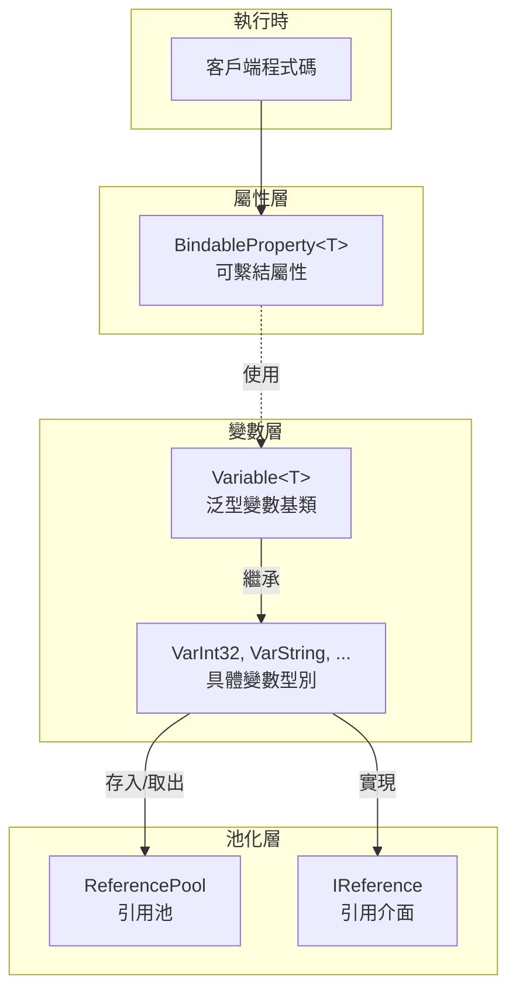
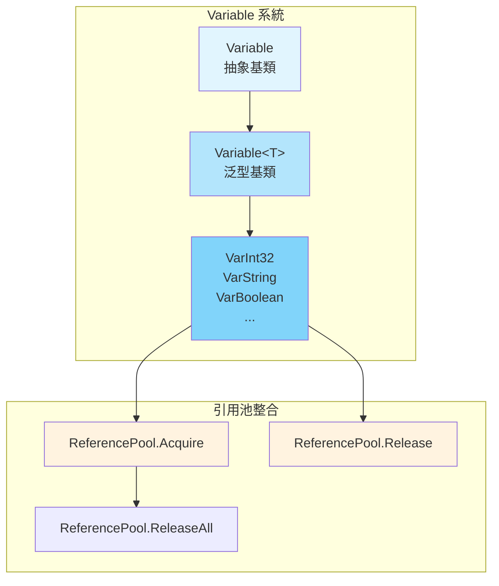

# 屬性系統

GameFrameX 屬性系統提供了一套完整的屬性和變數管理機制，包括可繫結屬性（BindableProperty）和型別化變數（Variable）兩大核心組件。該系統支援屬性值變化監聽、引用池管理以及泛型型別安全操作。

## 概述

屬性系統是 GameFrameX 框架的基礎組件之一，主要由以下兩部分組成：

1. **BindableProperty<T>** - 可繫結屬性，提供屬性值變化通知機制，基於觀察者模式實現
2. **Variable** 系統 - 型別化變數容器，整合引用池實現高效記憶體管理

該系統適用於以下場景：
- 需要監聽屬性值變化的 UI 繫結
- 需要高效管理臨時變數的遊戲邏輯
- 需要型別安全的資料傳遞
- 需要減少垃圾回收壓力的高效能場景

## Architecture

屬性系統的架構設計遵循模組化原則，主要包含以下層次：



### 核心組件關係

```mermaid
classDiagram
    class IReference {
        <<interface>>
        +Clear() void
    }
    
    class Variable {
        <<abstract>>
        +Type$ Type
        +GetValue() object
        +SetValue(object) void
        +Clear() void
    }
    
    class Variable<T> {
        <<abstract>>
        +Value$ T
        +GetValue() object
        +SetValue(object) void
        +Clear() void
    }
    
    class VarInt32 {
        +VarInt32()
        +implicit operator VarInt32(int)
        +implicit operator int(VarInt32)
    }
    
    class BindableProperty~T~ {
        -T _value
        -Action~T~ _onValueChanged
        +Value$ T
        +Add(Action~T~) BindableProperty~T~
        +RegisterWithInitValue(Action~T~) BindableProperty~T~
        +Remove(Action~T~) void
        +Clear() void
    }
    
    IReference <|.. Variable
    Variable <|-- Variable
    Variable~T~ --|> Variable
    Variable~T~ <|-- VarInt32
    BindableProperty~T~ --> Action : uses
```

## BindableProperty 可繫結屬性

`BindableProperty<T>` 是屬性系統的核心組件，提供屬性值變化通知功能。基於觀察者模式設計，當屬性值發生變化時，自動觸發已註冊的回呼檢視。

### 核心特性

- **泛型支援** - 支援任意型別 T
- **值變化監聽** - 透過 Action<T> 回呼機制通知變化
- **方法鏈式呼叫** - 支援 Fluent API 風格的註冊方式
- **自動比較** - 使用 `Equals` 方法避免不必要的更新

### 使用示例

#### 基礎用法

建立可繫結屬性並監聽值變化：

```csharp
using GameFrameX.Runtime;

// 建立可繫結屬性，預設值為 0
var health = new BindableProperty<int>(100);

// 註冊值變化監聽
health.Add(newValue => 
{
    Debug.Log($"生命值已變化: {newValue}");
});

// 修改值時會觸發回呼
health.Value = 90; // 輸出: "生命值已變化: 90"
health.Value = 80; // 輸出: "生命值已變化: 80"

// 相同值不會觸發回呼
health.Value = 80; // 不觸發回呼
```
> Source: [BindableProperty.cs](https://github.com/GameFrameX/com.gameframex.unity/blob/main/Runtime/Property/BindableProperty.cs#L1-L90)

#### 註冊時立即執行回呼

使用 `RegisterWithInitValue` 在註冊時立即執行回呼，適用於初始化場景：

```csharp
var score = new BindableProperty<int>(0);

// 註冊並立即獲取當前值
score.RegisterWithInitValue(currentScore =>
{
    Debug.Log($"當前分數: {currentScore}");
});
// 輸出: "當前分數: 0"
```
> Source: [BindableProperty.cs](https://github.com/GameFrameX/com.gameframex.unity/blob/main/Runtime/Property/BindableProperty.cs#L63-L68)

#### 移除監聽

```csharp
var health = new BindableProperty<int>(100);

Action<int> listener = newValue => Debug.Log($"變化: {newValue}");
health.Add(listener);

// 移除特定監聽器
health.Remove(listener);

// 清除所有監聽器
health.Clear();
```
> Source: [BindableProperty.cs](https://github.com/GameFrameX/com.gameframex.unity/blob/main/Runtime/Property/BindableProperty.cs#L70-L88)

### 實際應用場景

#### MVVM 模式中的資料繫結

```csharp
public class PlayerModel
{
    // 可繫結屬性用於資料繫結
    public BindableProperty<int> Health { get; } = new BindableProperty<int>(100);
    public BindableProperty<int> Gold { get; } = new BindableProperty<int>(0);
    public BindableProperty<string> Name { get; } = new BindableProperty<string>("");
}

public class PlayerView
{
    private PlayerModel _model;
    
    public void Bind(PlayerModel model)
    {
        _model = model;
        
        // 註冊生命值變化監聽
        _model.Health.Add(OnHealthChanged);
        
        // 註冊金幣變化監聽
        _model.Gold.Add(OnGoldChanged);
    }
    
    private void OnHealthChanged(int health)
    {
        Debug.Log($"UI更新: 生命值 = {health}");
    }
    
    private void OnGoldChanged(int gold)
    {
        Debug.Log($"UI更新: 金幣 = {gold}");
    }
}
```

#### 狀態機中的狀態變化監聽

```csharp
public class GameState
{
    public BindableProperty<GameStateType> CurrentState { get; } 
        = new BindableProperty<GameStateType>(GameStateType.Init);
    
    public void ChangeState(GameStateType newState)
    {
        CurrentState.Value = newState;
    }
}

// 狀態監聽
gameState.CurrentState.Add(state => 
{
    switch (state)
    {
        case GameStateType.Playing:
            StartGame();
            break;
        case GameStateType.Paused:
            PauseGame();
            break;
    }
});
```

## Variable 變數系統

Variable 系統提供了一套型別安全的變數封裝，結合引用池實現高效的記憶體管理。每個 Variable 型別都實現了 `IReference` 介面，可以被引用池統一管理。

### 架構設計



### 內建變數型別

GameFrameX 提供了 30+ 種預定義的 Variable 型別：

| 分類 | 型別 |
|------|------|
| 基礎數值 | VarInt16, VarInt32, VarInt64, VarUInt16, VarUInt32, VarUInt64 |
| 浮點數 | VarSingle, VarDouble, VarDecimal |
| 其他數值 | VarByte, VarSByte, VarChar |
| 字串 | VarString |
| 布林值 | VarBoolean |
| 日期時間 | VarDateTime |
| Unity 基礎 | VarVector2, VarVector3, VarVector4, VarQuaternion, VarRect |
| Unity 物件 | VarColor, VarColor32, VarGameObject, VarMaterial, VarTexture, VarTransform, VarUnityObject |
| 陣列 | VarByteArray, VarCharArray |
| 物件 | VarObject |

### 使用示例

#### 基本用法

```csharp
using GameFrameX.Runtime;

// 建立變數
VarInt32 score = ReferencePool.Acquire<VarInt32>();
score.Value = 100;

// 使用隱式轉換
int value = score; // 獲取值
score = 200;      // 設定值

// 釋放回引用池
ReferencePool.Release(score);
```
> Source: [VarInt32.cs](parameterNameValuePairs=)

#### 隱式轉換

Variable 型別支援 C# 隱式轉換，使程式碼更加簡潔：

```csharp
using GameFrameX.Runtime;

// 從原始型別建立 Variable
VarString playerName = ReferencePool.Acquire<VarString>();
playerName.Value = "Player1";

// 隱式轉換 - 獲取值
string name = playerName; // name = "Player1"

// 隱式轉換 - 設定值
playerName = "Player2";    // playerName.Value = "Player2"

// 使用完成後釋放
ReferencePool.Release(playerName);
```
> Source: [VarString.cs](https://github.com/GameFrameX/com.gameframex.unity/blob/main/Runtime/Variable/VarString.cs#L42-L84)

#### 引用池整合

Variable 系統與引用池深度整合，提供高效的記憶體管理：

```csharp
// 從引用池獲取
VarInt32 counter = ReferencePool.Acquire<VarInt32>();
counter.Value = 0;

// 使用
counter.Value++;

// 釋放回引用池
ReferencePool.Release(counter);

// Variable 會自動呼叫 Clear 方法重置狀態
// 再次獲取時是乾淨的物件
VarInt32 counter2 = ReferencePool.Acquire<VarInt32>();
// counter2.Value 已重置為 0
```
> Source: [GenericVariable.cs](https://github.com/GameFrameX/com.gameframex.unity/blob/main/Runtime/Base/Variable/GenericVariable.cs#L106-L127)

### 變數基類實現

Variable 類的核心實現：

```csharp
public abstract class Variable<T> : Variable
{
    private T m_Value;
    
    // 型別安全的值訪問
    public T Value
    {
        get { return m_Value; }
        set { m_Value = value; }
    }
    
    // 實現基類的抽象方法
    public override object GetValue()
    {
        return m_Value;
    }
    
    public override void SetValue(object value)
    {
        m_Value = (T)value;
    }
    
    // 清空變數，用於回收到引用池
    public override void Clear()
    {
        m_Value = default(T);
    }
}
```
> Source: [GenericVariable.cs](https://github.com/GameFrameX/com.gameframex.unity/blob/main/Runtime/Base/Variable/GenericVariable.cs#L45-L127)

## Core Flow

### BindableProperty 值變化流程

```mermaid
sequenceDiagram
    participant C as Client<br/>客戶端
    participant BP as BindableProperty&lt;T&gt;<br/>可繫結屬性
    participant CB as Callback<br/>回呼函式
    
    C->>BP: 建立 BindableProperty
    BP->>BP: 儲存預設值
    
    C->>BP: Add(callback)
    BP->>BP: 註冊回呼到 _onValueChanged
    
    C->>BP: Value = newValue
    BP->>BP: Equals(oldValue, newValue)?
    
    alt 值不相等
        BP->>BP: 更新 _value
        BP->>CB: _onValueChanged.Invoke(newValue)
        CB-->>C: 執行回呼邏輯
    else 值相等
        BP-->>C: 不觸發回呼
    end
```

### Variable 引用池流程

```mermaid
sequenceDiagram
    participant C as Client
    participant RP as ReferencePool
    participant V as Variable&lt;T&gt;
    
    C->>RP: Acquire&lt;VarInt32&gt;()
    RP->>V: 建立或複用例項
    V->>RP: 返回 Variable 例項
    RP-->>C: 返回例項
    
    C->>V: 設定/讀取值
    V-->>C: 操作完成
    
    C->>RP: Release(variable)
    RP->>V: Clear() 重置狀態
    RP->>RP: 加入可用佇列
```

## API Reference

### BindableProperty<T>

```csharp
public sealed class BindableProperty<T>
```

可繫結屬性類，提供屬性值變化通知功能。

#### 建構函式

| 建構函式 | 說明 |
|---------|------|
| `BindableProperty()` | 預設建構函式 |
| `BindableProperty(T defaultValue)` | 帶預設值的建構函式 |

**引數：**
- `defaultValue` (T): 預設屬性值

#### 屬性

| 屬性 | 型別 | 說明 |
|------|------|------|
| `Value` | `T` | 獲取或設定屬性值，設定時如果值變化會觸發回呼 |

#### 方法

##### `Add(Action<T> callback): BindableProperty<T>`

註冊值變化回呼。

**引數：**
- `callback` (Action<T>): 值變化時執行的回呼

**返回：** 返回自身，支援鏈式呼叫

---

##### `RegisterWithInitValue(Action<T> callback): BindableProperty<T>`

註冊回呼並在註冊時立即執行一次（常用於初始化）。

**引數：**
- `callback` (Action<T>): 回呼函式

**返回：** 返回自身，支援鏈式呼叫

---

##### `Remove(Action<T> callback): void`

移除指定的回呼。

**引數：**
- `callback` (Action<T>): 要移除的回呼函式

---

##### `Clear(): void`

清除所有已註冊的回呼。

---

### Variable<T>

```csharp
public abstract class Variable<T> : Variable
```

泛型變數基類，封裝具體型別並支援引用池。

#### 屬性

| 屬性 | 型別 | 說明 |
|------|------|------|
| `Type` | `Type` (override) | 獲取變數型別 |
| `Value` | `T` | 獲取或設定變數值 |

#### 方法

##### `GetValue(): object`

獲取變數值（基類抽象方法實現）。

**返回：** 變數值的 object 包裝

---

##### `SetValue(object value): void`

設定變數值（基類抽象方法實現）。

**引數：**
- `value` (object): 要設定的值

---

##### `Clear(): void`

清空變數值，重置為預設值（用於引用池回收）。

---

### VarInt32 示例

```csharp
public sealed class VarInt32 : Variable<int>
{
    public VarInt32() { }
    
    // 隱式轉換：int -> VarInt32
    public static implicit operator VarInt32(int value)
    {
        VarInt32 varValue = ReferencePool.Acquire<VarInt32>();
        varValue.Value = value;
        return varValue;
    }
    
    // 隱式轉換：VarInt32 -> int
    public static implicit operator int(VarInt32 value)
    {
        return value.Value;
    }
}
```
> Source: [VarInt32.cs](https://github.com/GameFrameX/com.gameframex.unity/blob/main/Runtime/Variable/VarInt32.cs#L41-L81)

## 最佳實踐

### BindableProperty 使用建議

1. **在 Model 層使用** - BindableProperty 適合作為資料模型的資料載體
2. **避免頻繁建立** - 建議在類初始化時建立，避免在 Update 中建立
3. **及時移除監聽** - 在物件銷燬時呼叫 `Clear()` 或 `Remove()` 避免記憶體洩漏

### Variable 使用建議

1. **配合引用池使用** - Variable 設計用於引用池，務必透過 `ReferencePool.Acquire` 獲取，`ReferencePool.Release` 釋放
2. **選擇合適的型別** - 使用對應的 Var 型別獲得更好的效能和型別安全
3. **注意生命週期** - Variable 例項在 Release 後不應再使用

### 效能最佳化

```csharp
// ❌ 不推薦：每次都建立新例項
public void ProcessScore(int score)
{
    VarInt32 var = new VarInt32();
    var.Value = score;
    // 處理...
}

// ✅ 推薦：使用引用池
public void ProcessScore(int score)
{
    VarInt32 var = ReferencePool.Acquire<VarInt32>();
    var.Value = score;
    // 處理...
    ReferencePool.Release(var); // 使用完畢後釋放
}
```

## Related Links

- [基礎組件](./5-runtime.base) - BaseComponent 組件文件
- [引用池系統](./5-runtime.reference-pool) - ReferencePool 詳細文件
- [事件系統](./5-runtime.event-system) - 事件系統文件
- [物件池系統](./5-runtime.object-pool) - 物件池系統文件
