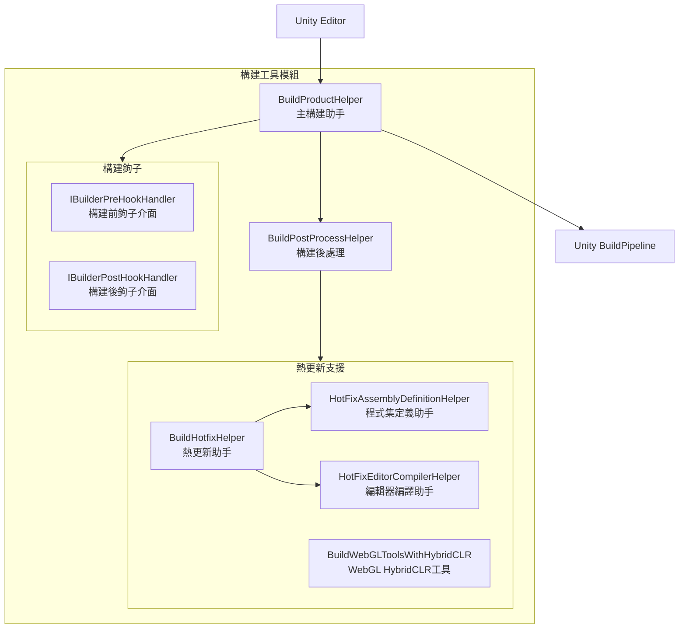
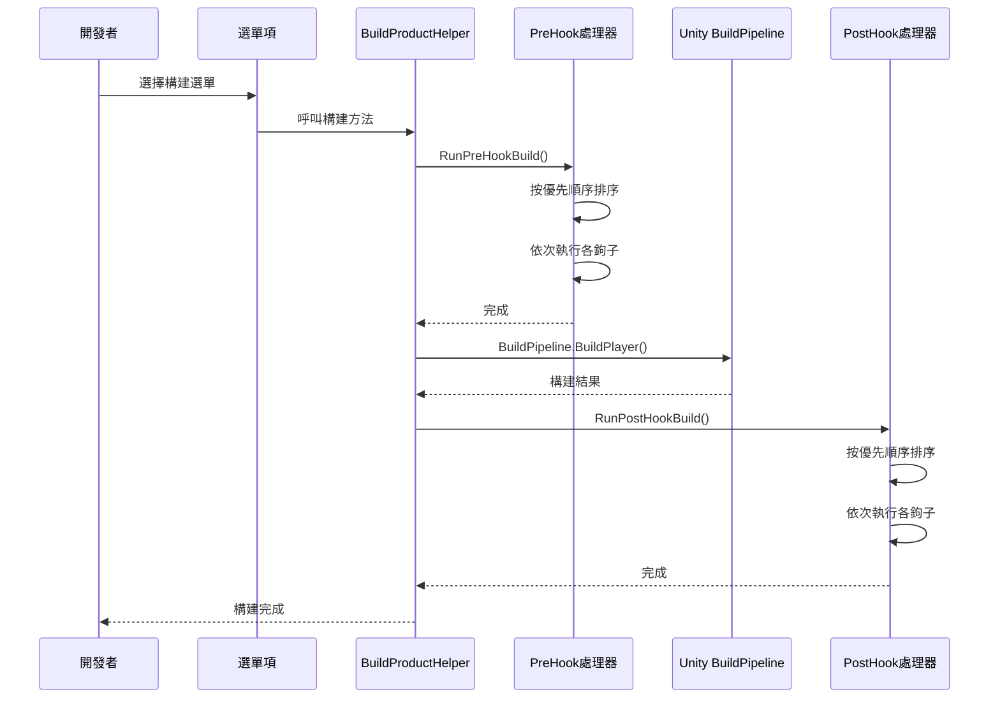

# 構建工具

GameFrameX 提供了一套完整的 Unity 編輯器構建工具，支援多平臺構建、熱更新（HybridCLR）整合、構建鉤子擴充套件等功能。

## 概述

構建工具模組位於 `Editor/` 目錄下，主要包含以下核心組件：

- **BuildProductHelper** - 主構建助手，提供多平臺構建功能
- **BuildHotfixHelper** - 熱更新程式碼管理助手
- **Hook 機制** - 構建前後的擴充套件鉤子介面

這些工具透過 Unity Editor 選單 `GameFrameX/Build` 提供統一的構建入口，簡化了跨平臺構建流程。

## 架構



### 核心組件說明

| 組件 | 檔案路徑 | 說明 |
|------|----------|------|
| BuildProductHelper | `Editor/BuildProduct/BuildProductHelper.cs` | 主構建助手，支援 Windows、Mac、Android、iOS、WebGL 平臺構建 |
| BuildPostProcessHelper | `Editor/BuildProduct/BuildPostProcessHelper.cs` | 構建後自動更新版本號 |
| IBuilderPreHookHandler | `Editor/BuildProduct/IBuilderPreHookHandler.cs` | 構建前鉤子介面 |
| IBuilderPostHookHandler | `Editor/BuildProduct/IBuilderPostHookHandler.cs` | 構建後鉤子介面 |
| BuildHotfixHelper | `Editor/BuildHotfix/BuildHotfixHelper.cs` | 熱更新程式碼複製和管理 |
| HotFixEditorCompilerHelper | `Editor/BuildHotfix/HotFixEditorCompilerHelper.cs` | 編輯器編譯控制 |
| HotFixAssemblyDefinitionHelper | `Editor/BuildHotfix/HotFixAssemblyDefinitionHelper.cs` | 程式集定義檔案修改 |
| BuildWebGLToolsWithHybridCLR | `Editor/BuildWebGLTools/BuildWebGLToolsWithHybridCLR.cs` | WebGL HybridCLR 支援 |

## 選單項

構建工具透過 Unity Editor 選單提供統一的構建入口，位於 `GameFrameX/Build` 選單下：

| 選單項 | 功能 |
|--------|------|
| Windows X64 | 構建 Windows x64 可執行檔案 |
| Windows X32 | 構建 Windows x32 可執行檔案 |
| Mac Os | 構建 macOS 應用程式 |
| WebGL | 構建 WebGL 版本 |
| Apk | 構建 Android APK |
| AAB | 構建 Android AAB 包 |
| AndroidStudio Project Debug | 匯出 Android Studio Debug 專案 |
| AndroidStudio Project Release | 匯出 Android Studio Release 專案 |
| Xcode Project Debug | 匯出 Xcode Debug 專案 |
| Xcode Project Release | 匯出 Xcode Release 專案 |
| Copy HotFix Code | 複製熱更新程式碼到 Bundles/Code 目錄 |
| Copy AOT Code | 複製 AOT 程式碼到 Bundles/AOTCode 目錄 |
| HotFix Editor Compiler Add | 新增熱更新程式集的編輯器編譯指令 |
| HotFix Editor Compiler Remove | 移除熱更新程式集的編輯器編譯指令 |

## 核心功能

### 多平臺構建

BuildProductHelper 支援以下平臺的構建：

```csharp
// Windows x64 構建
[MenuItem("GameFrameX/Build/Windows X64", false, 100)]
public static void BuildPlayerToWindows64BuildTarget()

// Windows x32 構建
[MenuItem("GameFrameX/Build/Windows X32", false, 100)]
public static void BuildPlayerToWindows32BuildTarget()

// macOS 構建
[MenuItem("GameFrameX/Build/Mac Os", false, 200)]
public static void BuildPlayerToMacBuildTarget()

// WebGL 構建
[MenuItem("GameFrameX/Build/WebGL", false, 300)]
private static void BuildPlayerToWebGL()

// Android APK 構建
[MenuItem("GameFrameX/Build/Apk", false, 400)]
private static void BuildPlayerToAndroid()

// Android AAB 構建
[MenuItem("GameFrameX/Build/AAB", false, 400)]
private static void BuildAppBundleForAndroid()

// Android Studio 專案匯出（Debug/Release）
[MenuItem("GameFrameX/Build/AndroidStudio Project Debug", false, 500)]
private static void ExportToAndroidStudioToDevelop()

[MenuItem("GameFrameX/Build/AndroidStudio Project Release", false, 500)]
private static void ExportToAndroidStudioToRelease()

// Xcode 專案匯出（Debug/Release）
[MenuItem("GameFrameX/Build/Xcode Project Debug", false, 250)]
private static void ExportToXcodeToDevelop()

[MenuItem("GameFrameX/Build/Xcode Project Release", false, 250)]
private static void ExportToXcodeToRelease()
```
> Source: [BuildProductHelper.cs](https://github.com/GameFrameX/com.gameframex.unity/blob/main/Editor/BuildProduct/BuildProductHelper.cs#L101-L662)

### 構建鉤子機制

透過實現 `IBuilderPreHookHandler` 和 `IBuilderPostHookHandler` 介面，可以在構建前後執行自定義邏輯：

```csharp
using UnityEditor;

namespace MyProject.Editor
{
    /// <summary>
    /// 構建前鉤子示例
    /// </summary>
    public class MyPreBuildHook : IBuilderPreHookHandler
    {
        /// <summary>
        /// 優先順序，數值越大優先順序越低
        /// </summary>
        public int Priority => 0;

        /// <summary>
        /// 執行構建前邏輯
        /// </summary>
        /// <param name="target">構建目標平臺</param>
        /// <param name="path">構建輸出路徑</param>
        public void Run(BuildTarget target, string path)
        {
            // 在構建前執行的自定義邏輯
            UnityEngine.Debug.Log($"開始構建 {target} 到 {path}");
        }
    }

    /// <summary>
    /// 構建後鉤子示例
    /// </summary>
    public class MyPostBuildHook : IBuilderPostHookHandler
    {
        /// <summary>
        /// 優先順序
        /// </summary>
        public int Priority => 0;

        /// <summary>
        /// 執行構建後邏輯
        /// </summary>
        /// <param name="target">構建目標平臺</param>
        /// <param name="path">構建輸出路徑</param>
        public void Run(BuildTarget target, string path)
        {
            // 在構建後執行的自定義邏輯
            UnityEngine.Debug.Log($"構建完成 {target} 輸出路徑 {path}");
        }
    }
}
```
> Sources:
> - [IBuilderPreHookHandler.cs](https://github.com/GameFrameX/com.gameframex.unity/blob/main/Editor/BuildProduct/IBuilderPreHookHandler.cs#L39-L52)
> - [IBuilderPostHookHandler.cs](https://github.com/GameFrameX/com.gameframex.unity/blob/main/Editor/BuildProduct/IBuilderPostHookHandler.cs#L39-L52)

**鉤子執行流程：**



### 熱更新支援 (HybridCLR)

GameFrameX 內建對 HybridCLR 熱更新解決方案的支援：

#### 啟用/禁用 HybridCLR

```csharp
// 禁用 HybridCLR
[MenuItem("GameFrameX/Scripting Define Symbols/Disable HybridCLR(關閉HybridCLR適配)", false, 5000)]
public static void DisableHybridCLR()
{
    ScriptingDefineSymbols.AddScriptingDefineSymbol(HybridCLRScriptingDefineSymbol);
}

// 啟用 HybridCLR
[MenuItem("GameFrameX/Scripting Define Symbols/Enable HybridCLR(開啟HybridCLR適配)", false, 5001)]
public static void EnableHybridCLR()
{
    ScriptingDefineSymbols.RemoveScriptingDefineSymbol(HybridCLRScriptingDefineSymbol);
}
```
> Source: [BuildHotfixHelper.cs](https://github.com/GameFrameX/com.gameframex.unity/blob/main/Editor/BuildHotfix/BuildHotfixHelper.cs#L107-L125)

#### 複製熱更新程式碼

```csharp
// 複製熱更新 DLL 到 Assets/Bundles/Code
[MenuItem("GameFrameX/Build/Copy HotFix Code(複製熱更新程式碼到Assets>Bundles>Code)", false, 10)]
public static void CopyHotfixCode()
{
    // 從 Library/ScriptAssemblies 複製 Unity.HotFix.dll 到 Assets/Bundles/Code
}

// 複製 AOT 程式碼到 Assets/Bundles/AOTCode
[MenuItem("GameFrameX/Build/Copy AOT Code(複製AOT程式碼到Assets>Bundles>AOTCode)", false, 11)]
public static void CopyAOTCode()
{
    // 從 HybridCLRData/AssembliesPostIl2CppStrip 複製 AOT DLL
}
```
> Source: [BuildHotfixHelper.cs](https://github.com/GameFrameX/com.gameframex.unity/blob/main/Editor/BuildHotfix/BuildHotfixHelper.cs#L43-L104)

### 編輯器編譯控制

在構建過程中，需要臨時控制熱更新程式集的編譯範圍：

```csharp
// 移除熱更新程式集的編輯器編譯指令
[MenuItem("GameFrameX/Build/HotFix Editor Compiler Remove(移除熱更新程式集的編輯器編譯指令)", false, 15)]
public static void RemoveEditor()
{
    var path = "Assets/Hotfix/Unity.HotFix.asmdef";
    HotFixAssemblyDefinitionHelper.RemoveEditor(path);
}

// 增加熱更新程式集的編輯器編譯指令
[MenuItem("GameFrameX/Build/HotFix Editor Compiler Add(增加熱更新程式集的編輯器編譯指令)", false, 16)]
public static void AddEditor()
{
    var path = "Assets/Hotfix/Unity.HotFix.asmdef";
    HotFixAssemblyDefinitionHelper.AddEditor(path);
}
```
> Source: [HotFixEditorCompilerHelper.cs](https://github.com/GameFrameX/com.gameframex.unity/blob/main/Editor/BuildHotfix/HotFixEditorCompilerHelper.cs#L8-L29)

### 構建後自動處理

BuildPostProcessHelper 在每次構建後自動更新版本號：

```csharp
[PostProcessBuild(999)]
public static void OnPostProcessBuild(BuildTarget target, string path)
{
    if (target == BuildTarget.Android)
    {
        // Android: bundleVersionCode + 1
        PlayerSettings.Android.bundleVersionCode = Convert.ToInt32(PlayerSettings.Android.bundleVersionCode) + 1;
    }

    if (target == BuildTarget.iOS)
    {
        // iOS: buildNumber + 1
        PlayerSettings.iOS.buildNumber = (Convert.ToInt32(PlayerSettings.iOS.buildNumber) + 1).ToString();
    }
}
```
> Source: [BuildPostProcessHelper.cs](https://github.com/GameFrameX/com.gameframex.unity/blob/main/Editor/BuildProduct/BuildPostProcessHelper.cs#L43-L57)

### 構建輸出路徑管理

構建輸出路徑按照以下規則自動生成：

```csharp
// 路徑格式: Builds/{平臺}/{包名}/{版本號}/{時間戳}
var pathName = $"{Application.identifier}_{_buildTime}_v_{PlayerSettings.bundleVersion}";

// Android 特殊格式
if (EditorUserBuildSettings.activeBuildTarget == BuildTarget.Android)
{
    pathName = $"{_buildTime}_code_{PlayerSettings.Android.bundleVersionCode}";
}

// iOS/macOS 特殊格式
else if (EditorUserBuildSettings.activeBuildTarget == BuildTarget.iOS || 
         EditorUserBuildSettings.activeBuildTarget == BuildTarget.StandaloneOSX)
{
    pathName = $"{_buildTime}_code_{PlayerSettings.iOS.buildNumber}";
}
```
> Source: [BuildProductHelper.cs](https://github.com/GameFrameX/com.gameframex.unity/blob/main/Editor/BuildProduct/BuildProductHelper.cs#L703-L746)

## 使用示例

### 基礎構建流程

1. **選擇目標平臺**：在 Unity Editor 中開啟場景
2. **設定構建目標**：透過 `File > Build Settings` 選擇目標平臺
3. **執行構建**：透過 `GameFrameX/Build` 選單選擇對應的構建選項
4. **檢視輸出**：構建完成後，在 `Builds/{平臺}/` 目錄下檢視輸出

### 使用構建鉤子擴充套件

建立一個自定義構建鉤子，用於在構建前清理舊資源：

```csharp
using UnityEditor;
using GameFrameX.Editor;

public class CustomBuildHook : IBuilderPreHookHandler
{
    public int Priority => 10; // 較低優先順序

    public void Run(BuildTarget target, string path)
    {
        // 清理舊的構建快取
        string cachePath = $"{path}/Cache";
        if (System.IO.Directory.Exists(cachePath))
        {
            System.IO.Directory.Delete(cachePath, true);
        }
        
        UnityEngine.Debug.Log($"構建前清理完成: {target}");
    }
}
```

### API 程式化構建

可以透過程式碼呼叫實現自動化構建：

```csharp
using GameFrameX.Editor;

// 構建 Android APK
string apkPath = BuildProductHelper.BuildPlayerAndroid();

// 構建 WebGL
string webglPath = BuildProductHelper.BuildPlayerWebGL();

// 構建 Xcode 專案
string xcodePath = BuildProductHelper.BuildPlayerXcode();
```
> Source: [BuildProductHelper.cs](https://github.com/GameFrameX/com.gameframex.unity/blob/main/Editor/BuildProduct/BuildProductHelper.cs#L281-L368)

## 相關連結

- [小遊戲平臺適配](./6-editor-tools.mini-game-platform) - 瞭解如何適配微信、位元組跳動等小遊戲平臺
- [包管理工具](./6-editor-tools.package-management) - 瞭解包管理功能
- [執行時模組概述](./5-runtime.base) - 瞭解執行時基礎組件
- [事件系統](./5-runtime.event-system) - 瞭解事件系統
- [物件池系統](./5-runtime.object-pool) - 瞭解物件池系統
