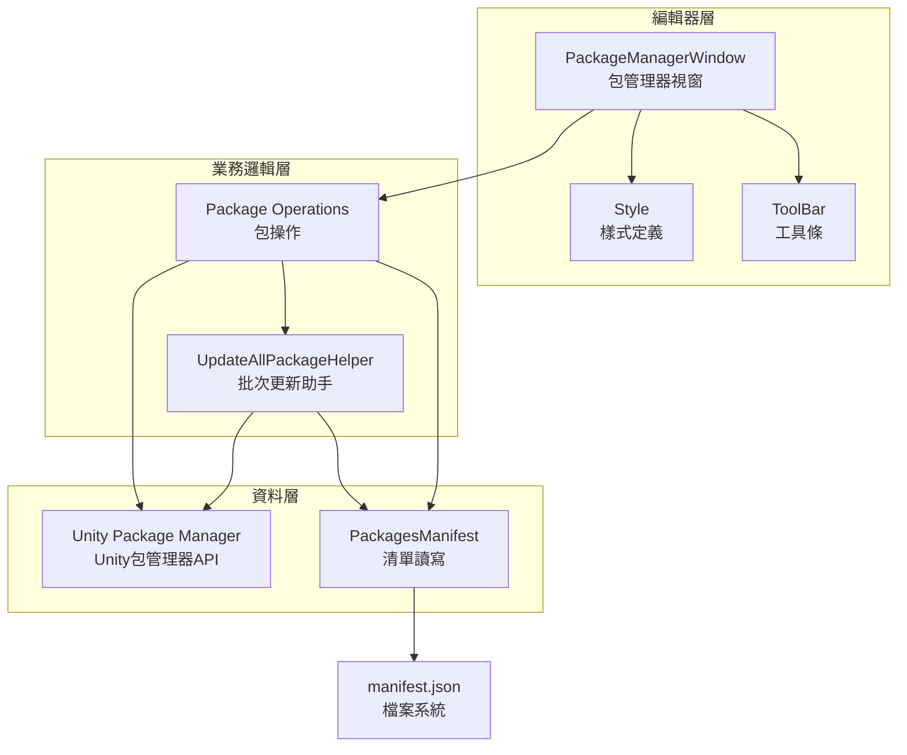
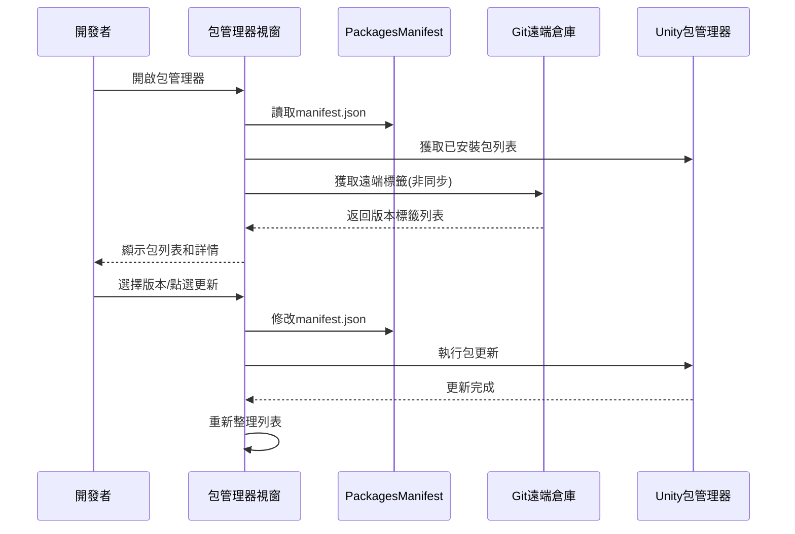

# 包管理工具

GameFrameX 包管理工具是一套完整的 Unity 編輯器擴充套件，專門用於管理基於 Git 的依賴包。它提供了視覺化的包管理介面和批次更新功能，幫助開發者更高效地管理專案依賴。

## 概述

GameFrameX 包管理工具是 Unity 編輯器擴充套件，整合在 `GameFrameX` 選單下。該工具主要解決以下問題：

1. **視覺化包管理** - 透過圖形介面檢視所有已安裝的 Git 包及其詳細資訊
2. **版本切換** - 支援在同一包的不同版本間自由切換（升級/降級）
3. **批次更新** - 一鍵更新所有 Git 包到最新版本
4. **映象切換** - 支援在 GitHub 和 Gitee 映象間快速切換

### 核心功能

| 功能 | 說明 |
|------|------|
| 包列表顯示 | 顯示所有已安裝的 Git 包 |
| 包詳情檢視 | 檢視包的名稱、版本、作者、描述等資訊 |
| 版本切換 | 支援升級/降級到指定版本 |
| 批次更新 | 一鍵更新所有包到最新版本 |
| 映象切換 | 支援 GitHub/Gitee 映象切換 |
| 重新整理功能 | 重新載入包列表 |

## 架構設計



### 組件說明

| 組件 | 檔案路徑 | 職責 |
|------|----------|------|
| PackageManagerWindow | Editor/PackageManager/PackageManagerWindow.cs | 主視窗介面，提供包列表和詳情展示 |
| PackageManagerWindow.Package | Editor/PackageManager/PackageManagerWindow.Package.cs | 包操作邏輯，包括載入、版本獲取 |
| PackageManagerWindow.ToolBar | Editor/PackageManager/PackageManagerWindow.ToolBar.cs | 工具條 UI，提供重新整理、更新、映象切換 |
| PackageManagerWindow.Style | Editor/PackageManager/PackageManagerWindow.Style.cs | 樣式定義 |
| PackagesManifest | Editor/PackageManager/PackagesManifest.cs | manifest.json 讀寫封裝 |
| UpdateAllPackageHelper | Editor/UpdatePackages/UpdateAllPackageHelper.cs | 批次更新功能 |

## 核心功能詳解

### 開啟包管理器

透過選單 `GameFrameX → Package Manager(GameFrameX的包管理器)` 開啟包管理視窗。

```csharp
[MenuItem("GameFrameX/Package Manager(GameFrameX的包管理器)", false, 2000)]
public static void ShowWindow()
{
    var window = GetWindow<PackageManagerWindow>("GameFrameX");
    window.minSize = new UnityEngine.Vector2(800, 600);
    window.Show();
}
```
> Source: [PackageManagerWindow.cs](https://github.com/GameFrameX/com.gameframex.unity/blob/main/Editor/PackageManager/PackageManagerWindow.cs#L11-L17)

### 包資訊模型

```csharp
public sealed class PackageManagerInfo
{
    /// <summary>
    /// 包名稱
    /// </summary>
    public string Name { get; }
    
    /// <summary>
    /// 包 git 地址
    /// </summary>
    public string GitUrl { get; }
    
    /// <summary>
    /// 包資訊
    /// </summary>
    public PackageInfo Package { get; }
    
    /// <summary>
    /// 版本列表，Tags
    /// </summary>
    public List<string> Versions { get; }
}
```
> Source: [PackageManagerWindow.Package.cs](https://github.com/GameFrameX/com.gameframex.unity/blob/main/Editor/PackageManager/PackageManagerWindow.Package.cs#L20-L49)

### 獲取 Git 標籤版本

工具透過呼叫 git ls-remote 獲取遠端倉庫的所有標籤：

```csharp
private void FetchGitTags(string gitUrl, PackageManagerInfo package)
{
    isLoadingPackageTagList = true;
    Task.Run(() =>
    {
        ProcessStartInfo startInfo = new ProcessStartInfo
        {
            FileName = "git",
            Arguments = $"ls-remote --tags {gitUrl}",
            RedirectStandardOutput = true,
            UseShellExecute = false,
            CreateNoWindow = true
        };
        using (Process process = Process.Start(startInfo))
        {
            using (StreamReader reader = process.StandardOutput)
            {
                string result = reader.ReadToEnd();
                string[] tags = result.Split('\n');
                foreach (var tag in tags)
                {
                    if (!string.IsNullOrEmpty(tag) && !tag.Contains("^{"))
                    {
                        // 提取標籤名
                        var tagName = tag.Split('\t')[1].Replace("refs/tags/", "").Trim();
                        package.Versions.Add(tagName);
                    }
                }
                package.Versions.Sort((x, y) => -x.CompareTo(y));
            }
        }
        isLoadingPackageTagList = false;
    });
}
```
> Source: [PackageManagerWindow.Package.cs](https://github.com/GameFrameX/com.gameframex.unity/blob/main/Editor/PackageManager/PackageManagerWindow.Package.cs#L103-L144)

### 版本更新/降級

```csharp
void UpdateToVersion(string packageName, string version)
{
    StartLoadPackages();
    PackagesManifest saveManifest = new PackagesManifest
    {
        Dependencies = new Dictionary<string, string>(PackagesManifest.Dependencies),
    };
    foreach (var dependency in PackagesManifest.Dependencies)
    {
        if (dependency.Key.Equals(packageName, StringComparison.OrdinalIgnoreCase))
        {
            string packageUrl = dependency.Value;
            if (packageUrl.Contains(".git"))
            {
                int indexTag = packageUrl.LastIndexOf("#", StringComparison.InvariantCulture);
                string url;
                if (indexTag >= 0)
                {
                    // 已有版本號
                    url = packageUrl.Substring(0, indexTag);
                    url = $"{url}#{version}";
                }
                else
                {
                    url = packageUrl.Split(new[] { ".git", }, StringSplitOptions.RemoveEmptyEntries)[0];
                    url = $"{url}.git#{version}";
                }
                saveManifest.Dependencies[dependency.Key] = url;
                UpdateAllPackageHelper.UpdatePackages(packageName, url);
                continue;
            }
            saveManifest.Dependencies[dependency.Key] = packageUrl;
        }
    }
    SavePackages(saveManifest);
    UpdateAllPackageHelper.StartUpdate();
    AssetDatabase.Refresh();
}
```
> Source: [PackageManagerWindow.cs](https://github.com/GameFrameX/com.gameframex.unity/blob/main/Editor/PackageManager/PackageManagerWindow.cs#L230-L271)

## 使用流程



## 批次更新功能

### 選單入口

```csharp
[MenuItem("GameFrameX/Update All Packages(更新所有git包)", false, 2000)]
public static void UpdatePackages()
{
    var result = EditorUtility.DisplayDialog("更新包提示", "是否更新所有包?\n 更新完成之後需要[重啟、重啟、重啟]Unity", "是", "否");
    if (result)
    {
        var manifestPath = Path.Combine(Application.dataPath, "..", "Packages", "manifest.json");
        UpdatePackagesFromManifest(manifestPath);
    }
}
```
> Source: [UpdateAllPackageHelper.cs](https://github.com/GameFrameX/com.gameframex.unity/blob/main/Editor/UpdatePackages/UpdateAllPackageHelper.cs#L24-L33)

### 更新進度處理

```csharp
private static void UpdatingProgressHandler()
{
    if (_addRequest.IsCompleted)
    {
        if (_addRequest.Status == StatusCode.Success)
        {
            UnityEngine.Debug.Log($"Updated package: {_addRequest.Result.packageId}");
        }
        else if (_addRequest.Status >= StatusCode.Failure)
        {
            UnityEngine.Debug.LogError($"Failed to update package: {_addRequest.Error.message}");
        }
        EditorApplication.update -= UpdatingProgressHandler;
        UpdateNextPackage();
    }
}
```
> Source: [UpdateAllPackageHelper.cs](https://github.com/GameFrameX/com.gameframex.unity/blob/main/Editor/UpdatePackages/UpdateAllPackageHelper.cs#L110-L126)

## 映象切換功能

工具支援在 GitHub 和 Gitee 映象間切換，適應不同網路環境：

```csharp
private void OnGUIByToolBar()
{
    GUILayout.BeginHorizontal(EditorStyles.toolbar);
    GUILayout.Label("映象列表:", EditorStyles.label, GUILayout.Width(100));
    int newDropdownIndex = EditorGUILayout.Popup(_selectedDropdownIndex, _dropdownOptions, EditorStyles.toolbarDropDown);
    if (newDropdownIndex != _selectedDropdownIndex)
    {
        var confirmed = EditorUtility.DisplayDialog("切換提示", 
            $"您將要將所有的包的下載地址切換為映象地址:\n{_dropdownOptions[newDropdownIndex]}\n可能會遇到部分庫沒有的情況。請提交Issue反饋", "確認", "取消");
        
        if (confirmed)
        {
            _selectedDropdownIndex = newDropdownIndex;
            // 更新所有包的 URL
            foreach (var manifestDependency in PackagesManifest.Dependencies)
            {
                if (manifestDependency.Value.StartsWith("https://"))
                {
                    var path = manifestDependency.Value.Replace("https://", string.Empty).Replace("\\", "/");
                    var index = path.IndexOf("/", System.StringComparison.OrdinalIgnoreCase);
                    if (index >= 0)
                    {
                        path = path.Substring(index);
                    }
                    dependencies[manifestDependency.Key] = $"https://{_dropdownOptions[_selectedDropdownIndex]}{path}";
                }
            }
            PackagesManifest.Dependencies = dependencies;
            SavePackages(PackagesManifest);
        }
    }
    // ... 重新整理和更新按鈕
}
```
> Source: [PackageManagerWindow.ToolBar.cs](https://github.com/GameFrameX/com.gameframex.unity/blob/main/Editor/PackageManager/PackageManagerWindow.ToolBar.cs#L13-L49)

## 常見問題

### Q: 更新包後需要重啟 Unity 嗎？

是的，由於 Unity 包管理器的限制，更新包後需要**重啟 Unity 編輯器**才能生效。工具會彈出提示框提醒您。

### Q: 為什麼某些包沒有顯示版本列表？

這可能是因為：
1. 遠端倉庫沒有建立 Git Tag
2. 網路問題導致無法獲取遠端標籤
3. Git 倉庫不支援 ls-remote 操作

如遇此問題，可以點選"該庫缺失Tag或者版本標記? 我要反饋"按鈕提交 Issue。

### Q: 映象切換後部分包無法下載怎麼辦？

由於 Gitee 映象可能與 GitHub 倉庫不完全同步，切換後可能出現部分包無法下載的情況。請提交 Issue 反饋，開發者會盡快處理。

### Q: 如何取消正在進行的批次更新？

在批次更新過程中，Progress Bar 右上角有關閉按鈕，點選即可取消更新。

## 相關連結

- [構建工具](./6-editor-tools.build-tools)
- [小遊戲平臺適配](./6-editor-tools.mini-game-platform)
- [檢視面板工具](./6-editor-tools.inspector-tools)
- [圖片裁剪工具](./6-editor-tools.cropping-tool)
- [Unity Package Manager 文件](https://docs.unity3d.com/Manual/Packages.html)
