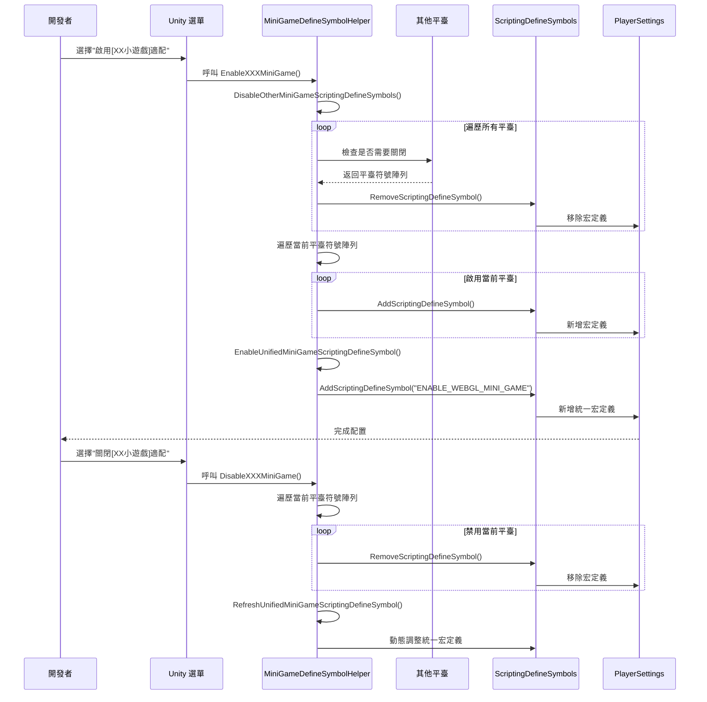

# 小遊戲平臺適配

小遊戲平臺適配模組提供了對 21 個主流小遊戲平臺的統一宏定義管理解決方案。透過該模組，開發者可以一鍵切換目標平臺，系統會自動處理平臺之間的互斥關係，並生成統一的 WebGL 小遊戲宏定義。

## 概述

在開發 Unity WebGL 小遊戲時，針對不同平臺需要設定不同的指令碼宏定義（Scripting Define Symbols）來啟用平臺特定的程式碼適配。傳統方式需要手動在 PlayerSettings 中配置，既繁瑣又容易出錯。

小遊戲平臺適配模組透過以下設計解決這些問題：

- **一鍵切換**：透過 Unity 選單欄快速啟用/禁用目標平臺
- **自動互斥**：啟用新平臺時自動關閉其他平臺，避免宏定義衝突
- **統一標識**：自動管理 `ENABLE_WEBGL_MINI_GAME` 統一宏，便於編寫跨平臺通用程式碼
- **平臺分類**：按國內小遊戲、海外小遊戲、裝置廠商、遊戲平臺四類組織，便於管理

## 架構設計

```mermaid
graph TB
    subgraph Core["核心層 - MiniGameDefineSymbolHelper.cs"]
        Main["主類定義<br/>MiniGameDefineSymbolHelper"]
        GetAll["獲取所有平臺符號<br/>GetAllMiniGameScriptingDefineSymbols"]
        DisableOthers["關閉其他平臺<br/>DisableOtherMiniGameScriptingDefineSymbols"]
        EnableUnified["啟用統一符號<br/>EnableUnifiedMiniGameScriptingDefineSymbol"]
        RefreshUnified["重新整理統一符號<br/>RefreshUnifiedMiniGameScriptingDefineSymbol"]
    end
    
    subgraph Domestic["國內小遊戲 - DomesticMiniGames"]
        WC["微信 WeChat"]
        DY["抖音 DouYin"]
        KS["快手 KuaiShou"]
        BD["百度 Baidu"]
        AL["支付寶 Alipay"]
        MT["美團 Meituan"]
        BL["嗶哩嗶哩 Bilibili"]
        JD["京東 JingDong"]
        TB["淘寶 Taobao"]
        TT["TapTap"]
    end
    
    subgraph International["海外小遊戲 - InternationalMiniGames"]
        CG["CrazyGames"]
        DC["Discord"]
        FB["Facebook"]
        GP["Google Play"]
        PK["Poki"]
        TTInt["TikTok"]
        YT["YouTube"]
    end
    
    subgraph Device["裝置廠商 - DeviceOEMs"]
        HW["華為 Huawei"]
        OP["OPPO"]
        VI["Vivo"]
        XM["小米 Xiaomi"]
    end
    
    subgraph Utilities["工具層 - ScriptingDefineSymbols"]
        Util["ScriptingDefineSymbols<br/>工具類"]
    end
    
    Main --> GetAll
    Main --> DisableOthers
    Main --> EnableUnified
    Main --> RefreshUnified
    
    GetAll --> WC
    GetAll --> DY
    GetAll --> KS
    GetAll --> BD
    GetAll --> AL
    GetAll --> MT
    GetAll --> BL
    GetAll --> JD
    GetAll --> TB
    GetAll --> TT
    GetAll --> CG
    GetAll --> DC
    GetAll --> FB
    GetAll --> GP
    GetAll --> PK
    GetAll --> TTInt
    GetAll --> YT
    GetAll --> HW
    GetAll --> OP
    GetAll --> VI
    GetAll --> XM
    
    DisableOthers --> Util
    EnableUnified --> Util
    RefreshUnified --> Util
```



### 架構說明

核心層 `MiniGameDefineSymbolHelper` 是整個模組的主控制器，提供以下核心功能：

1. **獲取所有平臺符號** (`GetAllMiniGameScriptingDefineSymbols`)：收集所有已註冊的小遊戲平臺宏定義
2. **關閉其他平臺** (`DisableOtherMiniGameScriptingDefineSymbols`)：實現平臺間的互斥邏輯
3. **啟用統一符號** (`EnableUnifiedMiniGameScriptingDefineSymbol`)：管理 `ENABLE_WEBGL_MINI_GAME` 統一宏
4. **重新整理統一符號** (`RefreshUnifiedMiniGameScriptingDefineSymbol`)：根據當前平臺狀態動態調整統一宏

平臺層按功能分為四個資料夾，每個平臺以 partial class 的形式擴充套件主類，透過 `[MenuItem]` 屬性在 Unity 選單欄生成對應的啟用/禁用選項。

## 核心功能流程



### 設計意圖

該流程設計遵循以下原則：

1. **互斥性**：透過 `DisableOtherMiniGameScriptingDefineSymbols` 確保同時只有一個平臺被啟用，防止宏定義衝突導致的編譯錯誤

2. **統一性**：每個平臺啟用時都會自動新增 `ENABLE_WEBGL_MINI_GAME` 統一宏，開發者可以使用該宏編寫平臺無關的核心邏輯

3. **動態重新整理**：禁用平臺時會檢查是否還有其他平臺處於啟用狀態，如果沒有則自動關閉統一宏，避免無效宏定義的存在

## 支援的平臺

### 國內小遊戲 (Domestic Mini Games)

| 平臺 | 宏定義 | 選單路徑 |
|------|--------|----------|
| 微信 WeChat | `ENABLE_WECHAT_MINI_GAME`, `WEIXINMINIGAME` | GameFrameX → Scripting Define Symbols → Domestic Mini Games |
| 抖音 DouYin | `ENABLE_DOUYIN_MINI_GAME`, `DOUYINMINIGAME`, `TTSDK_MIX_ENGINE` | GameFrameX → Scripting Define Symbols → Domestic Mini Games |
| 快手 KuaiShou | `ENABLE_KUAISHOU_MINI_GAME`, `KUAISHOUMINIGAME` | GameFrameX → Scripting Define Symbols → Domestic Mini Games |
| 百度 Baidu | `ENABLE_BAIDU_MINI_GAME`, `BAIDUMINIGAME` | GameFrameX → Scripting Define Symbols → Domestic Mini Games |
| 支付寶 Alipay | `ENABLE_ALIPAY_MINI_GAME`, `ALIPAYMINIGAME` | GameFrameX → Scripting Define Symbols → Domestic Mini Games |
| 美團 Meituan | `ENABLE_MEITUAN_MINI_GAME`, `MEITUANMINIGAME` | GameFrameX → Scripting Define Symbols → Domestic Mini Games |
| 嗶哩嗶哩 Bilibili | `ENABLE_BILIBILI_MINI_GAME`, `BILIBILIMINIGAME` | GameFrameX → Scripting Define Symbols → Domestic Mini Games |
| 京東 JingDong | `ENABLE_JINGDONG_MINI_GAME`, `JINGDONGMINIGAME` | GameFrameX → Scripting Define Symbols → Domestic Mini Games |
| 淘寶 Taobao | `ENABLE_TAOBAO_MINI_GAME`, `TAOBAOMINIGAME` | GameFrameX → Scripting Define Symbols → Domestic Mini Games |
| TapTap | `ENABLE_TAPTAP_MINI_GAME`, `TAPTAPMINIGAME` | GameFrameX → Scripting Define Symbols → Game Platforms |

### 海外小遊戲 (International Mini Games)

| 平臺 | 宏定義 | 選單路徑 |
|------|--------|----------|
| CrazyGames | `ENABLE_CRAZYGAMES_MINI_GAME`, `CRAZYGAMESMINIGAME` | GameFrameX → Scripting Define Symbols → International Mini Games |
| Discord | `ENABLE_DISCORD_MINI_GAME`, `DISCORDMINIGAME` | GameFrameX → Scripting Define Symbols → International Mini Games |
| Facebook | `ENABLE_FACEBOOK_MINI_GAME`, `FACEBOOKMINIGAME` | GameFrameX → Scripting Define Symbols → International Mini Games |
| Google Play | `ENABLE_GOOGLEPLAY_MINI_GAME`, `GOOGLEPLAYMINIGAME` | GameFrameX → Scripting Define Symbols → International Mini Games |
| Poki | `ENABLE_POKI_MINI_GAME`, `POKIMINIGAME` | GameFrameX → Scripting Define Symbols → International Mini Games |
| TikTok | `ENABLE_TIKTOK_MINI_GAME`, `TIKTOKMINIGAME` | GameFrameX → Scripting Define Symbols → International Mini Games |
| YouTube | `ENABLE_YOUTUBE_MINI_GAME`, `YOUTUBEMINIGAME` | GameFrameX → Scripting Define Symbols → International Mini Games |

### 裝置廠商 (Device OEMs)

| 平臺 | 宏定義 | 選單路徑 |
|------|--------|----------|
| 華為 Huawei | `ENABLE_HUAWEI_MINI_GAME`, `HUAWEIMINIGAME` | GameFrameX → Scripting Define Symbols → Device OEMs |
| OPPO | `ENABLE_OPPO_MINI_GAME`, `OPPOSMINIGAME` | GameFrameX → Scripting Define Symbols → Device OEMs |
| Vivo | `ENABLE_VIVO_MINI_GAME`, `VIVOMINIGAME` | GameFrameX → Scripting Define Symbols → Device OEMs |
| 小米 Xiaomi | `ENABLE_XIAOMI_MINI_GAME`, `XIAOMIMINIGAME` | GameFrameX → Scripting Define Symbols → Device OEMs |

## 使用示例

### 基礎使用：啟用平臺

在 Unity 編輯器中，透過選單欄選擇對應的平臺選項即可啟用適配：

```
GameFrameX → Scripting Define Symbols → Domestic Mini Games → Enable WeChat Mini Game
```

啟用後，系統會自動執行以下操作：
1. 關閉其他所有小遊戲平臺的宏定義
2. 啟用微信小遊戲的宏定義 (`ENABLE_WECHAT_MINI_GAME`, `WEIXINMINIGAME`)
3. 啟用統一宏定義 (`ENABLE_WEBGL_MINI_GAME`)

### 程式碼中使用平臺宏

```csharp
#if ENABLE_WECHAT_MINI_GAME
using WeChatMiniGame API;
// 微信小遊戲特定程式碼
#elif ENABLE_DOUYIN_MINI_GAME
using DouYinMiniGameAPI;
// 抖音小遊戲特定程式碼
#elif ENABLE_WEBGL_MINI_GAME
// 通用的 WebGL 小遊戲邏輯
#endif
```

> Source: [MiniGameDefineSymbolHelper.WeChat.cs](https://github.com/GameFrameX/com.gameframex.unity/blob/main/Editor/MiniGame/DomesticMiniGames/MiniGameDefineSymbolHelper.WeChat.cs#L20-L40)

### 禁用平臺

```
GameFrameX → Scripting Define Symbols → Domestic Mini Games → Disable WeChat Mini Game
```

禁用後，系統會移除該平臺的宏定義，並檢查是否需要調整統一宏定義。

### 平臺宏定義示例

微信小遊戲平臺的宏定義配置：

```csharp
/// <summary>
/// 微信小遊戲適配宏定義集合。
/// Define symbols for WeChat mini game adaptation.
/// </summary>
public static readonly string[] EnableWeChatMiniGameScriptingDefineSymbol = new[] 
{ 
    "ENABLE_WECHAT_MINI_GAME", 
    "WEIXINMINIGAME" 
};
```

> Source: [MiniGameDefineSymbolHelper.WeChat.cs](https://github.com/GameFrameX/com.gameframex.unity/blob/main/Editor/MiniGame/DomesticMiniGames/MiniGameDefineSymbolHelper.WeChat.cs#L10-L14)

抖音平臺包含額外的巨量引擎符號：

```csharp
/// <summary>
/// 抖音小遊戲適配宏定義集合。
/// Define symbols for DouYin mini game adaptation.
/// </summary>
public static readonly string[] EnableDouYinMiniGameScriptingDefineSymbol = new[] 
{ 
    "ENABLE_DOUYIN_MINI_GAME", 
    "DOUYINMINIGAME", 
    "TTSDK_MIX_ENGINE" 
};
```

> Source: [MiniGameDefineSymbolHelper.DouYin.cs](https://github.com/GameFrameX/com.gameframex.unity/blob/main/Editor/MiniGame/DomesticMiniGames/MiniGameDefineSymbolHelper.DouYin.cs#L10-L14)

### 核心實現邏輯

平臺啟用時的核心互斥邏輯：

```csharp
/// <summary>
/// 關閉除當前平臺以外的其它小遊戲平臺宏定義。
/// Disables define symbols of other mini game platforms except the current one.
/// </summary>
/// <param name="currentMiniGameScriptingDefineSymbols">當前平臺宏定義集合</param>
private static void DisableOtherMiniGameScriptingDefineSymbols(string[] currentMiniGameScriptingDefineSymbols)
{
#if UNITY_WEBGL
    var closedCount = 0;
    foreach (var defineSymbols in GetAllMiniGameScriptingDefineSymbols())
    {
        if (defineSymbols == null || object.ReferenceEquals(defineSymbols, currentMiniGameScriptingDefineSymbols))
        {
            continue;
        }

        foreach (var define in defineSymbols)
        {
            if (!ScriptingDefineSymbols.HasScriptingDefineSymbol(BuildTargetGroup.WebGL, define))
            {
                continue;
            }

            ScriptingDefineSymbols.RemoveScriptingDefineSymbol(define);
            closedCount++;
            UnityEngine.Debug.Log($"小遊戲宏定義 [{define}] 已經關閉");
        }
    }

    UnityEngine.Debug.Log($"小遊戲宏定義互斥清理完成，共關閉 {closedCount} 個宏定義");
#endif
}
```

> Source: [MiniGameDefineSymbolHelper.cs](https://github.com/GameFrameX/com.gameframex.unity/blob/main/Editor/MiniGame/MiniGameDefineSymbolHelper.cs#L52-L88)

## 配置說明

### 統一宏定義

所有啟用了任意小遊戲平臺的專案都會自動獲得 `ENABLE_WEBGL_MINI_GAME` 宏定義。該宏用於編寫平臺無關的核心邏輯：

```csharp
#if ENABLE_WEBGL_MINI_GAME
// 所有小遊戲平臺共用的程式碼
// 例如：統一的資源載入介面、通用的事件系統等
#endif
```

### 選單項優先順序

選單項按照平臺分類進行組織，優先順序設定如下：

| 分類 | 優先順序範圍 | 說明 |
|------|-----------|------|
| 國內小遊戲 | 2000-2099 | Domestic Mini Games |
| 遊戲平臺 | 2500-2599 | Game Platforms |
| 海外小遊戲 | 3200-3499 | International Mini Games |
| 裝置廠商 | 3700-3999 | Device OEMs |

### 注意事項

1. **僅支援 WebGL**：所有小遊戲平臺宏定義僅在 WebGL 構建目標下有效，程式碼中已新增 `#if UNITY_WEBGL` 保護
2. **互斥設計**：小遊戲平臺之間是互斥的，啟用新平臺會自動關閉舊平臺
3. **宏定義格式**：平臺宏定義通常包含兩部分：
   - `ENABLE_XXX_MINI_GAME`：統一格式，便於識別
   - `XXXMINIGAME`：平臺特定格式，與各平臺 SDK 對應

## 相關連結

- [構建工具](./6-editor-tools.build-tools) - 瞭解其他構建相關功能
- [包管理工具](./6-editor-tools.package-management) - 瞭解專案依賴管理
- [檢視面板工具](./6-editor-tools.inspector-tools) - 瞭解執行時監控工具
- [API 參考](./8-api-reference) - 檢視完整的 API 定義
