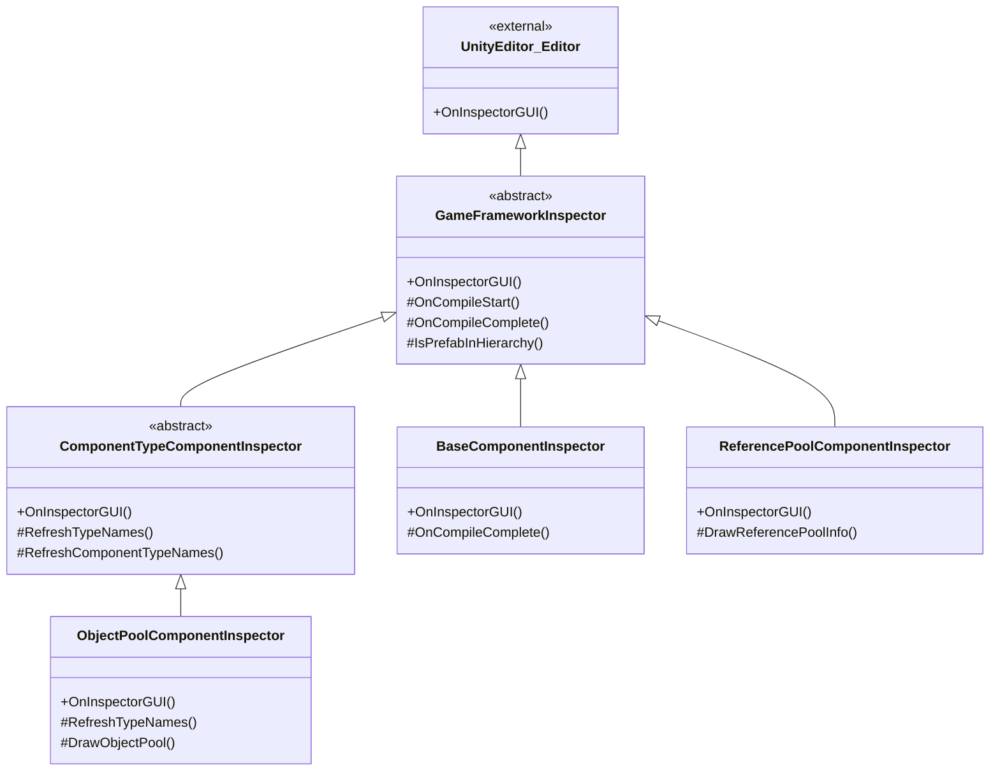

# 檢視面板工具

檢視面板工具是 GameFrameX 為 Unity 編輯器提供的一系列自定義檢視面板（Inspector）擴充套件，用於在編輯器中直觀地檢視和配置遊戲框架各組件的執行狀態和引數。

## 概述

GameFrameX 的檢視面板工具透過擴充套件 Unity 原生的 Inspector 系統，為框架的核心組件提供了更加友好和功能豐富的配置介面。這些自定義檢視面板不僅可以在編輯器模式下配置組件屬性，還能在執行時實時顯示物件池、引用池等系統的內部狀態，幫助開發者更好地除錯和最佳化遊戲效能。

檢視面板工具主要包含以下功能：
- **基礎組件檢視面板**：配置全域性助手型別（文字、版本、日誌、壓縮、JSON）和執行時引數（幀率、遊戲速度）
- **物件池檢視面板**：執行時顯示物件池狀態，支援手動釋放和 CSV 資料匯出
- **引用池檢視面板**：按程式集分組顯示引用池統計資訊，支援資料匯出
- **檢視面板鎖定快捷鍵**：透過選單快捷鍵快速切換 Inspector 鎖定狀態

## 架構

檢視面板工具採用物件導向的繼承結構，透過抽象基類定義通用功能，具體的檢視面板實現定製化的介面展示。



### 核心組件說明

| 類名 | 職責 | 繼承關係 |
|------|------|----------|
| `GameFrameworkInspector` | 所有檢視面板的抽象基類，提供編譯狀態檢測和 Prefab 層級判斷等通用功能 | 繼承自 `UnityEditor.Editor` |
| `ComponentTypeComponentInspector` | 組件型別選擇器的抽象基類，用於需要動態選擇組件型別的場景 | 繼承自 `GameFrameworkInspector` |
| `BaseComponentInspector` | `BaseComponent` 的定製檢視面板，配置全域性助手型別和執行時引數 | 繼承自 `GameFrameworkInspector` |
| `ObjectPoolComponentInspector` | `ObjectPoolComponent` 的定製檢視面板，顯示物件池執行時狀態 | 繼承自 `ComponentTypeComponentInspector` |
| `ReferencePoolComponentInspector` | `ReferencePoolComponent` 的定製檢視面板，顯示引用池統計資訊 | 繼承自 `GameFrameworkInspector` |

## 功能詳解

### 基礎檢視面板基類

`GameFrameworkInspector` 是所有自定義檢視面板的基類，提供了編譯狀態檢測和 Prefab 層級判斷等通用功能。

```csharp
public abstract class GameFrameworkInspector : UnityEditor.Editor
{
    protected const string NoneOptionName = "<None>";
    private bool m_IsCompiling = false;

    public override void OnInspectorGUI()
    {
        if (m_IsCompiling && !EditorApplication.isCompiling)
        {
            m_IsCompiling = false;
            OnCompileComplete();
        }
        else if (!m_IsCompiling && EditorApplication.isCompiling)
        {
            m_IsCompiling = true;
            OnCompileStart();
        }
    }

    protected bool IsPrefabInHierarchy(UnityEngine.Object obj)
    {
        // 判斷物件是否在 Prefab 層級檢視中
    }
}
```
> Source: [GameFrameworkInspector.cs](https://github.com/GameFrameX/com.gameframex.unity/blob/main/Editor/Inspector/GameFrameworkInspector.cs#L1-L57)

**設計意圖：**
- 監聽 Unity 編譯狀態變化，在編譯完成後自動重新整理型別列表
- 提供 Prefab 層級判斷方法，確保執行時檢視功能僅在場景中的物件上可用

### BaseComponent 檢視面板

`BaseComponentInspector` 為基礎組件提供了豐富的配置介面，包括全域性助手型別的選擇和執行時引數的控制。

```csharp
[CustomEditor(typeof(BaseComponent))]
internal sealed class BaseComponentInspector : GameFrameworkInspector
{
    private static readonly float[] GameSpeed = new float[] { 0f, 0.01f, 0.1f, 0.25f, 0.5f, 1f, 1.5f, 2f, 4f, 8f };

    public override void OnInspectorGUI()
    {
        base.OnInspectorGUI();
        serializedObject.Update();
        
        // 全域性助手型別配置
        EditorGUILayout.BeginVertical("box");
        {
            EditorGUILayout.LabelField("Global Helpers", EditorStyles.boldLabel);
            int textHelperSelectedIndex = EditorGUILayout.Popup("Text Helper", m_TextHelperTypeNameIndex, m_TextHelperTypeNames);
            // ... 其他助手型別配置
        }
        EditorGUILayout.EndVertical();

        // 幀率配置
        int frameRate = EditorGUILayout.IntSlider("Frame Rate", m_FrameRate.intValue, 1, 120);

        // 遊戲速度配置
        float gameSpeed = EditorGUILayout.Slider("Game Speed", m_GameSpeed.floatValue, 0f, 8f);

        serializedObject.ApplyModifiedProperties();
    }
}
```
> Source: [BaseComponentInspector.cs](https://github.com/GameFrameX/com.gameframex.unity/blob/main/Editor/Inspector/BaseComponentInspector.cs#L40-L193)

**功能特性：**
- **助手型別配置**：透過下拉選單動態選擇 Text、Version、Log、Compression、JSON 等助手型別
- **幀率控制**：滑塊控制遊戲幀率（1-120）
- **遊戲速度**：滑塊+預設按鈕控制時間縮放（0x - 8x）
- **後臺執行**：Toggle 控制應用是否在後臺執行
- **螢幕常亮**：Toggle 控制是否禁止裝置休眠

### 物件池檢視面板

`ObjectPoolComponentInspector` 在執行時顯示物件池的詳細狀態資訊。

```csharp
[CustomEditor(typeof(ObjectPoolComponent))]
internal sealed class ObjectPoolComponentInspector : ComponentTypeComponentInspector
{
    private readonly HashSet<string> m_OpenedItems = new HashSet<string>();

    public override void OnInspectorGUI()
    {
        base.OnInspectorGUI();

        if (!EditorApplication.isPlaying)
        {
            EditorGUILayout.HelpBox("Available during runtime only.", MessageType.Info);
            return;
        }

        ObjectPoolComponent t = (ObjectPoolComponent)target;
        if (IsPrefabInHierarchy(t.gameObject))
        {
            EditorGUILayout.LabelField("Object Pool Count", t.Count.ToString());
            ObjectPoolBase[] objectPools = t.GetAllObjectPools(true);
            foreach (ObjectPoolBase objectPool in objectPools)
            {
                DrawObjectPool(objectPool);
            }
        }
    }
}
```
> Source: [ObjectPoolComponentInspector.cs](https://github.com/GameFrameX/com.gameframex.unity/blob/main/Editor/Inspector/ObjectPoolComponentInspector.cs#L43-L72)

**功能特性：**
- **執行時可用**：僅在遊戲執行時顯示詳細資訊
- **可摺疊列表**：每個物件池可以展開檢視詳情
- **實時統計**：顯示池容量、使用計數、可用釋放數量、過期時間等
- **手動釋放**：提供 Release 和 Release All Unused 按鈕
- **CSV 匯出**：支援將物件池資料匯出為 CSV 檔案進行分析

### 引用池檢視面板

`ReferencePoolComponentInspector` 按程式集分組顯示引用池的統計資訊。

```csharp
[CustomEditor(typeof(ReferencePoolComponent))]
internal sealed class ReferencePoolComponentInspector : GameFrameworkInspector
{
    private readonly Dictionary<string, List<ReferencePoolInfo>> m_ReferencePoolInfos = new Dictionary<string, List<ReferencePoolInfo>>();

    public override void OnInspectorGUI()
    {
        base.OnInspectorGUI();
        serializedObject.Update();

        ReferencePoolComponent t = (ReferencePoolComponent)target;

        if (EditorApplication.isPlaying && IsPrefabInHierarchy(t.gameObject))
        {
            // 顯示嚴格檢查開關
            bool enableStrictCheck = EditorGUILayout.Toggle("Enable Strict Check", t.EnableStrictCheck);
            
            // 按程式集分組顯示引用池資訊
            foreach (KeyValuePair<string, List<ReferencePoolInfo>> assemblyReferencePoolInfo in m_ReferencePoolInfos)
            {
                bool currentState = EditorGUILayout.Foldout(lastState, assemblyReferencePoolInfo.Key);
                // 顯示詳細統計資訊
            }
        }
    }
}
```
> Source: [ReferencePoolComponentInspector.cs](https://github.com/GameFrameX/com.gameframex.unity/blob/main/Editor/Inspector/ReferencePoolComponentInspector.cs#L42-L151)

**功能特性：**
- **程式集分組**：按程式集名稱分組顯示引用池
- **詳細統計**：顯示未使用/使用中/獲取/釋放/新增/移除的引用計數
- **嚴格檢查開關**：執行時控制是否啟用嚴格檢查
- **簡潔/完整類名切換**：可選擇顯示簡短類名或完整類名
- **CSV 匯出**：支援資料匯出功能

### 檢視面板鎖定快捷鍵

`InspectorLockShortcut` 提供了一個編輯器視窗，用於快速切換 Inspector 的鎖定狀態。

```csharp
public sealed class InspectorLockShortcut : EditorWindow
{
    [MenuItem("Window/Toggle Inspector Lock %l")]
    private static void ToggleInspectorLock()
    {
        // 獲取Inspector視窗
        var inspectorType = typeof(UnityEditor.Editor).Assembly.GetType("UnityEditor.InspectorWindow");
        var inspectorWindow = EditorWindow.GetWindow(inspectorType);
        // 使用反射呼叫isLocked屬性
        var isLockedProperty = inspectorType.GetProperty("isLocked");
        var isLocked = (bool)isLockedProperty.GetValue(inspectorWindow);
        isLockedProperty.SetValue(inspectorWindow, !isLocked);
    }
}
```
> Source: [InspectorLockShortcut.cs](https://github.com/GameFrameX/com.gameframex.unity/blob/main/Editor/InspectorLockShortcut/InspectorLockShortcut.cs#L5-L18)

**功能特性：**
- **快捷鍵**：使用 `Ctrl+L`（Mac 上為 `Cmd+L`）快速切換
- **選單入口**：在 `Window` 選單下顯示 `Toggle Inspector Lock` 選項
- **反射實現**：透過反射呼叫 Unity 內部 API 實現鎖定功能

## 使用方法

### 檢視基礎組件配置

1. 在 Unity 場景中建立一個空物體，新增 `BaseComponent` 組件
2. 選中該物體，在 Inspector 面板中檢視自定義檢視面板
3. 透過下拉選單選擇各類助手型別
4. 調整幀率和遊戲速度滑塊

### 檢視執行時物件池狀態

1. 執行遊戲場景
2. 選中包含 `ObjectPoolComponent` 的遊戲物件
3. 展開各個物件池檢視詳細資訊
4. 可點選 Release 按鈕手動釋放物件
5. 可點選 Export CSV Data 匯出資料分析

### 檢視執行時引用池狀態

1. 執行遊戲場景
2. 選中包含 `ReferencePoolComponent` 的遊戲物件
3. 按程式集展開檢視各類引用統計
4. 切換 Show Full Class Name 檢視完整類名
5. 匯出 CSV 資料進行效能分析

### 鎖定檢視面板

1. 按下 `Ctrl+L`（或透過 Window > Toggle Inspector Lock 選單）
2. Inspector 面板將鎖定當前選中的物件
3. 再次按下快捷鍵可解鎖

## 擴充套件檢視面板

框架提供了可擴充套件的基類，開發者可以基於此建立自定義檢視面板。

### 繼承 GameFrameworkInspector

```csharp
[CustomEditor(typeof(MyComponent))]
public class MyComponentInspector : GameFrameworkInspector
{
    public override void OnInspectorGUI()
    {
        base.OnInspectorGUI();
        serializedObject.Update();
        
        // 自定義檢視面板邏輯
        
        serializedObject.ApplyModifiedProperties();
    }

    protected override void OnCompileComplete()
    {
        base.OnCompileComplete();
        // 編譯完成後重新整理資料
    }
}
```

### 繼承 ComponentTypeComponentInspector

```csharp
[CustomEditor(typeof(MyComponentWithType))]
public class MyComponentWithTypeInspector : ComponentTypeComponentInspector
{
    protected override void RefreshTypeNames()
    {
        RefreshComponentTypeNames(typeof(IMyInterface));
    }

    protected override void Enable()
    {
        // 額外的初始化邏輯
    }
}
```

## 相關連結

- [執行時模組概述](./5-runtime.base)
- [物件池系統](./5-runtime.object-pool)
- [引用池系統](./5-runtime.reference-pool)
- [構建工具](./6-editor-tools.build-tools)
- [包管理工具](./6-editor-tools.package-management)
