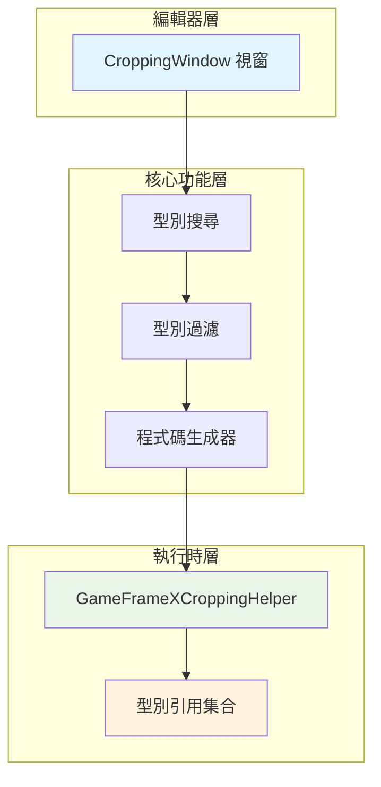

# 圖片裁剪工具

圖片裁剪工具（實際名稱為"防裁剪程式碼生成工具"）是 GameFrameX 提供的 Unity 編輯器擴充套件，用於解決 IL2CPP 構建時程式碼被錯誤剝離的問題。

## 概述

在 Unity 專案中使用 IL2CPP 進行構建時，編譯器會自動剝離未被直接引用的程式碼（稱為"程式碼裁剪"）。然而，當程式碼透過反射或其他動態方式使用時，這些型別可能被錯誤地剝離，導致執行時出現 `MissingMethodException` 或型別解析失敗的問題。

圖片裁剪工具透過以下方式解決這一問題：
1. 提供視覺化介面搜尋程式集中的型別
2. 生成 `typeof(TypeName)` 程式碼來保持對型別的引用
3. 將生成的程式碼新增到專案中，防止 IL2CPP 剝離這些型別

## 架構



### 核心組件

| 組件 | 檔案路徑 | 職責 |
|------|----------|------|
| CroppingWindow | `Editor/Cropping/CroppingWindow.cs` | 編輯器視窗 UI、型別搜尋、程式碼生成 |
| GameFrameXCroppingHelper | `Runtime/GameFrameXCroppingHelper.cs` | 執行時型別引用保持模板 |

## 工作流程


## 使用指南

### 開啟工具視窗

在 Unity 編輯器選單欄中點選 `GameFrameX` → `Cropping(防止裁剪程式碼生成)` 即可開啟工具視窗。

```csharp
// 選單項定義
[MenuItem("GameFrameX/Cropping(防止裁剪程式碼生成)", false, 2001)]
public static void ShowWindow()
{
    var window = GetWindow<CroppingWindow>("Cropping");
    window.minSize = new UnityEngine.Vector2(800, 600);
    window.maxSize = window.minSize;
    window.maximized = false;
    window.Show();
}
```
> Source: [CroppingWindow.cs](https://github.com/GameFrameX/com.gameframex.unity/blob/main/Editor/Cropping/CroppingWindow.cs#L45-L55)

### 搜尋型別

1. 在"查詢型別"文字框中輸入要搜尋的型別名稱關鍵詞
2. 點選 `Search(查詢)` 按鈕
3. 工具將掃描所有執行時程式集，排除系統型別（UnityEngine、UnityEditor、System等）
4. 在下拉選單中選擇要處理的型別

```csharp
// 型別搜尋邏輯
string searchText = _searchText.ToLower();
var types = Utility.Assembly.GetTypes();
var result = new List<string>();
foreach (var type in types)
{
    var fullName = type.FullName.ToLower();
    var isFind = false;
    foreach (var ignoredType in _ignoredTypes)
    {
        if (fullName.Contains(ignoredType))
        {
            isFind = true;
            break;
        }
    }
    if (isFind) continue;
    
    if (fullName.Contains(searchText))
    {
        result.Add(type.FullName);
    }
}
```
> Source: [CroppingWindow.cs](https://github.com/GameFrameX/com.gameframex.unity/blob/main/Editor/Cropping/CroppingWindow.cs#L76-L102)

### 生成防裁剪程式碼

1. 從下拉選單中選擇目標型別（通常選擇程式集的根名稱空間型別）
2. 點選 `Generate(生成)` 按鈕
3. 工具將生成該程式集中所有型別的 `typeof()` 引用程式碼
4. 將生成的程式碼複製到專案的 `CroppingHelper.cs` 檔案中

```csharp
// 程式碼生成邏輯
private void Generate(string targetTypeName)
{
    var targetType = Utility.Assembly.GetType(targetTypeName);
    if (targetType != null)
    {
        var types = targetType.Assembly.GetTypes();
        types = types.OrderBy(m => m.FullName).ToArray();
        StringBuilder stringBuilder = new StringBuilder();
        foreach (var type in types)
        {
            if (type.IsNestedPrivate) continue;
            if (type.FullName.Contains("PrivateImplementationDetails")) continue;
            
            stringBuilder.AppendLine(" _ = typeof(" + type.FullName.Replace("+", ".").Replace("`1", "<>").Replace("`2", "<,>") + ");");
        }
        _generatedText = stringBuilder.ToString();
    }
}
```
> Source: [CroppingWindow.cs](https://github.com/GameFrameX/com.gameframex.unity/blob/main/Editor/Cropping/CroppingWindow.cs#L136-L163)

### 使用生成的程式碼

將生成的程式碼複製到 Unity 專案的指令碼檔案中：

```csharp
using UnityEngine;

namespace GameFrameX.Runtime
{
    public class GameFrameXCroppingHelper : MonoBehaviour
    {
        private void Start()
        {
            // 生成的程式碼示例
            _ = typeof(GameFrameX.Runtime.SomeClass);
            _ = typeof(GameFrameX.Runtime.AnotherClass);
            // ... 更多型別
        }
    }
}
```
> Source: [GameFrameXCroppingHelper.cs](https://github.com/GameFrameX/com.gameframex.unity/blob/main/Runtime/GameFrameXCroppingHelper.cs#L1-L10)

## 排除的系統型別

工具預設排除以下程式集中的型別，避免生成不必要的程式碼：

| 排除字首 | 說明 |
|----------|------|
| unityengine | Unity 核心引擎型別 |
| unityeditor | Unity 編輯器型別 |
| mono | Mono 執行時型別 |
| system | .NET System 型別 |
| dnlib | 程式集解析庫 |
| unity.hotfix | 熱更新型別 |
| unity.baselib | 基礎庫型別 |
| .editor | 編輯器相關 |
| jetbrains | JetBrains 工具型別 |
| nunit | NUnit 測試框架 |

```csharp
private readonly string[] _ignoredTypes = new string[] { 
    "unityengine".ToLower(), 
    "unityeditor".ToLower(), 
    "mono".ToLower(), 
    "system".ToLower(), 
    "dnlib".ToLower(), 
    "unity.hotfix".ToLower(), 
    "unity.baselib".ToLower(), 
    ".editor".ToLower(), 
    "jetbrains".ToLower(), 
    "nunit".ToLower() 
};
```
> Source: [CroppingWindow.cs](https://github.com/GameFrameX/com.gameframex.unity/blob/main/Editor/Cropping/CroppingWindow.cs#L58)

## 常見使用場景

### 場景一：反射呼叫型別

當使用反射動態建立物件或呼叫方法時：

```csharp
// 這種程式碼可能導致型別被剝離
var type = Type.GetType("GameFrameX.Runtime.DynamicClass");
var instance = Activator.CreateInstance(type);
```

### 場景二：JSON 序列化

使用 JSON 序列化庫時，型別資訊可能丟失：

```csharp
// Newtonsoft.Json 或其他序列化庫
string json = JsonConvert.SerializeObject(someObject);
// 反序列化時需要型別存在
var obj = JsonConvert.DeserializeObject<DynamicType>(json);
```

### 場景三：介面與實現分離

使用依賴注入或工廠模式時：

```csharp
// 透過配置檔案或反射載入程式集
var assembly = Assembly.Load("GameFrameX.Plugin");
var type = assembly.GetType("GameFrameX.Plugin.IPlugin");
```

## 配置生成的程式碼模板

生成的程式碼會排除以下型別的型別：

1. **巢狀私有型別** (`IsNestedPrivate`) - 通常是內部實現細節
2. **PrivateImplementationDetails** - 編譯器生成的輔助型別

```csharp
foreach (var type in types)
{
    if (type.IsNestedPrivate)
    {
        continue;  // 跳過巢狀私有型別
    }
    
    if (type.FullName.Contains("PrivateImplementationDetails"))
    {
        continue;  // 跳過編譯器生成細節
    }
    
    // 生成 typeof() 程式碼
}
```
> Source: [CroppingWindow.cs](https://github.com/GameFrameX/com.gameframex.unity/blob/main/Editor/Cropping/CroppingWindow.cs#L147-L156)

## 相關連結

- [構建工具](./6-editor-tools.build-tools) - Unity 專案構建自動化工具
- [包管理工具](./6-editor-tools.package-management) - Unity 包管理工具
- [檢視面板工具](./6-editor-tools.inspector-tools) - 自定義 Inspector 面板工具
- [物件池系統](./5-runtime.object-pool) - 物件池管理系統
- [引用池系統](./5-runtime.reference-pool) - 引用池管理系統
