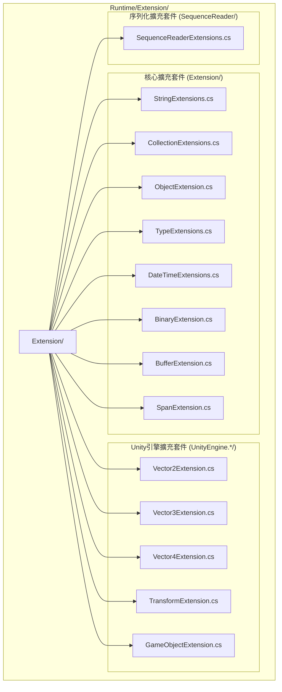

# 擴充套件方法庫

GameFrameX 擴充套件方法庫為 .NET 基礎型別和 Unity 引擎型別提供了一套豐富的擴充套件方法，旨在簡化常見程式設計任務，提升開發效率。所有擴充套件方法均使用 `[UnityEngine.Scripting.Preserve]` 特性標記，以確保在 Unity 打包時不會被程式碼裁剪。

## 概述

擴充套件方法庫是 GameFrameX 框架的核心基礎組件之一，提供了對標準庫型別和 Unity 引擎型別的增強功能。這些擴充套件方法遵循 C# 擴充套件方法語法規範，以靜態類的形式提供服務，可以直接在任何支援擴充套件方法的位置使用。

### 設計目標

擴充套件方法庫的設計遵循以下核心原則：

1. **簡化常見操作**：將複雜的操作封裝為簡潔的 API 呼叫
2. **提升效能**：針對高頻操作提供效能最佳化版本（如字串快速比較）
3. **型別安全**：充分利用泛型和強型別確保編譯時安全
4. **Unity 相容**：所有方法均考慮 Unity 平臺的特殊要求

### 目錄結構

擴充套件方法庫的原始碼組織結構如下：



## 核心功能分類

擴充套件方法庫提供的功能可以分為以下幾個主要類別：

### 1. 字串擴充套件方法

字串擴充套件方法提供了字串的快速比較、格式轉換、編碼轉換等功能。

**主要功能：**

- 快速字串比較：`EqualsFast`、`StartsWithFast`、`EndsWithFast` - 從字串末尾開始逐字元比較，效能優於標準方法
- 字串編碼轉換：`ToBytes`、`ToByteArray`、`ToUtf8` - 支援預設編碼和 UTF-8 編碼
- 十六進位制轉換：`HexToBytes` - 將十六進位制字串轉換為位元組陣列
- 空值檢查：`IsNullOrEmpty`、`IsNullOrWhiteSpace`、`IsNotNullOrEmpty`、`IsNotNullOrWhiteSpace`
- 格式化和清理：`Format`、`TrimEmpty`、`TrimZhCn` - 移除空白字元或中文字元
- 命名轉換：`ConvertToSnakeCase` - 將駝峰命名轉換為蛇形命名
- 字串分割：`SplitToIntArray`、`SplitTo2IntArray` - 將字串分割為整數陣列

```csharp
// 快速字串比較示例
string str = "Hello World";
bool isMatch = str.EqualsFast("hello world"); // 返回 false（區分大小寫）
bool startsWithHello = str.StartsWithFast("Hello"); // 返回 true
bool endsWithWorld = str.EndsWithFast("World"); // 返回 true

// 字串轉位元組陣列
byte[] bytes = str.ToUtf8(); // UTF-8 編碼
byte[] defaultBytes = str.ToByteArray(); // 預設編碼

// 十六進位制字串轉位元組陣列
string hex = "48656C6C6F";
byte[] hexBytes = hex.HexToBytes(); // [72, 101, 108, 108, 111]

// 空值檢查
string nullStr = null;
bool emptyCheck = nullStr.IsNullOrEmpty(); // true
bool whitespaceCheck = "   ".IsNullOrWhiteSpace(); // true
```
> Source: [StringExtensions.cs](https://github.com/GameFrameX/com.gameframex.unity/blob/main/Runtime/Extension/Extension/StringExtensions.cs#L31-L58)

### 2. 集合擴充套件方法

集合擴充套件方法為 Dictionary、List、HashSet 等集合型別提供了便捷的操作方法。

**主要功能：**

- Dictionary 擴充套件：
  - `Merge` - 合併鍵值對，支援自定義合併函式
  - `GetOrAdd` - 獲取或新增元素，支援預設值和工廠方法
  - `RemoveIf` - 按條件移除元素
- List 擴充套件：
  - `Shuffle` - Fisher-Yates 洗牌演算法打亂列表順序
  - `RemoveIf` - 按條件移除元素
  - `ListToString` - 將列表轉換為分隔符連線的字串
- HashSet 擴充套件：
  - `AddRange` - 批次新增元素
- ICollection 擴充套件：
  - `IsNullOrEmpty` - 檢查集合是否為空

```csharp
// Dictionary 使用示例
var dict = new Dictionary<string, int>();
dict.Merge("score", 100, (old, newVal) => old + newVal); // 合併值
int value = dict.GetOrAdd("newKey", k => 100); // 獲取或建立

// List 使用示例
var list = new List<int> { 1, 2, 3, 4, 5 };
list.Shuffle(); // 隨機打亂
list.RemoveIf(x => x > 3); // 移除大於3的元素
string result = list.ListToString(","); // "1,2,3,"
```
> Source: [CollectionExtensions.cs](https://github.com/GameFrameX/com.gameframex.unity/blob/main/Runtime/Extension/Extension/CollectionExtensions.cs#L33-L77)

### 3. 物件擴充套件方法

物件擴充套件方法提供了物件空值檢查和驗證功能。

**主要功能：**

- `IsNull` - 檢查物件是否為 null
- `IsNotNull` - 檢查物件是否不為 null
- `CheckNull` - 檢查物件是否為 null，為 null 時丟擲 ArgumentNullException

```csharp
object obj = null;
bool isNull = obj.IsNull(); // true
bool isNotNull = obj.IsNotNull(); // false

object validObj = new object();
validObj.CheckNull("validObj"); // 不丟擲異常
```
> Source: [ObjectExtension.cs](https://github.com/GameFrameX/com.gameframex.unity/blob/main/Runtime/Extension/Extension/ObjectExtension.cs#L18-L47)

### 4. 型別擴充套件方法

型別擴充套件方法用於檢查型別是否實現了特定的介面。

**主要功能：**

- `IsImplWithInterface` - 檢查型別是否實現了指定的介面，支援僅檢查直接實現或包含繼承鏈

```csharp
// 檢查型別是否實現介面
Type type = typeof(List<string>);
bool implements = type.IsImplWithInterface(typeof(IEnumerable<object>), false); // true
bool directOnly = type.IsImplWithInterface(typeof(IList<string>), true); // true
```
> Source: [TypeExtensions.cs](https://github.com/GameFrameX/com.gameframex.unity/blob/main/Runtime/Extension/Extension/TypeExtensions.cs#L30-L58)

### 5. DateTime 擴充套件方法

DateTime 擴充套件方法提供了日期時間相關的計算功能。

**主要功能：**

- `GetDaysFrom` - 計算從指定日期到當前日期的天數差
- `GetDaysFromDefault` - 計算從 1970年1月1日 到當前日期的天數差

```csharp
DateTime now = DateTime.Now;
int days = now.GetDaysFrom(new DateTime(2020, 1, 1)); // 距離2020年1月1日的天數
int unixDays = now.GetDaysFromDefault(); // Unix時間戳對應的天數
```
> Source: [DateTimeExtensions.cs](https://github.com/GameFrameX/com.gameframex.unity/blob/main/Runtime/Extension/Extension/DateTimeExtensions.cs#L23-L40)

### 6. 二進位制擴充套件方法

二進位制擴充套件方法為 BinaryReader 和 BinaryWriter 提供了 7 位編碼整數和加密字串的讀寫功能。

**主要功能：**

- 7位編碼整數讀寫：
  - `Read7BitEncodedInt32` / `Write7BitEncodedInt32`
  - `Read7BitEncodedUInt32` / `Write7BitEncodedUInt32`
  - `Read7BitEncodedInt64` / `Write7BitEncodedInt64`
  - `Read7BitEncodedUInt64` / `Write7BitEncodedUInt64`
- 加密字串讀寫：
  - `ReadEncryptedString` - 讀取加密字串
  - `WriteEncryptedString` - 寫入加密字串

7位編碼是一種變長編碼方式，用於在序列化時節省空間，小整數佔用較少的位元組數。

### 7. 緩衝區擴充套件方法

緩衝區擴充套件方法為位元組陣列提供了型別化的讀寫操作，支援大端位元組序（網路位元組序）。

**寫入方法：**

- `WriteInt`、`WriteUInt`、`WriteShort`、`WriteUShort`
- `WriteLong`、`WriteFloat`、`WriteDouble`
- `WriteByte`、`WriteSByte`、`WriteBool`
- `WriteBytes`、`WriteBytesWithoutLength`、`WriteString`

**讀取方法：**

- `ReadInt`、`ReadUInt`、`ReadShort`、`ReadUShort`
- `ReadLong`、`ReadFloat`、`ReadDouble`
- `ReadByte`、`ReadSByte`、`ReadBool`
- `ReadBytes`、`ReadString`

**轉換方法：**

- `ToHex`、`ToHex(format)`、`ToHex(offset, count)` - 位元組陣列轉十六進位制字串
- `ToDefaultString`、`ToUtf8String` - 位元組陣列轉字串

```csharp
byte[] buffer = new byte[1024];
int offset = 0;

// 寫入各種型別
buffer.WriteInt(12345, ref offset);
buffer.WriteFloat(3.14f, ref offset);
buffer.WriteString("Hello", ref offset);

// 讀取各種型別
offset = 0;
int intVal = buffer.ReadInt(ref offset);
float floatVal = buffer.ReadFloat(ref offset);
string strVal = buffer.ReadString(ref offset);

// 位元組陣列轉十六進位制字串
byte[] data = new byte[] { 0x48, 0x65, 0x6C, 0x6C, 0x6F };
string hex = data.ToHex(); // "48656C6C6F"
```
> Source: [BufferExtension.cs](https://github.com/GameFrameX/com.gameframex.unity/blob/main/Runtime/Extension/Extension/BufferExtension.cs#L90-L103)

### 8. Span 擴充套件方法

Span 擴充套件方法為 `Span<byte>` 提供了與 BufferExtension 類似的讀寫操作，用於高效能場景。

## Unity 引擎擴充套件

### 1. Vector 擴充套件方法

Vector 擴充套件方法提供了不同維度向量之間的轉換功能。

**Vector2 擴充套件：**

- `ToVector3` - 轉換為 Vector3（y 分量設為 0 或指定值）
- `ToVector4` - 轉換為 Vector4（z、w 分量設為 0）
- `AsVector3` - 轉換為 Vector3（z 分量設為 0）

**Vector3 擴充套件：**

- `ToVector2` - 轉換為 Vector2（取 x、z 分量）
- `ToVector3(Vector3Int)` - 從 Vector3Int 轉換
- `ToVector4` - 轉換為 Vector4（w 分量設為 0）

**Vector4 擴充套件：**

- `ToVector2` - 轉換為 Vector2（取 x、y 分量）
- `ToVector3` - 轉換為 Vector3（取 x、y、z 分量）

```csharp
Vector2 v2 = new Vector2(1, 2);
Vector3 v3 = v2.ToVector3(); // (1, 0, 2)
Vector3 v3WithY = v2.ToVector3(5); // (1, 5, 2)
Vector4 v4 = v2.ToVector4(); // (1, 2, 0, 0)

Vector3 v3 = new Vector3(1, 2, 3);
Vector2 v2FromV3 = v3.ToVector2(); // (1, 3)
```
> Source: [UnityEngine.Vector2Extension.cs](https://github.com/GameFrameX/com.gameframex.unity/blob/main/Runtime/Extension/UnityEngine.Vector2/UnityEngine.Vector2Extension.cs#L17-L35)

### 2. Transform 擴充套件方法

Transform 擴充套件方法提供了便捷的 Transform 組件操作功能。

**位置操作：**

- 世界座標設定：`SetPositionX`、`SetPositionY`、`SetPositionZ`
- 世界座標增量：`AddPositionX`、`AddPositionY`、`AddPositionZ`
- 本地座標設定：`SetLocalPositionX`、`SetLocalPositionY`、`SetLocalPositionZ`
- 本地座標增量：`AddLocalPositionX`、`AddLocalPositionY`、`AddLocalPositionZ`

**縮放操作：**

- 縮放設定：`SetLocalScaleX`、`SetLocalScaleY`、`SetLocalScaleZ`
- 縮放增量：`AddLocalScaleX`、`AddLocalScaleY`、`AddLocalScaleZ`

**其他操作：**

- `FindChildName` - 遞迴查詢子節點
- `LookAt2D` - 二維空間朝向目標
- `Reset` - 重置 Transform（位置、旋轉、縮放）
- `SetParentAndReset` - 設定父級並重置

```csharp
Transform transform = someObject.transform;

// 設定單個座標分量
transform.SetPositionX(5f);
transform.AddPositionY(2f);

// 設定區域性座標
transform.SetLocalPositionZ(0f);

// 設定縮放
transform.SetLocalScaleX(2f);

// 查詢子節點
Transform child = transform.FindChildName("ChildName");

// 二維朝向
transform.LookAt2D(new Vector2(10, 5));

// 重置
transform.Reset();
```
> Source: [UnityEngine.TransformExtension.cs](https://github.com/GameFrameX/com.gameframex.unity/blob/main/Runtime/Extension/UnityEngine.Transform/UnityEngine.TransformExtension.cs#L55-L92)

### 3. GameObject 和 Component 擴充套件方法

GameObject 和 Component 擴充套件方法提供了遊戲物件和組件的便捷操作。

**組件操作：**

- `GetOrAddComponent<T>` - 獲取或新增組件
- `GetOrAddComponent(Type)` - 獲取或新增指定型別組件
- `DestroyComponent<T>` - 銷燬指定型別組件
- `DestroyComponent` - 銷燬自身組件

**遊戲物件操作：**

- `InScene` - 檢查 GameObject 是否在場景中
- `SetLayerRecursively` - 遞迴設定遊戲物件及其子物件的層級

```csharp
GameObject go = someGameObject;

// 獲取或新增組件
Rigidbody rb = go.GetOrAddComponent<Rigidbody>();
AudioSource audio = go.GetOrAddComponent<AudioSource>();

// 銷燬組件
go.DestroyComponent<Rigidbody>();

// 檢查是否在場景中
bool inScene = go.InScene(); // true 表示在場景中，false 表示是預製體

// 遞迴設定層級
go.SetLayerRecursively(LayerMask.NameToLayer("UI"));
```
> Source: [UnityEngage.GameObjectExtension.cs](https://github.com/GameFrameX/com.gameframex.unity/blob/main/Runtime/Extension/UnityEngage.GameObject/UnityEngage.GameObjectExtension.cs#L60-L90)

## 使用示例

### 綜合示例

以下示例展示瞭如何在實際專案中使用擴充套件方法庫：

```csharp
using GameFrameX.Runtime;
using UnityEngine;
using System.Collections.Generic;

public class ExtensionMethodDemo : MonoBehaviour
{
    void Start()
    {
        // 字串操作
        string json = "{\"name\":\"Player\",\"score\":100}";
        if (json.IsNotNullOrWhiteSpace())
        {
            Debug.Log($"JSON有效，長度: {json.ToUtf8().Length}");
        }

        // 集合操作
        var scores = new Dictionary<string, int>
        {
            { "Player1", 100 },
            { "Player2", 200 }
        };
        
        // 合併分數
        scores.Merge("Player1", 50, (old, newVal) => old + newVal);
        
        // 獲取或新增新玩家
        int player3Score = scores.GetOrAdd("Player3", k => 0);

        // Unity 物件操作
        var child = transform.FindChildName("HealthBar");
        child?.SetPositionX(0);
        
        // 獲取或新增組件
        var animator = gameObject.GetOrAddComponent<Animator>();
        
        // 列表操作
        var items = new List<string> { "Sword", "Shield", "Potion" };
        items.Shuffle(); // 隨機排序
        Debug.Log(items.ListToString(", "));
    }
}
```

## 效能最佳化說明

擴充套件方法庫中包含多個效能最佳化版本的方法：

1. **字串快速比較**：`EqualsFast`、`StartsWithFast`、`EndsWithFast` 方法從字串末尾開始比較，在比較具有共同字尾/字首的字串時可能提供更好的效能。

2. **緩衝區直接操作**：使用 `Span<T>` 和不安全的指標操作避免邊界檢查，提供接近原生的效能。

3. **7位編碼整數**：使用變長編碼表示整數，小整數佔用更少的位元組，適合大量整數序列化的場景。

## 相關連結

- [基礎組件](./5-runtime.base) - GameFrameX 基礎組件系統
- [輔助類](./5-runtime.helper-classes) - 輔助工具類
- [工具類](./5-runtime.utility-classes) - 實用工具集
- [GitHub 倉庫](https://github.com/GameFrameX/com.gameframex.unity)
