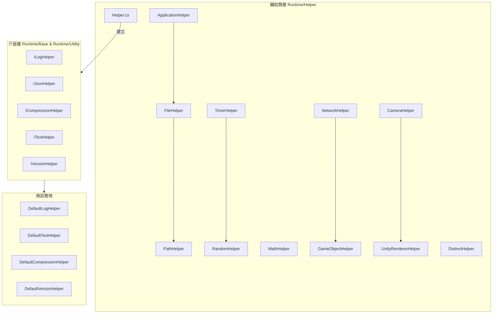

# 輔助類

GameFrameX 框架提供的輔助類模組，涵蓋應用、檔案、路徑、數學、隨機數、時間、網路、遊戲物件、相機、渲染等多個領域的實用工具方法。

## 概述

輔助類（Helper Classes）是 GameFrameX 框架的基礎工具層，為開發者提供日常開發中常用的靜態工具方法。這些輔助類經過精心設計，以統一、便捷的方式封裝了 Unity 開發和通用程式設計中的常見操作，使開發者能夠更專注於業務邏輯的實現。

### 設計目標

GameFrameX 輔助類系統的設計遵循以下原則：

1. **統一入口**：透過 `Helper` 工廠類提供統一的輔助器建立機制
2. **平臺適配**：自動處理不同 Unity 平臺（Editor、Windows、Mac、Android、iOS、WebGL 等）的差異
3. **效能最佳化**：使用 `ThreadLocalRandom` 等機制確保多執行緒安全
4. **可擴充套件性**：透過介面（如 `ILogHelper`、`IJsonHelper`）支援自定義實現

### 輔助類分類

GameFrameX 的輔助類可分為以下幾個類別：

| 類別 | 輔助類 | 功能描述 |
|------|--------|----------|
| 應用層 | `ApplicationHelper` | 平臺檢測、應用控制、URL 開啟 |
| 檔案/路徑 | `FileHelper`、`PathHelper` | 檔案讀寫、目錄操作、路徑拼接 |
| 數學計算 | `MathHelper`、`PositionHelper` | 矩形相交檢測、位置計算 |
| 隨機數 | `RandomHelper` | 多種隨機數生成方法 |
| 時間 | `TimerHelper` | Unix 時間戳、本地時間、伺服器時間同步 |
| 網路 | `NetworkHelper` | 網路可達性檢測、WiFi/行動網路判斷 |
| 遊戲物件 | `GameObjectHelper` | GameObject 建立、銷燬、查詢 |
| 渲染 | `CameraHelper`、`UnityRendererHelper` | 螢幕截圖、渲染器可見性檢測 |
| 資料處理 | `DistinctHelper`、`NewtonsoftJsonHelper`、`ZipHelper` | 去重、JSON 序列化、壓縮 |

## 架構

GameFrameX 輔助類採用分層架構設計，核心組件包括靜態工具類和可替換的介面實現。



### 核心組件說明

#### Helper.cs - 輔助器工廠

`Helper.cs` 是整個輔助類系統的核心工廠類，提供基於 `MonoBehaviour` 的輔助器建立機制。

> Source: [Helper.cs](https://github.com/GameFrameX/com.gameframex.unity/blob/main/Runtime/Helper/Helper.cs#L44-L155)

```csharp
public static T CreateHelper<T>(string helperTypeName, T customHelper) where T : MonoBehaviour
{
    return CreateHelper(helperTypeName, customHelper, 0);
}

public static T CreateHelper<T>(string helperTypeName, T customHelper, int index) where T : MonoBehaviour
{
    // 根據型別名稱或自定義輔助器建立例項
}
```

**設計意圖**：透過工廠模式允許開發者在執行時動態替換預設實現，提高框架的可擴充套件性。

#### 靜態工具類

所有靜態輔助類都使用 `[UnityEngine.Scripting.Preserve]` 特性標記，確保在程式碼裁剪（IL2CPP）時不被移除。

## 核心功能詳解

### 應用層輔助類

`ApplicationHelper` 提供平臺檢測和應用控制功能，是開發跨平臺遊戲的重要工具。

> Source: [ApplicationHelper.cs](https://github.com/GameFrameX/com.gameframex.unity/blob/main/Runtime/Helper/ApplicationHelper.cs#L1-L305)

```csharp
// 平臺檢測
public static bool IsEditor => ...;
public static bool IsAndroid => ...;
public static bool IsIOS => ...;
public static bool IsWebGL => ...;
public static bool IsWindows => ...;
public static bool IsMacOsx => ...;
public static bool IsLinux => ...;

// 小遊戲平臺檢測
public static bool IsWebGLWeChatMiniGame => ...;
public static bool IsWebGLDouYinMiniGame => ...;

// 應用控制
public static void Quit() => ...;
public static void OpenURL(string url) => ...;
public static void OpenSetting() => ...;
```

### 檔案操作輔助類

`FileHelper` 提供跨平臺的檔案讀寫操作，自動處理 Android APK 內資源的讀取問題。

> Source: [FileHelper.cs](https://github.com/GameFrameX/com.gameframex.unity/blob/main/Runtime/Helper/FileHelper.cs#L16-L357)

```csharp
// 檔案讀取
public static byte[] ReadAllBytes(string path) => ...;
public static string ReadAllText(string path) => ...;
public static string[] ReadAllLines(string path) => ...;

// 檔案寫入
public static void WriteAllBytes(string path, byte[] buffer) => ...;
public static void WriteAllText(string path, string content) => ...;
public static void WriteAllLines(string path, string[] lines) => ...;

// 檔案操作
public static void Copy(string sourceFileName, string destFileName, bool overwrite = false) => ...;
public static void Delete(string path) => ...;
public static void Move(string sourceFileName, string destFileName) => ...;
public static bool IsExists(string path) => ...;

// 目錄操作
public static void GetAllFiles(List<string> files, string dir) => ...;
public static void CleanDirectory(string dir) => ...;
public static void CopyDirectory(string srcDir, string targetDir) => ...;
```

**設計意圖**：統一跨平臺檔案操作介面，自動處理 Android StreamingAssets 只讀路徑的特殊情況。

### 路徑輔助類

`PathHelper` 提供路徑規範化和拼接功能。

> Source: [PathHelper.cs](https://github.com/GameFrameX/com.gameframex.unity/blob/main/Runtime/Helper/PathHelper.cs#L14-L130)

```csharp
// 常用路徑
public static string AppHotfixResPath => ...;  // 熱更新資源路徑
public static string AppResPath => ...;        // StreamingAssets 路徑
public static string AppResPath4Web => ...;   // Web 請求專用路徑

// 路徑操作
public static string NormalizePath(string path) => ...;
public static string Combine(params string[] paths) => ...;
```

### 時間輔助類

`TimerHelper` 提供完整的時間處理功能，包括 Unix 時間戳轉換、伺服器時間同步等。

> Source: [TimerHelper.cs](https://github.com/GameFrameX/com.gameframex.unity/blob/main/Runtime/Helper/TimerHelper.cs#L36-L525)

```csharp
// 時間戳獲取
public static long UnixTimeSeconds() => ...;
public static long UnixTimeMilliseconds() => ...;
public static long NowTimeSeconds() => ...;
public static long NowTimeMilliseconds() => ...;

// 客戶端/伺服器時間
public static long ClientNow() => ...;
public static long ClientNowSeconds() => ...;
public static long ServerNow() => ...;

// 時間轉換
public static long LocalTimeToUnixTimeSeconds(DateTime time) => ...;
public static long LocalTimeToUnixTimeMilliseconds(DateTime time) => ...;
public static DateTime UtcToLocalDateTime(long utcTimestamp) => ...;
public static DateTime UtcToUtcDateTime(long utcTimestamp) => ...;

// 伺服器時間同步
public static void SetDifferenceTime(long timeSpan) => ...;
public static void SetDifferenceTime(DateTime serverTime, bool isUtc = false) => ...;
```

### 隨機數輔助類

`RandomHelper` 提供執行緒安全的隨機數生成。

> Source: [RandomHelper.cs](https://github.com/GameFrameX/com.gameframex.unity/blob/main/Runtime/Helper/RandomHelper.cs#L12-L80)

```csharp
// 隨機數生成
public static void SetSeed(int seed) => ...;
public static int Next(int lower, int upper) => ...;
public static float Next() => ...;
public static long NextInt64() => ...;
public static ulong NextUInt64() => ...;
```

### 數學輔助類

`MathHelper` 提供矩形相交檢測等功能。

> Source: [MathHelper.cs](https://github.com/GameFrameX/com.gameframex.unity/blob/main/Runtime/Helper/MathHelper.cs#L13-L148)

```csharp
// 矩形相交檢測
public static bool CheckIntersect(RectInt src, RectInt target) => ...;
public static bool CheckIntersect(int x1, int y1, int w1, int h1, int x2, int y2, int w2, int h2) => ...;
public static bool CheckIntersectPoints(int x1, int y1, int w1, int h1, int x2, int y2, int w2, int h2, int[] intersectPoints) => ...;
```

### 網路輔助類

`NetworkHelper` 提供網路狀態檢測。

> Source: [NetworkHelper.cs](https://github.com/GameFrameX/com.gameframex.unity/blob/main/Runtime/Helper/NetworkHelper.cs#L14-L77)

```csharp
// 網路狀態檢測
public static string[] GetAddressIPs() => ...;
public static bool IsReachable() => ...;
public static bool IsWifi() => ...;
public static bool IsViaCarrierData() => ...;
```

### 遊戲物件輔助類

`GameObjectHelper` 提供 GameObject 的建立、銷燬、查詢等操作。

> Source: [GameObjectHelper.cs](https://github.com/GameFrameX/com.gameframex.unity/blob/main/Runtime/Helper/GameObjectHelper.cs#L14-L213)

```csharp
// 建立
public static GameObject Create(Transform parent, string name) => ...;
public static GameObject Create(GameObject parent, string name) => ...;

// 銷燬
public static void Destroy(GameObject gameObject) => ...;
public static void DestroyObject(this GameObject gameObject) => ...;
public static void DestroyComponent(Component component) => ...;

// 查詢
public static GameObject FindChildGamObjectByName(string nodeName, string sceneName = null) => ...;
public static GameObject FindChildGamObjectByName(GameObject gameObject, string name) => ...;

// 變換操作
public static void RemoveChildren(GameObject go) => ...;
public static void ResetTransform(GameObject gameObject) => ...;

// 層設定
public static void SetLayer(GameObject gameObject, int layer, bool children = true) => ...;
public static void SetSortingGroupLayer(GameObject gameObject, string sortingLayer) => ...;
```

### 渲染輔助類

`CameraHelper` 和 `UnityRendererHelper` 提供螢幕截圖和渲染器可見性檢測。

> Source: [CameraHelper.cs](https://github.com/GameFrameX/com.gameframex.unity/blob/main/Runtime/Helper/CameraHelper.cs#L14-L47)

```csharp
// 螢幕截圖
public static Texture2D GetCaptureScreenshot(Camera main, float scale = 0.5f) => ...;
```

> Source: [UnityRendererHelper.cs](https://github.com/GameFrameX/com.gameframex.unity/blob/main/Runtime/Helper/UnityRendererHelper.cs#L12-L42)

```csharp
// 可見性檢測
public static bool IsVisibleFrom(Renderer renderer, Camera camera) => ...;
public static bool IsVisibleFrom(MeshRenderer renderer, Camera camera) => ...;
```

### 資料處理輔助類

`DistinctHelper` 提供基於鍵的集合去重功能。

> Source: [DistinctHelper.cs](https://github.com/GameFrameX/com.gameframex.unity/blob/main/Runtime/Helper/DistinctHelper.cs#L13-L39)

```csharp
// 去重
public static IEnumerable<TSource> DistinctBy<TSource, TKey>(
    this IEnumerable<TSource> source, 
    Func<TSource, TKey> keySelector) => ...;
```

## 使用示例

### 平臺檢測與適配

```csharp
using GameFrameX.Runtime;

// 檢測當前平臺
if (ApplicationHelper.IsAndroid)
{
    Debug.Log("執行在 Android 平臺");
}
else if (ApplicationHelper.IsIOS)
{
    Debug.Log("執行在 iOS 平臺");
}
else if (ApplicationHelper.IsWebGL)
{
    Debug.Log("執行在 WebGL 平臺");
}

// 檢測小遊戲平臺
if (ApplicationHelper.IsWebGLWeChatMiniGame)
{
    Debug.Log("執行在微信小遊戲平臺");
}

// 獲取平臺名稱
string platform = ApplicationHelper.PlatformName;
```

### 檔案讀寫操作

```csharp
using GameFrameX.Runtime;

// 讀取檔案
string content = FileHelper.ReadAllText("path/to/file.txt");
byte[] data = FileHelper.ReadAllBytes("path/to/file.bin");
string[] lines = FileHelper.ReadAllLines("path/to/file.txt");

// 寫入檔案
FileHelper.WriteAllText("path/to/output.txt", "Hello World");
FileHelper.WriteAllBytes("path/to/output.bin", data);

// 檢查檔案存在
if (FileHelper.IsExists("path/to/file.txt"))
{
    Debug.Log("檔案存在");
}
```

### 時間戳處理

```csharp
using GameFrameX.Runtime;

// 獲取當前時間戳
long unixSeconds = TimerHelper.UnixTimeSeconds();
long unixMillis = TimerHelper.UnixTimeMilliseconds();

// 時間戳轉換
DateTime dateTime = TimerHelper.UtcToLocalDateTime(1699999999);
long timestamp = TimerHelper.LocalTimeToUnixTimeSeconds(DateTime.Now);

// 伺服器時間同步（從伺服器獲取時間後呼叫）
TimerHelper.SetDifferenceTime(serverTimestamp);

// 獲取伺服器時間
long serverTime = TimerHelper.ServerNow();
DateTime serverDateTime = TimerHelper.ServerToday();
```

### 遊戲物件操作

```csharp
using GameFrameX.Runtime;

// 建立 GameObject
GameObject parent = someParent;
GameObject newObj = GameObjectHelper.Create(parent, "NewObject");

// 重置變換
GameObjectHelper.ResetTransform(newObj);

// 設定層級
GameObjectHelper.SetLayer(newObj, LayerMask.NameToLayer("UI"), true);

// 查詢子物件
GameObject child = GameObjectHelper.FindChildGamObjectByName(parent, "ChildName");

// 銷燬子物件
GameObjectHelper.RemoveChildren(parent);
```

### 渲染器可見性檢測

```csharp
using GameFrameX.Runtime;

// 檢測物體是否在相機視野內
Camera mainCamera = Camera.main;
Renderer[] renderers = FindObjectsOfType<Renderer>();

foreach (var renderer in renderers)
{
    if (UnityRendererHelper.IsVisibleFrom(renderer, mainCamera))
    {
        Debug.Log("物體在相機視野內");
    }
}
```

### 螢幕截圖

```csharp
using GameFrameX.Runtime;

// 捕獲螢幕截圖
Texture2D screenshot = CameraHelper.GetCaptureScreenshot(Camera.main, 0.5f);

// 儲存截圖
byte[] pngData = screenshot.EncodeToPNG();
FileHelper.WriteAllBytes(Application.persistentDataPath + "/screenshot.png", pngData);
```

### 集合去重

```csharp
using GameFrameX.Runtime;

// 基於特定鍵去重
var list = new List<Player>();
list.Add(new Player { Id = 1, Name = "Alice" });
list.Add(new Player { Id = 1, Name = "Alice" });
list.Add(new Player { Id = 2, Name = "Bob" });

// 按 Id 去重
var distinctList = list.DistinctBy(p => p.Id).ToList();
```

## API 參考

### Helper

#### `CreateHelper<T>(string helperTypeName, T customHelper): T`

建立輔助器例項。

**引數：**
- `helperTypeName` (string): 輔助器型別名稱
- `customHelper` (T): 自定義輔助器例項

**返回：** 建立的輔助器例項

### ApplicationHelper

| 方法/屬性 | 返回型別 | 描述 |
|----------|---------|------|
| `IsEditor` | `bool` | 是否在 Unity 編輯器中執行 |
| `IsAndroid` | `bool` | 是否在 Android 平臺執行 |
| `IsIOS` | `bool` | 是否在 iOS 平臺執行 |
| `IsWebGL` | `bool` | 是否在 WebGL 平臺執行 |
| `IsWindows` | `bool` | 是否在 Windows 平臺執行 |
| `PlatformName` | `string` | 獲取當前平臺名稱 |
| `Quit()` | `void` | 退出應用程式 |
| `OpenURL(string url)` | `void` | 開啟指定 URL |

### FileHelper

| 方法 | 描述 |
|------|------|
| `ReadAllBytes(string path)` | 讀取檔案位元組陣列 |
| `ReadAllText(string path)` | 讀取檔案文字內容 |
| `WriteAllBytes(string path, byte[] buffer)` | 寫入位元組陣列 |
| `WriteAllText(string path, string content)` | 寫入文字內容 |
| `Copy(string source, string dest, bool overwrite)` | 複製檔案 |
| `Delete(string path)` | 刪除檔案 |
| `IsExists(string path)` | 檢查檔案是否存在 |
| `GetAllFiles(List<string> files, string dir)` | 獲取目錄下所有檔案 |
| `CleanDirectory(string dir)` | 清理目錄 |

### TimerHelper

| 方法 | 描述 |
|------|------|
| `UnixTimeSeconds()` | 獲取當前 UTC Unix 時間戳（秒） |
| `UnixTimeMilliseconds()` | 獲取當前 UTC Unix 時間戳（毫秒） |
| `ServerNow()` | 獲取伺服器當前時間 |
| `ClientNow()` | 獲取客戶端當前時間（毫秒） |
| `UtcToLocalDateTime(long timestamp)` | UTC 時間戳轉本地時間 |
| `SetDifferenceTime(long timeSpan)` | 設定伺服器時間差 |

### RandomHelper

| 方法 | 描述 |
|------|------|
| `SetSeed(int seed)` | 設定隨機數種子 |
| `Next(int lower, int upper)` | 獲取指定範圍隨機整數 |
| `Next()` | 獲取 0-1 之間隨機浮點數 |
| `NextInt64()` | 獲取 Int64 範圍隨機數 |

### GameObjectHelper

| 方法 | 描述 |
|------|------|
| `Create(Transform parent, string name)` | 建立 GameObject |
| `Destroy(GameObject gameObject)` | 銷燬 GameObject |
| `FindChildGamObjectByName(string name)` | 按名稱查詢子物件 |
| `RemoveChildren(GameObject go)` | 銷燬所有子物件 |
| `ResetTransform(GameObject gameObject)` | 重置變換組件 |
| `SetLayer(GameObject gameObject, int layer, bool children)` | 設定層級 |

### MathHelper

| 方法 | 描述 |
|------|------|
| `CheckIntersect(RectInt src, RectInt target)` | 檢測矩形相交 |
| `CheckIntersect(int x1, int y1, int w1, int h1, int x2, int y2, int w2, int h2)` | 檢測矩形相交（引數形式） |

### NetworkHelper

| 方法 | 描述 |
|------|------|
| `IsReachable()` | 檢測是否有網路連線 |
| `IsWifi()` | 是否透過 WiFi 連線 |
| `IsViaCarrierData()` | 是否透過移動資料連線 |
| `GetAddressIPs()` | 獲取本地 IP 地址列表 |

### CameraHelper

| 方法 | 描述 |
|------|------|
| `GetCaptureScreenshot(Camera main, float scale)` | 捕獲相機螢幕截圖 |

### UnityRendererHelper

| 方法 | 描述 |
|------|------|
| `IsVisibleFrom(Renderer renderer, Camera camera)` | 檢測渲染器是否在相機視野內 |

### DistinctHelper

| 方法 | 描述 |
|------|------|
| `DistinctBy<TSource, TKey>(IEnumerable, Func)` | 基於鍵選擇器去重 |

## 相關連結

- [擴充套件方法庫](./5-runtime.extension-methods) - 瞭解更多擴充套件方法
- [工具類](./5-runtime.utility-classes) - 框架核心工具類
- [基礎組件](./5-runtime.base) - 框架核心組件
- [事件系統](./5-runtime.event-system) - 框架事件機制
