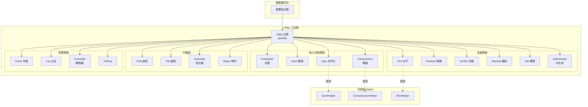

# 工具類

GameFrameX 框架提供的核心靜態工具函式庫，涵蓋加密解密、雜湊計算、JSON序列化、壓縮解壓、字串處理、隨機數生成、資料校驗、網路操作、ID生成等常用功能。

## 概述

Utility 工具類是 GameFrameX 框架的基礎設施層，為上層業務邏輯提供底層技術支撐。這些工具類採用**靜態類設計**，無需例項化即可直接呼叫，極大地簡化了日常開發工作。

### 設計理念

1. **無狀態工具方法**：所有方法都是無副作用的靜態方法，可安全並行呼叫
2. **可擴充套件架構**：關鍵功能採用 Helper 插拔機制，支援使用者自定義實現
3. **Partial Class 組織**：使用 C# partial class 特性，按功能模組分散程式碼到多個檔案，提高可維護性

### 模組分類

Utility 工具類涵蓋以下功能領域：

| 分類 | 功能描述 |
|------|----------|
| 加密模組 | XOR 異或加密 |
| 雜湊模組 | MD5、SHA1、SHA256、HMAC-SHA256、MurmurHash3、XxHash |
| 資料格式 | JSON 序列化/反序列化、壓縮/解壓縮 |
| 文字處理 | 字串格式化、型別轉換、擴充套件字串 |
| 校驗模組 | CRC32、CRC64 校驗和計算 |
| 隨機數 | 隨機整數、浮點數、位元組陣列生成 |
| 系統操作 | 結構體編組、網路埠/IP操作、唯一ID生成 |
| 輸入輸出 | 路徑處理、檔案操作 |
| 反射操作 | 程式集載入、物件操作 |

## 架構



## 核心功能詳解

### 加密模組 (Encryption)

提供 XOR 異或加密功能，適用於輕量級資料混淆場景。

```csharp
// XOR 加密示例
byte[] originalData = new byte[] { 0x01, 0x02, 0x03, 0x04 };
byte[] key = new byte[] { 0xAA, 0xBB, 0xCC, 0xDD };

// 加密
byte[] encrypted = Utility.Encryption.GetXorBytes(originalData, key);

// 解密（異或加密是對稱的）
byte[] decrypted = Utility.Encryption.GetXorBytes(encrypted, key);
```
> Source: [Utility.Encryption.cs](https://github.com/GameFrameX/com.gameframex.unity/blob/main/Runtime/Utility/Utility.Encryption.cs#L82-L90)

### 雜湊模組 (Hash)

支援多種雜湊演算法，用於資料完整性校驗和密碼儲存：

- **MD5**：128位雜湊值，適用於檔案完整性校驗
- **SHA1**：160位雜湊值
- **SHA256**：256位雜湊值，安全係數更高
- **HMAC-SHA256**：帶金鑰的雜湊，用於訊息認證
- **MurmurHash3**：高效能非加密雜湊
- **XxHash**：極高效能的非加密雜湊

```csharp
// 計算字串的 MD5 雜湊
string input = "Hello GameFrameX";
string md5Hash = Utility.Hash.MD5.Hash(input);

// 驗證雜湊值
bool isValid = Utility.Hash.MD5.IsVerify(input, md5Hash);

// 計算檔案 MD5
string fileHash = Utility.Hash.MD5.FileHash("path/to/file");
```
> Source: [Utility.Hash.Md5.cs](https://github.com/GameFrameX/com.gameframex.unity/blob/main/Runtime/Utility/Utility.Hash.Md5.cs#L38-L42)

### JSON 模組 (Json)

提供 JSON 序列化和反序列化功能，支援可插拔的 Helper 實現：

```csharp
// 設定自定義 JSON Helper
Utility.Json.SetJsonHelper(new NewtonsoftJsonHelper());

// 序列化物件為 JSON
var user = new User { Name = "張三", Age = 25 };
string json = Utility.Json.ToJson(user);

// 反序列化 JSON 為物件
var user2 = Utility.Json.ToObject<User>(json);

// 反序列化為指定型別
object obj = Utility.Json.ToObject(typeof(User), json);
```
> Source: [Utility.Json.cs](https://github.com/GameFrameX/com.gameframex.unity/blob/main/Runtime/Utility/Utility.Json.cs#L68-L88)

### 壓縮模組 (Compression)

提供資料壓縮和解壓縮功能：

```csharp
// 設定壓縮 Helper
Utility.Compression.SetCompressionHelper(new DefaultCompressionHelper());

// 壓縮位元組陣列
byte[] originalData = File.ReadAllBytes("data.bin");
byte[] compressed = Utility.Compression.Compress(originalData);

// 解壓縮
byte[] decompressed = Utility.Compression.Decompress(compressed);

// 壓縮流
using (var inputStream = File.OpenRead("data.bin"))
using (var outputStream = new MemoryStream())
{
    Utility.Compression.Compress(inputStream, outputStream);
}
```
> Source: [Utility.Compression.cs](https://github.com/GameFrameX/com.gameframex.unity/blob/main/Runtime/Utility/Utility.Compression.cs#L67-L75)

### 文字模組 (Text)

提供安全的字串格式化功能，支援最多16個引數的格式化：

```csharp
// 基本格式化
string result = Utility.Text.Format("Hello {0}, you have {1} messages", "張三", 5);

// 多引數格式化
string result2 = Utility.Text.Format(
    "Name: {0}, Age: {1}, Score: {2}, Rank: {3}",
    "李四", 25, 98.5, "A"
);

// 設定自定義 Text Helper
Utility.Text.SetTextHelper(new DefaultTextHelper());
```
> Source: [Utility.Text.cs](https://github.com/GameFrameX/com.gameframex.unity/blob/main/Runtime/Utility/Utility.Text.cs#L68-L81)

### 隨機數模組 (Random)

提供高質量的隨機數生成：

```csharp
// 設定隨機數種子
Utility.Random.SetSeed(12345);

// 生成 0 到 Int32.MaxValue 之間的隨機數
int rand1 = Utility.Random.GetRandom();

// 生成 0 到 100 之間的隨機數（不含100）
int rand2 = Utility.Random.GetRandom(100);

// 生成 50 到 100 之間的隨機數
int rand3 = Utility.Random.GetRandom(50, 100);

// 生成 0.0 到 1.0 之間的隨機浮點數
double randFloat = Utility.Random.GetRandomDouble();

// 生成隨機位元組陣列
byte[] buffer = new byte[16];
Utility.Random.GetRandomBytes(buffer);
```
> Source: [Utility.Random.cs](https://github.com/GameFrameX/com.gameframex.unity/blob/main/Runtime/Utility/Utility.Random.cs#L71-L103)

### 校驗模組 (Verifier)

提供 CRC32/CRC64 校驗和計算，用於資料完整性驗證：

```csharp
// 計算位元組陣列的 CRC32
byte[] data = new byte[] { 0x01, 0x02, 0x03, 0x04 };
int crc32 = Utility.Verifier.GetCrc32(data);

// 計算流的 CRC32
using (var stream = File.OpenRead("data.bin"))
{
    int crc = Utility.Verifier.GetCrc32(stream);
}

// 計算 CRC64
ulong crc64 = Utility.Verifier.GetCrc64(data);

// CRC32 位元組陣列轉換
byte[] crcBytes = Utility.Verifier.GetCrc32Bytes(crc32);
```
> Source: [Utility.Verifier.cs](https://github.com/GameFrameX/com.gameframex.unity/blob/main/Runtime/Utility/Utility.Verifier.cs#L95-L103)

### 網路模組 (Net)

提供網路操作輔助功能：

```csharp
// 獲取第一個可用埠
int availablePort = Utility.Net.GetFirstAvailablePort(8000, 9000);

// 檢查埠是否可用
bool isAvailable = Utility.Net.PortIsAvailable(8080);

// 獲取已用埠列表
List<int> usedPorts = Utility.Net.PortIsUsed();

// 獲取本機IP地址
string localIP = Utility.Net.GetIP();

// 獲取域名的IPv4地址
string ipv4 = Utility.Net.GetHostIPv4("example.com");

// 獲取域名的IPv6地址
string ipv6 = Utility.Net.GetHostIPv6("example.com");
```
> Source: [Utility.Net.cs](https://github.com/GameFrameX/com.gameframex.unity/blob/main/Runtime/Utility/Utility.Net.cs#L145-L158)

### ID生成模組 (IdGenerator)

提供分散式唯一ID生成功能，使用時間戳+計數器策略：

```csharp
// 生成唯一的 long 型別 ID
long uniqueId = Utility.IdGenerator.GetNextUniqueId();

// 生成唯一的 int 型別 ID
int uniqueIntId = Utility.IdGenerator.GetNextUniqueIntId();

// 時間基準：2020年1月1日 UTC
DateTime startTime = Utility.IdGenerator.UtcTimeStart;
```
> Source: [Utility.IdGenerator.cs](https://github.com/GameFrameX/com.gameframex.unity/blob/main/Runtime/Utility/Utility.IdGenerator.cs#L45-L49)

### Marshal 模組

提供結構體與位元組陣列之間的相互轉換，用於低層次資料處理：

```csharp
// 定義結構體
[StructLayout(LayoutKind.Sequential)]
public struct PlayerData
{
    public int Id;
    public int Level;
    public long Experience;
}

// 結構體轉位元組陣列
PlayerData player = new PlayerData { Id = 1, Level = 10, Experience = 5000 };
byte[] bytes = Utility.Marshal.StructureToBytes(player);

// 位元組陣列轉結構體
PlayerData player2 = Utility.Marshal.BytesToStructure<PlayerData>(bytes);

// 快取管理
Utility.Marshal.EnsureCachedHGlobalSize(4096);
Utility.Marshal.FreeCachedHGlobal();
```
> Source: [Utility.Marshal.cs](https://github.com/GameFrameX/com.gameframex.unity/blob/main/Runtime/Utility/Utility.Marshal.cs#L102-L105)

## 使用示例

### 綜合使用示例

以下示例展示如何在實際專案中使用 Utility 工具類：

```csharp
using GameFrameX.Runtime;

// 1. 初始化 Helper（可選，如需自定義實現）
Utility.Json.SetJsonHelper(new NewtonsoftJsonHelper());
Utility.Compression.SetCompressionHelper(new DefaultCompressionHelper());
Utility.Text.SetTextHelper(new DefaultTextHelper());

// 2. 資料處理流程
public class DataProcessor
{
    public void ProcessData(byte[] rawData)
    {
        // 計算 CRC32 校驗
        int crc = Utility.Verifier.GetCrc32(rawData);
        Console.WriteLine($"CRC32: {crc}");
        
        // 計算 MD5 雜湊
        string md5 = Utility.Hash.MD5.Hash(rawData.ToString());
        
        // 壓縮資料
        byte[] compressed = Utility.Compression.Compress(rawData);
        
        // 生成唯一ID
        long dataId = Utility.IdGenerator.GetNextUniqueId();
        
        // 序列化為 JSON
        var dataInfo = new 
        {
            Id = dataId,
            Crc = crc,
            Md5 = md5,
            Size = compressed.Length
        };
        string json = Utility.Json.ToJson(dataInfo);
        
        // 格式化輸出
        string message = Utility.Text.Format(
            "資料處理完成 - ID: {0}, CRC: {1}, 壓縮後大小: {2} bytes",
            dataId, crc, compressed.Length
        );
    }
}
```

### 遊戲開發常見場景

```csharp
// 場景1：資源版本校驗
public bool VerifyResource(string filePath, string expectedHash)
{
    string actualHash = Utility.Hash.MD5.FileHash(filePath);
    return Utility.Hash.MD5.IsVerify(expectedHash, actualHash);
}

// 場景2：配置資料加密儲存
public void SaveEncryptedConfig(byte[] configData, byte[] key)
{
    byte[] encrypted = Utility.Encryption.GetXorBytes(configData, key);
    byte[] compressed = Utility.Compression.Compress(encrypted);
    File.WriteAllBytes("config.dat", compressed);
}

// 場景3：隨機生成遊戲道具
public Item GenerateRandomItem()
{
    int itemType = Utility.Random.GetRandom(1, 100);
    int itemLevel = Utility.Random.GetRandom(1, 10);
    long itemId = Utility.IdGenerator.GetNextUniqueId();
    
    return new Item 
    { 
        Id = itemId, 
        Type = itemType, 
        Level = itemLevel 
    };
}
```

## 相關連結

- [輔助類](./5-runtime.helper-classes) - Unity 特定場景的輔助組件
- [擴充套件方法庫](./5-runtime.extension-methods) - 鏈式呼叫擴充套件方法
- [事件系統](./5-runtime.event-system) - 事件驅動架構
- [物件池系統](./5-runtime.object-pool) - 物件複用管理
