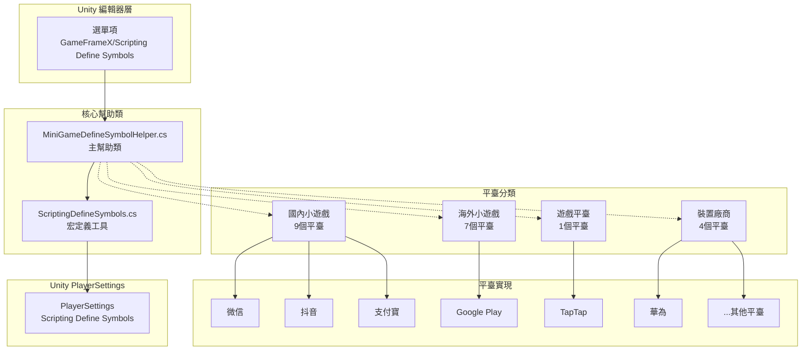
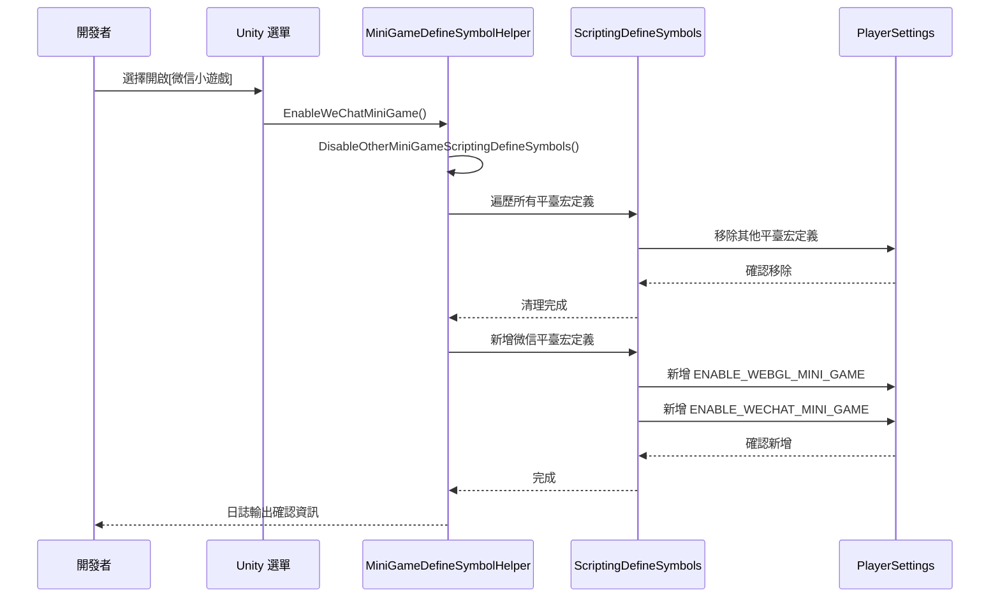

# 平臺支援

GameFrameX 提供全面的多平臺支援，涵蓋作業系統平臺和小遊戲平臺兩大類別。透過條件編譯機制和統一的宏定義管理，開發者可以輕鬆實現專案在不同平臺之間的無縫切換。

## 概述

GameFrameX 的平臺支援系統採用 Unity 的 Scripting Define Symbols（指令碼宏定義）技術，實現了對 21 個主流小遊戲平臺的一鍵切換支援。該系統設計遵循以下核心原則：

- **互斥機制**：各小遊戲平臺之間互斥，一次只能啟用一個平臺
- **統一標識**：所有小遊戲平臺共享統一宏定義 `ENABLE_WEBGL_MINI_GAME`
- **選單整合**：透過 Unity 選單提供視覺化的平臺切換操作
- **條件編譯**：使用 `#if` 預處理指令實現平臺特定程式碼

## 架構

平臺支援系統的架構設計圍繞 `MiniGameDefineSymbolHelper` 展開，採用部分類（partial class）模式實現模組化擴充套件。



**架構說明：**

1. **編輯器層**：透過 Unity 選單觸發平臺切換操作
2. **核心幫助類**：
   - `MiniGameDefineSymbolHelper`：主幫助類，管理所有平臺宏定義
   - `ScriptingDefineSymbols`：底層工具類，封裝 PlayerSettings API
3. **平臺分類**：按地區和型別將 21 個平臺分為 4 個組
4. **Unity PlayerSettings**：最終的宏定義儲存位置

## 核心機制

### 宏定義體系

GameFrameX 使用雙層宏定義體系來管理平臺切換：

```mermaid
flowchart LR
    subgraph DefineLayers["宏定義層級"]
        Unified["統一宏定義<br/>ENABLE_WEBGL_MINI_GAME"]
        Platform["平臺宏定義<br/>ENABLE_XXX_MINI_GAME<br/>XXXMINIGAME"]
    end
    
    Unified -->|啟用時機| Auto[當任意平臺開啟時<br/>自動啟用]
    Platform -->|條件編譯|#if UNITY_WEBGL<br/>& ENABLE_XXX_MINI_GAME
    
    style Unified fill:#e1f5fe
    style Platform fill:#fff3e0
```

**宏定義說明：**

| 宏定義型別 | 名稱 | 用途 |
|-----------|------|------|
| 統一宏定義 | `ENABLE_WEBGL_MINI_GAME` | 標識當前構建為 WebGL 小遊戲 |
| 平臺宏定義 | `ENABLE_XXX_MINI_GAME` | 標識具體的小遊戲平臺 |
| 平臺宏定義 | `XXXMINIGAME` | 平臺簡寫標識（用於第三方 SDK 適配） |

### 平臺互斥機制



## 支援的平臺

### 作業系統平臺

GameFrameX 支援以下作業系統平臺的構建：

| 平臺 | 狀態 | 支援版本 | 構建目標組 |
|------|------|----------|-----------|
| Windows | ✅ 已支援 | Unity 2019.4+ | Standalone |
| macOS | ✅ 已支援 | Unity 2019.4+ | Standalone |
| Linux | ✅ 已支援 | Unity 2019.4+ | Standalone |
| iOS | ✅ 已支援 | Unity 2019.4+ | iOS |
| Android | ✅ 已支援 | Unity 2019.4+ | Android |
| WebGL | ✅ 已支援 | Unity 2019.4+ | WebGL |

### 小遊戲平臺

GameFrameX 提供一鍵切換的 21 個小遊戲平臺適配，涵蓋國內、國際、裝置廠商和遊戲平臺四大類別。

#### 國內小遊戲（9個）

| 平臺 | 宏定義 | 地區 | 選單路徑 |
|------|--------|------|----------|
| 微信小程式 | `ENABLE_WECHAT_MINI_GAME` / `WEIXINMINIGAME` | 🇨🇳 中國 | Domestic Mini Games |
| 支付寶小程式 | `ENABLE_ALIPAY_MINI_GAME` / `ALIPAYMINIGAME` | 🇨🇳 中國 | Domestic Mini Games |
| 抖音小程式 | `ENABLE_DOUYIN_MINI_GAME` / `DOUYINMINIGAME` | 🇨🇳 中國 | Domestic Mini Games |
| 快手小程式 | `ENABLE_KUAISHOU_MINI_GAME` / `KUAISHOUMINIGAME` | 🇨🇳 中國 | Domestic Mini Games |
| 百度小程式 | `ENABLE_BAIDU_MINI_GAME` / `BAIDUMINIGAME` | 🇨🇳 中國 | Domestic Mini Games |
| 京東小程式 | `ENABLE_JINGDONG_MINI_GAME` / `JINGDONGMINIGAME` | 🇨🇳 中國 | Domestic Mini Games |
| 淘寶小程式 | `ENABLE_TAOBAO_MINI_GAME` / `TAOBAOMINIGAME` | 🇨🇳 中國 | Domestic Mini Games |
| 美團小程式 | `ENABLE_MEITUAN_MINI_GAME` / `MEITUANMINIGAME` | 🇨🇳 中國 | Domestic Mini Games |
| Bilibili 小程式 | `ENABLE_BILIBILI_MINI_GAME` / `BILIBILIMINIGAME` | 🇨🇳 中國 | Domestic Mini Games |

#### 海外小遊戲（7個）

| 平臺 | 宏定義 | 地區 | 選單路徑 |
|------|--------|------|----------|
| Discord | `ENABLE_DISCORD_MINI_GAME` / `DISCORDMINIGAME` | 🌍 全球 | International Mini Games |
| YouTube | `ENABLE_YOUTUBE_MINI_GAME` / `YOUTUBEMINIGAME` | 🌍 全球 | International Mini Games |
| Facebook | `ENABLE_FACEBOOK_MINI_GAME` / `FACEBOOKMINIGAME` | 🌍 全球 | International Mini Games |
| Google Play | `ENABLE_GOOGLEPLAY_MINI_GAME` / `GOOGLEPLAYMINIGAME` | 🌍 全球 | International Mini Games |
| TikTok | `ENABLE_TIKTOK_MINI_GAME` / `TIKTOKMINIGAME` | 🌍 全球 | International Mini Games |
| CrazyGames | `ENABLE_CRAZYGAMES_MINI_GAME` / `CRAZYGAMESMINIGAME` | 🌍 全球 | International Mini Games |
| Poki | `ENABLE_POKI_MINI_GAME` / `POKIMINIGAME` | 🌍 全球 | International Mini Games |

#### 裝置廠商（4個）

| 平臺 | 宏定義 | 地區 | 選單路徑 |
|------|--------|------|----------|
| 華為小遊戲 | `ENABLE_HUAWEI_MINI_GAME` / `HUAWEIMINIGAME` | 🇨🇳 中國 | Device OEMs |
| OPPO 小遊戲 | `ENABLE_OPPO_MINI_GAME` / `OPPOSMINIGAME` | 🇨🇳 中國 | Device OEMs |
| vivo 小遊戲 | `ENABLE_VIVO_MINI_GAME` / `VIVOMINIGAME` | 🇨🇳 中國 | Device OEMs |
| 小米小遊戲 | `ENABLE_XIAOMI_MINI_GAME` / `XIAOMIMINIGAME` | 🇨🇳 中國 | Device OEMs |

#### 遊戲平臺（1個）

| 平臺 | 宏定義 | 地區 | 選單路徑 |
|------|--------|------|----------|
| TapTap 小遊戲 | `ENABLE_TAPTAP_MINI_GAME` / `TAPTAPMINIGAME` | 🇨🇳 中國 | Game Platforms |

## 使用指南

### 啟用小遊戲平臺

在 Unity 編輯器中，透過選單操作可以快速切換小遊戲平臺：

```
GameFrameX/
└── Scripting Define Symbols/
    ├── Domestic Mini Games(國內小遊戲)/
    │   ├── Enable WeChat Mini Game (開啟[微信小遊戲]適配)
    │   ├── Enable Alipay Mini Game (開啟[支付寶小遊戲]適配)
    │   ├── Enable DouYin Mini Game (開啟[抖音小遊戲]適配)
    │   ├── Enable KuaiShou Mini Game (開啟[快手小遊戲]適配)
    │   ├── Enable Baidu Mini Game (開啟[百度小遊戲]適配)
    │   ├── Enable JingDong Mini Game (開啟[京東小遊戲]適配)
    │   ├── Enable Meituan Mini Game (開啟[美團小遊戲]適配)
    │   ├── Enable Taobao Mini Game (開啟[淘寶小遊戲]適配)
    │   └── Enable Bilibili Mini Game (開啟[Bilibili小遊戲]適配)
    ├── International Mini Games(海外小遊戲)/
    │   ├── Enable Discord Mini Game
    │   ├── Enable YouTube Mini Game
    │   ├── Enable Facebook Mini Game
    │   ├── Enable Google Play Mini Game
    │   ├── Enable TikTok Mini Game
    │   ├── Enable CrazyGames Mini Game
    │   └── Enable Poki Mini Game
    ├── Device OEMs(裝置廠商)/
    │   ├── Enable Huawei Mini Game (開啟[華為小遊戲]適配)
    │   ├── Enable OPPO Mini Game (開啟[OPPO小遊戲]適配)
    │   ├── Enable Vivo Mini Game (開啟[vivo小遊戲]適配)
    │   └── Enable Xiaomi Mini Game (開啟[小米小遊戲]適配)
    └── Game Platforms(遊戲平臺)/
        └── Enable TapTap Mini Game (開啟[TapTap小遊戲]適配)
```

### 使用條件編譯

在程式碼中可以使用條件編譯指令來實現平臺特定的邏輯：

```csharp
#if ENABLE_WEBGL_MINI_GAME
    // 所有小遊戲平臺共用的程式碼
#endif

#if ENABLE_WECHAT_MINI_GAME
    // 微信小遊戲特定程式碼
    // 可使用微信小遊戲專屬 API
#endif

#if ENABLE_TAPTAP_MINI_GAME
    // TapTap 小遊戲特定程式碼
    // 可使用 TapTap 平臺 SDK
#endif

#if ENABLE_GOOGLEPLAY_MINI_GAME
    // Google Play 小遊戲特定程式碼
    // 可使用 Google Play 遊戲服務
#endif
```

> Source: [MiniGameDefineSymbolHelper.WeChat.cs](https://github.com/GameFrameX/com.gameframex.unity/blob/main/Editor/MiniGame/DomesticMiniGames/MiniGameDefineSymbolHelper.WeChat.cs#L14-L39)
> Source: [MiniGameDefineSymbolHelper.TapTap.cs](https://github.com/GameFrameX/com.gameframex.unity/blob/main/Editor/MiniGame/GamePlatforms/MiniGameDefineSymbolHelper.TapTap.cs#L14-L39)

### 關閉小遊戲平臺

同樣可以透過選單關閉已啟用的小遊戲平臺：

```
GameFrameX/
└── Scripting Define Symbols/
    ├── Domestic Mini Games(國內小遊戲)/
    │   └── Disable WeChat Mini Game (關閉[微信小遊戲]適配)
    ├── International Mini Games(海外小遊戲)/
    │   └── Disable Google Play Mini Game (關閉[Google Play]適配)
    ├── Device OEMs(裝置廠商)/
    │   └── Disable Huawei Mini Game (關閉[華為小遊戲]適配)
    └── Game Platforms(遊戲平臺)/
        └── Disable TapTap Mini Game (關閉[TapTap小遊戲]適配)
```

## 核心 API 參考

### `MiniGameDefineSymbolHelper`

小遊戲平臺宏定義管理主類。

#### `EnableWeChatMiniGame()`

```csharp
#if UNITY_WEBGL
[MenuItem("GameFrameX/Scripting Define Symbols/Domestic Mini Games(國內小遊戲)/Enable WeChat Mini Game(開啟[微信小遊戲]適配)", false, 2000)]
#endif
public static void EnableWeChatMiniGame()
```

開啟微信小遊戲適配。啟用時會自動：
1. 關閉其他所有小遊戲平臺的宏定義
2. 啟用微信小遊戲專用的宏定義
3. 啟用統一的 WebGL 小遊戲宏定義

> Source: [MiniGameDefineSymbolHelper.WeChat.cs](https://github.com/GameFrameX/com.gameframex.unity/blob/main/Editor/MiniGame/DomesticMiniGames/MiniGameDefineSymbolHelper.WeChat.cs#L20-L40)

#### `DisableWeChatMiniGame()`

```csharp
#if UNITY_WEBGL
[MenuItem("GameFrameX/Scripting Define Symbols/Domestic Mini Games(國內小遊戲)/Disable WeChat Mini Game(關閉[微信小遊戲]適配)", false, 2001)]
#endif
public static void DisableWeChatMiniGame()
```

關閉微信小遊戲適配。

> Source: [MiniGameDefineSymbolHelper.WeChat.cs](https://github.com/GameFrameX/com.gameframex.unity/blob/main/Editor/MiniGame/DomesticMiniGames/MiniGameDefineSymbolHelper.WeChat.cs#L46-L64)

### `ScriptingDefineSymbols`

指令碼宏定義底層操作工具類。

#### `HasScriptingDefineSymbol(buildTargetGroup, scriptingDefineSymbol): bool`

```csharp
public static bool HasScriptingDefineSymbol(BuildTargetGroup buildTargetGroup, string scriptingDefineSymbol)
```

檢查指定平臺是否存在指定的指令碼宏定義。

**引數：**
- `buildTargetGroup` (BuildTargetGroup)：目標平臺組
- `scriptingDefineSymbol` (string)：要檢查的宏定義

**返回：** 是否存在指定宏定義

> Source: [ScriptingDefineSymbols.cs](https://github.com/GameFrameX/com.gameframex.unity/blob/main/Editor/Misc/ScriptingDefineSymbols.cs#L57-L74)

#### `AddScriptingDefineSymbol(buildTargetGroup, scriptingDefineSymbol): void`

```csharp
public static void AddScriptingDefineSymbol(BuildTargetGroup buildTargetGroup, string scriptingDefineSymbol)
```

為指定平臺新增指令碼宏定義。

**引數：**
- `buildTargetGroup` (BuildTargetGroup)：目標平臺組
- `scriptingDefineSymbol` (string)：要新增的宏定義

> Source: [ScriptingDefineSymbols.cs](https://github.com/GameFrameX/com.gameframex.unity/blob/main/Editor/Misc/ScriptingDefineSymbols.cs#L81-L99)

#### `RemoveScriptingDefineSymbol(buildTargetGroup, scriptingDefineSymbol): void`

```csharp
public static void RemoveScriptingDefineSymbol(BuildTargetGroup buildTargetGroup, string scriptingDefineSymbol)
```

從指定平臺移除指令碼宏定義。

**引數：**
- `buildTargetGroup` (BuildTargetGroup)：目標平臺組
- `scriptingDefineSymbol` (string)：要移除的宏定義

> Source: [ScriptingDefineSymbols.cs](https://github.com/GameFrameX/com.gameframex.unity/blob/main/Editor/Misc/ScriptingDefineSymbols.cs#L106-L125)

#### `GetScriptingDefineSymbols(buildTargetGroup): string[]`

```csharp
public static string[] GetScriptingDefineSymbols(BuildTargetGroup buildTargetGroup)
```

獲取指定平臺的指令碼宏定義陣列。

**引數：**
- `buildTargetGroup` (BuildTargetGroup)：目標平臺組

**返回：** 宏定義陣列

> Source: [ScriptingDefineSymbols.cs](https://github.com/GameFrameX/com.gameframex.unity/blob/main/Editor/Misc/ScriptingDefineSymbols.cs#L166-L169)

## 最佳實踐

### 平臺適配建議

1. **使用統一的 WebGL 宏定義**：對於所有小遊戲平臺通用的程式碼，使用 `ENABLE_WEBGL_MINI_GAME` 進行條件編譯

2. **分離平臺特定程式碼**：將不同平臺的程式碼分別放置在獨立的目錄或檔案中，便於維護

3. **介面抽象**：對於需要呼叫平臺特定 API 的場景，建議使用介面抽象或依賴注入模式

4. **測試覆蓋**：每個目標平臺都應該進行充分的測試，確保條件編譯程式碼正確執行

### 常見問題

**Q: 開啟新平臺後之前的平臺宏定義是否會自動關閉？**

是的，系統採用互斥機制，開啟任一小遊戲平臺會自動關閉其他所有小遊戲平臺的宏定義。

**Q: 可以同時開啟多個小遊戲平臺嗎？**

不可以。由於小遊戲平臺之間的 API 和 SDK 存在衝突，系統設計為互斥模式，一次只能啟用一個平臺。

**Q: 如何檢視當前已開啟的平臺？**

可以透過 Unity 選單 `Edit > Project Settings > Player > Other Settings > Scripting Define Symbols` 檢視 WebGL 平臺下的宏定義列表。

## 相關連結

- [編輯器工具](./6-editor-tools.mini-game-platform) - 小遊戲平臺適配詳細文件
- [構建工具](./6-editor-tools.build-tools) - 構建產品相關工具
- [API 參考](./8-api-reference) - 完整 API 文件
- [專案主頁](https://github.com/GameFrameX/com.gameframex.unity)
- [官方文件](https://gameframex.doc.alianblank.com)
