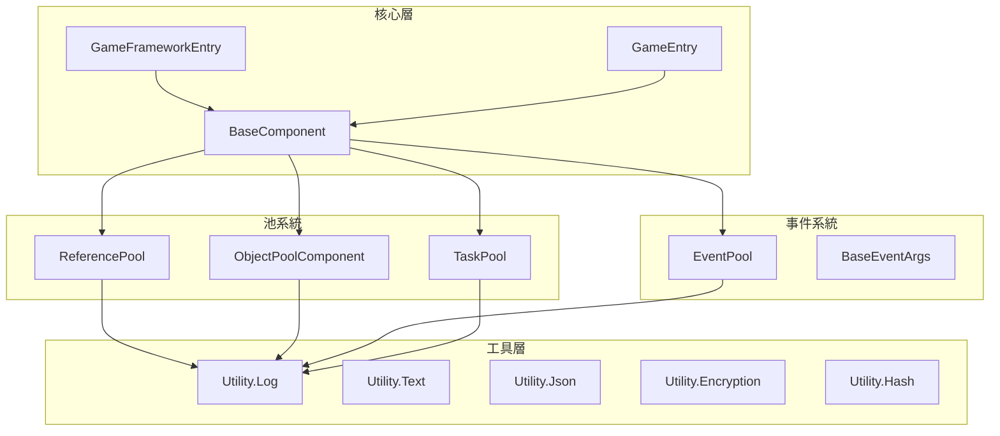

# API 參考

本文件提供 GameFrameX 框架所有公共 API 的完整參考，包括核心類、介面、方法簽名和使用說明。

## 概述

GameFrameX 框架採用模組化架構設計，核心 API 主要分為以下幾個部分：

- **框架入口**：`GameFrameworkEntry` 和 `GameEntry` 提供框架初始化和組件管理
- **基礎組件**：`BaseComponent` 提供遊戲執行時基礎設定
- **引用池**：`ReferencePool` 提供高效能記憶體管理
- **事件系統**：`EventPool<T>` 提供型別安全的事件機制
- **任務池**：`TaskPool<T>` 提供非同步任務管理
- **物件池**：`ObjectPoolComponent` 提供遊戲物件複用
- **工具類**：`Utility` 名稱空間提供各類輔助功能

## 架構圖



---

## 框架入口

### GameFrameworkEntry

框架模組管理器，負責框架級模組的註冊、獲取和更新。

> Source: [Runtime/Base/GameFrameworkEntry.cs](https://github.com/GameFrameX/com.gameframex.unity/blob/main/Runtime/Base/GameFrameworkEntry.cs#L44-L209)

#### 核心方法

##### `Update(elapseSeconds: float, realElapseSeconds: float): void`

輪詢所有已註冊的框架模組。

```csharp
GameFrameworkEntry.Update(deltaTime, unscaledDeltaTime);
```
> Source: [GameFrameworkEntry.cs#L58-L64](https://github.com/GameFrameX/com.gameframex.unity/blob/main/Runtime/Base/GameFrameworkEntry.cs#L58-L64)

##### `Shutdown(): void`

關閉並清理所有遊戲框架模組，釋放引用池和快取。

```csharp
GameFrameworkEntry.Shutdown();
```
> Source: [GameFrameworkEntry.cs#L73-L84](https://github.com/GameFrameX/com.gameframex.unity/blob/main/Runtime/Base/GameFrameworkEntry.cs#L73-L84)

##### `GetModule<T>(): T`

獲取指定介面型別的框架模組。如果模組不存在，將自動建立。

```csharp
var objectPoolMgr = GameFrameworkEntry.GetModule<IObjectPoolManager>();
```
> Source: [GameFrameworkEntry.cs#L95-L120](https://github.com/GameFrameX/com.gameframex.unity/blob/main/Runtime/Base/GameFrameworkEntry.cs#L95-L120)

##### `RegisterModule(interfaceType: Type, implType: Type): void`

註冊框架模組的介面與實現型別對映。

```csharp
GameFrameworkEntry.RegisterModule(typeof(IObjectPoolManager), typeof(ObjectPoolManager));
```
> Source: [GameFrameworkEntry.cs#L153-L169](https://github.com/GameFrameX/com.gameframex.unity/blob/main/Runtime/Base/GameFrameworkEntry.cs#L153-L169)

---

### GameEntry

Unity 組件管理器，提供遊戲框架組件的註冊和獲取。

> Source: [Runtime/Base/GameEntry.cs](https://github.com/GameFrameX/com.gameframex.unity/blob/main/Runtime/Base/GameEntry.cs#L46-L196)

#### 核心方法

##### `GetComponent<T>(): T`

獲取指定型別的遊戲框架組件。

```csharp
var objectPoolComp = GameEntry.GetComponent<ObjectPoolComponent>();
```
> Source: [GameEntry.cs#L67-L70](https://github.com/GameFrameX/com.gameframex.unity/blob/main/Runtime/Base/GameEntry.cs#L67-L70)

##### `Shutdown(shutdownType: ShutdownType): void`

關閉遊戲框架。

```csharp
GameEntry.Shutdown(ShutdownType.Quit);
```
> Source: [GameEntry.cs#L131-L162](https://github.com/GameFrameX/com.gameframex.unity/blob/main/Runtime/Base/GameEntry.cs#L131-L162)

---

## 基礎組件

### BaseComponent

遊戲基礎組件，提供幀率控制、遊戲速度管理、後臺執行設定等核心功能。

> Source: [Runtime/Base/BaseComponent.cs](https://github.com/GameFrameX/com.gameframex.unity/blob/main/Runtime/Base/BaseComponent.cs#L48-L403)

#### 屬性

| 屬性 | 型別 | 描述 |
|------|------|------|
| `FrameRate` | `int` | 獲取或設定遊戲幀率 |
| `GameSpeed` | `float` | 獲取或設定遊戲速度（0 表示暫停） |
| `IsGamePaused` | `bool` | 獲取遊戲是否暫停 |
| `IsNormalGameSpeed` | `bool` | 獲取遊戲是否以正常速度執行 |
| `RunInBackground` | `bool` | 獲取或設定是否允許後臺執行 |
| `NeverSleep` | `bool` | 獲取或設定是否禁止休眠 |

#### 方法

##### `PauseGame(): void`

暫停遊戲。

```csharp
var baseComp = GameEntry.GetComponent<BaseComponent>();
baseComp.PauseGame();
```
> Source: [BaseComponent.cs#L220-L229](https://github.com/GameFrameX/com.gameframex.unity/blob/main/Runtime/Base/BaseComponent.cs#L220-L229)

##### `ResumeGame(): void`

恢復遊戲。

```csharp
baseComp.ResumeGame();
```
> Source: [BaseComponent.cs#L235-L243](https://github.com/GameFrameX/com.gameframex.unity/blob/main/Runtime/Base/BaseComponent.cs#L235-L243)

##### `ResetNormalGameSpeed(): void`

重置為正常遊戲速度。

```csharp
baseComp.ResetNormalGameSpeed();
```
> Source: [BaseComponent.cs#L249-L257](https://github.com/GameFrameX/com.gameframex.unity/blob/main/Runtime/Base/BaseComponent.cs#L249-L257)

---

## 引用池

### ReferencePool

引用池管理器，用於物件的複用，減少 GC 開銷。

> Source: [Runtime/Base/ReferencePool/ReferencePool.cs](https://github.com/GameFrameX/com.gameframex.unity/blob/main/Runtime/Base/ReferencePool/ReferencePool.cs#L44-L296)

#### 屬性

| 屬性 | 型別 | 描述 |
|------|------|------|
| `EnableStrictCheck` | `bool` | 獲取或設定是否開啟強制型別檢查 |
| `Count` | `int` | 獲取引用池的數量 |

#### 核心方法

##### `Acquire<T>(): T`

從引用池獲取指定型別的引用。

```csharp
var myRef = ReferencePool.Acquire<MyReferenceClass>();
```
> Source: [ReferencePool.cs#L129-L132](https://github.com/GameFrameX/com.gameframex.unity/blob/main/Runtime/Base/ReferencePool/ReferencePool.cs#L129-L132)

##### `Release(reference: IReference): void`

將引用歸還引用池。

```csharp
ReferencePool.Release(myRef);
```
> Source: [ReferencePool.cs#L157-L167](https://github.com/GameFrameX/com.gameframex.unity/blob/main/Runtime/Base/ReferencePool/ReferencePool.cs#L157-L167)

##### `Add<T>(count: int): void`

向引用池中追加指定數量的引用。

```csharp
ReferencePool.Add<MyReferenceClass>(10);
```
> Source: [ReferencePool.cs#L178-L181](https://github.com/GameFrameX/com.gameframex.unity/blob/main/Runtime/Base/ReferencePool/ReferencePool.cs#L178-L181)

##### `Remove<T>(count: int): void`

從引用池中移除指定數量的引用。

```csharp
ReferencePool.Remove<MyReferenceClass>(5);
```
> Source: [ReferencePool.cs#L207-L210](https://github.com/GameFrameX/com.gameframex.unity/blob/main/Runtime/Base/ReferencePool/ReferencePool.cs#L207-L210)

##### `ClearAll(): void`

清除所有引用池。

```csharp
ReferencePool.ClearAll();
```
> Source: [ReferencePool.cs#L107-L118](https://github.com/GameFrameX/com.gameframex.unity/blob/main/Runtime/Base/ReferencePool/ReferencePool.cs#L107-L118)

##### `GetAllReferencePoolInfos(): ReferencePoolInfo[]`

獲取所有引用池的資訊。

```csharp
var infos = ReferencePool.GetAllReferencePoolInfos();
```
> Source: [ReferencePool.cs#L82-L98](https://github.com/GameFrameX/com.gameframex.unity/blob/main/Runtime/Base/ReferencePool/ReferencePool.cs#L82-L98)

---

### IReference

引用介面，所有可放入引用池的物件必須實現此介面。

> Source: [Runtime/Base/ReferencePool/IReference.cs](https://github.com/GameFrameX/com.gameframex.unity/blob/main/Runtime/Base/ReferencePool/IReference.cs#L40-L52)

```csharp
public class MyReferenceClass : IReference
{
    public void Clear() { /* 重置狀態 */ }
}
```
> Source: [IReference.cs#L40-L52](https://github.com/GameFrameX/com.gameframex.unity/blob/main/Runtime/Base/ReferencePool/IReference.cs#L40-L52)

---

## 事件系統

### `EventPool<T>`

型別安全的事件池，支援執行緒安全的事件分發。

> Source: [Runtime/Base/EventPool/EventPool.cs](https://github.com/GameFrameX/com.gameframex.unity/blob/main/Runtime/Base/EventPool/EventPool.cs#L47-L395)

#### 構造方法

##### `EventPool(mode: EventPoolMode)`

建立事件池例項。

```csharp
var eventPool = new EventPool<T>(EventPoolMode.AllowMultiHandler | EventPoolMode.AllowDuplicateHandler);
```
> Source: [EventPool.cs#L65-L73](https://github.com/GameFrameX/com.gameframex.unity/blob/main/Runtime/Base/EventPool/EventPool.cs#L65-L73)

#### 屬性

| 屬性 | 型別 | 描述 |
|------|------|------|
| `EventHandlerCount` | `int` | 獲取事件處理函式的數量 |
| `EventCount` | `int` | 獲取佇列中待處理事件的數量 |

#### 核心方法

##### `Subscribe(id: string, handler: EventHandler<T>): void`

訂閱事件。

```csharp
eventPool.Subscribe("PlayerDead", OnPlayerDead);
```
> Source: [EventPool.cs#L208-L234](https://github.com/GameFrameX/com.gameframex.unity/blob/main/Runtime/Base/EventPool/EventPool.cs#L208-L234)

##### `Unsubscribe(id: string, handler: EventHandler<T>): void`

取消訂閱事件。

```csharp
eventPool.Unsubscribe("PlayerDead", OnPlayerDead);
```
> Source: [EventPool.cs#L245-L280](https://github.com/GameFrameX/com.gameframex.unity/blob/main/Runtime/Base/EventPool/EventPool.cs#L245-L280)

##### `Fire(sender: object, e: T): void`

丟擲事件（執行緒安全，非同步分發）。

```csharp
var eventArgs = ReferencePool.Acquire<PlayerDeadEventArgs>();
eventArgs.PlayerId = 123;
eventPool.Fire(this, eventArgs);
```
> Source: [EventPool.cs#L304-L313](https://github.com/GameFrameX/com.gameframex.unity/blob/main/Runtime/Base/EventPool/EventPool.cs#L304-L313)

##### `FireNow(sender: object, e: T): void`

立即丟擲事件（同步分發）。

```csharp
eventPool.FireNow(this, eventArgs);
```
> Source: [EventPool.cs#L324-L335](https://github.com/GameFrameX/com.gameframex.unity/blob/main/Runtime/Base/EventPool/EventPool.cs#L324-L335)

##### `Check(id: string, handler: EventHandler<T>): bool`

檢查是否存在指定的事件處理函式。

```csharp
bool exists = eventPool.Check("PlayerDead", OnPlayerDead);
```
> Source: [EventPool.cs#L186-L197](https://github.com/GameFrameX/com.gameframex.unity/blob/main/Runtime/Base/EventPool/EventPool.cs#L186-L197)

##### `Update(elapseSeconds: float, realElapseSeconds: float): void`

輪詢事件池，處理佇列中的事件。

```csharp
eventPool.Update(deltaTime, unscaledDeltaTime);
```
> Source: [EventPool.cs#L114-L121](https://github.com/GameFrameX/com.gameframex.unity/blob/main/Runtime/Base/EventPool/EventPool.cs#L114-L121)

##### `Shutdown(): void`

關閉並清理事件池。

```csharp
eventPool.Shutdown();
```
> Source: [EventPool.cs#L129-L140](https://github.com/GameFrameX/com.gameframex.unity/blob/main/Runtime/Base/EventPool/EventPool.cs#L129-L140)

---

### BaseEventArgs

事件引數基類，所有自定義事件引數都應繼承此類。

> Source: [Runtime/Base/EventPool/BaseEventArgs.cs](https://github.com/GameFrameX/com.gameframex.unity/blob/main/Runtime/Base/EventPool/BaseEventArgs.cs)

```csharp
public sealed class PlayerDeadEventArgs : BaseEventArgs
{
    public int PlayerId { get; set; }
    public string PlayerName { get; set; }
    
    public override void Clear()
    {
        PlayerId = 0;
        PlayerName = null;
    }
}
```

---

### EventPoolMode

事件池模式列舉。

> Source: [Runtime/Base/EventPool/EventPoolMode.cs](https://github.com/GameFrameX/com.gameframex.unity/blob/main/Runtime/Base/EventPool/EventPoolMode.cs#L44-L56)

```csharp
[Flags]
public enum EventPoolMode : byte
{
    /// 不允許存在空處理函式
    AllowNoHandler = 1,
    /// 允許存在多個處理函式
    AllowMultiHandler = 2,
    /// 允許存在重複的處理函式
    AllowDuplicateHandler = 4,
}
```

---

## 任務池

### `TaskPool<T>`

任務池管理器，用於管理非同步任務的執行。

> Source: [Runtime/Base/TaskPool/TaskPool.cs](https://github.com/GameFrameX/com.gameframex.unity/blob/main/Runtime/Base/TaskPool/TaskPool.cs#L44-L525)

#### 構造方法

##### `TaskPool()`

建立任務池例項。

```csharp
var taskPool = new TaskPool<DownloadTask>();
```
> Source: [TaskPool.cs#L58-L64](https://github.com/GameFrameX/com.gameframex.unity/blob/main/Runtime/Base/TaskPool/TaskPool.cs#L58-L64)

#### 屬性

| 屬性 | 型別 | 描述 |
|------|------|------|
| `Paused` | `bool` | 獲取或設定任務池是否被暫停 |
| `TotalAgentCount` | `int` | 獲取任務代理總數量 |
| `FreeAgentCount` | `int` | 獲取可用任務代理數量 |
| `WorkingAgentCount` | `int` | 獲取工作中任務代理數量 |
| `WaitingTaskCount` | `int` | 獲取等待任務數量 |

#### 核心方法

##### `AddAgent(agent: ITaskAgent<T>): void`

增加任務代理。

```csharp
taskPool.AddAgent(new DownloadTaskAgent());
```
> Source: [TaskPool.cs#L172-L181](https://github.com/GameFrameX/com.gameframex.unity/blob/main/Runtime/Base/TaskPool/TaskPool.cs#L172-L181)

##### `AddTask(task: T): void`

增加任務。

```csharp
var task = ReferencePool.Acquire<DownloadTask>();
task.Url = "http://example.com/file.png";
task.Priority = 100;
taskPool.AddTask(task);
```
> Source: [TaskPool.cs#L327-L348](https://github.com/GameFrameX/com.gameframex.unity/blob/main/Runtime/Base/TaskPool/TaskPool.cs#L327-L348)

##### `RemoveTask(serialId: int): bool`

根據序列編號移除任務。

```csharp
bool removed = taskPool.RemoveTask(taskSerialId);
```
> Source: [TaskPool.cs#L359-L390](https://github.com/GameFrameX/com.gameframex.unity/blob/main/Runtime/Base/TaskPool/TaskPool.cs#L359-L390)

##### `RemoveTasks(tag: string): int`

根據標籤移除任務。

```csharp
int count = taskPool.RemoveTasks("download");
```
> Source: [TaskPool.cs#L401-L439](https://github.com/GameFrameX/com.gameframex.unity/blob/main/Runtime/Base/TaskPool/TaskPool.cs#L401-L439)

##### `RemoveAllTasks(): int`

移除所有任務。

```csharp
int count = taskPool.RemoveAllTasks();
```
> Source: [TaskPool.cs#L449-L471](https://github.com/GameFrameX/com.gameframex.unity/blob/main/Runtime/Base/TaskPool/TaskPool.cs#L449-L471)

##### `GetTaskInfo(serialId: int): TaskInfo`

獲取指定序列編號的任務資訊。

```csharp
var info = taskPool.GetTaskInfo(serialId);
```
> Source: [TaskPool.cs#L192-L212](https://github.com/GameFrameX/com.gameframex.unity/blob/main/Runtime/Base/TaskPool/TaskPool.cs#L192-L212)

##### `GetAllTaskInfos(): TaskInfo[]`

獲取所有任務資訊。

```csharp
var infos = taskPool.GetAllTaskInfos();
```
> Source: [TaskPool.cs#L273-L289](https://github.com/GameFrameX/com.gameframex.unity/blob/main/Runtime/Base/TaskPool/TaskPool.cs#L273-L289)

##### `Update(elapseSeconds: float, realElapseSeconds: float): void`

輪詢任務池，處理任務。

```csharp
taskPool.Update(deltaTime, unscaledDeltaTime);
```
> Source: [TaskPool.cs#L136-L145](https://github.com/GameFrameX/com.gameframex.unity/blob/main/Runtime/Base/TaskPool/TaskPool.cs#L136-L145)

##### `Shutdown(): void`

關閉並清理任務池。

```csharp
taskPool.Shutdown();
```
> Source: [TaskPool.cs#L154-L162](https://github.com/GameFrameX/com.gameframex.unity/blob/main/Runtime/Base/TaskPool/TaskPool.cs#L154-L162)

---

### TaskBase

任務基類，所有自定義任務都應繼承此類。

> Source: [Runtime/Base/TaskPool/TaskBase.cs](https://github.com/GameFrameX/com.gameframex.unity/blob/main/Runtime/Base/TaskPool/TaskBase.cs)

```csharp
public class DownloadTask : TaskBase
{
    public string Url { get; set; }
    public byte[] Result { get; set; }
    
    public override void Clear()
    {
        Url = null;
        Result = null;
        base.Clear();
    }
}
```

---

### `ITaskAgent<T>`

任務代理介面。

> Source: [Runtime/Base/TaskPool/ITaskAgent.cs](https://github.com/GameFrameX/com.gameframex.unity/blob/main/Runtime/Base/TaskPool/ITaskAgent.cs#L41-L56)

```csharp
public interface ITaskAgent<T> where T : TaskBase
{
    TaskBase Task { get; }
    void Initialize();
    void Update(float elapseSeconds, float realElapseSeconds);
    void Shutdown();
    void Reset();
    StartTaskStatus Start(T task);
}
```

---

## 物件池

### ObjectPoolComponent

Unity 物件池組件，提供遊戲物件的複用管理。

> Source: [Runtime/ObjectPool/ObjectPoolComponent.cs](https://github.com/GameFrameX/com.gameframex.unity/blob/main/Runtime/ObjectPool/ObjectPoolComponent.cs#L45-L1135)

#### 屬性

| 屬性 | 型別 | 描述 |
|------|------|------|
| `Count` | `int` | 獲取物件池數量 |

#### 核心方法

##### `HasObjectPool<T>(): bool`

檢查是否存在指定型別的物件池。

```csharp
bool exists = objectPoolComp.HasObjectPool<MyObject>();
```
> Source: [ObjectPoolComponent.cs#L80-L83](https://github.com/GameFrameX/com.gameframex.unity/blob/main/Runtime/ObjectPool/ObjectPoolComponent.cs#L80-L83)

##### `GetObjectPool<T>(): IObjectPool<T>`

獲取指定型別的物件池。

```csharp
var pool = objectPoolComp.GetObjectPool<MyObject>();
```
> Source: [ObjectPoolComponent.cs#L137-L140](https://github.com/GameFrameX/com.gameframex.unity/blob/main/Runtime/ObjectPool/ObjectPoolComponent.cs#L137-L140)

##### `CreateSingleSpawnObjectPool<T>(): IObjectPool<T>`

建立單次獲取物件池。

```csharp
var pool = objectPoolComp.CreateSingleSpawnObjectPool<MyObject>("MyObjectPool");
```
> Source: [ObjectPoolComponent.cs#L257-L260](https://github.com/GameFrameX/com.gameframex.unity/blob/main/Runtime/ObjectPool/ObjectPoolComponent.cs#L257-L260)

##### `CreateMultiSpawnObjectPool<T>(): IObjectPool<T>`

建立多次獲取物件池。

```csharp
var pool = objectPoolComp.CreateMultiSpawnObjectPool<MyObject>("MyObjectPool", 10, 300f);
```
> Source: [ObjectPoolComponent.cs#L655-L658](https://github.com/GameFrameX/com.gameframex.unity/blob/main/Runtime/ObjectPool/ObjectPoolComponent.cs#L655-L658)

##### `DestroyObjectPool<T>(): bool`

銷燬物件池。

```csharp
bool destroyed = objectPoolComp.DestroyObjectPool<MyObject>();
```
> Source: [ObjectPoolComponent.cs#L1053-L1056](https://github.com/GameFrameX/com.gameframex.unity/blob/main/Runtime/ObjectPool/ObjectPoolComponent.cs#L1053-L1056)

##### `Release(): void`

釋放物件池中的可釋放物件。

```csharp
objectPoolComp.Release();
```
> Source: [ObjectPoolComponent.cs#L1120-L1124](https://github.com/GameFrameX/com.gameframex.unity/blob/main/Runtime/ObjectPool/ObjectPoolComponent.cs#L1120-L1124)

##### `ReleaseAllUnused(): void`

釋放物件池中的所有未使用物件。

```csharp
objectPoolComp.ReleaseAllUnused();
```
> Source: [ObjectPoolComponent.cs#L1130-L1134](https://github.com/GameFrameX/com.gameframex.unity/blob/main/Runtime/ObjectPool/ObjectPoolComponent.cs#L1130-L1134)

---

### `IObjectPool<T>`

物件池介面。

> Source: [Runtime/ObjectPool/IObjectPool.cs](https://github.com/GameFrameX/com.gameframex.unity/blob/main/Runtime/ObjectPool/IObjectPool.cs#L40-L58)

```csharp
public interface IObjectPool<T> where T : ObjectBase
{
    string Name { get; }
    int Count { get; }
    int CanReleaseCount { get; }
    T Spawn();
    void Release(T obj);
    void ReleaseAllUnused();
}
```

---

### ObjectBase

物件池物件基類。

> Source: [Runtime/ObjectPool/ObjectBase.cs](https://github.com/GameFrameX/com.gameframex.unity/blob/main/Runtime/ObjectPool/ObjectBase.cs)

```csharp
public class MyObject : ObjectBase
{
    public string Data { get; set; }
    
    public override void Clear() 
    {
        Data = null;
    }
    
    public override void OnSpawn() { }
    public override void OnRelease() { }
}
```

---

## 工具類

### Utility.Log

日誌工具類，提供分級日誌輸出。

> Source: [Runtime/Utility/Log.cs](https://github.com/GameFrameX/com.gameframex.unity/blob/main/Runtime/Utility/Log.cs#L40-L2000+)

#### 日誌級別

| 方法 | 描述 |
|------|------|
| `Debug(message)` | 除錯級別日誌 |
| `Info(message)` | 資訊級別日誌 |
| `Warning(message)` | 警告級別日誌 |
| `Error(message)` | 錯誤級別日誌 |
| `Fatal(message)` | 致命錯誤日誌 |

```csharp
Log.Info("玩家 {0} 進入了遊戲", playerName);
Log.Warning("資源載入失敗: {0}", url);
Log.Error("網路請求超時");
```
> Source: [Log.cs#L557-L560](https://github.com/GameFrameX/com.gameframex.unity/blob/main/Runtime/Utility/Log.cs#L557-L560)

---

### Utility.Text

文字格式化工具。

> Source: [Runtime/Utility/Utility.Text.cs](https://github.com/GameFrameX/com.gameframex.unity/blob/main/Runtime/Utility/Utility.Text.cs)

```csharp
string formatted = Utility.Text.Format("{0} + {1} = {2}", 1, 2, 3);
```

---

### Utility.Json

JSON 序列化工具。

> Source: [Runtime/Utility/Utility.Json.cs](https://github.com/GameFrameX/com.gameframex.unity/blob/main/Runtime/Utility/Utility.Json.cs)

```csharp
string json = Utility.Json.ToJson(myObject);
var obj = Utility.Json.FromJson<MyClass>(json);
```

---

### Utility.Encryption

加解密工具。

> Source: [Runtime/Utility/Utility.Encryption.cs](https://github.com/GameFrameX/com.gameframex.unity/blob/main/Runtime/Utility/Utility.Encryption.cs)

```csharp
// AES 加密
byte[] encrypted = Utility.Encryption.Aes.Encrypt(data, key, iv);

// AES 解密
byte[] decrypted = Utility.Encryption.Aes.Decrypt(encrypted, key, iv);
```

---

### Utility.Hash

雜湊工具。

> Source: [Runtime/Utility/Utility.Hash.Md5.cs](https://github.com/GameFrameX/com.gameframex.unity/blob/main/Runtime/Utility/Utility.Hash.Md5.cs#L25-L50)

```csharp
string md5 = Utility.Hash.MD5.Hash(data);
string sha1 = Utility.Hash.Sha1.Hash(data);
ulong xxhash = Utility.Hash.XXHash.Hash64(data, seed);
```

---

### Utility.Marshal

記憶體操作工具。

> Source: [Runtime/Utility/Utility.Marshal.cs](https://github.com/GameFrameX/com.gameframex.unity/blob/main/Runtime/Utility/Utility.Marshal.cs#L45-L100)

```csharp
IntPtr ptr = Utility.Marshal.Alloc(size);
Utility.Marshal.Copy(data, 0, ptr, data.Length);
Utility.Marshal.FreeCachedHGlobal();
```

---

### Utility.File

檔案操作工具。

> Source: [Runtime/Utility/Utility.File.cs](https://github.com/GameFrameX/com.gameframex.unity/blob/main/Runtime/Utility/Utility.File.cs#L12-L100)

```csharp
string[] lines = Utility.File.ReadAllLines(path);
byte[] data = Utility.File.ReadAllBytes(path);
Utility.File.WriteAllBytes(path, data);
```

---

### Utility.Path

路徑操作工具。

> Source: [Runtime/Utility/Utility.Path.cs](https://github.com/GameFrameX/com.gameframex.unity/blob/main/Runtime/Utility/Utility.Path.cs#L45-L100)

```csharp
string normalizePath = Utility.Path.GetRegularPath(path);
string combinePath = Utility.Path.Combine(dir, file);
```

---

### Utility.Random

隨機數工具。

> Source: [Runtime/Utility/Utility.Random.cs](https://github.com/GameFrameX/com.gameframex.unity/blob/main/Runtime/Utility/Utility.Random.cs#L46-L100)

```csharp
int randomInt = Utility.Random.GetRandom(0, 100);
float randomFloat = Utility.Random.GetRandomFloat(0f, 1f);
```

---

## 列舉型別

### ShutdownType

關閉型別。

> Source: [Runtime/Base/ShutdownType.cs](https://github.com/GameFrameX/com.gameframex.unity/blob/main/Runtime/Base/ShutdownType.cs#L41-L54)

```csharp
public enum ShutdownType : byte
{
    /// 不做任何事
    None = 0,
    /// 關閉後重啟遊戲
    Restart = 1,
    /// 關閉後退出遊戲
    Quit = 2,
}
```

---

### GameFrameworkLogLevel

日誌級別。

> Source: [Runtime/Base/Log/GameFrameworkLogLevel.cs](https://github.com/GameFrameX/com.gameframex.unity/blob/main/Runtime/Base/Log/GameFrameworkLogLevel.cs#L42-L56)

```csharp
public enum GameFrameworkLogLevel : byte
{
    Debug = 0,
    Info = 1,
    Warning = 2,
    Error = 3,
    Fatal = 4,
}
```

---

### TaskStatus

任務狀態。

> Source: [Runtime/Base/TaskPool/TaskStatus.cs](https://github.com/GameFrameX/com.gameframex.unity/blob/main/Runtime/Base/TaskPool/TaskStatus.cs#L41-L51)

```csharp
public enum TaskStatus : byte
{
    /// 未開始
    Todo = 0,
    /// 進行中
    Doing = 1,
    /// 已完成
    Done = 2,
}
```

---

### StartTaskStatus

任務啟動狀態。

> Source: [Runtime/Base/TaskPool/StartTaskStatus.cs](https://github.com/GameFrameX/com.gameframex.unity/blob/main/Runtime/Base/TaskPool/StartTaskStatus.cs#L41-L54)

```csharp
public enum StartTaskStatus : byte
{
    /// 可以進行
    CanStart = 0,
    /// 需要等待
    HasToWait = 1,
    /// 立即完成
    Done = 2,
    /// 可以恢復
    CanResume = 3,
    /// 未知錯誤
    UnknownError = 4,
}
```

---

## 相關連結

- [概述](./1-overview)
- [核心概念](./4-core-concepts)
- [執行時模組 - 事件系統](./5-runtime.event-system)
- [執行時模組 - 物件池系統](./5-runtime.object-pool)
- [執行時模組 - 引用池系統](./5-runtime.reference-pool)
- [執行時模組 - 任務池系統](./5-runtime.task-pool)
- [執行時模組 - 工具類](./5-runtime.utility-classes)
- [常見問題](./9-troubleshooting)
