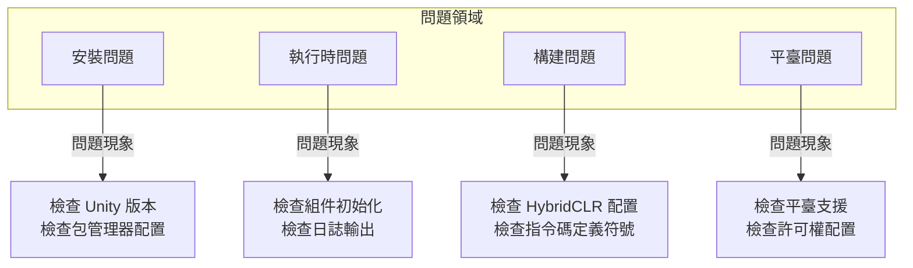

# 常見問題

本文件收集了 GameFrameX Unity 框架在使用過程中可能遇到的常見問題及其解決方案。

## 概述

GameFrameX 是一個功能豐富的 Unity 遊戲框架，在使用過程中可能會遇到各種技術問題。本文件旨在幫助開發者快速定位和解決常見問題，提高開發效率。

## 架構



## 安裝問題

### Unity 版本不相容

**問題描述**: 匯入框架後出現編譯錯誤或功能異常。

**原因分析**:
- Unity 版本低於框架要求的最低版本 (2019.4+)
- .NET API 相容級別設定不正確

**解決方案**:

1. 檢查 Unity 版本：
   - 確保使用 Unity 2019.4 或更高版本
   - 推薦使用 LTS 版本以獲得最佳穩定性

2. 設定 API 相容級別：
   - 開啟 `Edit` → `Project Settings` → `Player`
   - 在 `Other Settings` 中將 `Api Compatibility Level` 設定為 `.NET Standard 2.0` 或更高

> Source: [README.zh-CN.md](https://github.com/GameFrameX/com.gameframex.unity/blob/main/README.zh-CN.md#L57-L61)

### Package Manager 安裝失敗

**問題描述**: 透過 UPM 新增包時出現網路錯誤或安裝失敗。

**解決方案**:

1. 使用推薦的安裝方式：
   - 開啟 Unity 編輯器
   - 選擇 `Window` → `Package Manager`
   - 點選左上角 `+` 按鈕
   - 選擇 `Add package from git URL`
   - 輸入: `https://github.com/GameFrameX/com.gameframex.unity.git`

2. 備選方案 - 手動安裝：
   - 從 GitHub Releases 下載最新版本
   - 解壓到專案的 `Packages` 目錄下

> Source: [README.zh-CN.md](https://github.com/GameFrameX/com.gameframex.unity/blob/main/README.zh-CN.md#L349-L364)

## 執行時問題

### 組件獲取返回空 (Null)

**問題描述**: `GameEntry.GetComponent<T>()` 返回 null。

**原因分析**:
- 對應的組件未新增到場景中
- 組件未正確初始化
- 組件新增順序不正確

**解決方案**:

1. 確保組件已新增到場景：
   - 在場景中建立空物體，新增必要的組件
   - 檢查組件是否繼承自 `GameFrameworkComponent`

2. 檢查組件初始化程式碼：
   > Source: [Runtime/Base/ObjectPoolComponent.cs](https://github.com/GameFrameX/com.gameframex.unity/blob/main/Runtime/ObjectPool/ObjectPoolComponent.cs#L61-L72)

```csharp
protected override void Awake()
{
    ImplementationComponentType = Type.GetType(componentType);
    InterfaceComponentType = typeof(IObjectPoolManager);
    base.Awake();
    m_ObjectPoolManager = GameFrameworkEntry.GetModule<IObjectPoolManager>();
    if (m_ObjectPoolManager == null)
    {
        Log.Fatal("Object pool manager is invalid.");
        return;
    }
}
```

3. 確保 GameEntry 已正確初始化

### 物件池使用問題

**問題描述**: 物件池無法正常獲取或釋放物件。

**原因分析**:
- 物件型別未繼承自 `ObjectBase`
- 物件池未正確建立
- 池容量設定不合理

**解決方案**:

1. 確保物件型別正確繼承：
   > Source: [Runtime/ObjectPool/ObjectBase.cs](https://github.com/GameFrameX/com.gameframex.unity/blob/main/Runtime/ObjectPool/ObjectBase.cs)

2. 正確建立和使用物件池：
```csharp
// 獲取物件池組件
var objectPool = GameEntry.GetComponent<ObjectPoolComponent>();

// 建立物件池
objectPool.CreatePool<MyObject>("MyObjectPool", 10, 100);

// 從池中獲取物件
var obj = objectPool.Spawn<MyObject>("MyObjectPool");

// 歸還物件到池中
objectPool.Unspawn(obj);
```

> Source: [README.zh-CN.md](https://github.com/GameFrameX/com.gameframex.unity/blob/main/README.zh-CN.md#L394-L411)

### 事件系統無響應

**問題描述**: 訂閱的事件無法觸發。

**原因分析**:
- 事件 ID 不匹配
- 未正確訂閱/取消訂閱
- 事件已過期被清理

**解決方案**:

1. 確保事件 ID 定義正確：
```csharp
// 定義事件引數
public class PlayerDeadEventArgs : BaseEventArgs
{
    public int PlayerId { get; set; }
    public float Damage { get; set; }
}

// 訂閱事件
GameEntry.Event.Subscribe(PlayerDeadEventArgs.EventId, OnPlayerDead);

// 傳送事件
GameEntry.Event.Fire(this, PlayerDeadEventArgs.Create(playerId, damage));

// 取消訂閱
GameEntry.Event.Unsubscribe(PlayerDeadEventArgs.EventId, OnPlayerDead);
```

> Source: [README.zh-CN.md](https://github.com/GameFrameX/com.gameframex.unity/blob/main/README.zh-CN.md#L450-L468)

2. 在適當的時候取消訂閱，避免記憶體洩漏

## 構建問題

### HybridCLR 熱更新構建失敗

**問題描述**: 熱更新構建時出現編譯錯誤或檔案未找到。

**原因分析**:
- HybridCLR 未正確安裝
- AOT 程式碼未正確生成
- 熱更 DLL 路徑配置錯誤

**解決方案**:

1. 確認 HybridCLR 已正確安裝：
   - 檢查 `Project Settings` → `HybridCLR` 是否存在
   - 確保已安裝 HybridCLR 外掛

2. 使用框架提供的構建工具：
   ```
   GameFrameX/
   └── Build/
       ├── Build Hotfix (構建熱更新)
       ├── Build Product (構建產品)
       └── Build WebGL With HybridCLR (WebGL熱更新構建)
   ```

3. 複製熱更新程式碼：
   - 使用選單 `GameFrameX/Build/Copy HotFix Code` 複製熱更 DLL
   - 使用選單 `GameFrameX/Build/Copy AOT Code` 複製 AOT 程式碼

> Source: [Editor/BuildHotfix/BuildHotfixHelper.cs](https://github.com/GameFrameX/com.gameframex.unity/blob/main/Editor/BuildHotfix/BuildHotfixHelper.cs#L43-L65)

### AOT 程式碼目錄未找到

**問題描述**: 複製 AOT 程式碼時提示 "未找到 HybridCLR 資料目錄"。

**原因分析**:
- 專案未進行 IL2CPP 構建
- HybridCLR 未正確生成 AOT 資料
- 構建目標平臺不正確

**解決方案**:

1. 確保專案已配置 IL2CPP：
   - 開啟 `Project Settings` → `Player` → `Other Settings`
   - 確認 `Scripting Backend` 設定為 `IL2CPP`

2. 先生成 AOT 後設資料：
   - 在 HybridCLR 選單中執行 `Generate AOT Hocking`

3. 檢查構建目標平臺：
   > Source: [Editor/BuildHotfix/BuildHotfixHelper.cs](https://github.com/GameFrameX/com.gameframex.unity/blob/main/Editor/BuildHotfix/BuildHotfixHelper.cs#L73-L91)

```csharp
DirectoryInfo directoryInfo = new DirectoryInfo(Application.dataPath);
string path = Path.Combine(directoryInfo.Parent.FullName, "HybridCLRData", "AssembliesPostIl2CppStrip", EditorUserBuildSettings.activeBuildTarget.ToString());

DirectoryInfo aotCodeDir = new DirectoryInfo(path);
if (!aotCodeDir.Exists)
{
    Debug.LogError($"未找到HybridCLR資料目錄:{path}");
    return;
}
```

### WebGL 構建相關問題

**問題描述**: WebGL 平臺構建失敗或執行異常。

**解決方案**:

1. 使用專門的 WebGL 構建工具：
   - `GameFrameX/Build WebGL With HybridCLR` - 帶熱更新的 WebGL 構建

2. 檢查 WebGL 模組是否安裝：
   - 開啟 Unity Hub → 安裝 → 新增模組 → WebGL Build Support

### 指令碼定義符號衝突

**問題描述**: 多個平臺宏定義同時生效導致編譯錯誤。

**原因分析**:
- 小遊戲平臺宏定義互斥機制未生效
- 手動新增的宏定義與框架衝突

**解決方案**:

1. 使用框架的選單切換平臺：
   ```
   GameFrameX/
   └── Scripting Define Symbols/
       ├── Domestic Mini Games (國內小遊戲)
       ├── International Mini Games (國際小遊戲)
       ├── Device OEMs (裝置廠商)
       └── Game Platforms (遊戲平臺)
   ```

2. 框架自動處理互斥邏輯：
   > Source: [Editor/MiniGame/MiniGameDefineSymbolHelper.cs](https://github.com/GameFrameX/com.gameframex.unity/blob/main/Editor/MiniGame/MiniGameDefineSymbolHelper.cs#L52-L88)

```csharp
/// <summary>
/// 關閉除當前平臺以外的其它小遊戲平臺宏定義。
/// </summary>
private static void DisableOtherMiniGameScriptingDefineSymbols(string[] currentMiniGameScriptingDefineSymbols)
{
#if UNITY_WEBGL
    var closedCount = 0;
    foreach (var defineSymbols in GetAllMiniGameScriptingDefineSymbols())
    {
        if (defineSymbols == null || object.ReferenceEquals(defineSymbols, currentMiniGameScriptingDefineSymbols))
        {
            continue;
        }

        foreach (var define in defineSymbols)
        {
            if (!ScriptingDefineSymbols.HasScriptingDefineSymbol(BuildTargetGroup.WebGL, define))
            {
                continue;
            }

            ScriptingDefineSymbols.RemoveScriptingDefineSymbol(define);
            closedCount++;
        }
    }
    Debug.Log($"小遊戲宏定義互斥清理完成，共關閉 {closedCount} 個宏定義");
#endif
}
```

## 平臺問題

### iOS 平臺編譯錯誤

**問題描述**: iOS 平臺構建時出現編譯錯誤或原生外掛問題。

**解決方案**:

1. 檢查 iOS 原生外掛：
   - 確保 `Plugins/iOS/GameFrameX/GameFrameX.mm` 存在
   - 檢查外掛匯入設定

2. 設定正確的許可權：
   - 在 Xcode 中配置必要的許可權描述
   - 檢查 Info.plist 配置

### Android 平臺執行崩潰

**問題描述**: Android 平臺應用啟動後崩潰。

**解決方案**:

1. 檢查 IL2CPP 配置：
   - 確保使用了正確的 ABI 設定
   - 檢查 armeabi-v7a 和 arm64-v8a 支援

2. 檢查許可權配置：
   - 確保必要的 Android 許可權已宣告

### 小遊戲平臺適配問題

**問題描述**: 切換小遊戲平臺後功能異常。

**原因分析**:
- 未正確啟用目標平臺的宏定義
- 平臺特定的 API 未正確呼叫
- 資源路徑配置問題

**解決方案**:

1. 確認平臺宏定義已啟用：
   - 透過選單 `GameFrameX/Scripting Define Symbols/` 選擇目標平臺
   - 檢視 Console 確認宏定義啟用日誌

2. 使用條件編譯處理平臺差異：
```csharp
#if ENABLE_WECHAT_MINI_GAME
    // 微信小遊戲特定程式碼
#elif ENABLE_ALIPAY_MINI_GAME
    // 支付寶小遊戲特定程式碼
#endif
```

3. 檢查統一宏定義：
   - 所有小遊戲平臺共享 `ENABLE_WEBGL_MINI_GAME` 宏定義

> Source: [README.zh-CN.md](https://github.com/GameFrameX/com.gameframex.unity/blob/main/README.zh-CN.md#L583-L588)

## 日誌與除錯

### 啟用詳細日誌

**問題描述**: 需要檢視更詳細的執行資訊進行除錯。

**解決方案**:

1. 使用框架日誌系統：
   > Source: [Runtime/Base/Log/GameFrameworkLog.cs](https://github.com/GameFrameX/com.gameframex.unity/blob/main/Runtime/Base/Log/GameFrameworkLog.cs)

2. 配置日誌級別：
```csharp
// 在遊戲初始化時設定
Log.SetLogLevel(LogLevel.Debug);
```

3. 檢視框架內建日誌：
   - 框架使用 `GameFrameworkLog` 進行日誌輸出
   - 可透過自定義 `ILogHelper` 改變日誌行為

### 異常捕獲與處理

**問題描述**: 需要捕獲並處理框架異常。

**解決方案**:

1. 使用框架定義的異常型別：
   > Source: [Runtime/Base/GameFrameworkException.cs](https://github.com/GameFrameX/com.gameframex.unity/blob/main/Runtime/Base/GameFrameworkException.cs)

```csharp
try
{
    // 框架相關操作
}
catch (GameFrameworkException ex)
{
    Log.Error($"框架異常: {ex.Message}");
}
catch (Exception ex)
{
    Log.Error($"系統異常: {ex.Message}");
}
```

2. 使用引數驗證：
   > Source: [Runtime/Base/GameFrameworkGuard.cs](https://github.com/GameFrameX/com.gameframex.unity/blob/main/Runtime/Base/GameFrameworkGuard.cs)

```csharp
// 引數非空檢查
GameFrameworkGuard.NotNull(value, nameof(value));
GameFrameworkGuard.NotNullOrEmpty(text, nameof(text));
// 範圍檢查
GameFrameworkGuard.NotRange(value, 0, 100, nameof(value));
```

## 效能問題

### 記憶體洩漏

**問題描述**: 長時間執行後記憶體持續增長。

**可能原因**:
- 事件未取消訂閱
- 物件池物件未歸還
- 引用池物件未釋放

**解決方案**:

1. 正確管理事件訂閱：
```csharp
void OnDestroy()
{
    // 取消所有訂閱
    GameEntry.Event.Unsubscribe<PlayerDeadEventArgs>(OnPlayerDead);
}
```

2. 正確使用物件池：
```csharp
// 使用完成後歸還
objectPool.Unspawn(obj);

// 或者使用 using 語句（如果支援）
```

3. 使用 Inspector 監控：
   - 框架提供了物件池和引用池的視覺化檢視面板
   - 透過 `Window` → `GameFrameX` → `Inspector` 檢視

### 效能最佳化建議

1. 使用物件池複用頻繁建立銷燬的物件
2. 使用引用池減少 GC 壓力
3. 使用擴充套件方法最佳化 Unity 物件操作
4. 合理使用任務池處理非同步操作

## 常見錯誤資訊對照表

| 錯誤資訊 | 可能原因 | 解決方案 |
|----------|----------|----------|
| `Object pool manager is invalid` | 組件未正確初始化 | 檢查 ObjectPoolComponent 是否新增到場景 |
| `未找到 HybridCLR 資料目錄` | 未執行 IL2CPP 構建 | 執行完整構建流程 |
| `can not be null` | 引數為空 | 使用 GameFrameworkGuard 進行檢查 |
| `組件獲取返回 null` | 組件未新增到場景 | 確認組件已正確新增到場景 |
| `小遊戲宏定義衝突` | 多個平臺同時啟用 | 使用框架選單切換平臺 |

## 獲取更多幫助

- **官方文件**: [https://gameframex.doc.alianblank.com](https://gameframex.doc.alianblank.com)
- **GitHub Issues**: [https://github.com/GameFrameX/com.gameframex.unity/issues](https://github.com/GameFrameX/com.gameframex.unity/issues)
- **QQ 討論群**: 467608841
- **功能建議**: [GitHub Discussions](https://github.com/GameFrameX/com.gameframex.unity/discussions)

## 相關連結

- [安裝指南](./2-installation)
- [快速入門](./3-quick-start)
- [核心概念](./4-core-concepts)
- [執行時模組](./5-runtime.base)
- [編輯器工具](./6-editor-tools.build-tools)
- [平臺支援](./7-platforms)
- [API 參考](./8-api-reference)
