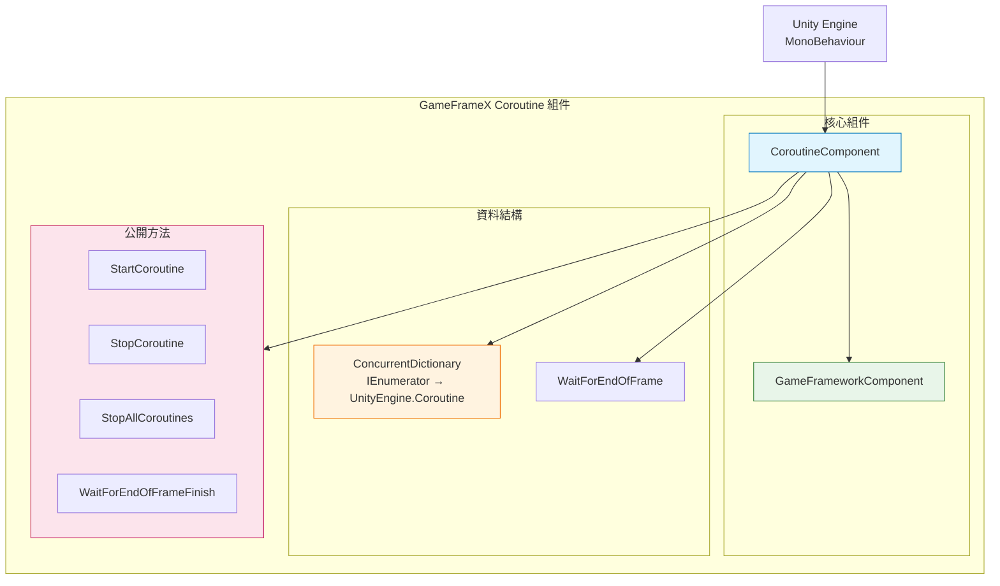
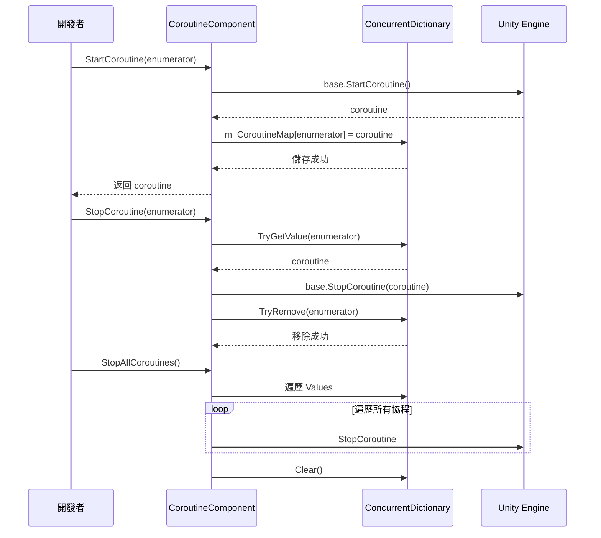

# 外掛介紹

GameFrameX Coroutine 協程組件是一個 Unity 擴充套件組件，提供增強的協程管理功能。透過使用併發字典來跟蹤執行的協程，它為協程的啟動、停止和清理提供了更好的控制和訪問。

## 概述

**CoroutineComponent** 是 GameFrameX 遊戲開發框架的核心組件之一，專門用於管理和執行 Unity 協程。該組件擴充套件了 Unity 的內建協程管理功能，解決了原生協程管理中的一些痛點問題。

### 解決的問題

在 Unity 開發中，原生協程管理存在以下問題：

1. **追蹤困難**: 難以獲取已啟動協程的狀態
2. **停止複雜**: 使用 `IEnumerator` 停止協程不夠直觀
3. **記憶體洩漏風險**: 協程未正確停止可能導致記憶體洩漏
4. **無法批次管理**: 無法方便地停止所有協程

### 核心特性

| 特性 | 描述 |
|------|------|
| 協程追蹤 | 使用 `ConcurrentDictionary` 記錄所有啟動的協程 |
| 安全停止 | 支援透過迭代器和協程物件兩種方式停止協程 |
| 批次管理 | 提供停止所有協程的功能 |
| 幀結束回呼 | 提供在當前幀渲染結束後執行回呼的便捷方法 |
| 單例限制 | 使用 `[DisallowMultipleComponent]` 防止重複新增 |

## 架構



### 組件結構說明

**CoroutineComponent** 繼承自 `GameFrameworkComponent`，整合了 GameFrameX 框架的核心功能。組件內部維護一個 `ConcurrentDictionary`，用於將使用者傳入的 `IEnumerator` 與 Unity 內部的 `Coroutine` 物件進行對映，從而實現更便捷的協程管理。

### 核心檔案

| 檔案 | 路徑 | 描述 |
|------|------|------|
| CoroutineComponent.cs | Runtime/Coroutine/ | 主組件實現 |
| CoroutineComponentInspector.cs | Editor/Inspector/ | Unity 編輯器檢查器 |
| GameFrameXCoroutineCroppingHelper.cs | Runtime/ | IL2CPP 程式碼保留輔助類 |

## 核心功能

### 1. 協程啟動

`StartCoroutine` 方法重寫了 Unity MonoBehaviour 的同名方法，在啟動協程的同時將其記錄到內部字典中：

```csharp
public new UnityEngine.Coroutine StartCoroutine(IEnumerator enumerator)
{
    var ret = base.StartCoroutine(enumerator);
    m_CoroutineMap[enumerator] = ret;
    return ret;
}
```

> Source: [CoroutineComponent.cs](https://github.com/GameFrameX/com.gameframex.unity.coroutine/blob/main/Runtime/Coroutine/CoroutineComponent.cs#L25-L30)

**設計意圖**: 透過在啟動時儲存對映關係，後續可以透過 `IEnumerator` 精確地停止特定的協程，解決了原生 Unity 協程 API 無法透過 IEnumerator 停止的問題。

### 2. 協程停止

組件提供了兩種停止協程的方法：

**透過 IEnumerator 停止**:
```csharp
public new void StopCoroutine(IEnumerator enumerator)
{
    if (m_CoroutineMap.TryGetValue(enumerator, out var coroutine))
    {
        base.StopCoroutine(coroutine);
        m_CoroutineMap.TryRemove(enumerator, out _);
    }
    base.StopCoroutine(enumerator);
}
```

> Source: [CoroutineComponent.cs](https://github.com/GameFrameX/com.gameframex.unity.coroutine/blob/main/Runtime/Coroutine/CoroutineComponent.cs#L36-L45)

**透過 UnityEngine.Coroutine 停止**:
```csharp
public new void StopCoroutine(UnityEngine.Coroutine coroutine)
{
    base.StopCoroutine(coroutine);
    foreach (var item in m_CoroutineMap)
    {
        if (item.Value == coroutine)
        {
            m_CoroutineMap.TryRemove(item.Key, out _);
            break;
        }
    }
}
```

> Source: [CoroutineComponent.cs](https://github.com/GameFrameX/com.gameframex.unity.coroutine/blob/main/Runtime/Coroutine/CoroutineComponent.cs#L51-L62)

**設計意圖**: 提供靈活的停止方式，開發者可以根據手中持有的引用型別（IEnumerator 或 Coroutine）選擇合適的停止方法。

### 3. 停止所有協程

```csharp
public new void StopAllCoroutines()
{
    foreach (var coroutine in m_CoroutineMap.Values)
    {
        base.StopCoroutine(coroutine);
    }
    m_CoroutineMap.Clear();
    base.StopAllCoroutines();
}
```

> Source: [CoroutineComponent.cs](https://github.com/GameFrameX/com.gameframex.unity.coroutine/blob/main/Runtime/Coroutine/CoroutineComponent.cs#L67-L76)

**設計意圖**: 在場景切換或物件銷燬時，確保所有協程被幹淨地停止，防止記憶體洩漏和野指標問題。

### 4. 幀結束回呼

```csharp
public void WaitForEndOfFrameFinish(System.Action callback)
{
    StartCoroutine(_WaitForEndOfFrameFinish(callback));
}
```

> Source: [CoroutineComponent.cs](https://github.com/GameFrameX/com.gameframex.unity.coroutine/blob/main/Runtime/Coroutine/CoroutineComponent.cs#L94-L97)

**設計意圖**: 提供一種便捷的方式，在當前幀的渲染完成後執行回呼。這對於需要等待 UI 更新完成後再進行計算的場景特別有用。

## 協程管理流程



## 使用示例

### 基本使用

```csharp
IEnumerator YourCoroutine()
{
    // 協程執行的內容
    yield return null;
}

// 新增組件到遊戲物件
CoroutineComponent coroutineComponent = gameObject.AddComponent<CoroutineComponent>();

// 啟動協程
coroutineComponent.StartCoroutine(YourCoroutine());

// 停止協程
coroutineComponent.StopCoroutine(YourCoroutine());
```

> Source: [README.md](https://github.com/GameFrameX/com.gameframex.unity.coroutine/blob/main/README.md#L29-L42)

### 幀結束回呼

```csharp
void YourCallback()
{
    // 回呼執行的內容
}

coroutineComponent.WaitForEndOfFrameFinish(YourCallback);
```

> Source: [README.md](https://github.com/GameFrameX/com.gameframex.unity.coroutine/blob/main/README.md#L59-L70)

## 注意事項

1. **單例限制**: 組件使用 `[DisallowMultipleComponent]` 屬性，確保每個 GameObject 只能新增一個 CoroutineComponent 例項。

2. **自動註冊**: 在 `Awake` 方法中設定 `IsAutoRegister = false`，表示該組件不會自動註冊到框架的核心繫統。

3. **程式碼保留**: `GameFrameXCoroutineCroppingHelper` 類用於確保在使用 IL2CPP 構建時，CoroutineComponent 不會被程式碼裁剪掉。

## 相關連結

- [安裝方式](../2-installation.index)
- [使用指南](../3-getting-started.index)
- [API 參考](./4-api-reference.coroutine-component)
- [FAQ](../5-troubleshooting.index)
- [GitHub 倉庫](https://github.com/GameFrameX/com.gameframex.unity.coroutine.git)
- [GameFrameX 官網](https://gameframex.doc.alianblank.com)
