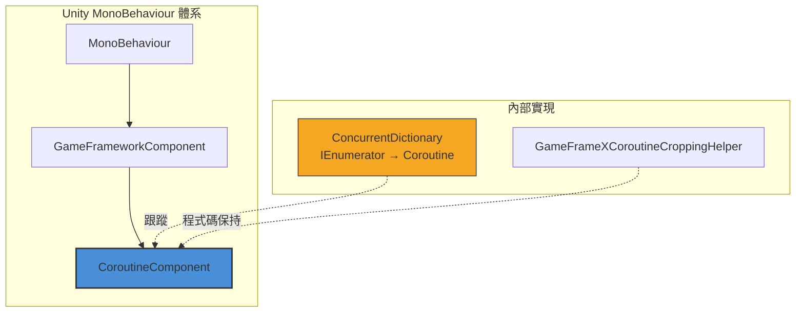

# CoroutineComponent

協程組件（CoroutineComponent）是 GameFrameX 框架的核心組件之一，提供擴充套件了 Unity 內建協程管理功能的介面。透過使用併發字典來跟蹤執行的協程，它為停止和清理協程提供了更好的控制。

## 概述

`CoroutineComponent` 是一個 Unity `MonoBehaviour` 組件，繼承自 `GameFrameworkComponent`。它封裝了 Unity 原生協程功能，新增了協程追蹤和管理能力，幫助開發者更方便地控制協程的生命週期，防止因未正確停止協程導致的記憶體洩漏問題。

### 核心特性

- **協程追蹤**：使用 `ConcurrentDictionary` 執行緒安全地追蹤所有已啟動的協程
- **靈活停止**：支援透過迭代器或協程物件停止單個協程
- **批次管理**：提供一鍵停止所有協程的功能
- **幀結束回呼**：提供在當前幀渲染結束後執行回呼的便捷方法

## 架構



### 組件層級

- **MonoBehaviour**：Unity 組件基類
- **GameFrameworkComponent**：GameFrameX 框架組件基類
- **CoroutineComponent**：協程管理組件（當前文件主題）

### 核心資料結構

`CoroutineComponent` 使用 `ConcurrentDictionary<IEnumerator, UnityEngine.Coroutine>` 維護協程對映表：

```csharp
private readonly ConcurrentDictionary<IEnumerator, UnityEngine.Coroutine> m_CoroutineMap = new ConcurrentDictionary<IEnumerator, UnityEngine.Coroutine>();
```

> Source: [CoroutineComponent.cs](https://github.com/GameFrameX/com.gameframex.unity.coroutine/blob/main/Runtime/Coroutine/CoroutineComponent.cs#L18)

## 核心功能

### 啟動協程

`StartCoroutine` 方法重寫了 Unity 基類實現，不僅啟動協程，還會將其新增到內部追蹤字典中：

```csharp
public new UnityEngine.Coroutine StartCoroutine(IEnumerator enumerator)
{
    var ret = base.StartCoroutine(enumerator);
    m_CoroutineMap[enumerator] = ret;
    return ret;
}
```

> Source: [CoroutineComponent.cs](https://github.com/GameFrameX/com.gameframex.unity.coroutine/blob/main/Runtime/Coroutine/CoroutineComponent.cs#L25-L30)

**設計意圖**：透過追蹤每個迭代器與其對應協程的對映關係，實現精確的協程停止控制。

### 停止協程

組件提供了兩種停止協程的方式：

**方式一：透過迭代器停止**

```csharp
public new void StopCoroutine(IEnumerator enumerator)
{
    if (m_CoroutineMap.TryGetValue(enumerator, out var coroutine))
    {
        base.StopCoroutine(coroutine);
        m_CoroutineMap.TryRemove(enumerator, out _);
    }
    base.StopCoroutine(enumerator);
}
```

> Source: [CoroutineComponent.cs](https://github.com/GameFrameX/com.gameframex.unity.coroutine/blob/main/Runtime/Coroutine/CoroutineComponent.cs#L36-L45)

**方式二：透過協程物件停止**

```csharp
public new void StopCoroutine(UnityEngine.Coroutine coroutine)
{
    base.StopCoroutine(coroutine);
    foreach (var item in m_CoroutineMap)
    {
        if (item.Value == coroutine)
        {
            m_CoroutineMap.TryRemove(item.Key, out _);
            break;
        }
    }
}
```

> Source: [CoroutineComponent.cs](https://github.com/GameFrameX/com.gameframex.unity.coroutine/blob/main/Runtime/Coroutine/CoroutineComponent.cs#L51-L62)

### 停止所有協程

```csharp
public new void StopAllCoroutines()
{
    foreach (var coroutine in m_CoroutineMap.Values)
    {
        base.StopCoroutine(coroutine);
    }
    m_CoroutineMap.Clear();
    base.StopAllCoroutines();
}
```

> Source: [CoroutineComponent.cs](https://github.com/GameFrameX/com.gameframex.unity.coroutine/blob/main/Runtime/Coroutine/CoroutineComponent.cs#L67-L76)

**設計意圖**：確保所有協程被正確停止並清理內部追蹤資料，防止記憶體洩漏。

### 幀結束回呼

`WaitForEndOfFrameFinish` 方法允許在當前幀渲染結束後執行回呼：

```csharp
private readonly WaitForEndOfFrame _waitForEndOfFrame = new WaitForEndOfFrame();

public void WaitForEndOfFrameFinish(System.Action callback)
{
    StartCoroutine(_WaitForEndOfFrameFinish(callback));
}
```

> Source: [CoroutineComponent.cs](https://github.com/GameFrameX/com.gameframex.unity.coroutine/blob/main/Runtime/Coroutine/CoroutineComponent.cs#L78-L97)

**設計意圖**：提供便捷的幀結束回呼功能，常用於需要在整個幀渲染完成後執行的操作，如 UI 更新後的資料同步。

## 使用示例

### 基本用法

```csharp
using GameFrameX.Coroutine.Runtime;
using UnityEngine;
using System.Collections;

public class CoroutineExample : MonoBehaviour
{
    private CoroutineComponent _coroutineComponent;

    private void Start()
    {
        // 獲取或新增 CoroutineComponent
        _coroutineComponent = gameObject.GetComponent<CoroutineComponent>();
        if (_coroutineComponent == null)
        {
            _coroutineComponent = gameObject.AddComponent<CoroutineComponent>();
        }

        // 啟動協程
        IEnumerator myCoroutine = MyCoroutine();
        _coroutineComponent.StartCoroutine(myCoroutine);
    }

    private IEnumerator MyCoroutine()
    {
        Debug.Log("協程開始");
        yield return new WaitForSeconds(1f);
        Debug.Log("1秒後繼續執行");
        yield return null;
        Debug.Log("下一幀繼續執行");
    }
}
```

### 停止協程示例

```csharp
using GameFrameX.Coroutine.Runtime;
using UnityEngine;
using System.Collections;

public class StopCoroutineExample : MonoBehaviour
{
    private CoroutineComponent _coroutineComponent;
    private IEnumerator _runningCoroutine;

    private void Start()
    {
        _coroutineComponent = gameObject.AddComponent<CoroutineComponent>();
        
        // 啟動協程並儲存引用
        _runningCoroutine = LongRunningCoroutine();
        _coroutineComponent.StartCoroutine(_runningCoroutine);
        
        // 5秒後自動停止
        Invoke("StopMyCoroutine", 5f);
    }

    private IEnumerator LongRunningCoroutine()
    {
        int count = 0;
        while (true)
        {
            Debug.Log($"執行中: {count++}");
            yield return new WaitForSeconds(1f);
        }
    }

    private void StopMyCoroutine()
    {
        // 透過迭代器停止協程
        if (_runningCoroutine != null)
        {
            _coroutineComponent.StopCoroutine(_runningCoroutine);
        }
    }
}
```

### 幀結束回呼示例

```csharp
using GameFrameX.Coroutine.Runtime;
using UnityEngine;
using UnityEngine.UI;

public class FrameEndCallbackExample : MonoBehaviour
{
    public Text statusText;
    private CoroutineComponent _coroutineComponent;

    private void Start()
    {
        _coroutineComponent = gameObject.AddComponent<CoroutineComponent>();
        
        // 在幀結束後更新 UI
        _coroutineComponent.WaitForEndOfFrameFinish(() =>
        {
            statusText.text = "UI 已更新";
        });
    }
}
```

## API 參考

### 屬性

| 屬性 | 型別 | 說明 |
|------|------|------|
| m_CoroutineMap | `ConcurrentDictionary<IEnumerator, UnityEngine.Coroutine>` | 儲存所有活躍協程的對映表 |

### 方法

### `StartCoroutine(IEnumerator enumerator): UnityEngine.Coroutine`

啟動一個協程並將其新增到追蹤表中。

**引數：**
- `enumerator` (IEnumerator): 協程迭代器

**返回：** UnityEngine.Coroutine - 啟動的協程物件

**示例：**
```csharp
IEnumerator coroutine = MyRoutine();
UnityEngine.Coroutine running = coroutineComponent.StartCoroutine(coroutine);
```

---

### `StopCoroutine(IEnumerator enumerator): void`

透過迭代器引用停止協程。

**引數：**
- `enumerator` (IEnumerator): 要停止的協程迭代器

**說明：** 此方法會同時從追蹤表中移除協程引用，確保完全清理。

**示例：**
```csharp
IEnumerator myCoroutine = MyRoutine();
coroutineComponent.StartCoroutine(myCoroutine);
// ... 一些邏輯後
coroutineComponent.StopCoroutine(myCoroutine);
```

---

### `StopCoroutine(UnityEngine.Coroutine coroutine): void`

透過協程物件停止協程。

**引數：**
- `coroutine` (UnityEngine.Coroutine): 要停止的協程物件

**說明：** 如果協程在追蹤表中存在，也會同步清理對映關係。

**示例：**
```csharp
var running = coroutineComponent.StartCoroutine(MyRoutine());
coroutineComponent.StopCoroutine(running);
```

---

### `StopAllCoroutines(): void`

停止該組件啟動的所有協程。

**說明：** 此方法會遍歷並停止所有追蹤中的協程，同時清空內部追蹤表。

**示例：**
```csharp
// 場景切換時清理所有協程
coroutineComponent.StopAllCoroutines();
```

---

### `WaitForEndOfFrameFinish(System.Action callback): void`

在當前幀渲染結束後執行回呼。

**引數：**
- `callback` (System.Action): 要執行的回呼方法

**說明：** 內部使用 `WaitForEndOfFrame` 實現，常用於需要在整個渲染流程完成後執行的操作。

**示例：**
```csharp
coroutineComponent.WaitForEndOfFrameFinish(() =>
{
    Debug.Log("當前幀已渲染完成");
});
```

---

## 組件配置

### Unity 編輯器配置

`CoroutineComponent` 在 Unity 編輯器中有以下特性：

| 特性 | 值 | 說明 |
|------|------|------|
| 選單路徑 | Game Framework/Coroutine | 新增組件時的選單位置 |
| 允許重複 | 否 | 使用 `[DisallowMultipleComponent]` 限制 |
| 自動註冊 | 否 | `IsAutoRegister = false`，需手動新增 |

### 程式碼保持 (IL2CPP)

為防止 IL2CPP 程式碼裁剪導致組件被移除，框架提供了 `GameFrameXCoroutineCroppingHelper` 輔助類：

```csharp
[Preserve]
public class GameFrameXCoroutineCroppingHelper : MonoBehaviour
{
    [Preserve]
    private void Start()
    {
        _ = typeof(CoroutineComponent);
    }
}
```

> Source: [GameFrameXCoroutineCroppingHelper.cs](https://github.com/GameFrameX/com.gameframex.unity.coroutine/blob/main/Runtime/GameFrameXCoroutineCroppingHelper.cs#L7-L14)

**設計意圖**：透過引用 `CoroutineComponent` 型別，確保該型別在 IL2CPP 構建時不會被程式碼裁剪移除。

## 相關連結

- [外掛介紹](../1-overview.index)
- [安裝方式](../2-installation.index)
- [使用指南](../3-getting-started.index)
- [常見問題](../5-troubleshooting.index)
- [GitHub 倉庫](https://github.com/GameFrameX/com.gameframex.unity.coroutine.git)
