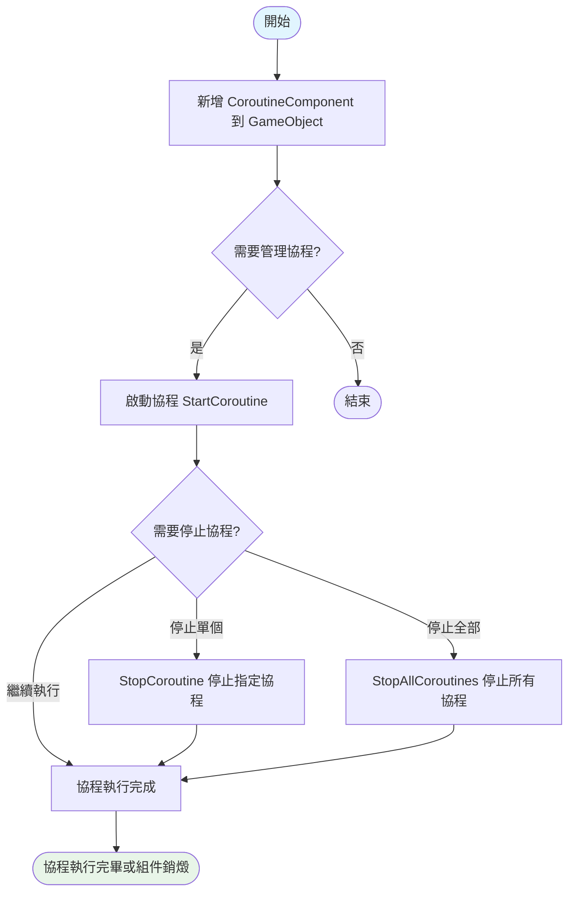
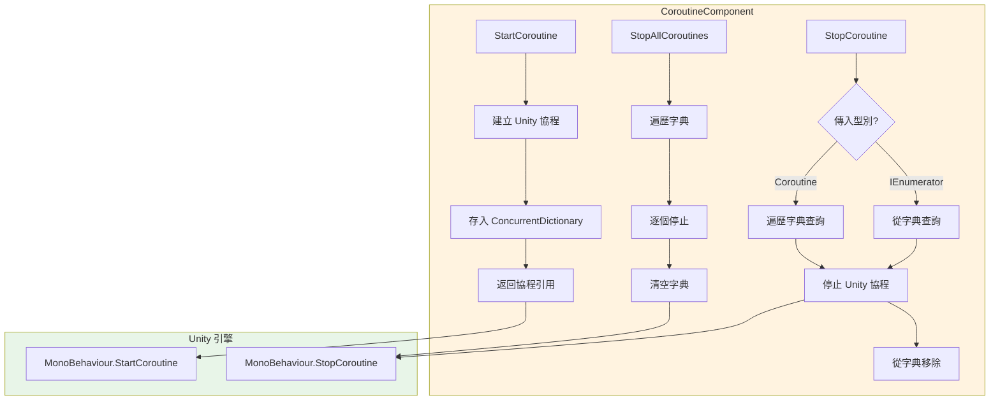

# 使用指南

本指南將幫助您快速上手使用 CoroutineComponent 協程組件，掌握在 Unity 專案中管理和控制協程的核心方法。

## 概述

CoroutineComponent 是 GameFrameX 框架提供的協程管理組件，擴充套件了 Unity 內建的協程功能。該組件透過併發字典（ConcurrentDictionary）追蹤所有已啟動的協程，提供了更精細的生命週期控制能力，幫助開發者避免協程洩漏和管理混亂的問題。

**為什麼使用 CoroutineComponent？**

在大型 Unity 專案中，協程管理往往成為維護難點。當場景切換或物件銷燬時，未正確停止的協程會導致記憶體洩漏、邏輯錯誤甚至崩潰。CoroutineComponent 提供了統一的協程管理介面，使得啟動、停止、追蹤協程變得簡單可控。

## 核心功能概覽

| 功能 | 說明 |
|------|------|
| 啟動協程 | 使用迭代器啟動協程並自動追蹤 |
| 停止單個協程 | 透過迭代器引用或協程物件停止 |
| 停止所有協程 | 一鍵清理所有正在執行的協程 |
| 幀結束回呼 | 在當前幀渲染完成後執行回呼 |

## 工作流程

以下流程圖展示了 CoroutineComponent 的典型使用流程：



## 基礎使用

### 第一步：新增組件到場景

在 Unity 編輯器中，您可以透過以下方式新增 CoroutineComponent：

1. 在 Hierarchy 面板中右鍵點選遊戲物件
2. 選擇 **Game Framework → Coroutine** 選單項
3. 組件將新增到選中的遊戲物件上

> **注意**：由於使用了 `[DisallowMultipleComponent]` 屬性，每個遊戲物件只能新增一個 CoroutineComponent。

### 第二步：在程式碼中使用

在指令碼中獲取組件例項並使用協程功能：

```csharp
using System.Collections;
using GameFrameX.Coroutine.Runtime;
using UnityEngine;

public class Example : MonoBehaviour
{
    private CoroutineComponent _coroutineComponent;

    private void Start()
    {
        // 獲取或新增 CoroutineComponent
        _coroutineComponent = gameObject.GetComponent<CoroutineComponent>();
        if (_coroutineComponent == null)
        {
            _coroutineComponent = gameObject.AddComponent<CoroutineComponent>();
        }
    }
}
```
> Source: [CoroutineComponent.cs](https://github.com/GameFrameX/com.gameframex.unity.coroutine/blob/main/Runtime/Coroutine/CoroutineComponent.cs#L25-L30)

## 使用示例

### 示例一：啟動和停止協程

以下示例展示瞭如何啟動一個協程，並在一定條件下停止它：

```csharp
using System.Collections;
using GameFrameX.Coroutine.Runtime;
using UnityEngine;

public class CoroutineExample : MonoBehaviour
{
    private CoroutineComponent _coroutineComponent;
    private IEnumerator _runningCoroutine;

    private void Start()
    {
        _coroutineComponent = gameObject.AddComponent<CoroutineComponent>();
        
        // 啟動協程並儲存引用
        _runningCoroutine = MyProcessCoroutine();
        _coroutineComponent.StartCoroutine(_runningCoroutine);
    }

    private IEnumerator MyProcessCoroutine()
    {
        while (true)
        {
            Debug.Log("協程正在執行...");
            yield return null;
        }
    }

    private void OnDestroy()
    {
        // 確保在物件銷燬時停止協程
        if (_runningCoroutine != null)
        {
            _coroutineComponent.StopCoroutine(_runningCoroutine);
        }
    }
}
```
> Sources:
> - [CoroutineComponent.cs](https://github.com/GameFrameX/com.gameframex.unity.coroutine/blob/main/Runtime/Coroutine/CoroutineComponent.cs#L25-L30)
> - [CoroutineComponent.cs](https://github.com/GameFrameX/com.gameframex.unity.coroutine/blob/main/Runtime/Coroutine/CoroutineComponent.cs#L36-L45)

### 示例二：停止所有協程

當需要清理所有正在執行的協程時（例如場景切換時）：

```csharp
using System.Collections;
using GameFrameX.Coroutine.Runtime;
using UnityEngine;

public class CleanupExample : MonoBehaviour
{
    private CoroutineComponent _coroutineComponent;

    private void Start()
    {
        _coroutineComponent = gameObject.AddComponent<CoroutineComponent>();
        
        // 啟動多個協程
        _coroutineComponent.StartCoroutine(TaskA());
        _coroutineComponent.StartCoroutine(TaskB());
        _coroutineComponent.StartCoroutine(TaskC());
    }

    private IEnumerator TaskA()
    {
        for (int i = 0; i < 10; i++)
        {
            Debug.Log("Task A: " + i);
            yield return null;
        }
    }

    private IEnumerator TaskB()
    {
        for (int i = 0; i < 10; i++)
        {
            Debug.Log("Task B: " + i);
            yield return null;
        }
    }

    private IEnumerator TaskC()
    {
        for (int i = 0; i < 10; i++)
        {
            Debug.Log("Task C: " + i);
            yield return null;
        }
    }

    public void OnSceneChange()
    {
        // 停止所有協程
        _coroutineComponent.StopAllCoroutines();
        Debug.Log("已停止所有協程");
    }
}
```
> Source: [CoroutineComponent.cs](https://github.com/GameFrameX/com.gameframex.unity.coroutine/blob/main/Runtime/Coroutine/CoroutineComponent.cs#L67-L76)

### 示例三：幀結束回呼

使用 `WaitForEndOfFrameFinish` 在幀渲染完成後執行操作，常用於截圖、UI 更新等場景：

```csharp
using GameFrameX.Coroutine.Runtime;
using UnityEngine;

public class EndOfFrameExample : MonoBehaviour
{
    private CoroutineComponent _coroutineComponent;

    private void Start()
    {
        _coroutineComponent = gameObject.AddComponent<CoroutineComponent>();
    }

    private void OnGUI()
    {
        if (GUI.Button(new Rect(10, 10, 200, 50), "擷取螢幕截圖"))
        {
            CaptureScreenshot();
        }
    }

    private void CaptureScreenshot()
    {
        // 在幀結束後執行截圖
        _coroutineComponent.WaitForEndOfFrameFinish(() =>
        {
            ScreenCapture.CaptureScreenshot("screenshot.png");
            Debug.Log("截圖已儲存");
        });
    }
}
```
> Source: [CoroutineComponent.cs](https://github.com/GameFrameX/com.gameframex.unity.coroutine/blob/main/Runtime/Coroutine/CoroutineComponent.cs#L94-L97)

### 示例四：透過協程物件停止

如果您只持有 Unity 的 Coroutine 物件引用，也可以直接停止：

```csharp
using System.Collections;
using GameFrameX.Coroutine.Runtime;
using UnityEngine;

public class StopByCoroutineExample : MonoBehaviour
{
    private CoroutineComponent _coroutineComponent;
    private UnityEngine.Coroutine _unityCoroutine;

    private void Start()
    {
        _coroutineComponent = gameObject.AddComponent<CoroutineComponent>();
        
        // 啟動協程
        _unityCoroutine = _coroutineComponent.StartCoroutine(LongRunningTask());
    }

    private IEnumerator LongRunningTask()
    {
        Debug.Log("任務開始");
        yield return new WaitForSeconds(5f);
        Debug.Log("任務完成");
    }

    private void Update()
    {
        // 按下空格鍵停止協程
        if (Input.GetKeyDown(KeyCode.Space))
        {
            if (_unityCoroutine != null)
            {
                _coroutineComponent.StopCoroutine(_unityCoroutine);
                Debug.Log("協程已停止");
            }
        }
    }
}
```
> Source: [CoroutineComponent.cs](https://github.com/GameFrameX/com.gameframex.unity.coroutine/blob/main/Runtime/Coroutine/CoroutineComponent.cs#L51-L62)

## 內部實現機制

理解組件的內部實現有助於更好地使用它：



組件使用 `ConcurrentDictionary<IEnumerator, UnityEngine.Coroutine>` 來維護協程對映表。這種設計確保了：
- **執行緒安全**：在多執行緒環境下安全訪問
- **雙向追蹤**：可以透過迭代器或協程物件停止
- **自動清理**：停止協程時自動從字典中移除

## 最佳實踐

### 1. 在 OnDestroy 中清理協程

始終在 MonoBehaviour 的 `OnDestroy` 生命週期方法中停止協程，避免記憶體洩漏：

```csharp
private void OnDestroy()
{
    // 方式一：停止所有協程
    _coroutineComponent.StopAllCoroutines();
    
    // 方式二：停止特定協程
    // _coroutineComponent.StopCoroutine(_myCoroutine);
}
```

### 2. 避免重複啟動協程

在啟動協程前檢查是否已經在執行：

```csharp
private bool _isCoroutineRunning = false;

private void TryStartCoroutine()
{
    if (!_isCoroutineRunning)
    {
        _isCoroutineRunning = true;
        _coroutineComponent.StartCoroutine(MyCoroutine());
    }
}

private IEnumerator MyCoroutine()
{
    try
    {
        yield return null;
    }
    finally
    {
        _isCoroutineRunning = false;
    }
}
```

### 3. 場景切換時的清理

在場景切換前停止所有協程，確保乾淨的過渡：

```csharp
// 在場景管理器的切換邏輯中呼叫
public void ChangeScene(string sceneName)
{
    // 停止所有協程
    _coroutineComponent.StopAllCoroutines();
    
    // 載入新場景
    SceneManager.LoadScene(sceneName);
}
```

## 相關連結

- [外掛介紹](./1-overview.index) - 瞭解 CoroutineComponent 的完整特性和設計理念
- [安裝方式](./2-installation.index) - 詳細安裝步驟和依賴配置
- [API 參考](./4-api-reference.coroutine-component) - 完整的 API 方法簽名和引數說明
- [常見問題](./5-troubleshooting.index) - 常見問題和解決方案

## 程式碼示例參考

本指南中的程式碼示例基於以下原始檔：

- [CoroutineComponent.cs](https://github.com/GameFrameX/com.gameframex.unity.coroutine/blob/main/Runtime/Coroutine/CoroutineComponent.cs) - 核心協程組件實現
- [CoroutineComponentInspector.cs](https://github.com/GameFrameX/com.gameframex.unity.coroutine/blob/main/Editor/Inspector/CoroutineComponentInspector.cs) - Unity 編輯器檢視視窗
