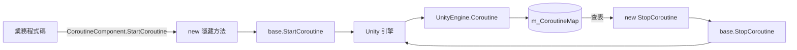

# 工作原理:協程追蹤與元件生命週期

`CoroutineComponent` 透過在原生 Unity API 上疊加一層參考追蹤,把「開啟的協程」與「IEnumerator 實例」一一對應起來,從而保證後續能以同樣的 `IEnumerator` 參考精確停止。元件自身作為 `GameFrameworkComponent` 參與 GameFrameX 框架的生命週期排程。

## 核心機制

### 1. 用 ConcurrentDictionary 做參考追蹤

元件內部維護一個執行緒安全的字典,key 為 `IEnumerator`,value 為 `UnityEngine.Coroutine`。

```csharp
private readonly ConcurrentDictionary<IEnumerator, UnityEngine.Coroutine> m_CoroutineMap
    = new ConcurrentDictionary<IEnumerator, UnityEngine.Coroutine>();
```

來源:[CoroutineComponent.cs](https://github.com/GameFrameX/com.gameframex.unity.coroutine/blob/main/Runtime/Coroutine/CoroutineComponent.cs#L21)

`StartCoroutine` 以 `new` 關鍵字隱藏基底類別方法，先呼叫 `base.StartCoroutine`,再將回傳的 `UnityEngine.Coroutine` 寫入字典：

```csharp
public new UnityEngine.Coroutine StartCoroutine(IEnumerator enumerator)
{
    var ret = base.StartCoroutine(enumerator);
    m_CoroutineMap[enumerator] = ret;
    return ret;
}
```

來源:[CoroutineComponent.cs](https://github.com/GameFrameX/com.gameframex.unity.coroutine/blob/main/Runtime/Coroutine/CoroutineComponent.cs#L28-L33)

### 2. 用 `new` 隱藏基底類別方法，保證追蹤入口唯一

四個 Start/Stop 方法全部以 `new` 關鍵字隱藏 `MonoBehaviour` 基底類別成員。如果不透過 `CoroutineComponent` 的參考呼叫(例如直接 `gameObject.GetComponent<MonoBehaviour>().StartCoroutine(...)`),追蹤字典不會被寫入，後續 `StopCoroutine` 將無法命中。

| 方法 | 行為 |
|------|------|
| `StartCoroutine(IEnumerator)` | 啟動並存入 `m_CoroutineMap` |
| `StopCoroutine(IEnumerator)` | 查詢字典找到 `UnityEngine.Coroutine` 後呼叫 `base.StopCoroutine`;查不到則回退至 `base.StopCoroutine(enumerator)` |
| `StopCoroutine(UnityEngine.Coroutine)` | 直接呼叫 `base.StopCoroutine`,再線性掃描字典刪除對應項目 |
| `StopAllCoroutines()` | 先逐一停止字典中的協程，清空字典，再呼叫 `base.StopAllCoroutines()`,確保未被追蹤的協程也一併被清理 |

來源:[CoroutineComponent.cs](https://github.com/GameFrameX/com.gameframex.unity.coroutine/blob/main/Runtime/Coroutine/CoroutineComponent.cs#L39-L82)

### 3. 元件生命週期接入

`CoroutineComponent` 繼承自 `GameFrameworkComponent`,並帶有 `[GameFrameXAutoComponent(-6500)]` 特性，表示由框架按優先順序自動註冊到全域元件系統。

```csharp
[DisallowMultipleComponent]
[AddComponentMenu("GameFrameX/Coroutine")]
[GameFrameXAutoComponent(-6500)]
public class CoroutineComponent : GameFrameworkComponent
```

來源:[CoroutineComponent.cs](https://github.com/GameFrameX/com.gameframex.unity.coroutine/blob/main/Runtime/Coroutine/CoroutineComponent.cs#L12-L15)

`Awake` 中明確停用自動註冊，以避免與框架註冊邏輯衝突：

```csharp
protected override void Awake()
{
    IsAutoRegister = false;
    base.Awake();
}
```

來源:[CoroutineComponent.cs](https://github.com/GameFrameX/com.gameframex.unity.coroutine/blob/main/Runtime/Coroutine/CoroutineComponent.cs#L106-L110)

### 4. 影格結尾回呼封裝

元件額外提供了 `WaitForEndOfFrameFinish`,內部 yield 一個可重複使用的 `WaitForEndOfFrame` 實例，再觸發回呼：

```csharp
private readonly WaitForEndOfFrame _waitForEndOfFrame = new WaitForEndOfFrame();

private IEnumerator WaitForEndOfFrameFinishInternal(System.Action callback)
{
    yield return _waitForEndOfFrame;
    callback?.Invoke();
}

public void WaitForEndOfFrameFinish(System.Action callback)
{
    StartCoroutine(WaitForEndOfFrameFinishInternal(callback));
}
```

來源:[CoroutineComponent.cs](https://github.com/GameFrameX/com.gameframex.unity.coroutine/blob/main/Runtime/Coroutine/CoroutineComponent.cs#L84-L104)

如果協程在影格結束前被 `StopCoroutine` 或 `StopAllCoroutines` 終止，`callback` 將不會執行。

### 5. IL2CPP 連結保護

`GameFrameXCoroutineCroppingHelper` 是一個空 `MonoBehaviour`,僅在 `Start` 中參考 `CoroutineComponent` 型別，目的是在 IL2CPP / 裁剪情境下將 `CoroutineComponent` 標記為保留，避免被靜態分析誤刪：

```csharp
[Preserve]
public class GameFrameXCoroutineCroppingHelper : MonoBehaviour
{
    [Preserve]
    private void Start()
    {
        _ = typeof(CoroutineComponent);
    }
}
```

來源:[GameFrameXCoroutineCroppingHelper.cs](https://github.com/GameFrameX/com.gameframex.unity.coroutine/blob/main/Runtime/GameFrameXCoroutineCroppingHelper.cs#L1-L14)

## 資料流



## 呼叫限制

- `IEnumerator` 作為字典 key 時使用參考相等性，`StopCoroutine` 必須傳入與 `StartCoroutine` 完全相同的 `IEnumerator` 實例，否則會走「查不到」的回退分支。
- 必須透過 `CoroutineComponent` 型別的參考呼叫 `StartCoroutine`/`StopCoroutine`,直接呼叫基底類別 `MonoBehaviour` 方法不會被追蹤。
- 字典使用 `ConcurrentDictionary`,因此即便在非主執行緒上建構 `IEnumerator`(如工作系統產生的迭代器)，寫入與查詢也是執行緒安全的；但 `UnityEngine.Coroutine` 的實際啟動/停止仍受 Unity 主執行緒限制。

## 相關連結

- 關於元件如何接入 GameFrameX 框架，請參閱 `GameFrameworkComponent` 與 `[GameFrameXAutoComponent]` 的原始碼。
- 關於 Unity 原生協程語意，請參考 Unity 官方 `MonoBehaviour.StartCoroutine` 文件。