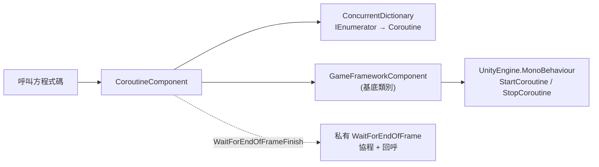

# 認識 Coroutine 協程元件

`CoroutineComponent` 是 GameFrameX 框架對 Unity 原生協程 API 的封裝元件,核心價值在於**追蹤與管理**所有透過它啟動的協程——既能按迭代器或 `UnityEngine.Coroutine` 控制代碼精確停止單一協程,也能一鍵清理全部，同時還提供「幀結束回呼」的便捷介面。

## 快速開始

### 1. 安裝套件

在 Unity 專案的 `Packages/manifest.json` 的 `scopedRegistries` 中加入 GameFrameX 註冊表，然後在 `dependencies` 中宣告：

```json
{
  "scopedRegistries": [
    {
      "name": "GameFrameX",
      "url": "https://gameframex.upm.alianblank.uk",
      "scopes": ["com.gameframex"]
    }
  ],
  "dependencies": {
    "com.gameframex.unity.coroutine": "1.0.3"
  }
}
```

Source: [README.zh-CN.md](https://github.com/GameFrameX/com.gameframex.unity.coroutine/blob/main/README.zh-CN.md#L50-L65)

### 2. 新增元件到場景物件

由於類別上標記了 `[DisallowMultipleComponent]` 與 `[AddComponentMenu("GameFrameX/Coroutine")]`,同一個遊戲物件只能掛一個；框架也會透過 `[GameFrameXAutoComponent(-6500)]` 自動註冊。

```csharp
CoroutineComponent coroutineComponent = gameObject.AddComponent<CoroutineComponent>();
```

Source: [CoroutineComponent.cs](https://github.com/GameFrameX/com.gameframex.unity.coroutine/blob/main/Runtime/Coroutine/CoroutineComponent.cs#L12-L15)

### 3. 啟動並管理協程

```csharp
IEnumerator YourCoroutine()
{
    // 協程執行的內容
    yield return null;
}

coroutineComponent.StartCoroutine(YourCoroutine());
```

Source: [README.zh-CN.md](https://github.com/GameFrameX/com.gameframex.unity.coroutine/blob/main/README.zh-CN.md#L82-L91)

## 工作原理速覽

元件內部使用 `ConcurrentDictionary<IEnumerator, UnityEngine.Coroutine>` 維護一張「迭代器 → Unity 協程控制代碼」的對應表。所有 `StartCoroutine`/`StopCoroutine`/`StopAllCoroutines` 都透過 `new` 關鍵字隱藏基底類別方法，先操作這張對應表，再委派給 `GameFrameworkComponent` 基底類別執行真正的 Unity 呼叫。



## 核心 API 一覽

| 方法 | 作用 | 關鍵點 |
|------|------|--------|
| `StartCoroutine(IEnumerator)` | 啟動協程並加入追蹤表 | 傳回 `UnityEngine.Coroutine` |
| `StopCoroutine(IEnumerator)` | 按迭代器停止 | 必須傳入與 `StartCoroutine` 相同的 `IEnumerator` 實例 |
| `StopCoroutine(UnityEngine.Coroutine)` | 按控制代碼停止 | 內部遍歷字典找到對應 key 並移除 |
| `StopAllCoroutines()` | 停止全部已追蹤與未追蹤協程 | 先停追蹤項、清字典，再呼叫基底類別 |
| `WaitForEndOfFrameFinish(Action)` | 目前幀渲染結束後執行回呼 | 若在幀結束前被 `StopCoroutine` 停止，回呼不會觸發 |

## 接下來

- 想依步驟跑通第一個協程：見《如何啟動與停止協程》
- 遇到 `StopCoroutine` 無效、回呼沒觸發等問題：見《協程相關問題怎麼辦》
- 需要完整 API 簽章與預設值：見《CoroutineComponent API 參考》