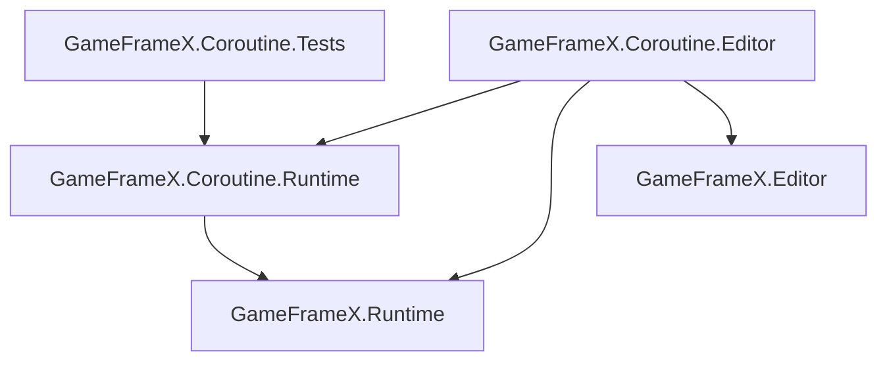

# 套件設定與組件參考

本頁收錄 `com.gameframex.unity.coroutine` 套件的全部中繼資料與組件定義,用於排查依賴、版本相容和組件參考問題。

## 套件中繼資料(package.json)

| 欄位 | 值 |
|------|-----|
| `name` | `com.gameframex.unity.coroutine` |
| `displayName` | `Game Frame X Coroutine` |
| `category` | `GameFrameX` |
| `version` | `1.2.0` |
| `unity` | `2019.4`(最低支援版本) |
| `keywords` | `GameFrameX`, `Coroutine` |
| `dependencies` | `com.gameframex.unity: 2.5.1` |
| `publishConfig.access` | `public` |
| `publishConfig.registry` | `https://npm.cnb.cool/GameFrameX/npm/-/packages/` |
| `documentationUrl` | `https://gameframex.doc.alianblank.com` |
| `changelogUrl` | `https://github.com/gameframex/com.gameframex.unity.coroutine/blob/main/CHANGELOG.md` |
| `licensesUrl` | `https://github.com/gameframex/com.gameframex.unity.coroutine/blob/main/LICENSE.md` |

## 組件清單

套件內共三個組件(`.asmdef`)。所有組件的 `autoReferenced` 均為 `true`,代表同一專案中的其他腳本可直接使用其中的類型,無需手動加入參考。

| 組件名稱 | 檔案 | 適用平台 | 參考 |
|---------|------|---------|------|
| `GameFrameX.Coroutine.Runtime` | [Runtime/GameFrameX.Coroutine.Runtime.asmdef](https://github.com/GameFrameX/com.gameframex.unity.coroutine/blob/main/Runtime/GameFrameX.Coroutine.Runtime.asmdef) | 全平台 | `GameFrameX.Runtime` |
| `GameFrameX.Coroutine.Editor` | [Editor/GameFrameX.Coroutine.Editor.asmdef](https://github.com/GameFrameX/com.gameframex.unity.coroutine/blob/main/Editor/GameFrameX.Coroutine.Editor.asmdef) | `Editor` | `GameFrameX.Coroutine.Runtime`, `GameFrameX.Editor`, `GameFrameX.Runtime` |
| `GameFrameX.Coroutine.Tests` | [Tests/GameFrameX.Coroutine.Tests.asmdef](https://github.com/GameFrameX/com.gameframex.unity.coroutine/blob/main/Tests/GameFrameX.Coroutine.Tests.asmdef) | `Editor` | `GameFrameX.Coroutine.Runtime` |

## 各組件關鍵欄位

| 欄位 | Runtime | Editor | Tests |
|------|---------|--------|-------|
| `rootNamespace` | `GameFrameX.Coroutine.Runtime` | (未設定) | `GameFrameX.Coroutine.Tests` |
| `includePlatforms` | (空，全部平台) | `Editor` | `Editor` |
| `allowUnsafeCode` | `true` | `false` | `false` |
| `overrideReferences` | `false` | `false` | `false` |
| `autoReferenced` | `true` | `true` | `true` |
| `precompiledReferences` | (空) | (空) | (空) |
| `defineConstraints` | (空) | (空) | (空) |

## 依賴關係圖

## 常見問題速查

| 症狀 | 原因 | 修復 |
|------|------|------|
| 找不到 `GameFrameX.Coroutine` 命名空間 | 未匯入本套件或未啟用 `com.gameframex.unity` 上游套件 | 在 `manifest.json` 中確認 `com.gameframex.unity.coroutine` 與 `com.gameframex.unity@2.5.1` 同時存在 |
| Editor 平台編譯錯誤 `GameFrameX.Editor` 找不到 | 上游 Editor 組件未匯入 | 確認 `com.gameframex.unity@2.5.1` 已安裝並提供 `GameFrameX.Editor` |
| 在非 Editor 平台參考 Editor 組件 | Editor 組件限制了 `includePlatforms: ["Editor"]` | 將對應程式碼移至 Runtime 組件或使用 `#if UNITY_EDITOR` 包裹 |
| 想關閉自動參考 | `autoReferenced: true` | 在自己的 `.asmdef` 的 `references` 中明確加入 `GameFrameX.Coroutine.Runtime` |

## 套件原始碼參考

- [package.json](https://github.com/GameFrameX/com.gameframex.unity.coroutine/blob/main/package.json)
- [Runtime/GameFrameX.Coroutine.Runtime.asmdef](https://github.com/GameFrameX/com.gameframex.unity.coroutine/blob/main/Runtime/GameFrameX.Coroutine.Runtime.asmdef)
- [Editor/GameFrameX.Coroutine.Editor.asmdef](https://github.com/GameFrameX/com.gameframex.unity.coroutine/blob/main/Editor/GameFrameX.Coroutine.Editor.asmdef)
- [Tests/GameFrameX.Coroutine.Tests.asmdef](https://github.com/GameFrameX/com.gameframex.unity.coroutine/blob/main/Tests/GameFrameX.Coroutine.Tests.asmdef)