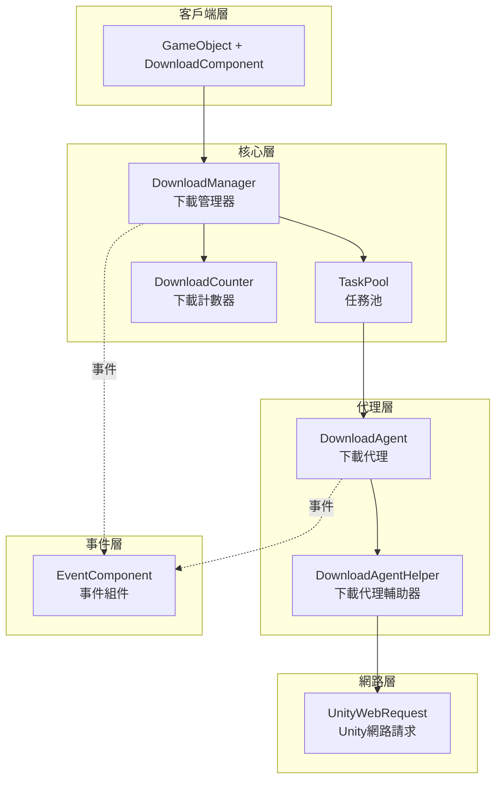
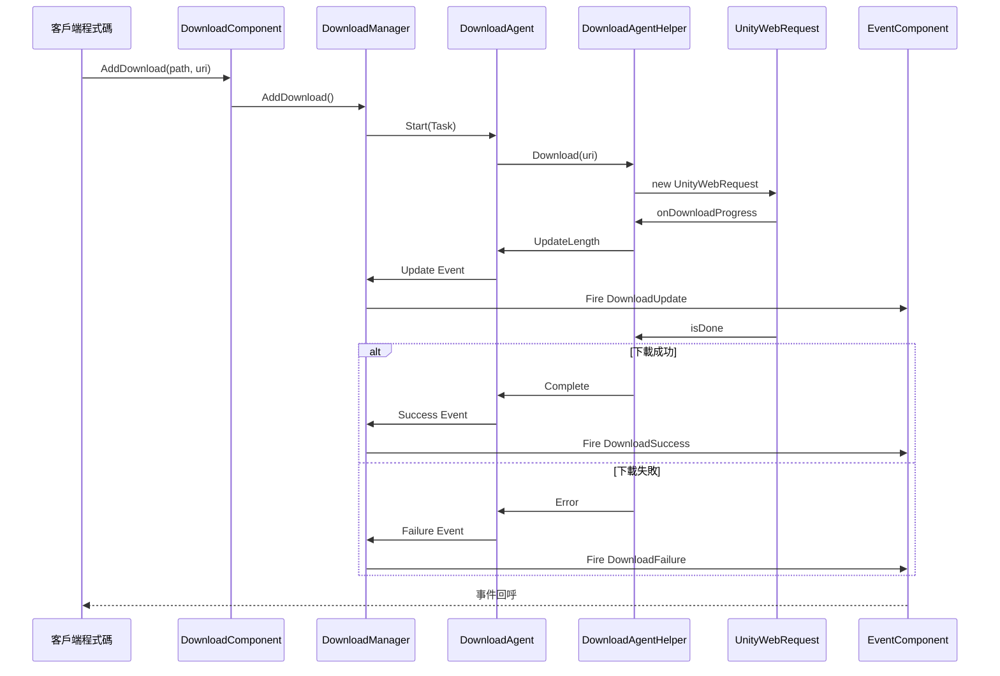

# 外掛介紹

GameFrameX Download 下載任務組件是 GameFrameX 遊戲框架的核心模組之一，專門為 Unity 遊戲專案提供高效、可靠的資源下載解決方案。該組件採用模組化設計，支援多執行緒併發下載、斷點續傳、任務優先順序管理等企業級功能。

## 概述

GameFrameX Download 組件是一個功能完善的下載管理系統，旨在幫助 Unity 開發者輕鬆實現遊戲資源的遠端下載和更新功能。該組件設計遵循高內聚、低耦合的原則，透過事件驅動機制提供下載全流程的狀態追蹤，讓開發者能夠靈活控制下載任務的建立、管理和監控。

該組件的核心價值在於提供了開箱即用的下載功能，開發者無需關心底層網路實現的複雜性，只需呼叫簡單的 API 即可完成複雜的下載任務。同時，組件支援自定義下載代理輔助器，允許開發者根據專案需求替換或擴充套件下載實現方式。

從架構角度來看，Download 組件構建在 GameFrameX 框架的模組系統之上，與 Event 組件緊密整合，透過統一的事件機制向外部傳遞下載狀態變化。這種設計使得下載邏輯與業務邏輯完全分離，程式碼更加清晰易於維護。

## 核心功能

該下載組件提供了完整的企業級下載管理能力，能夠滿足各種複雜的遊戲資源下載場景。以下是組件的主要功能特性：

### 多工併發下載

組件內部採用任務池（TaskPool）機制管理下載任務，支援配置多個下載代理同時工作。開發者可以根據實際需求調整併發數量，在下載速度和系統資源消耗之間取得平衡。任務池會自動排程任務的執行順序，確保高優先順序任務優先處理，同時合理分配系統頻寬資源。

```csharp
// 配置下載代理數量，預設值為3
[SerializeField] private int m_DownloadAgentHelperCount = 3;
```
> Source: [DownloadComponent.cs](https://github.com/GameFrameX/com.gameframex.unity.download/blob/main/Runtime/Download/DownloadComponent.cs#L37)

### 斷點續傳支援

組件內建斷點續傳功能，在下載過程中會將資料先寫入 `.download` 臨時檔案。當下載中斷（無論是網路問題還是應用退出）後重新啟動時，系統會自動檢測已下載的部分，並從中斷處繼續下載，避免重複下載造成的流量浪費和時間損失。

```csharp
// 檢測並繼續未完成的下載
if (File.Exists(downloadFile))
{
    m_FileStream = File.OpenWrite(downloadFile);
    m_FileStream.Seek(0L, SeekOrigin.End);
    m_StartLength = m_SavedLength = m_FileStream.Length;
}
```
> Source: [DownloadManager.DownloadAgent.cs](https://github.com/GameFrameX/com.gameframex.unity.download/blob/main/Runtime/Download/Download/DownloadManager.DownloadAgent.cs#L173-L178)

### 任務優先順序管理

每個下載任務都可以設定優先順序（整數數值，數值越高優先順序越大），任務池會根據優先順序排程下載順序。在遊戲更新場景中，可以將關鍵資源（如初始場景、核心配置）設定為高優先順序，確保重要內容優先下載完成。

### 實時進度追蹤

組件提供完整的下載事件系統，包括下載開始、進度更新、下載成功和下載失敗四種狀態。開發者可以透過訂閱這些事件實時獲取下載進度、速度統計等資訊，並據此更新使用者介面或執行相應的業務邏輯。

### 下載速度統計

內建下載計數器模組，能夠實時計算當前下載速度（位元組/秒）。這一功能對於向使用者展示下載進度、最佳化下載體驗非常有幫助。開發者可以透過 `CurrentSpeed` 屬性獲取當前下載速度值。

```csharp
/// <summary>
/// 獲取當前下載速度。
/// </summary>
public float CurrentSpeed
{
    get { return m_DownloadManager.CurrentSpeed; }
}
```
> Source: [DownloadComponent.cs](https://github.com/GameFrameX/com.gameframex.unity.download/blob/main/Runtime/Download/DownloadComponent.cs#L105-L108)

### 任務標籤管理

支援為下載任務設定標籤（Tag），可以透過標籤批次查詢或移除相關任務。這一功能在管理同型別資源（如語言包、地圖資料）時特別有用，可以一次性對某一類資源進行統一操作。

## 架構設計

GameFrameX Download 組件採用分層架構設計，各層職責明確，層與層之間透過介面進行通訊，實現了良好的解耦效果。



### 各層職責說明

**客戶端層（DownloadComponent）**

客戶端層是開發者直接互動的入口點，表現為 Unity 遊戲物件上的組件。DownloadComponent 繼承自 GameFrameworkComponent，負責初始化下載管理器、註冊事件回呼、處理任務新增和移除等前端工作。它將複雜的內部實現封裝為簡潔的 API，供業務程式碼呼叫。

作為 Unity 組件，DownloadComponent 提供了豐富的序列化欄位，用於在編輯器中配置下載引數，如下載代理型別、代理數量、超時時間等。這種設計使得開發者無需編寫程式碼即可完成組件的基礎配置。

**核心層（DownloadManager + TaskPool + DownloadCounter）**

核心層是下載功能的大腦，由下載管理器（DownloadManager）、任務池（TaskPool）和下載計數器（DownloadCounter）三個核心組件構成。

DownloadManager 繼承自 GameFrameworkModule，是框架的模組化組成部分。它實現了 IDownloadManager 介面，提供下載任務的增刪改查、暫停恢復、引數配置等管理功能。DownloadManager 內部維護一個任務池例項，將具體的下載執行委託給任務池處理。

TaskPool 是一個通用的任務池實現，專門用於管理 DownloadTask。它負責維護待處理任務佇列、分配任務給空閒的下載代理、處理任務優先順序排序等邏輯。TaskPool 支援動態新增和移除代理，能夠根據可用代理數量和任務佇列狀態自動排程任務。

DownloadCounter 用於統計下載速度。它維護一個時間視窗，記錄最近一段時間內下載的資料量，從而計算出實時的下載速度。這種滑動視窗演算法能夠快速反映網路狀況的變化。

**代理層（DownloadAgent + DownloadAgentHelper）**

代理層負責實際的網路下載操作，是真正與外部伺服器通訊的層級。

DownloadAgent 是下載代理的內部實現類，實現了 ITaskAgent 介面。每個下載代理繫結一個下載代理輔助器，負責處理一個具體的下載任務。DownloadAgent 管理下載的整個生命週期，包括建立臨時檔案、處理斷點續傳、寫入下載資料、檢測超時等。

DownloadAgentHelper 是下載操作的抽象介面，定義了下載輔助器需要實現的方法。DownloadAgentHelperBase 是該介面的 Unity 基類實現，提供了 MonoBehaviour 的生命週期管理和基礎的事件定義。

**網路層（UnityWebRequest）**

網路層是架構的最底層，負責與遠端伺服器建立連線並傳輸資料。預設實現使用 Unity 的 UnityWebRequest 類，這是一個跨平臺的 HTTP 客戶端，能夠在所有 Unity 支援的平臺上有良好的表現。

開發者可以透過繼承 DownloadAgentHelperBase 或實現 IDownloadAgentHelper 介面來建立自定義的網路實現，以滿足特殊需求。

**事件層（EventComponent）**

事件層不是下載組件的一部分，而是依賴 GameFrameX 框架的 Event 組件。下載過程中產生的各種狀態變化會透過事件系統向外傳播，DownloadComponent 負責將內部事件轉換為框架事件並觸發。這種設計使得下載狀態能夠被任意業務模組訂閱和響應。

### 事件流轉機制



## 核心概念

### 下載任務（DownloadTask）

下載任務是一個資料結構，封裝了單個下載請求的所有資訊。每個任務包含：下載路徑（本地儲存位置）、下載地址（遠端 URL）、標籤、優先順序、使用者自定義資料等屬性。任務在下載過程中會維護其狀態（待處理、執行中、完成、錯誤等）。

任務使用序列號（SerialId）作為唯一識別符號，開發者透過序列號可以查詢特定任務的狀態或在執行時移除任務。

### 下載代理（DownloadAgent）

下載代理是執行下載的實體，每個代理一次只能處理一個下載任務。代理負責管理下載的完整生命週期：建立本地臨時檔案、發起網路請求、處理下載進度、維護斷點續傳狀態、檢測超時、處理完成或錯誤等。

系統中可以存在多個代理同時工作，實現併發下載。代理數量的配置需要權衡下載速度和系統資源佔用。

### 下載代理輔助器（DownloadAgentHelper）

下載代理輔助器是網路下載能力的抽象，它定義了與特定網路實現互動的介面。框架提供了基於 UnityWebRequest 的預設實現，開發者也可以透過實現介面來使用其他網路庫（如 HttpClient、curl 等）。

輔助器設計為可替換組件，這種策略模式允許在不同的執行環境和需求下切換網路實現，而不需要修改上層程式碼。

### 任務池（TaskPool）

任務池是下載管理的核心排程器，負責維護所有下載任務的狀態和佇列。任務池管理待處理任務的優先順序排序，將任務分配給可用的下載代理，處理任務完成後的清理工作，並提供任務狀態的查詢介面。

任務池的設計參考了物件池模式，透過複用代理資源來減少頻繁建立和銷燬物件的開銷，提升系統效能。

## 使用流程

### 組件初始化

在 Unity 場景中建立一個空遊戲物件，然後新增 DownloadComponent 組件。組件會在 Awake 階段獲取下載管理器模組，並在 Start 階段初始化指定數量的下載代理輔助器。

```csharp
protected override void Awake()
{
    ImplementationComponentType = Utility.Assembly.GetType(componentType);
    InterfaceComponentType = typeof(IDownloadManager);
    base.Awake();
    m_DownloadManager = GameFrameworkEntry.GetModule<IDownloadManager>();
    // ...
}
```
> Source: [DownloadComponent.cs](https://github.com/GameFrameX/com.gameframex.unity.download/blob/main/Runtime/Download/DownloadComponent.cs#L142-L152)

### 新增下載任務

透過呼叫 DownloadComponent 的 AddDownload 方法新增下載任務。該方法有多種過載形式，支援只指定路徑和地址，也可以額外指定標籤、優先順序和自定義資料。

```csharp
// 基礎用法：新增下載任務
int serialId = downloadComponent.AddDownload("本地儲存路徑", "下載連結");

// 帶優先順序的用法
int serialId = downloadComponent.AddDownload("本地儲存路徑", "下載連結", 10);

// 帶標籤的用法
int serialId = downloadComponent.AddDownload("本地儲存路徑", "下載連結", "resource");

// 完整引數用法
int serialId = downloadComponent.AddDownload("本地儲存路徑", "下載連結", "resource", 10, customData);
```
> Source: [DownloadComponent.cs](https://github.com/GameFrameX/com.gameframex.unity.download/blob/main/Runtime/Download/DownloadComponent.cs#L238-L350)

AddDownload 方法返回任務的序列號（SerialId），這是一個遞增的唯一識別符號，可用於後續查詢任務狀態或移除任務。

### 非同步等待下載完成

組件提供了基於 Task 的非同步等待機制，適合在 async/await 模式下使用：

```csharp
// 非同步等待下載完成
public async Task<bool> DownloadAsync(string downloadPath, string downloadUri)
{
    var serialId = AddDownload(downloadPath, downloadUri);
    if (m_Downloads.TryGetValue(serialId, out var value))
    {
        return await value.TCS.Task;
    }
    return false;
}
```
> Source: [DownloadComponent.cs](https://github.com/GameFrameX/com.gameframex.unity.download/blob/main/Runtime/Download/DownloadComponent.cs#L273-L282)

### 訂閱下載事件

透過 GameFrameX 的事件系統訂閱下載進度和結果：

```csharp
// 訂閱下載成功事件
eventComponent.Subscribe(DownloadSuccessEventArgs.EventId, OnDownloadSuccess);

// 訂閱下載失敗事件
eventComponent.Subscribe(DownloadFailureEventArgs.EventId, OnDownloadFailure);

// 下載成功回呼
private void OnDownloadSuccess(object sender, GameEventArgs e)
{
    DownloadSuccessEventArgs ne = (DownloadSuccessEventArgs)e;
    Debug.Log($"下載完成：{ne.DownloadPath}，大小：{ne.CurrentLength}");
}
```
> Source: [README.md](https://github.com/GameFrameX/com.gameframex.unity.download/blob/main/README.md#L88-L106)

### 移除下載任務

可以透過序列號、標籤或全部移除來管理下載任務：

```csharp
// 根據序列號移除單個任務
bool result = downloadComponent.RemoveDownload(serialId);

// 根據標籤移除多個任務
int count = downloadComponent.RemoveDownloads("resource");

// 移除所有任務
int count = downloadComponent.RemoveAllDownloads();
```
> Source: [DownloadComponent.cs](https://github.com/GameFrameX/com.gameframex.unity.download/blob/main/Runtime/Download/DownloadComponent.cs#L357-L392)

## 配置說明

### DownloadComponent 配置項

| 配置項 | 型別 | 預設值 | 說明 |
|--------|------|--------|------|
| DownloadAgentHelperTypeName | string | UnityWebRequestDownloadAgentHelper | 下載代理輔助器型別名稱 |
| CustomDownloadAgentHelper | DownloadAgentHelperBase | null | 自定義下載代理輔助器例項 |
| DownloadAgentHelperCount | int | 3 | 下載代理數量，併發下載數 |
| Timeout | float | 30f | 單個任務超時時間（秒） |
| FlushSize | int | 1048576 (1MB) | 緩衝區寫入磁碟的臨界大小 |

### FlushSize 的作用

FlushSize 控制資料從記憶體緩衝區寫入磁碟的頻率。設定較小的值可以更頻繁地儲存下載資料，減少因異常中斷導致的資料丟失，但會增加磁碟 I/O 操作。較大的值則相反。建議根據實際場景和網路環境調整此引數。

### Timeout 的作用

Timeout 設定單個下載任務的無響應超時時間。當網路連線建立後，如果在指定時間內沒有收到任何資料，任務會被判定為超時並觸發失敗回呼。合理的超時設定可以避免下載在網路不穩定時無限等待。

## 依賴關係

GameFrameX Download 組件依賴於以下模組：

- **GameFrameX.Runtime** - 核心執行時庫，提供框架基礎功能
- **GameFrameX.Event** - 事件系統，用於下載狀態的事件通知

```json
{
   "com.gameframex.unity.event": "https://github.com/GameFrameX/com.gameframex.unity.event.git",
   "com.gameframex.unity.download": "https://github.com/GameFrameX/com.gameframex.unity.download.git"
}
```
> Source: [README.md](https://github.com/GameFrameX/com.gameframex.unity.download/blob/main/README.md#L112-L118)

## 平臺支援

該組件使用 UnityWebRequest 作為預設網路實現，天然支援 Unity 支援的所有平臺：

- Windows / macOS / Linux
- Android
- iOS
- WebGL
- PS4 / PS5
- Xbox One / Xbox Series X|S
- Nintendo Switch

## 相關連結

- [功能特性](./1-overview.features) - 瞭解更多功能詳情
- [安裝指南](./2-installation) - 外掛安裝說明
- [基礎配置](./3-getting-started.basic-setup) - 快速配置
- [首個示例](./3-getting-started.first-example) - 完整程式碼示例
- [架構概述](./4-core-concepts.architecture) - 深入架構解析
- [DownloadComponent 詳解](./4-core-concepts.download-component) - 組件 API 詳解
- [下載代理詳解](./4-core-concepts.download-agent) - 代理實現機制
- [屬性參考](./5-api-reference.properties) - 屬性列表
- [方法參考](./5-api-reference.methods) - 方法簽名
- [下載事件](./6-events.download-events) - 事件詳情
- [代理事件](./6-events.agent-events) - 代理層事件
- [編輯器配置](./7-configuration.editor-configuration) - 編輯器設定
- [代理配置](./7-configuration.agent-configuration) - 代理配置詳解
- [常見問題](./8-troubleshooting) - 問題排查指南
