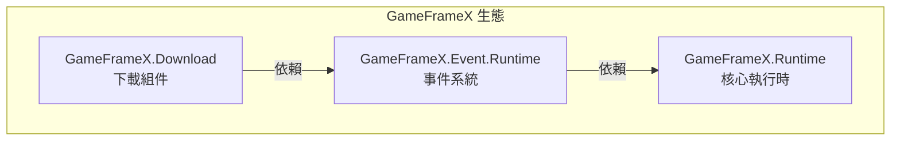

# 安裝

本文件介紹如何在 Unity 專案中安裝 Game Frame X Download 下載組件。

## 概述

Game Frame X Download 是 GameFrameX 框架的下載管理組件，提供完整的多工下載解決方案。該組件支援斷點續傳、下載優先順序、進度實時更新等功能，並透過事件系統提供下載狀態的完整通知。

> **注意**：此組件依賴於 **Event 組件** (`com.gameframex.unity.event`)，在安裝時需要同時安裝依賴項。

### 系統要求

| 要求 | 最低版本 |
|------|----------|
| Unity | 2017.1+ |
| GameFrameX.Runtime | 最新穩定版 |
| GameFrameX.Event | 最新穩定版 |

## 安裝前準備

在開始安裝之前，請確保：

1. ✅ 已安裝 Unity 2017.1 或更高版本
2. ✅ 瞭解 Unity Package Manager 的基本使用方法
3. ✅ 具備對專案 `Packages/manifest.json` 檔案的編輯許可權

## 安裝方式

### 方式一：透過 manifest.json 安裝（推薦）

這是最推薦的安裝方式，便於版本管理和團隊協作。

1. 開啟專案的 `Packages/manifest.json` 檔案
2. 在 `dependencies` 節點下新增以下內容：

```json
{
  "dependencies": {
    "com.gameframex.unity.event": "https://github.com/GameFrameX/com.gameframex.unity.event.git",
    "com.gameframex.unity.download": "https://github.com/GameFrameX/com.gameframex.unity.download.git"
  }
}
```

3. 儲存檔案後，Unity 會自動下載並安裝依賴包
4. 等待 Unity 編譯完成

> Source: [README.md](https://github.com/GameFrameX/com.gameframex.unity.download/blob/main/README.md#L112-L118)

### 方式二：透過 Unity Package Manager 安裝

如果您偏好使用 Unity 編輯器的圖形介面：

1. 開啟 Unity 編輯器
2. 進入 **Window → Package Manager** 選單
3. 點選左上角的 **+** 按鈕
4. 選擇 **Add package from git URL...**
5. 在輸入框中填入以下 URL：

```
https://github.com/GameFrameX/com.gameframex.unity.download.git
```

6. 點選 **Add** 按鈕開始安裝
7. 同樣需要先安裝事件組件，重複步驟 3-6，新增以下 URL：

```
https://github.com/GameFrameX/com.gameframex.unity.event.git
```

8. 等待下載和安裝完成

### 方式三：直接放置原始碼

適用於需要修改原始碼或離線使用的情況：

1. 從 GitHub 倉庫下載或克隆原始碼：

```bash
git clone https://github.com/GameFrameX/com.gameframex.unity.download.git
```

2. 將下載的資料夾複製到 Unity 專案的 `Packages` 目錄下
3. Unity 會自動識別並載入包
4. 確保同時安裝 Event 組件的原始碼或預編譯包

## 依賴項說明

安裝 Download 組件時，系統會自動解析以下依賴：



| 依賴包 | 說明 | 必需 |
|--------|------|------|
| `GameFrameX.Runtime` | 核心執行時，提供基礎框架功能 | ✅ 必需 |
| `GameFrameX.Event.Runtime` | 事件系統，處理下載狀態通知 | ✅ 必需 |
| `GameFrameX.Editor` | 編輯器工具（僅開發時需要） | ❌ 可選 |

## 安裝驗證

安裝完成後，可以透過以下方式驗證是否安裝成功：

### 方法一：檢查 Package Manager

開啟 **Window → Package Manager**，確認以下包已正確安裝：

- `Game Frame X Download` - 版本號應為 1.1.0
- `Game Frame X Event` - 事件組件

### 方法二：檢查指令碼編譯

在專案中建立一個簡單的測試指令碼，確認以下名稱空間可以正常引用：

```csharp
using GameFrameX.Download.Runtime;
// 如果編譯透過，說明安裝成功
```

### 方法三：檢查組件選單

在 Unity 編輯器中：

1. 建立一個新的 GameObject
2. 右鍵點選 Inspector 面板
3. 檢查選單中是否出現 **Game Framework → Download** 選項

## 專案配置

### Assembly Definition

安裝後，系統會自動配置以下程式集定義檔案：

| 程式集 | 路徑 | 用途 |
|--------|------|------|
| `GameFrameX.Download.Runtime` | `Runtime/GameFrameX.Download.Runtime.asmdef` | 執行時程式集 |
| `GameFrameX.Download.Editor` | `Editor/GameFrameX.Download.Editor.asmdef` | 編輯器程式集 |

執行時程式集的依賴配置如下：

```json
{
  "name": "GameFrameX.Download.Runtime",
  "references": [
    "GameFrameX.Runtime",
    "GameFrameX.Event.Runtime"
  ]
}
```

> Source: [Runtime/GameFrameX.Download.Runtime.asmdef](https://github.com/GameFrameX/com.gameframex.unity.download/blob/main/Runtime/GameFrameX.Download.Runtime.asmdef#L1-L17)

## 常見問題

### Q1: 安裝後編譯報錯怎麼辦？

請確保：
1. 已正確安裝 Event 組件依賴
2. Unity 版本符合要求（2017.1+）
3. 嘗試執行 **File → Build Settings → Switch Platform** 重新編譯

### Q2: 下載功能無法使用？

檢查是否滿足以下條件：
1. `DownloadComponent` 組件已新增到場景中
2. `EventComponent` 組件也已新增
3. 網路許可權已配置（見下文）

### Q3: 如何配置網路許可權？

對於需要訪問網際網路的下載功能，需要在 `Assets/Plugins/Android` 目錄下建立或修改 `AndroidManifest.xml`，新增網路許可權：

```xml
<uses-permission android:name="android.permission.INTERNET" />
```

## 後續步驟

安裝完成後，建議繼續閱讀以下文件：

- [基礎配置](./3-getting-started.basic-setup) - 瞭解組件的基本配置
- [首個示例](./3-getting-started.first-example) - 建立您的第一個下載任務
- [核心概念](./4-core-concepts.architecture) - 深入瞭解框架架構

## 相關連結

- [GitHub 倉庫](https://github.com/GameFrameX/com.gameframex.unity.download.git)
- [官方文件](https://gameframex.doc.alianblank.com)
- [Event 組件](https://github.com/GameFrameX/com.gameframex.unity.event)
- [問題反饋](mailto:alianblank@outlook.com)
