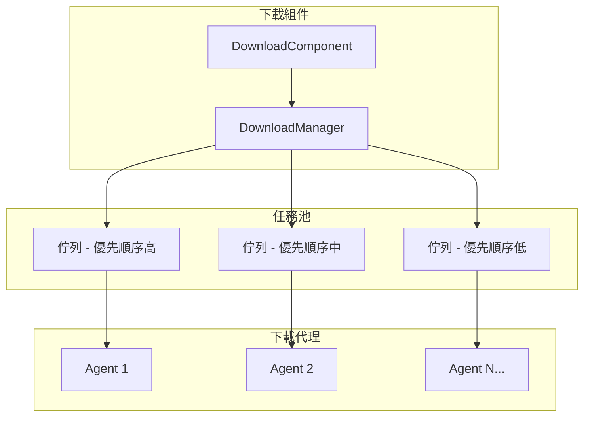
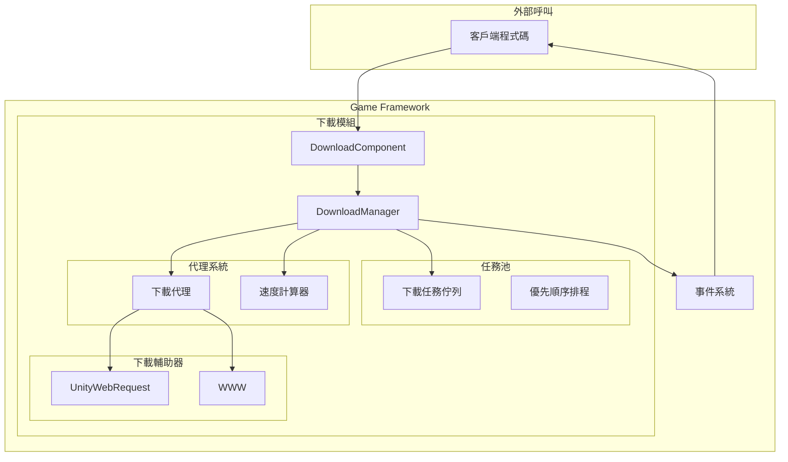

# 功能特性

GameFrameX Download 下載組件是一個功能強大的 Unity 資源下載管理模組，提供完整的下載任務佇列管理、斷點續傳、優先順序排程、實時進度監控等功能。

## 概述

下載組件是 GameFrameX 框架的核心模組之一，專門用於處理遊戲資源的下載需求。該組件基於任務池架構設計，支援多執行緒併發下載，可同時管理多個下載任務，並透過事件機制實時推送下載狀態更新。

> 更多關於組件的介紹和架構設計，請參閱 [外掛介紹](./1-overview.introduction) 和 [架構概述](./4-core-concepts.architecture)。

## 核心功能

### 1. 多工佇列管理

下載組件採用任務池（TaskPool）架構，支援同時管理多個下載任務。任務佇列具有以下特性：

- **FIFO 佇列**：按先進先出順序處理任務
- **優先順序排程**：高優先順序任務優先執行
- **任務狀態追蹤**：實時記錄每個任務的狀態（待處理、執行中、已完成、錯誤）
- **序列 ID 標識**：每個任務擁有唯一的序列 ID，便於追蹤和管理



> 來源: [DownloadManager.cs](https://github.com/GameFrameX/com.gameframex.unity.download/blob/main/Runtime/Download/Download/DownloadManager.cs#L22-L44)

### 2. 斷點續傳支援

斷點續傳是下載組件的核心功能之一，顯著提升大檔案下載的可靠性：

- **自動檢測**：系統自動檢測本地是否存在未完成的下載檔案（`.download` 字尾）
- **Range 請求**：使用 HTTP Range 頭部從上次停止的位置繼續下載
- **增量下載**：僅下載檔案的新增部分，節省頻寬和時間
- **狀態驗證**：下載完成後自動驗證檔案完整性

```csharp
// DownloadAgent.cs 中斷點續傳核心邏輯
if (File.Exists(downloadFile))
{
    m_FileStream = File.OpenWrite(downloadFile);
    m_FileStream.Seek(0L, SeekOrigin.End);
    m_StartLength = m_SavedLength = m_FileStream.Length;
    m_DownloadedLength = 0L;
}
// 從斷點位置繼續下載
if (m_StartLength > 0L)
{
    m_Helper.Download(m_Task.DownloadUri, m_StartLength, m_Task.UserData);
}
```

> 來源: [DownloadManager.DownloadAgent.cs#L168-L204](https://github.com/GameFrameX/com.gameframex.unity.download/blob/main/Runtime/Download/Download/DownloadManager.DownloadAgent.cs#L168-L204)

### 3. 多下載代理並行

下載組件支援配置多個下載代理（Download Agent），實現並行下載：

- **可配置數量**：1-16 個代理可透過編輯器配置
- **工作狀態監控**：實時獲取代理工作狀態
- **負載均衡**：任務自動分配給空閒代理
- **獨立執行**：每個代理相互獨立，互不干擾

| 屬性 | 說明 |
|------|------|
| TotalAgentCount | 下載代理總數量 |
| FreeAgentCount | 可用（空閒）代理數量 |
| WorkingAgentCount | 工作中代理數量 |
| WaitingTaskCount | 等待執行的任務數量 |

```csharp
// 在 Start 方法中初始化多個下載代理
for (int i = 0; i < m_DownloadAgentHelperCount; i++)
{
    AddDownloadAgentHelper(i);
}
```

> 來源: [DownloadComponent.cs#L178-L181](https://github.com/GameFrameX/com.gameframex.unity.download/blob/main/Runtime/Download/DownloadComponent.cs#L178-L181)

### 4. 實時下載速度監控

組件內建下載速度計算器，提供準確的實時下載速率：

- **滑動視窗演算法**：使用時間視窗計算瞬時速度
- **按需更新**：速度值根據實際下載資料動態更新
- **多代理彙總**：多個代理的速度自動累加

```csharp
public float CurrentSpeed
{
    get { return m_DownloadCounter.CurrentSpeed; }
}
```

> 來源: [DownloadManager.cs#L117-L120](https://github.com/GameFrameX/com.gameframex.unity.download/blob/main/Runtime/Download/Download/DownloadManager.cs#L117-L120)

### 5. 事件驅動通知

完整的生命週期事件體系，涵蓋下載全流程：

```mermaid
sequenceDiagram
    participant Client as 客戶端程式碼
    participant DC as DownloadComponent
    participant DM as DownloadManager
    participant Agent as DownloadAgent

    Client->>DC: AddDownload()
    DC->>DM: AddDownload()
    DM->>Agent: Start()
    
    rect rgb(240, 248, 255)
        Note over Agent,Client: 下載開始
        Agent-->>DM: OnDownloadAgentStart
        DM-->>DC: DownloadStart 事件
        DC-->>Client: 通知客戶端
    end
    
    rect rgb(255, 250, 240)
        Note over Agent,Client: 下載更新
        Agent->>DM: OnDownloadAgentUpdate
        DM-->>DC: DownloadUpdate 事件
        DC-->>Client: 實時進度
    end
    
    rect rgb(240, 255, 240)
        Note over Agent,Client: 下載完成
        Agent-->>DM: OnDownloadAgentSuccess
        DM-->>DC: DownloadSuccess 事件
        DC-->>Client: 下載完成
    end
```



| 事件 | 說明 | 觸發時機 |
|------|------|----------|
| DownloadStart | 下載開始 | 代理開始處理任務時 |
| DownloadUpdate | 下載更新 | 收到資料塊時 |
| DownloadSuccess | 下載成功 | 檔案完整下載完成時 |
| DownloadFailure | 下載失敗 | 發生錯誤或超時時 |

> 詳細事件引數請參閱 [下載事件](./6-events.download-events)。

### 6. 暫停與恢復

全域性暫停功能，可隨時暫停/恢復所有下載任務：

```csharp
// 暫停所有下載
downloadComponent.Paused = true;

// 恢復下載
downloadComponent.Paused = false;
```

> 來源: [DownloadComponent.cs#L46-L50](https://github.com/GameFrameX/com.gameframex.unity.download/blob/main/Runtime/Download/DownloadComponent.cs#L46-L50)

### 7. 標籤化管理

支援使用標籤（Tag）對下載任務進行分組管理：

- **按標籤查詢**：獲取指定標籤的所有下載任務
- **按標籤移除**：一次性移除指定標籤的所有任務
- **靈活組織**：可按資源型別、更新批次等方式組織任務

```csharp
// 新增帶標籤的下載任務
int serialId = downloadComponent.AddDownload(downloadPath, downloadUri, "resources");

// 獲取指定標籤的任務資訊
TaskInfo[] tasks = downloadComponent.GetDownloadInfos("resources");

// 移除指定標籤的所有任務
downloadComponent.RemoveDownloads("resources");
```

> 來源: [DownloadComponent.cs#L250-L253](https://github.com/GameFrameX/com.gameframex.unity.download/blob/main/Runtime/Download/DownloadComponent.cs#L250-L253)

### 8. 超時與緩衝區配置

靈活的下載引數配置：

| 配置項 | 說明 | 預設值 |
|--------|------|--------|
| Timeout | 下載超時時間（秒） | 30 |
| FlushSize | 緩衝區寫入磁碟臨界值（位元組） | 1 MB |

- **Timeout**：單次請求無響應時的超時時間
- **FlushSize**：記憶體緩衝區達到此大小時強制寫入磁碟，防止資料丟失

```csharp
// 配置超時時間（執行時）
downloadComponent.Timeout = 60f;

// 配置FlushSize（執行時）
downloadComponent.FlushSize = 2 * 1024 * 1024; // 2MB
```

> 來源: [DownloadComponent.cs#L87-L100](https://github.com/GameFrameX/com.gameframex.unity.download/blob/main/Runtime/Download/DownloadComponent.cs#L87-L100)

### 9. 多下載代理輔助器

組件提供兩種下載實現方式：

1. **UnityWebRequestDownloadAgentHelper**（推薦）
   - 現代 Unity 網路請求 API
   - 支援 Unity 2017.2+
   - 完整的斷點續傳支援

2. **WWWDownloadAgentHelper**（相容性）
   - 傳統 WWW 類
   - 支援 Unity 2018.3 之前的版本
   - 斷點續傳依賴伺服器支援

```csharp
// 使用 UnityWebRequest 從斷點繼續下載
m_UnityWebRequest.SetRequestHeader("Range", 
    GameFrameX.Runtime.Utility.Text.Format("bytes={0}-", fromPosition));
m_UnityWebRequest.downloadHandler = new DownloadHandler(this);
```

> 來源: [UnityWebRequestDownloadAgentHelper.cs#L104-L121](https://github.com/GameFrameX/com.gameframex.unity.download/blob/main/Runtime/Download/UnityWebRequestDownloadAgentHelper.cs#L104-L121)

## 系統架構



## 功能對比

| 功能 | 說明 | 狀態 |
|------|------|------|
| 多工佇列 | 同時管理多個下載任務 | ✅ 支援 |
| 斷點續傳 | 從上次位置繼續下載 | ✅ 支援 |
| 優先順序排程 | 高優先順序任務優先處理 | ✅ 支援 |
| 實時速度 | 顯示當前下載速度 | ✅ 支援 |
| 事件通知 | 下載狀態實時推送 | ✅ 支援 |
| 多代理並行 | 1-16個代理併發下載 | ✅ 支援 |
| 暫停/恢復 | 暫停和恢復所有任務 | ✅ 支援 |
| 標籤管理 | 按標籤組織下載任務 | ✅ 支援 |
| 超時控制 | 配置網路超時時間 | ✅ 支援 |
| 緩衝區管理 | 控制磁碟寫入頻率 | ✅ 支援 |

## 相關連結

- [外掛介紹](./1-overview.introduction) - 瞭解外掛背景和設計理念
- [架構概述](./4-core-concepts.architecture) - 深入瞭解系統架構
- [DownloadComponent](./4-core-concepts.download-component) - 核心組件詳解
- [下載代理](./4-core-concepts.download-agent) - 下載代理機制
- [API 參考](./5-api-reference.properties) - 完整 API 文件
- [安裝指南](./2-installation) - 快速安裝配置
